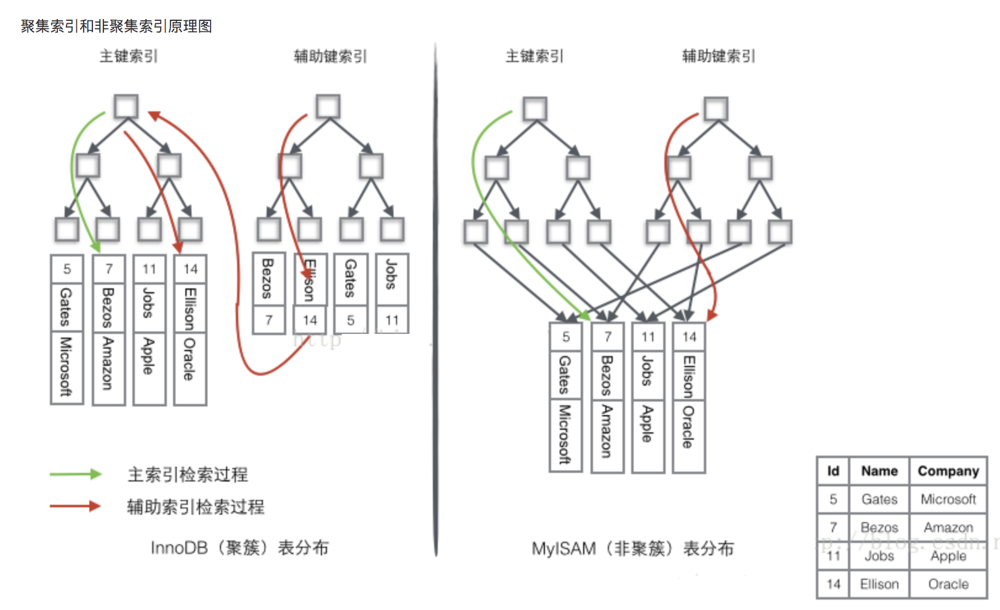

## 数据库中的事务隔离级别 和 锁

### 事务的四种隔离级别

在数据库操作中，为了有效保证并发读取数据的正确性，提出的事务隔离级别。我们的数据库锁，也是为了构建这些隔离级别存在的。

|隔离级别 | 脏读（Dirty Read) | 不可重复读（NonRepeatable Read）| 幻读（Phantom Read）|
|------|-----|-----|-----|
|未提交读（Read uncommitted）| 可能	| 可能 | 可能
|已提交读（Read committed）| 不可能 | 可能 | 可能
|可重复读（Repeatable read）| 不可能 | 不可能 | 可能
|可串行化（Serializable ）| 不可能 | 不可能 | 不可能

* 未提交读(Read Uncommitted)：允许脏读，也就是可能读取到其他会话中未提交事务修改的数据
* 提交读(Read Committed)：只能读取到已经提交的数据。Oracle等多数数据库默认都是该级别 (不重复读)
* 可重复读(Repeated Read)：可重复读。在同一个事务内的查询都是事务开始时刻一致的，InnoDB默认级别。在SQL标准中，该隔离级别消除了不可重复读，但是还存在幻象读
* 串行读(Serializable)：完全串行化的读，每次读都需要获得表级共享锁，读写相互都会阻塞


① 脏读: 脏读就是指当一个事务正在访问数据，并且对数据进行了修改，而这种修改还没有提交到数据库中，这时，另外一个事务也访问这个数据，然后使用了这个数据。

② 不可重复读:是指在一个事务内，多次读同一数据。在这个事务还没有结束时，另外一个事务也访问该同一数据。那么，在第一个事务中的两次读数据之间，由于第二个事务的修改，那么第一个事务两次读到的的数据可能是不一样的。这样就发生了在一个事务内两次读到的数据是不一样的，因此称为是不可重复读。

③ 可重复读:可重读这个概念是一事务的多个实例在并发读取数据时，会看到同样的数据行

④ 幻读:第一个事务对一个表中的数据进行了修改，这种修改涉及到表中的全部数据行。同时，第二个事务也修改这个表中的数据，这种修改是向表中插入一行新数据。那么，以后就会发生操作第一个事务的用户发现表中还有没有修改的数据行，就好象发生了幻觉一样。


### 数据库锁

数据库锁一般可以分为两类，一个是悲观锁，一个是乐观锁。

* 乐观锁

乐观锁一般是指用户自己实现的一种锁机制，假设认为数据一般情况下不会造成冲突，所以在数据进行提交更新的时候，才会正式对数据的冲突与否进行检测，如果发现冲突了，则让返回用户错误的信息，让用户决定如何去做。乐观锁的实现方式一般包括使用版本号和时间戳。

* 悲观锁

悲观锁一般就是我们通常说的数据库锁机制，以下讨论都是基于悲观锁。

悲观锁主要表锁、行锁、页锁。在MyISAM中只用到表锁，不会有死锁的问题，锁的开销也很小，但是相应的并发能力很差。innodb实现了行级锁和表锁，锁的粒度变小了，并发能力变强，但是相应的锁的开销变大，很有可能出现死锁。同时innodb需要协调这两种锁，算法也变得复杂。InnoDB行锁是通过给索引上的索引项加锁来实现的，只有通过索引条件检索数据，InnoDB才使用行级锁，否则，InnoDB将使用表锁。

表锁和行锁都分为共享锁和排他锁（独占锁），而更新锁是为了解决行锁升级（共享锁升级为独占锁）的死锁问题。

innodb中表锁和行锁一起用，所以为了提高效率才会有意向锁（意向共享锁和意向排他锁）。

<br>
**表锁**：开销小，加锁快；不会出现死锁；锁定粒度大，发生锁冲突的概率最高，并发度最低；<br>
**行锁**：开销大，加锁慢；会出现死锁；锁定粒度最小，发生锁冲突的概率最低，并发度也最高。<br>
常见的增删改（INSERT、DELETE、UPDATE）语句会自动对操作的数据行加写锁。查询的时候也可以明确指定锁的类型，SELECT ... LOCK IN SHARE MODE 语句加的是读锁，SELECT ... FOR UPDATE 语句加的是写锁。

### 乐观锁和悲观锁的适用场景：

- 悲观锁：比较适合写入操作比较频繁的场景，如果出现大量的读取操作，每次读取的时候都会进行加锁，这样会增加大量的锁的开销，降低了系统的吞吐量。

- 乐观锁：比较适合读取操作比较频繁的场景，如果出现大量的写入操作，数据发生冲突的可能性就会增大，为了保证数据的一致性，应用层需要不断的重新获取数据，这样会增加大量的查询操作，降低了系统的吞吐量。

总结：两种所各有优缺点，读取频繁使用乐观锁，写入频繁使用悲观锁。

### 行锁的细分

* 共享锁

加锁与解锁：当一个事务执行select语句时，数据库系统会为这个事务分配一把共享锁，来锁定被查询的数据。在默认情况下，数据被读取后，数据库系统立即解除共享锁。例如，当一个事务执行查询“SELECT * FROM accounts”语句时，数据库系统首先锁定第一行，读取之后，解除对第一行的锁定，然后锁定第二行。这样，在一个事务读操作过程中，允许其他事务同时更新accounts表中未锁定的行。

兼容性：如果数据资源上放置了共享锁，还能再放置共享锁和更新锁。

并发性能：具有良好的并发性能，当数据被放置共享锁后，还可以再放置共享锁或更新锁。所以并发性能很好。

* 排他锁

加锁与解锁：当一个事务执行insert、update或delete语句时，数据库系统会自动对SQL语句操纵的数据资源使用独占锁。如果该数据资源已经有其他锁（任何锁）存在时，就无法对其再放置独占锁了。

兼容性：独占锁不能和其他锁兼容，如果数据资源上已经加了独占锁，就不能再放置其他的锁了。同样，如果数据资源上已经放置了其他锁，那么也就不能再放置独占锁了。

并发性能：最差。只允许一个事务访问锁定的数据，如果其他事务也需要访问该数据，就必须等待。

* 更新锁

加锁与解锁：当一个事务执行update语句时，数据库系统会先为事务分配一把更新锁。当读取数据完毕，执行更新操作时，会把更新锁升级为独占锁。

兼容性：更新锁与共享锁是兼容的，也就是说，一个资源可以同时放置更新锁和共享锁，但是最多放置一把更新锁。这样，当多个事务更新相同的数据时，只有一个事务能获得更新锁，然后再把更新锁升级为独占锁，其他事务必须等到前一个事务结束后，才能获取得更新锁，这就避免了死锁。

并发性能：允许多个事务同时读锁定的资源，但不允许其他事务修改它。


<br>
所以读锁在事务中持有可以保证不出现不可重复读，写的时候必须加锁且持有，这是必须的了，不然就会出现脏读。Repeatable Read（可重读）也是MySql的默认事务隔离级别，读的时候需要加锁并且保持。

### InnoDB 如何解决幻读

首先说结论，在RR的隔离级别下，**Innodb使用MVCC和next-key locks解决幻读**，MVCC解决的是普通读（快照读）的幻读，next-key locks解决的是当前读情况下的幻读。

#### 当前读

所谓当前读，指的是加锁的select(S或者X), update, delete等语句。在RR的事务隔离级别下，数据库会使用next-key locks来锁住本条记录以及索引区间。

在RR的情况下，假设使用的是当前读，加锁了的读select * from table where id>3 锁住的就是id=3这条记录以及id>3这个区间范围，锁住索引记录之间的范围，避免范围间插入记录，以避免产生幻影行记录。

 
#### 普通读

因为普通读是不会加锁的读，故不会有next-key locks的使用，解决幻读的手段是MVCC

MVCC会给每行元组加一些辅助字段，记录创建版本号和删除版本号。

而每一个事务在启动的时候，都有一个唯一的递增的版本号。每开启一个新事务，事务的版本号就会递增。

默认的隔离级别（REPEATABLE READ）下，增删查改变成了这样：

    SELECT
        读取创建版本小于或等于当前事务版本号，并且删除版本为空或大于当前事务版本号的记录。这样可以保证在读取之前记录是存在的

    INSERT
        将当前事务的版本号保存至行的创建版本号
    UPDATE
        新插入一行，并以当前事务的版本号作为新行的创建版本号，同时将原记录行的删除版本号设置为当前事务版本号

    DELETE
        将当前事务的版本号保存至行的删除版本号

## 索引
### 聚簇索引与非聚簇索引（也叫二级索引）

B+Tree结构都可以用在MyISAM和InnoDB上。mysql中，不同的存储引擎对索引的实现方式不同，大致说下MyISAM和InnoDB两种存储引擎。
 

MyISAM的是非聚簇索引，B+Tree的叶子节点上的data，并不是数据本身，而是数据存放的地址。主索引和辅助索引没啥区别，只是主索引中的key一定得是唯一的。这里的索引都是非聚簇索引。非聚簇索引的两棵B+树看上去没什么不同，节点的结构完全一致只是存储的内容不同而已，主键索引B+树的节点存储了主键，辅助键索引B+树存储了辅助键。表数据存储在独立的地方，
这两颗B+树的叶子节点都使用一个地址指向真正的表数据，对于表数据来说，这两个键没有任何差别。由于索引树是独立的，通过辅助键检索无需访问主键的索引树。InnoDB的数据文件本身就是索引文件，B+Tree的叶子节点上的data就是数据本身，key为主键，这是聚簇索引。聚簇索引，叶子节点上的data是主键(所以聚簇索引的key，不能过长)。

InnoDB使用的是聚簇索引，将主键组织到一棵B+树中，而行数据就储存在叶子节点上，若使用"where id = 14"这样的条件查找主键，则按照B+树的检索算法即可查找到对应的叶节点，之后获得行数据。若对Name列进行条件搜索，则需要两个步骤：第一步在辅助索引B+树中检索Name，到达其叶子节点获取对应的主键。第二步使用主键在主索引B+树种再执行一次B+树检索操作，最终到达叶子节点即可获取整行数据。



## 性能
### MySQL分页offset过大性能问题与优化

Example: 导致慢查询的sql为：

```
SELECT b FROM t WHERE c<1000 LIMIT 2000000, 500
```

可以看到这个一个分页查询，从位置2000000处开始，取500条数据，问题的原因正是这个过大的分页起点导致。mysql分页查询会并不是直接跳过前2000000再取出500条数据，而是把前2000000条和后面的500条都取出来，再把前2000000条抛弃，这样的话，上面的慢查询相当于从表中取2000500条数据，这么大的数据量必然会慢。

#### 解决方案

sql修改为：

```
SELECT b FROM (SELECT a FROM t WHERE c<1000 LIMIT 2000000, 500) ta INNER JOIN t tb ON ta.a = tb.a
```

**这种方式先用一个子查询表的主键（还是和原来一样带有过大分页），结果做为一个临时表，再和原来的t表JOIN，查出需要的字段。**

这种方式不仔细看的话，也是要查出2000500条数据，因为子任务的where和limit设置和原来一样，关键就在于子任务SELECT出来的是a字段（t表的主键），而不是像原来直接b字段，这样查出500条数据后再和原有的表join再查出需要的数据字段b，下面详细分析下这个细节带来的性能差异。

基础知识：innodb的索引分为聚集索引和辅助索引，innodb是用聚集索引组织数据的，辅助索引上只存了一个主键，按辅助索引查询数据时，先从辅助索引对应记录的主键，再用主键去聚集索引查具体的数据字段。

上面的慢sql会从辅助索上查2000500条数据，对于每一条数据还要从聚集索引上查一次。修改后的sql会从辅助索引上查出2000500条主键，由于辅助索引上本身就有主键，所以这2000500无需再去聚集索引查，生成临时表后再把这500条数据去聚集索引查出b字段，sql从聚集索引中查2000500条数据变成了只需要查500条，并且b字段在真实的情况往往是大量数据的字段，因此修改前后的sql性能差别很大（这里我理解修改前的sql按辅助索引顺序查询时，再去查聚集索引就不再是顺序读了，而是随机的离散读，也是一部分性能差的原因，具体只是自己的猜测，没有验证）。

### 利用EXPLAIN分析sql语句的性能

使用explain关键字可以模拟优化器执行SQL查询语句，从而知道MySQL是如何处理你的SQL语句的，分析你的查询语句或是表结构的性能瓶颈。
explain执行计划包含的信息

| id | select_type | table | type | possible_keys | key | key_len | ref | rows | Extra |
|------|-----|-----|-----|-----|-----|-----|-----|-----|-----|

其中最重要的字段为：id、type、key、rows、Extra

#### select_type

查询的类型，主要是用于区分普通查询、联合查询、子查询等复杂的查询

1、SIMPLE：简单的select查询，查询中不包含子查询或者union
2、PRIMARY：查询中包含任何复杂的子部分，最外层查询则被标记为primary
3、SUBQUERY：在select 或 where列表中包含了子查询
4、DERIVED：在from列表中包含的子查询被标记为derived（衍生），mysql或递归执行这些子查询，把结果放在零时表里
5、UNION：若第二个select出现在union之后，则被标记为union；若union包含在from子句的子查询中，外层select将被标记为derived
6、UNION RESULT：从union表获取结果的select 

#### type

访问类型，sql查询优化中一个很重要的指标，结果值从好到坏依次是：

**system > const > eq_ref > ref**> fulltext > ref_or_null > index_merge > unique_subquery > index_subquery > **range > index > ALL**

一般来说，**好的sql查询至少达到range级别，最好能达到ref**

#### possible_keys

查询涉及到的字段上存在索引，则该索引将被列出，但不一定被查询实际使用

#### key

实际使用的索引，如果为NULL，则没有使用索引。
查询中如果使用了覆盖索引，则该索引仅出现在key列表中

#### key_len

表示索引中使用的字节数，查询中使用的索引的长度（最大可能长度），并非实际使用长度，理论上长度越短越好。key_len是根据表定义计算而得的，不是通过表内检索出的

#### ref

显示索引的那一列被使用了，如果可能，是一个常量const。

#### rows

根据表统计信息及索引选用情况，大致估算出找到所需的记录所需要读取的行数

#### Extra

不适合在其他字段中显示，但是十分重要的额外信息


<br/><br/>
#### References
#### MYSQL 中的锁 及 索引结构
Refer to https://www.aneasystone.com/archives/2017/11/solving-dead-locks-two.html

#### Explain
https://blog.csdn.net/wuseyukui/article/details/71512793
