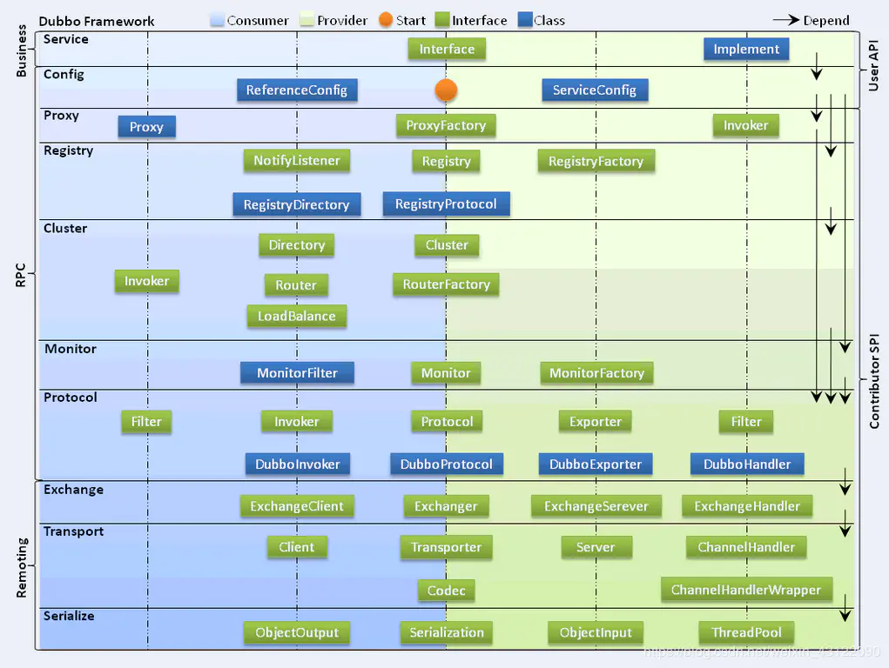

## Dubbo

### 1.为什么要用Dubbo

随着服务化的进一步发展，服务越来越多，服务之间的调用和依赖关系也越来越复杂，诞生了面向服务的架构体系(SOA)，也因此衍生出了一系列相应的技术，如对服务提供、服务调用、连接处理、通信协议、序列化方式、服务发现、服务路由、日志输出等行为进行封装的服务框架。就这样为分布式系统的服务治理框架就出现了，Dubbo 也就这样产生了

### 2.Dubbo是什么

Dubbo 是一款高性能、轻量级的开源 RPC 框架，提供服务自动注册、自动发现等高效服务治理方案， 可以和 Spring 框架无缝集成。

### 3.Dubbo的使用场景有哪些

- 透明化的远程方法调用：就像调用本地方法一样调用远程方法，只需简单配置，没有任何API侵入。
- 软负载均衡及容错机制：可在内网替代 F5 等硬件负载均衡器，降低成本，减少单点。
- 服务自动注册与发现：不再需要写死服务提供方地址，注册中心基于接口名查询服务提供者的IP地址，并且能够平滑添加或删除服务提供者。

### 4.Dubbo核心功能有哪些

- Remoting：网络通信框架，提供对多种NIO框架抽象封装，包括“同步转异步”和“请求-响应”模式的信息交换方式。
- Cluster：服务框架，提供基于接口方法的透明远程过程调用，包括多协议支持，以及软负载均衡，失败容错，地址路由，动态配置等集群支持。
- Registry：服务注册，基于注册中心目录服务，使服务消费方能动态的查找服务提供方，使地址透明，使服务提供方可以平滑增加或减少机器。

### 5.Dubbo核心组件有哪些

- Provider：暴露服务的服务提供方
- Consumer：调用远程服务消费方
- Registry：服务注册与发现注册中心
- Monitor：监控中心和访问调用统计
- Container：服务运行容器

### 6.Dubbo服务器注册与发现的流程

- 服务容器Container负责启动，加载，运行服务提供者。
- 服务提供者Provider在启动时，向注册中心注册自己提供的服务。
- 服务消费者Consumer在启动时，向注册中心订阅自己所需的服务。
- 注册中心Registry返回服务提供者地址列表给消费者，如果有变更，注册中心将基于长连接推送变更数据给消费者。
- 服务消费者Consumer，从提供者地址列表中，基于软负载均衡算法，选一台提供者进行调用，如果调用失败，再选另一台调用。
- 服务消费者Consumer和提供者Provider，在内存中累计调用次数和调用时间，定时每分钟发送一次统计数据到监控中心Monitor。

### 7.Dubbo的整体架构设计有哪些分层

- 接口服务层（Service）：该层与业务逻辑相关，根据 provider 和 consumer 的业务设计对应的接口和实现
- 配置层（Config）：对外配置接口，以 ServiceConfig 和 ReferenceConfig 为中心
- 服务代理层（Proxy）：服务接口透明代理，生成服务的客户端 Stub 和 服务端的 Skeleton，以 ServiceProxy 为中心，扩展接口为 ProxyFactory
- 服务注册层（Registry）：封装服务地址的注册和发现，以服务 URL 为中心，扩展接口为 RegistryFactory、Registry、RegistryService
- 路由层（Cluster）：封装多个提供者的路由和负载均衡，并桥接注册中心，以Invoker 为中心，扩展接口为 Cluster、Directory、Router 和 LoadBlancce
- 监控层（Monitor）：RPC 调用次数和调用时间监控，以 Statistics 为中心，扩展接口为 MonitorFactory、Monitor 和 MonitorService
- 远程调用层（Protocal）：封装 RPC 调用，以 Invocation 和 Result 为中心，扩展接口为 Protocal、Invoker 和 Exporter
- 信息交换层（Exchange）：封装请求响应模式，同步转异步。以 Request 和Response 为中心，扩展接口为 Exchanger、ExchangeChannel、ExchangeClient 和 ExchangeServer
- 网络 传输 层（Transport）：抽象 mina 和 netty 为统一接口，以 Message 为中心，扩展接口为 Channel、Transporter、Client、Server 和 Codec
- 数据序列化层（Serialize）：可复用的一些工具，扩展接口为 Serialization、ObjectInput、ObjectOutput 和 ThreadPool

### 8.DubboMonitor实现原理

Consumer 端在发起调用之前会先走 filter 链；provider 端在接收到请求时也是先走 filter 链，然后才进行真正的业务逻辑处理。默认情况下，在 consumer 和 provider 的 filter 链中都会有 Monitorfilter。

- 1.MonitorFilter 向 DubboMonitor 发送数据

- 2.DubboMonitor 将数据进行聚合后（默认聚合 1min 中的统计数据）暂存到ConcurrentMap<Statistics, AtomicReference> statisticsMap，然后使用一个含有 3 个线程（线程名字：DubboMonitorSendTimer）的线程池每隔 1min 钟，调用 SimpleMonitorService 遍历发送 statisticsMap 中的统计数据，每发送完毕一个，就重置当前的 Statistics 的 AtomicReference

- 3.SimpleMonitorService 将这些聚合数据塞入 BlockingQueue queue 中（队列大写为 100000）

- 4.SimpleMonitorService 使用一个后台线程（线程名为：DubboMonitorAsyncWriteLogThread）将 queue 中的数据写入文件（该线程以死循环的形式来写）

- 5.SimpleMonitorService 还会使用一个含有 1 个线程（线程名字：DubboMonitorTimer）的线程池每隔 5min 钟，将文件中的统计数据画成图表

### 9.Dubbo和SpringCloud有什么哪些区别

- Dubbo 底层是使用 Netty 这样的 NIO 框架，是基于 TCP 协议传输的，配合以 Hession 序列化完成 RPC 通信。

- Spring Cloud 是基于 Http 协议 Rest 接口调用远程过程的通信，相对来说 Http 请求会有更大的报文，占的带宽也会更多。但是 REST 相比 RPC 更为灵活，服务提供方和调用方的依赖只依靠一纸契约，不存在代码级别的强依赖，这在强调快速演化的微服务环境下，显得更为合适，至于注重通信速度还是方便灵活性，具体情况具体考虑。

### 10.Dubbo有哪些注册中心

- Multicast 注册中心：Multicast 注册中心不需要任何中心节点，只要广播地址，就能进行服务注册和发现,基于网络中组播传输实现。
- Zookeeper 注册中心：基于分布式协调系统 Zookeeper 实现，采用 Zookeeper 的 watch 机制实现数据变更。
- Redis 注册中心：基于 Redis 实现，采用 key/map 存储，key 存储服务名和类型，map 中 key 存储服务 url，value 服务过期时间。基于 Redis 的发布/订阅模式通知数据变更。
- Simple 注册中心。

推荐使用 Zookeeper 作为注册中心

#### Dubbo 的注册中心集群挂掉，发布者和订阅者之间还能通信么？

可以通讯。启动 Dubbo 时，消费者会从 Zookeeper 拉取注册的生产者的地址接口等数据，缓存在本地。每次调用时，按照本地存储的地址进行调用。

### 11.Dubbo集群提供了哪些负载均衡策略

- Random LoadBalance: 随机选取提供者策略，有利于动态调整提供者权重。截面碰撞率高，调用次数越多，分布越均匀。

- RoundRobin LoadBalance: 轮循选取提供者策略，平均分布，但是存在请求累积的问题。

- LeastActive LoadBalance: 最少活跃调用策略，解决慢提供者接收更少的请求。

- ConstantHash LoadBalance: 一致性 Hash 策略，使相同参数请求总是发到同一提供者，一台机器宕机，可以基于虚拟节点，分摊至其他提供者，避免引起提供者的剧烈变动。

### 12.Dubbo的集群容错方案有哪些

- Failover Cluster：失败自动切换，当出现失败，重试其它服务器。通常用于读操作，但重试会带来更长延迟。
- Failfast Cluster：快速失败，只发起一次调用，失败立即报错。通常用于非幂等性的写操作，比如新增记录。
- Failsafe Cluster：失败安全，出现异常时，直接忽略。通常用于写入审计日志等操作。
- Failback Cluster：失败自动恢复，后台记录失败请求，定时重发。通常用于消息通知操作。
- Forking Cluster：并行调用多个服务器，只要一个成功即返回。通常用于实时性要求较高的读操作，但需要浪费更多服务资源。可通过 forks=”2″ 来设置最大并行数。
- Broadcast Cluster：广播调用所有提供者，逐个调用，任意一台报错则报错 。通常用于通知所有提供者更新缓存或日志等本地资源信息。

默认的容错方案是 Failover Cluster。

### 13.默认的容错方案是FailoverCluster

Spring 容器在启动的时候，会读取到 Spring 默认的一些 schema 以及 Dubbo 自定义的 schema，每个 schema 都会对应一个自己的 NamespaceHandler，NamespaceHandler 里面通过 BeanDefinitionParser 来解析配置信息并转化为需要加载的 bean 对象！

### 14.说说核心的配置有哪些

<dubbo:service/>
服务配置
用于暴露一个服务，定义服务的元信息，一个服务可以用多个协议暴露，一个服务也可以注册到多个注册中心

<dubbo:reference/>
引用配置
用于创建一个远程服务代理，一个引用可以指向多个注册中心

<dubbo:protocol/>
协议配置
用于配置提供服务的协议信息，协议由提供方指定，消费方被动接受

<dubbo:application/>
应用配置
用于配置当前应用信息，不管该应用是提供者还是消费者

<dubbo:module/>
模块配置
用于配置当前模块信息，可选

<dubbo:registry/>
注册中心配置
用于配置连接注册中心相关信息

<dubbo:monitor/>
监控中心配置
用于配置连接监控中心相关信息，可选

<dubbo:provider/>
提供方配置
当 ProtocolConfig 和 ServiceConfig 某属性没有配置时，采用此缺省值，可选

<dubbo:consumer/>
消费方配置
当 ReferenceConfig 某属性没有配置时，采用此缺省值，可选

<dubbo:method/>
方法配置
用于 ServiceConfig 和 ReferenceConfig 指定方法级的配置信息

<dubbo:argument>
参数配置
用于指定方法参数配置

如果是SpringBoot项目就只需要注解，或者开Application配置文件

### 15.Dubbo超时设置有哪些方式

Dubbo 超时设置有两种方式：

- 服务提供者端设置超时时间，在Dubbo的用户文档中，推荐如果能在服务端多配置就尽量多配置，因为服务提供者比消费者更清楚自己提供的服务特性。
- 服务消费者端设置超时时间，如果在消费者端设置了超时时间，以消费者端为主，即优先级更高。因为服务调用方设置超时时间控制性更灵活。如果消费方超时，服务端线程不会定制，会产生警告。

### 16.服务调用超时会怎么样

dubbo 在调用服务不成功时，默认是会重试两次。

### 17.Dubbo使用的是什么通信框架

默认使用 Netty 作为通讯框架。

### 18.Dubbo支持哪些协议，它们的优缺点有哪些

- Dubbo： 单一长连接和 NIO 异步通讯，适合大并发小数据量的服务调用，以及消费者远大于提供者。传输协议 TCP，异步 Hessian 序列化。Dubbo推荐使用dubbo协议。

- RMI： 采用 JDK 标准的 RMI 协议实现，传输参数和返回参数对象需要实现 Serializable 接口，使用 Java 标准序列化机制，使用阻塞式短连接，传输数据包大小混合，消费者和提供者个数差不多，可传文件，传输协议 TCP。 多个短连接 TCP 协议传输，同步传输，适用常规的远程服务调用和 RMI 互操作。在依赖低版本的 Common-Collections 包，Java 序列化存在安全漏洞。

- WebService：基于 WebService 的远程调用协议，集成 CXF 实现，提供和原生 WebService 的互操作。多个短连接，基于 HTTP 传输，同步传输，适用系统集成和跨语言调用。

- HTTP： 基于 Http 表单提交的远程调用协议，使用 Spring 的 HttpInvoke 实现。多个短连接，传输协议 HTTP，传入参数大小混合，提供者个数多于消费者，需要给应用程序和浏览器 JS 调用。

- Hessian：集成 Hessian 服务，基于 HTTP 通讯，采用 Servlet 暴露服务，Dubbo 内嵌 Jetty 作为服务器时默认实现，提供与 Hession 服务互操作。多个短连接，同步 HTTP 传输，Hessian 序列化，传入参数较大，提供者大于消费者，提供者压力较大，可传文件。

- Memcache：基于 Memcache实现的 RPC 协议。

- Redis：基于 Redis 实现的RPC协议。

### 19.Dubbo支持哪些序列化方式

默认使用 Hessian 序列化，还有 Duddo、FastJson、Java 自带序列化。
\

### Reference:

https://juejin.cn/post/6844904127076499463

