## JAVA Basic 

### 1.Object类中方法详解

Object类是Java中所有类的基类。位于java.lang包中，一共有13个方法

#### 方法一 Object() 即Object的构造方法

大部分情况下，Java中通过形如 new A(args..)形式创建一个属于该类型的对象。

其中A即是类名，A(args..)即此类定义中相对应的构造函数。通过此种形式创建的对象都是通过类中的构造函数完成。为体现此特性，Java中规定：在类定义过程中，对于未定义构造函数的类，默认会有一个无参数的构造函数，作为所有类的基类，Object类自然要反映出此特性，在源码中，未给出Object类构造函数定义，但实际上，此构造函数是存在的。

当然，并不是所有的类都是通过此种方式去构建，也自然的，并不是所有的类构造函数都是public。

#### 方法二 registerNatives

通常情况下，为了使JVM发现您的本机功能，他们被一定的方式命名。例如，对于java.lang.Object.registerNatives，对应的C函数命名为Java_java_lang_Object_registerNatives。通过使用registerNatives（或者更确切地说，JNI函数RegisterNatives），您可以命名任何你想要你的C函数。

#### 方法三 clone

注意：clone返回的对象为浅拷贝

clone()方法同样是一个被声明为native的方法，因此，我们知道了clone()方法并不是Java的原生方法，具体的实现是有C/C++完成的。clone英文翻译为"克隆"，其目的是创建并返回此对象的一个副本。形象点理解，这有一辆科鲁兹，你看着不错，想要个一模一样的。你调用此方法即可像变魔术一样变出一辆一模一样的科鲁兹出来。配置一样，长相一样。但从此刻起，原来的那辆科鲁兹如果进行了新的装饰，与你克隆出来的这辆科鲁兹没有任何关系了。你克隆出来的对象变不变完全在于你对克隆出来的科鲁兹有没有进行过什么操作了。Java术语表述为：clone函数返回的是一个引用，指向的是新的clone出来的对象，此对象与原对象分别占用不同的堆空间。

#### 方法4 getClass()

getClass()也是一个native方法，返回的是此Object对象的类对象/运行时类对象Class<?>。效果与Object.class相同。

首先解释下"类对象"的概念：在Java中，类是是对具有一组相同特征或行为的实例的抽象并进行描述，对象则是此类所描述的特征或行为的具体实例。作为概念层次的类，其本身也具有某些共同的特性，如都具有类名称、由类加载器去加载，都具有包，具有父类，属性和方法等。于是，Java中有专门定义了一个类，Class，去描述其他类所具有的这些特性，因此，从此角度去看，类本身也都是属于Class类的对象。为与经常意义上的对象相区分，在此称之为"类对象"。


#### 方法5 equals

==与equals在Java中经常被使用，大家也都知道==与equals的区别：

==表示的是变量值完成相同（对于基础类型，地址中存储的是值，引用类型则存储指向实际对象的地址）；

equals表示的是对象的内容完全相同，此处的内容多指对象的特征/属性。

实际上，上面说法是不严谨的，更多的只是常见于String类中。首先看一下Object类中关于equals()方法的定义：

```
public boolean equals(Object obj) {
     return (this == obj);
}
```

由此可见，Object原生的equals()方法内部调用的正是==，与==具有相同的含义。既然如此，为什么还要定义此equals()方法？

equlas()方法的正确理解应该是：判断两个对象是否相等。那么判断对象相等的标尺又是什么？

如上，在object类中，此标尺即为==。当然，这个标尺不是固定的，其他类中可以按照实际的需要对此标尺含义进行重定义。如String类中则是依据字符串内容是否相等来重定义了此标尺含义。如此可以增加类的功能型和实际编码的灵活性。当然了，如果自定义的类没有重写equals()方法来重新定义此标尺，那么默认的将是其父类的equals()，直到object基类。

如上重写equals方法表面上看上去是可以了，实则不然。因为它破坏了Java中的约定：**重写equals()方法必须重写hasCode()方法**。

#### 方法6 hashCode();

hashCode()方法返回一个整形数值，表示该对象的哈希码值。

hashCode()具有如下约定：

1).在Java应用程序程序执行期间，对于同一对象多次调用hashCode()方法时，其返回的哈希码是相同的，前提是将对象进行equals比较时所用的标尺信息未做修改。在Java应用程序的一次执行到另外一次执行，同一对象的hashCode()返回的哈希码无须保持一致；

2).如果两个对象相等（依据：调用equals()方法），那么这两个对象调用hashCode()返回的哈希码也必须相等；

3).反之，两个对象调用hasCode()返回的哈希码相等，这两个对象不一定相等。

即严格的数学逻辑表示为： 两个对象相等 <=>  equals()相等  => hashCode()相等。因此，重写equlas()方法必须重写hashCode()方法，以保证此逻辑严格成立，同时可以推理出：hasCode()不相等 => equals（）不相等 <=> 两个对象不相等。

可能有人在此产生疑问：既然比较两个对象是否相等的唯一条件（也是冲要条件）是equals，那么为什么还要弄出一个hashCode()，并且进行如此约定，弄得这么麻烦？

其实，这主要体现在hashCode()方法的作用上，其主要用于增强哈希表的性能。

以集合类中，以Set为例，当新加一个对象时，需要判断现有集合中是否已经存在与此对象相等的对象，如果没有hashCode()方法，需要将Set进行一次遍历，并逐一用equals()方法判断两个对象是否相等，此种算法时间复杂度为o(n)。通过借助于hasCode方法，先计算出即将新加入对象的哈希码，然后根据哈希算法计算出此对象的位置，直接判断此位置上是否已有对象即可。（注：Set的底层用的是Map的原理实现）

在此需要纠正一个理解上的误区：对象的hashCode()返回的不是对象所在的物理内存地址。甚至也不一定是对象的逻辑地址，hashCode()相同的两个对象，不一定相等，换言之，不相等的两个对象，hashCode()返回的哈希码可能相同。

因此，在上述代码中，重写了equals()方法后，需要重写hashCode()方法。

#### 方法7 toString();

toString()方法返回该对象的字符串表示。先看一下Object中的具体方法体：

```
public String toString() {
    return getClass().getName() + "@" + Integer.toHexString(hashCode());
}
```

toString()方法相信大家都经常用到，即使没有显式调用，但当我们使用System.out.println(obj)时，其内部也是通过toString()来实现的。

getClass()返回对象的类对象，getClassName()以String形式返回类对象的名称（含包名）。Integer.toHexString(hashCode())则是以对象的哈希码为实参，以16进制无符号整数形式返回此哈希码的字符串表示形式。

如上例中的u1的哈希码是638，则对应的16进制为27e，调用toString()方法返回的结果为：com.corn.objectsummary.User@27e。


因此：toString()是由对象的类型和其哈希码唯一确定，同一类型但不相等的两个对象分别调用toString()方法返回的结果可能相同。

#### wait(...) / notify() / notifyAll()方法

一说到wait(...) / notify() | notifyAll()几个方法，首先想到的是线程。确实，这几个方法主要用于java多线程之间的协作。先具体看下这几个方法的主要含义：

wait()：调用此方法所在的当前线程等待，直到在其他线程上调用此方法的主调（某一对象）的notify()/notifyAll()方法。

wait(long timeout)/wait(long timeout, int nanos)：调用此方法所在的当前线程等待，直到在其他线程上调用此方法的主调（某一对象）的notisfy()/notisfyAll()方法，或超过指定的超时时间量。

notify()/notifyAll()：唤醒在此对象监视器上等待的单个线程/所有线程。

#### 方法13 finalize();

finalize方法主要与Java垃圾回收机制有关。首先我们看一下finalized方法在Object中的具体定义：

```
protected void finalize() throws Throwable { }
```

我们发现Object类中finalize方法被定义成一个空方法，为什么要如此定义呢？finalize方法的调用时机是怎么样的呢？

首先，Object中定义finalize方法表明Java中每一个对象都将具有finalize这种行为，其具体调用时机在：JVM准备对此对形象所占用的内存空间进行垃圾回收前，将被调用。由此可以看出，此方法并不是由我们主动去调用的（虽然可以主动去调用，此时与其他自定义方法无异）。

### 3.JAVA中基本类型和长度

#### 整型

|类型 |             存储需求  |      bit数    |              取值范围  |
|---|---|---|---|    
|byte|              1字节     |      1*8 |     （-2的31次方到2的31次方-1）| 
|short   |          2字节      |     2*8       |      －32768～32767|
|int   |            4字节  |         4*8 |     （-2的63次方到2的63次方-1）|
|long   |           8字节   |        8*8   |              －128～127|

#### 浮点型

|类型  |            存储需求  |       bit数       |                           备注|
|---|---|---|---|
|float |             4字节 |          4*8     |       float类型的数值有一个后缀F(例如：3.14F)|
|double        |     8字节       |    8*8  |       没有后缀F的浮点数值(如3.14)默认为double类型 |

#### char 
|类型 |             存储需求    |    bit数 |
|---|---|---|
|char |                 2字节 |         2*8|

#### boolean类型

|类型    |          存储需求  |      bit数    |              取值范围  |
|---|---|---|---|
|boolean |          1字节      |     1*8     |            false、true|

### 4.十大经典排序算法

#### 术语说明

- 稳定：如果a原本在b前面，而a=b，排序之后a仍然在b的前面；
- 不稳定：如果a原本在b的前面，而a=b，排序之后a可能会出现在b的后面；
- 内排序：所有排序操作都在内存中完成；
- 外排序：由于数据太大，因此把数据放在磁盘中，而排序通过磁盘和内存的数据传输才能进行；
- 时间复杂度： 一个算法执行所耗费的时间。
- 空间复杂度：运行完一个程序所需内存的大小。

#### 算法总结


名词解释：

n: 数据规模
k: “桶”的个数
In-place: 占用常数内存，不占用额外内存
Out-place: 占用额外内存

#### 算法分类


#### 比较和非比较的区别

常见的**快速排序、归并排序、堆排序、冒泡排序等属于比较排序**。在排序的最终结果里，元素之间的次序依赖于它们之间的比较。每个数都必须和其他数进行比较，才能确定自己的位置。<br/>
在冒泡排序之类的排序中，问题规模为n，又因为需要比较n次，所以平均时间复杂度为O(n²)。在归并排序、快速排序之类的排序中，问题规模通过分治法消减为logN次，所以时间复杂度平均O(nlogn)。<br/>
比较排序的优势是，适用于各种规模的数据，也不在乎数据的分布，都能进行排序。可以说，比较排序适用于一切需要排序的情况。

**计数排序、基数排序、桶排序则属于非比较排序**。非比较排序是通过确定每个元素之前，应该有多少个元素来排序。针对数组arr，计算arr[i]之前有多少个元素，则唯一确定了arr[i]在排序后数组中的位置。<br/>
非比较排序只要确定每个元素之前的已有的元素个数即可，所有一次遍历即可解决。算法时间复杂度O(n)。<br/>
非比较排序时间复杂度底，但由于非比较排序需要占用空间来确定唯一位置。所以对数据规模和数据分布有一定的要求。

#### 1.冒泡排序

冒泡排序是一种简单的排序算法。它重复地走访过要排序的数列，一次比较两个元素，如果它们的顺序错误就把它们交换过来。走访数列的工作是重复地进行直到没有再需要交换，也就是说该数列已经排序完成。这个算法的名字由来是因为越小的元素会经由交换慢慢“浮”到数列的顶端。 

##### 1.1 算法描述

- 比较相邻的元素。如果第一个比第二个大，就交换它们两个；
- 对每一对相邻元素作同样的工作，从开始第一对到结尾的最后一对，这样在最后的元素应该会是最大的数；
- 针对所有的元素重复以上的步骤，除了最后一个；
- 重复步骤1~3，直到排序完成。

##### 1.2 动图演示


##### 1.3 代码实现

```
/**
* 冒泡排序
*
* @param array
* @return
*/
public static int[] bubbleSort(int[] array) {
    if (array.length == 0)
        return array;
    for (int i = 0; i < array.length; i++)
        for (int j = 0; j < array.length - 1 - i; j++)
            if (array[j + 1] < array[j]) {
                int temp = array[j + 1];
                array[j + 1] = array[j];
                array[j] = temp;
            }
    return array;
}
```

##### 1.4 算法分析

最佳情况：T(n) = O(n)   最差情况：T(n) = O(n2)   平均情况：T(n) = O(n2)

#### 2.选择排序

**表现最稳定的排序算法之一**，因为无论什么数据进去都是O(n2)的时间复杂度，所以用到它的时候，数据规模越小越好。唯一的好处可能就是不占用额外的内存空间了吧。理论上讲，选择排序可能也是平时排序一般人想到的最多的排序方法了吧。

选择排序(Selection-sort)是一种简单直观的排序算法。它的工作原理：首先在未排序序列中找到最小（大）元素，存放到排序序列的起始位置，然后，再从剩余未排序元素中继续寻找最小（大）元素，然后放到已排序序列的末尾。以此类推，直到所有元素均排序完毕。 

##### 2.1 算法描述

n个记录的直接选择排序可经过n-1趟直接选择排序得到有序结果。具体算法描述如下：

- 初始状态：无序区为R[1..n]，有序区为空；
- 第i趟排序(i=1,2,3…n-1)开始时，当前有序区和无序区分别为R[1..i-1]和R(i..n）。该趟排序从当前无序区中-选出关键字最小的记录 R[k]，将它与无序区的第1个记录R交换，使R[1..i]和R[i+1..n)分别变为记录个数增加1个的新有序区和记录个数减少1个的新无序区；
- n-1趟结束，数组有序化了。

##### 2.2 动图演示


##### 2.2 代码实现

```
/**
* 选择排序
* @param array
* @return
*/
public static int[] selectionSort(int[] array) {
    if (array.length == 0)
        return array;
    for (int i = 0; i < array.length; i++) {
        int minIndex = i;
        for (int j = i; j < array.length; j++) {
            if (array[j] < array[minIndex]) //找到最小的数
                minIndex = j; //将最小数的索引保存
        }
        int temp = array[minIndex];
        array[minIndex] = array[i];
        array[i] = temp;
    }
    return array;
}
```

##### 2.4 算法分析

最佳情况：T(n) = O(n2)  最差情况：T(n) = O(n2)  平均情况：T(n) = O(n2)

#### 3.插入排序

插入排序（Insertion-Sort）的算法描述是一种简单直观的排序算法。它的工作原理是通过构建有序序列，对于未排序数据，在已排序序列中从后向前扫描，找到相应位置并插入。插入排序在实现上，通常采用in-place排序（即只需用到O(1)的额外空间的排序），因而在从后向前扫描过程中，需要反复把已排序元素逐步向后挪位，为最新元素提供插入空间。

##### 3.1 算法描述

一般来说，插入排序都采用in-place在数组上实现。具体算法描述如下：

- 从第一个元素开始，该元素可以认为已经被排序；
- 取出下一个元素，在已经排序的元素序列中从后向前扫描；
- 如果该元素（已排序）大于新元素，将该元素移到下一位置；
- 重复步骤3，直到找到已排序的元素小于或者等于新元素的位置；
- 将新元素插入到该位置后；
- 重复步骤2~5。

##### 3.2 动图演示


##### 3.2 代码实现

```
/**
     * 插入排序
     * @param array
     * @return
     */
    public static int[] insertionSort(int[] array) {
        if (array.length == 0)
            return array;
        int current;
        for (int i = 0; i < array.length - 1; i++) {
            current = array[i + 1];
            int preIndex = i;
            while (preIndex >= 0 && current < array[preIndex]) {
                array[preIndex + 1] = array[preIndex];
                preIndex--;
            }
            array[preIndex + 1] = current;
        }
        return array;
    }
```

##### 3.4 算法分析

最佳情况：T(n) = O(n)   最坏情况：T(n) = O(n2)   平均情况：T(n) = O(n2)

#### 4.希尔排序

希尔排序是希尔（Donald Shell）于1959年提出的一种排序算法。希尔排序也是一种插入排序，它是简单插入排序经过改进之后的一个更高效的版本，也称为缩小增量排序，同时该算法是冲破O(n2）的第一批算法之一。它与插入排序的不同之处在于，它会优先比较距离较远的元素。希尔排序又叫缩小增量排序。

**希尔排序是把记录按下表的一定增量分组，对每组使用直接插入排序算法排序；随着增量逐渐减少，每组包含的关键词越来越多，当增量减至1时，整个文件恰被分成一组，算法便终止。**

##### 4.1 算法描述

我们来看下希尔排序的基本步骤，在此我们选择增量gap=length/2，缩小增量继续以gap = gap/2的方式，这种增量选择我们可以用一个序列来表示，{n/2,(n/2)/2...1}，称为增量序列。希尔排序的增量序列的选择与证明是个数学难题，我们选择的这个增量序列是比较常用的，也是希尔建议的增量，称为希尔增量，但其实这个增量序列不是最优的。此处我们做示例使用希尔增量。

先将整个待排序的记录序列分割成为若干子序列分别进行直接插入排序，具体算法描述：

- 选择一个增量序列t1，t2，…，tk，其中ti>tj，tk=1；
- 按增量序列个数k，对序列进行k 趟排序；
- 每趟排序，根据对应的增量ti，将待排序列分割成若干长度为m 的子序列，分别对各子表进行直接插入排序。仅增量因子为1 时，整个序列作为一个表来处理，表长度即为整个序列的长度。

##### 4.2 过程演示

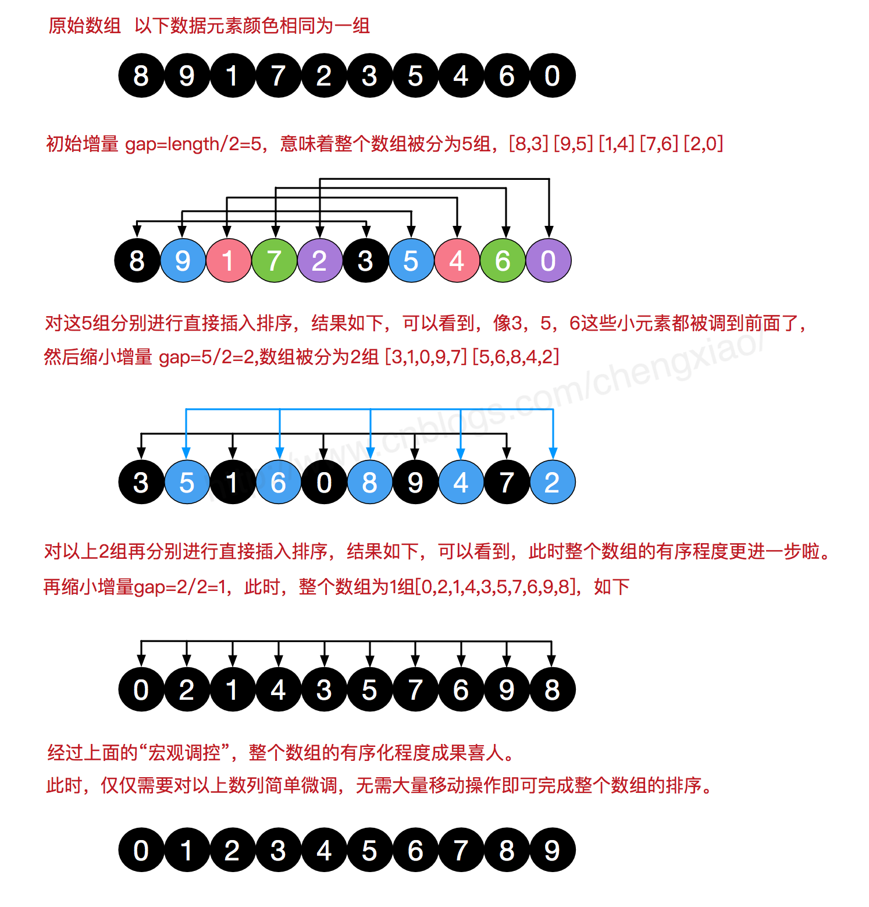

##### 4.3 代码实现

```
/**
     * 希尔排序
     *
     * @param array
     * @return
     */
    public static int[] ShellSort(int[] array) {
        int len = array.length;
        int temp, gap = len / 2;
        while (gap > 0) {
            for (int i = gap; i < len; i++) {
                temp = array[i];
                int preIndex = i - gap;
                while (preIndex >= 0 && array[preIndex] > temp) {
                    array[preIndex + gap] = array[preIndex];
                    preIndex -= gap;
                }
                array[preIndex + gap] = temp;
            }
            gap /= 2;
        }
        return array;
    }
```

##### 4.4 算法分析

最佳情况：T(n) = O(nlog2 n)  最坏情况：T(n) = O(nlog2 n)  平均情况：T(n) =O(nlog2n)　

#### 5.归并排序

和选择排序一样，归并排序的性能不受输入数据的影响，但表现比选择排序好的多，因为始终都是O(n log n）的时间复杂度。代价是需要额外的内存空间。

归并排序是建立在归并操作上的一种有效的排序算法。该算法是采用分治法（Divide and Conquer）的一个非常典型的应用。归并排序是一种稳定的排序方法。将已有序的子序列合并，得到完全有序的序列；即先使每个子序列有序，再使子序列段间有序。若将两个有序表合并成一个有序表，称为2-路归并。 

##### 5.1 算法描述

- 把长度为n的输入序列分成两个长度为n/2的子序列；
- 对这两个子序列分别采用归并排序；
- 将两个排序好的子序列合并成一个最终的排序序列。

##### 5.2 动图演示


##### 5.3 代码实现

```
/**
     * 归并排序
     *
     * @param array
     * @return
     */
    public static int[] MergeSort(int[] array) {
        if (array.length < 2) return array;
        int mid = array.length / 2;
        int[] left = Arrays.copyOfRange(array, 0, mid);
        int[] right = Arrays.copyOfRange(array, mid, array.length);
        return merge(MergeSort(left), MergeSort(right));
    }
    /**
     * 归并排序——将两段排序好的数组结合成一个排序数组
     *
     * @param left
     * @param right
     * @return
     */
    public static int[] merge(int[] left, int[] right) {
        int[] result = new int[left.length + right.length];
        for (int index = 0, i = 0, j = 0; index < result.length; index++) {
            if (i >= left.length)
                result[index] = right[j++];
            else if (j >= right.length)
                result[index] = left[i++];
            else if (left[i] > right[j])
                result[index] = right[j++];
            else
                result[index] = left[i++];
        }
        return result;
    }
```

##### 5. 4 算法分析

最佳情况：T(n) = O(n)  最差情况：T(n) = O(nlogn)  平均情况：T(n) = O(nlogn)

#### 6.快速排序

快速排序的基本思想：通过一趟排序将待排记录分隔成独立的两部分，其中一部分记录的关键字均比另一部分的关键字小，则可分别对这两部分记录继续进行排序，以达到整个序列有序。

##### 6.1 算法描述

快速排序使用分治法来把一个串（list）分为两个子串（sub-lists）。具体算法描述如下：

- 从数列中挑出一个元素，称为 “基准”（pivot）；
- 重新排序数列，所有元素比基准值小的摆放在基准前面，所有元素比基准值大的摆在基准的后面（相同的数可以到任一边）。在这个分区退出之后，该基准就处于数列的中间位置。这个称为分区（partition）操作；
- 递归地（recursive）把小于基准值元素的子数列和大于基准值元素的子数列排序。

##### 6.2 动图演示


##### 6.3 代码实现

```
/**
     * 快速排序方法
     * @param array
     * @param start
     * @param end
     * @return
     */
    public static int[] QuickSort(int[] array, int start, int end) {
        if (array.length < 1 || start < 0 || end >= array.length || start > end) return null;
        int smallIndex = partition(array, start, end);
        if (smallIndex > start)
            QuickSort(array, start, smallIndex - 1);
        if (smallIndex < end)
            QuickSort(array, smallIndex + 1, end);
        return array;
    }
    /**
     * 快速排序算法——partition
     * @param array
     * @param start
     * @param end
     * @return
     */
    public static int partition(int[] array, int start, int end) {
        int pivot = (int) (start + Math.random() * (end - start + 1));
        int smallIndex = start - 1;
        swap(array, pivot, end);
        for (int i = start; i <= end; i++)
            if (array[i] <= array[end]) {
                smallIndex++;
                if (i > smallIndex)
                    swap(array, i, smallIndex);
            }
        return smallIndex;
    }

    /**
     * 交换数组内两个元素
     * @param array
     * @param i
     * @param j
     */
    public static void swap(int[] array, int i, int j) {
        int temp = array[i];
        array[i] = array[j];
        array[j] = temp;
    }
```

##### 6.4 算法分析

最佳情况：T(n) = O(nlogn)   最差情况：T(n) = O(n2)   平均情况：T(n) = O(nlogn)　

#### 7.堆排序

堆排序（Heapsort）是指利用堆这种数据结构所设计的一种排序算法。堆积是一个近似完全二叉树的结构，并同时满足堆积的性质：即子结点的键值或索引总是小于（或者大于）它的父节点。

##### 7.1 算法描述

- 将初始待排序关键字序列(R1,R2….Rn)构建成大顶堆，此堆为初始的无序区；
- 将堆顶元素R[1]与最后一个元素R[n]交换，此时得到新的无序区(R1,R2,……Rn-1)和新的有序区(Rn),且满足R[1,2…n-1]<=R[n]；
- 由于交换后新的堆顶R[1]可能违反堆的性质，因此需要对当前无序区(R1,R2,……Rn-1)调整为新堆，然后再次将R[1]与无序区最后一个元素交换，得到新的无序区(R1,R2….Rn-2)和新的有序区(Rn-1,Rn)。不断重复此过程直到有序区的元素个数为n-1，则整个排序过程完成。

##### 7.2 动图演示


##### 7.3 代码实现
注意：这里用到了完全二叉树的部分性质：详情见《数据结构二叉树知识点总结》

```
//声明全局变量，用于记录数组array的长度；
static int len;
    /**
     * 堆排序算法
     *
     * @param array
     * @return
     */
    public static int[] HeapSort(int[] array) {
        len = array.length;
        if (len < 1) return array;
        //1.构建一个最大堆
        buildMaxHeap(array);
        //2.循环将堆首位（最大值）与末位交换，然后在重新调整最大堆
        while (len > 0) {
            swap(array, 0, len - 1);
            len--;
            adjustHeap(array, 0);
        }
        return array;
    }
    /**
     * 建立最大堆
     *
     * @param array
     */
    public static void buildMaxHeap(int[] array) {
        //从最后一个非叶子节点开始向上构造最大堆
        for (int i = (len/2 - 1); i >= 0; i--) { //感谢 @让我发会呆 网友的提醒，此处应该为 i = (len/2 - 1) 
            adjustHeap(array, i);
        }
    }
    /**
     * 调整使之成为最大堆
     *
     * @param array
     * @param i
     */
    public static void adjustHeap(int[] array, int i) {
        int maxIndex = i;
        //如果有左子树，且左子树大于父节点，则将最大指针指向左子树
        if (i * 2 < len && array[i * 2] > array[maxIndex])
            maxIndex = i * 2;
        //如果有右子树，且右子树大于父节点，则将最大指针指向右子树
        if (i * 2 + 1 < len && array[i * 2 + 1] > array[maxIndex])
            maxIndex = i * 2 + 1;
        //如果父节点不是最大值，则将父节点与最大值交换，并且递归调整与父节点交换的位置。
        if (maxIndex != i) {
            swap(array, maxIndex, i);
            adjustHeap(array, maxIndex);
        }
    }
```

##### 7.4 算法分析

最佳情况：T(n) = O(nlogn) 最差情况：T(n) = O(nlogn) 平均情况：T(n) = O(nlogn)

#### 8.计数排序

计数排序的核心在于将输入的数据值转化为键存储在额外开辟的数组空间中。 作为一种线性时间复杂度的排序，计数排序要求输入的数据必须是有确定范围的整数。

计数排序(Counting sort)是一种稳定的排序算法。计数排序使用一个额外的数组C，其中第i个元素是待排序数组A中值等于i的元素的个数。然后根据数组C来将A中的元素排到正确的位置。它只能对整数进行排序。

##### 8.1 算法描述

- 找出待排序的数组中最大和最小的元素；
- 统计数组中每个值为i的元素出现的次数，存入数组C的第i项；
- 对所有的计数累加（从C中的第一个元素开始，每一项和前一项相加）；
- 反向填充目标数组：将每个元素i放在新数组的第C(i)项，每放一个元素就将C(i)减去1。

##### 8.2 动图演示


##### 8.3 代码实现

```
/**
     * 计数排序
     *
     * @param array
     * @return
     */
    public static int[] CountingSort(int[] array) {
        if (array.length == 0) return array;
        int bias, min = array[0], max = array[0];
        for (int i = 1; i < array.length; i++) {
            if (array[i] > max)
                max = array[i];
            if (array[i] < min)
                min = array[i];
        }
        bias = 0 - min;
        int[] bucket = new int[max - min + 1];
        Arrays.fill(bucket, 0);
        for (int i = 0; i < array.length; i++) {
            bucket[array[i] + bias]++;
        }
        int index = 0, i = 0;
        while (index < array.length) {
            if (bucket[i] != 0) {
                array[index] = i - bias;
                bucket[i]--;
                index++;
            } else
                i++;
        }
        return array;
    }
```

##### 8.4 算法分析

当输入的元素是n 个0到k之间的整数时，它的运行时间是 O(n + k)。计数排序不是比较排序，排序的速度快于任何比较排序算法。由于用来计数的数组C的长度取决于待排序数组中数据的范围（等于待排序数组的最大值与最小值的差加上1），这使得计数排序对于数据范围很大的数组，需要大量时间和内存。

最佳情况：T(n) = O(n+k)  最差情况：T(n) = O(n+k)  平均情况：T(n) = O(n+k)

#### 9.桶排序

桶排序是计数排序的升级版。它利用了函数的映射关系，高效与否的关键就在于这个映射函数的确定。

桶排序 (Bucket sort)的工作的原理：假设输入数据服从均匀分布，将数据分到有限数量的桶里，每个桶再分别排序（有可能再使用别的排序算法或是以递归方式继续使用桶排序进行排

##### 9.1 算法描述

- 人为设置一个BucketSize，作为每个桶所能放置多少个不同数值（例如当BucketSize==5时，该桶可以存放｛1,2,3,4,5｝这几种数字，但是容量不限，即可以存放100个3）；
- 遍历输入数据，并且把数据一个一个放到对应的桶里去；
- 对每个不是空的桶进行排序，可以使用其它排序方法，也可以递归使用桶排序；
- 从不是空的桶里把排好序的数据拼接起来。 

注意，如果递归使用桶排序为各个桶排序，则当桶数量为1时要手动减小BucketSize增加下一循环桶的数量，否则会陷入死循环，导致内存溢出。

##### 9.2 图片演示


##### 9.3 代码实现

```
/**
     * 桶排序
     * 
     * @param array
     * @param bucketSize
     * @return
     */
    public static ArrayList<Integer> BucketSort(ArrayList<Integer> array, int bucketSize) {
        if (array == null || array.size() < 2)
            return array;
        int max = array.get(0), min = array.get(0);
        // 找到最大值最小值
        for (int i = 0; i < array.size(); i++) {
            if (array.get(i) > max)
                max = array.get(i);
            if (array.get(i) < min)
                min = array.get(i);
        }
        int bucketCount = (max - min) / bucketSize + 1;
        ArrayList<ArrayList<Integer>> bucketArr = new ArrayList<>(bucketCount);
        ArrayList<Integer> resultArr = new ArrayList<>();
        for (int i = 0; i < bucketCount; i++) {
            bucketArr.add(new ArrayList<Integer>());
        }
        for (int i = 0; i < array.size(); i++) {
            bucketArr.get((array.get(i) - min) / bucketSize).add(array.get(i));
        }
        for (int i = 0; i < bucketCount; i++) {
            if (bucketSize == 1) { // 如果带排序数组中有重复数字时  感谢 @见风任然是风 朋友指出错误
                for (int j = 0; j < bucketArr.get(i).size(); j++)
                    resultArr.add(bucketArr.get(i).get(j));
            } else {
                if (bucketCount == 1)
                    bucketSize--;
                ArrayList<Integer> temp = BucketSort(bucketArr.get(i), bucketSize);
                for (int j = 0; j < temp.size(); j++)
                    resultArr.add(temp.get(j));
            }
        }
        return resultArr;
    }
```

##### 9.4 算法分析

桶排序最好情况下使用线性时间O(n)，桶排序的时间复杂度，取决与对各个桶之间数据进行排序的时间复杂度，因为其它部分的时间复杂度都为O(n)。很显然，桶划分的越小，各个桶之间的数据越少，排序所用的时间也会越少。但相应的空间消耗就会增大。 

最佳情况：T(n) = O(n+k)   最差情况：T(n) = O(n+k)   平均情况：T(n) = O(n2)　　

#### 10.基数排序

基数排序也是非比较的排序算法，对每一位进行排序，从最低位开始排序，复杂度为O(kn),为数组长度，k为数组中的数的最大的位数；

基数排序是按照低位先排序，然后收集；再按照高位排序，然后再收集；依次类推，直到最高位。有时候有些属性是有优先级顺序的，先按低优先级排序，再按高优先级排序。最后的次序就是高优先级高的在前，高优先级相同的低优先级高的在前。基数排序基于分别排序，分别收集，所以是稳定的。

##### 10.1 算法描述

- 取得数组中的最大数，并取得位数；
- arr为原始数组，从最低位开始取每个位组成radix数组；
- 对radix进行计数排序（利用计数排序适用于小范围数的特点）；

##### 10.2 动图演示


##### 10.2 代码实现

```
/**
     * 基数排序
     * @param array
     * @return
     */
    public static int[] RadixSort(int[] array) {
        if (array == null || array.length < 2)
            return array;
        // 1.先算出最大数的位数；
        int max = array[0];
        for (int i = 1; i < array.length; i++) {
            max = Math.max(max, array[i]);
        }
        int maxDigit = 0;
        while (max != 0) {
            max /= 10;
            maxDigit++;
        }
        int mod = 10, div = 1;
        ArrayList<ArrayList<Integer>> bucketList = new ArrayList<ArrayList<Integer>>();
        for (int i = 0; i < 10; i++)
            bucketList.add(new ArrayList<Integer>());
        for (int i = 0; i < maxDigit; i++, mod *= 10, div *= 10) {
            for (int j = 0; j < array.length; j++) {
                int num = (array[j] % mod) / div;
                bucketList.get(num).add(array[j]);
            }
            int index = 0;
            for (int j = 0; j < bucketList.size(); j++) {
                for (int k = 0; k < bucketList.get(j).size(); k++)
                    array[index++] = bucketList.get(j).get(k);
                bucketList.get(j).clear();
            }
        }
        return array;
    }
```

##### 10.4 算法分析

最佳情况：T(n) = O(n * k)   最差情况：T(n) = O(n * k)   平均情况：T(n) = O(n * k)

基数排序有两种方法：

MSD 从高位开始进行排序 LSD 从低位开始进行排序 

基数排序 vs 计数排序 vs 桶排序

这三种排序算法都利用了桶的概念，但对桶的使用方法上有明显差异：

- 基数排序：根据键值的每位数字来分配桶
- 计数排序：每个桶只存储单一键值
- 桶排序：每个桶存储一定范围的数值

### 5.常见的设计模式

#### 软件设计模式的分类

1.1.  创建型

创建对象时，不再由我们直接实例化对象；而是根据特定场景，由程序来确定创建对象的方式，从而保证更大的性能、更好的架构优势。创建型模式主要有**简单工厂模式**（并不是23种设计模式之一）、**工厂方法、抽象工厂模式、单例模式**、生成器模式和原型模式。

1.2.  结构型

用于帮助将多个对象组织成更大的结构。结构型模式主要有适配器模式adapter、**桥接模式bridge**、组合器模式component、装饰器模式decorator、**门面模式**、亨元模式flyweight和**代理模式proxy**。

1.3.  行为型

用于帮助系统间各对象的通信，以及如何控制复杂系统中流程。行为型模式主要有**命令模式command**、解释器模式、迭代器模式、中介者模式、备忘录模式、**观察者模式**、状态模式state、**策略模式**、模板模式和访问者模式。

#### 常见设计模式

##### 1.单例模式 singleton

有些时候，允许自由创建某个类的实例没有意义，还可能造成系统性能下降。如果一个类始终只能创建一个实例，则这个类被称为单例类，这种模式就被称为单例模式。

一般建议单例模式的方法命名为：getInstance()，这个方法的返回类型肯定是单例类的类型了。getInstance方法可以有参数，这些参数可能是创建类实例所需要的参数，当然，大多数情况下是不需要的

单例模式主要有如下两个优势：

1)      减少创建实例所带来的系统开销

2)      便于系统跟踪单个实例的生命周期、实例状态等。

##### 2.简单工厂 StaticFactory Method

简单工厂模式是由一个工厂对象决定创建出哪一种产品类的实例。简单工厂模式是工厂模式家族中最简单实用的模式，可以理解为是不同工厂模式的一个特殊实现。

A实例调用B实例的方法，称为A依赖于B。如果使用new关键字来创建一个B实例（硬编码耦合），然后调用B实例的方法。一旦系统需要重构：需要使用C类来代替B类时，程序不得不改写A类代码。而用工厂模式则不需要关心B对象的实现、创建过程。

使用简单工厂模式的优势：让对象的调用者和对象创建过程分离，当对象调用者需要对象时，直接向工厂请求即可。从而避免了对象的调用者与对象的实现类以硬编码方式耦合，以提高系统的可维护性、可扩展性。工厂模式也有一个小小的缺陷：当产品修改时，工厂类也要做相应的修改。

结构图：

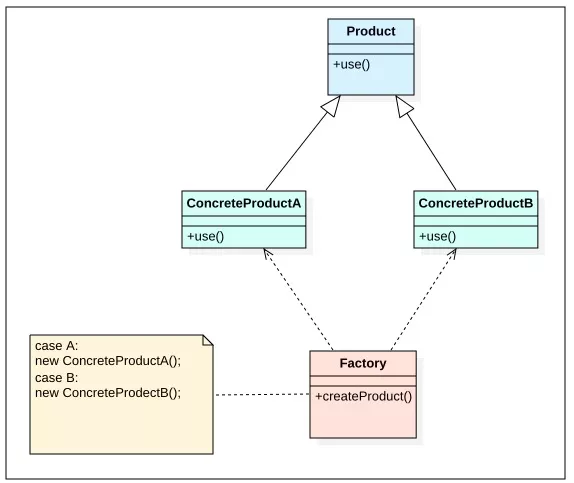

时序图：

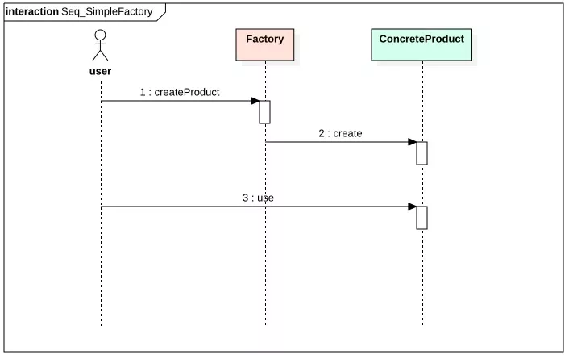

##### 3.工厂方法 Factory Method 和 抽象工厂 Abstract Factory

如果我们不想在工厂类中进行逻辑判断，程序可以为不同产品类提供不同的工厂，不同的工厂类和产不同的产品。

当使用工厂方法设计模式时，对象调用者需要与具体的工厂类耦合

使用简单工厂类，需要在工厂类里做逻辑判断。而工厂类虽然不用在工厂类做判断。但是带来了另一种耦合：客户端代码与不同的工厂类耦合。

为了解决客户端代码与不同工厂类耦合的问题。在工厂类的基础上再增加一个工厂类，该工厂类不制造具体的被调用对象，而是制造不同工厂对象。

结构图：

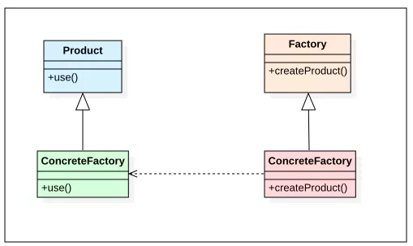

时序图：

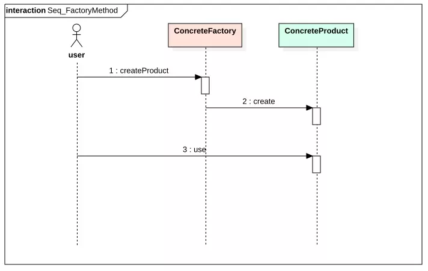

##### 4.代理模式 Proxy

代理模式是一种应用非常广泛的设计模式，当客户端代码需要调用某个对象时，客户端实际上不关心是否准确得到该对象，它只要一个能提供该功能的对象即可，此时我们就可返回该对象的代理（Proxy）。

代理就是一个对象代表另一个对象来采取行动。

结构图：

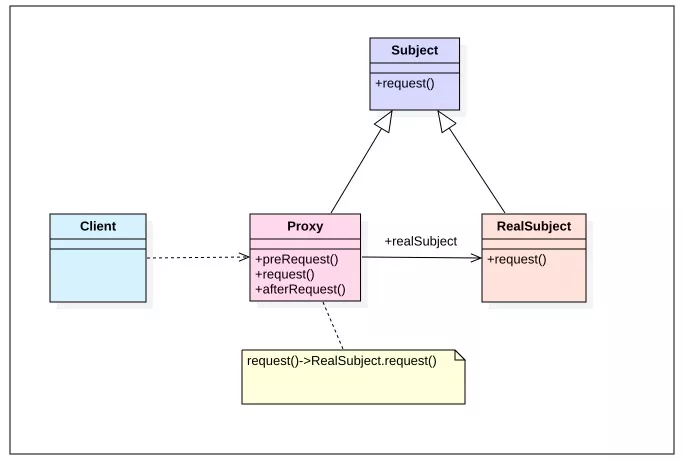

时序图：

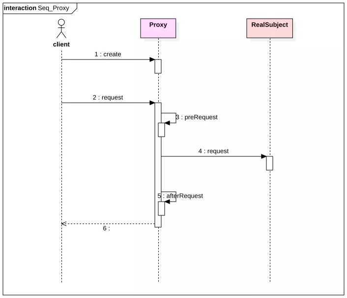

##### 5.命令模式 Command

某个方法需要完成某一个功能，完成这个功能的大部分步骤已经确定了，但可能有少量具体步骤无法确定，必须等到执行该方法时才可以确定。（在某些编程语言如Ruby、Perl里，允许传入一个代码块作为参数。但Jara暂时还不支持代码块作为参数）。在Java中，传入该方法的是一个对象，该对象通常是某个接口的匿名实现类的实例，该接口通常被称为命令接口，这种设计方式也被称为命令模式。

##### 6.策略模式 Strategy

策略模式用于封装系列的算法，这些算法通常被封装在一个被称为Context的类中，客户端程序可以自由选择其中一种算法，或让Context为客户端选择一种最佳算法——使用策略模式的优势是为了支持算法的自由切换。

结构图：

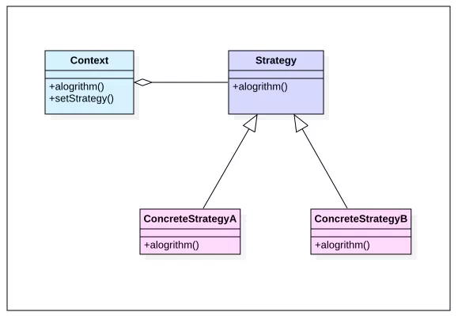

时序图：

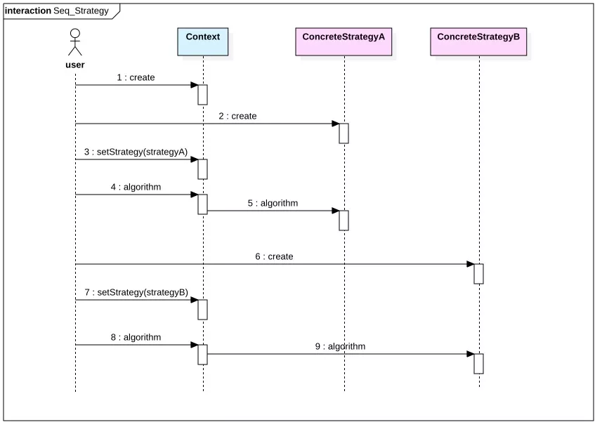

##### 7.门面模式 Facade

随着系统的不断改进和开发，它们会变得越来越复杂，系统会生成大量的类，这使得程序流程更难被理解。门面模式可为这些类提供一个简化的接口，从而简化访问这些类的复杂性。

门面模式（Facade）也被称为正面模式、外观模式，这种模式用于将一组复杂的类包装到一个简单的外部接口中。

##### 8.桥接模式 Bridge

由于实际的需要，某个类具有两个以上的维度变化，如果只是使用继承将无法实现这种需要，或者使得设计变得相当臃肿。而桥接模式的做法是把变化部分抽象出来，使变化部分与主类分离开来，从而将多个的变化彻底分离。最后提供一个管理类来组合不同维度上的变化，通过这种组合来满足业务的需要。

##### 9.观察者模式 Observer

观察者模式结构中包括四种角色：

　　一、主题：主题是一个接口，该接口规定了具体主题需要实现的方法，比如添加、删除观察者以及通知观察者更新数据的方法。

　　二、观察者：观察者也是一个接口，该接口规定了具体观察者用来更新数据的方法。

　　三、具体主题：具体主题是一个实现主题接口的类，该类包含了会经常发生变化的数据。而且还有一个集合，该集合存放的是观察者的引用。

　　四：具体观察者：具体观察者是实现了观察者接口的一个类。具体观察者包含有可以存放具体主题引用的主题接口变量，以便具体观察者让具体主题将自己的引用添加到具体主题的集合中，让自己成为它的观察者，或者让这个具体主题将自己从具体主题的集合中删除，使自己不在时它的观察者。

观察者模式定义了对象间的一对多依赖关系，让一个或多个观察者对象观察一个主题对象。当主题对象的状态发生变化时，系统能通知所有的依赖于此对象的观察者对象，从而使得观察者对象能够自动更新。

在观察者模式中，被观察的对象常常也被称为目标或主题（Subject），依赖的对象被称为观察者（Observer）。

结构图：

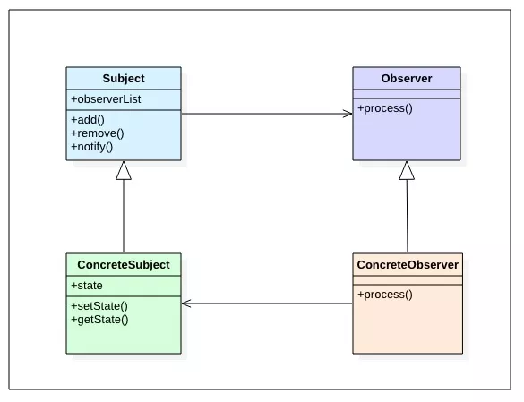

时序图：

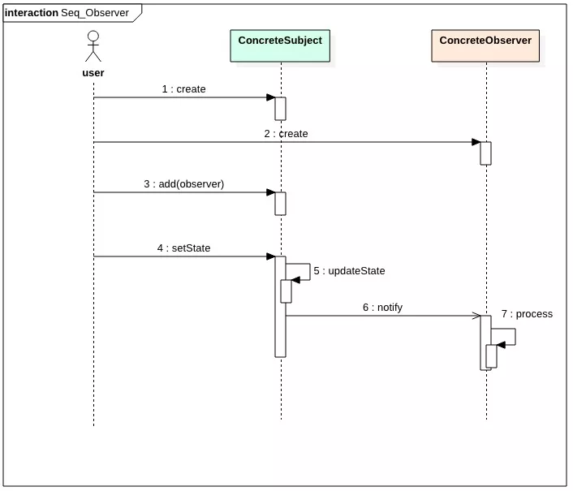


 


 


