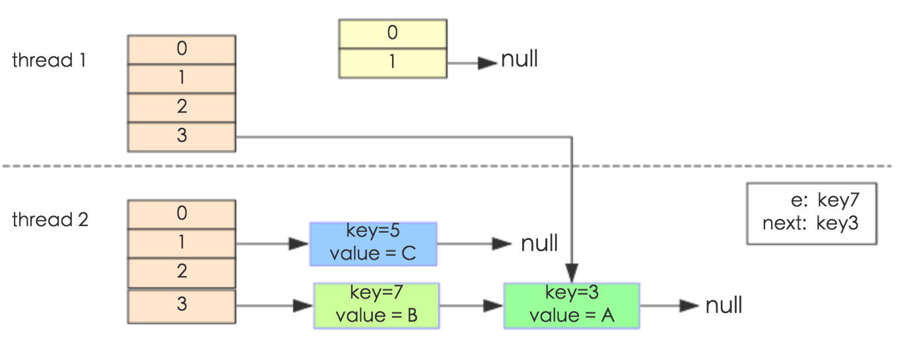
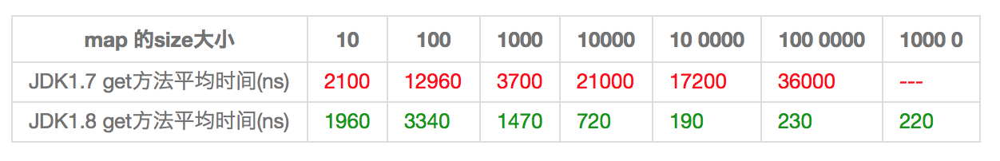

## JAVA 集合

### 1.ArrayList与LinkedList的实现和区别

ArrayList和LinkedList都是实现了List接口的类，他们都是元素的容器，用于存放对象的引用；

他们都可以对存放的元素进行增删改查的操作，还可以进行排序。

但是，他们还是有区别的。

除了实现对List接口的实现，他们还实现了其他的接口，由此造就了他们之间的差异；

#### ArrayList

ArrayList：内部使用数组的形式实现了存储，实现了RandomAccess接口，利用数组的下面进行元素的访问，因此对元素的随机访问速度非常快。

因为是数组，所以ArrayList在初始化的时候，有初始大小10，插入新元素的时候，会判断是否需要扩容，扩容的步长是0.5倍原容量，扩容方式是利用数组的复制，因此有一定的开销；

另外，ArrayList在进行元素插入的时候，需要移动插入位置之后的所有元素，位置越靠前，需要位移的元素越多，开销越大，相反，插入位置越靠后的话，开销就越小了，如果在最后面进行插入，那就不需要进行位移；

#### LinkedList
LinkedList：内部使用双向链表的结构实现存储，LinkedList有一个内部类作为存放元素的单元，里面有三个属性，用来存放元素本身以及前后2个单元的引用，另外LinkedList内部还有一个header属性，用来标识起始位置，LinkedList的第一个单元和最后一个单元都会指向header，因此形成了一个双向的链表结构。

LinkedList是采用双向链表实现的。所以它也具有链表的特点，每一个元素（结点）的地址不连续，通过引用找到当前结点的上一个结点和下一个结点，即插入和删除效率较高，只需要常数时间，而get和set则较为低效。
LinkedList的方法和使用和ArrayList大致相同，由于LinkedList是链表实现的，所以额外提供了在头部和尾部添加/删除元素的方法，也没有ArrayList扩容的问题了。另外，ArrayList和LinkedList都可以实现栈、队列等数据结构，但LinkedList本身实现了队列的接口，所以更推荐用LinkedList来实现队列和栈。

#### ArrayList和LinkedList区别

通常情况下，ArrayList和LinkedList的区别有以下几点：

- 1.ArrayList是实现了基于动态数组的数据结构，而LinkedList是基于链表的数据结构；

- 2.对于随机访问get和set，ArrayList要优于LinkedList，因为LinkedList要移动指针；

- 3.对于添加和删除操作add和remove，一般大家都会说LinkedList要比ArrayList快，因为ArrayList要移动数据。但是实际情况并非这样，对于添加或删除，LinkedList和ArrayList并不能明确说明谁快谁慢，下面会详细分析。

ArrayList中的随机访问、添加和删除部分源码如下：

```
//获取index位置的元素值
public E get(int index) {
    rangeCheck(index); //首先判断index的范围是否合法
 
    return elementData(index);
}
 
//将index位置的值设为element，并返回原来的值
public E set(int index, E element) {
    rangeCheck(index);
 
    E oldValue = elementData(index);
    elementData[index] = element;
    return oldValue;
}
 
//将element添加到ArrayList的指定位置
public void add(int index, E element) {
    rangeCheckForAdd(index);
 
    ensureCapacityInternal(size + 1);  // Increments modCount!!
    //将index以及index之后的数据复制到index+1的位置往后，即从index开始向后挪了一位
    System.arraycopy(elementData, index, elementData, index + 1,
                     size - index); 
    elementData[index] = element; //然后在index处插入element
    size++;
}
 
//删除ArrayList指定位置的元素
public E remove(int index) {
    rangeCheck(index);
 
    modCount++;
    E oldValue = elementData(index);
 
    int numMoved = size - index - 1;
    if (numMoved > 0)
        //向左挪一位，index位置原来的数据已经被覆盖了
        System.arraycopy(elementData, index+1, elementData, index,
                         numMoved);
    //多出来的最后一位删掉
    elementData[--size] = null; // clear to let GC do its work
 
    return oldValue;
}
```

LinkedList中的随机访问、添加和删除部分源码如下：

```
//获得第index个节点的值
public E get(int index) {
	checkElementIndex(index);
	return node(index).item;
}
 
//设置第index元素的值
public E set(int index, E element) {
	checkElementIndex(index);
	Node<E> x = node(index);
	E oldVal = x.item;
	x.item = element;
	return oldVal;
}
 
//在index个节点之前添加新的节点
public void add(int index, E element) {
	checkPositionIndex(index);
 
	if (index == size)
		linkLast(element);
	else
		linkBefore(element, node(index));
}
 
//删除第index个节点
public E remove(int index) {
	checkElementIndex(index);
	return unlink(node(index));
}
 
//定位index处的节点
Node<E> node(int index) {
	// assert isElementIndex(index);
	//index<size/2时，从头开始找
	if (index < (size >> 1)) {
		Node<E> x = first;
		for (int i = 0; i < index; i++)
			x = x.next;
		return x;
	} else { //index>=size/2时，从尾开始找
		Node<E> x = last;
		for (int i = size - 1; i > index; i--)
			x = x.prev;
		return x;
	}
}
```

从源码可以看出，ArrayList想要get(int index)元素时，直接返回index位置上的元素，而LinkedList需要通过for循环进行查找，虽然LinkedList已经在查找方法上做了优化，比如index < size / 2，则从左边开始查找，反之从右边开始查找，但是还是比ArrayList要慢。这点是毋庸置疑的。

ArrayList想要在指定位置插入或删除元素时，主要耗时的是System.arraycopy动作，会移动index后面所有的元素；LinkedList主耗时的是要先通过for循环找到index，然后直接插入或删除。这就导致了两者并非一定谁快谁慢，下面通过一个测试程序来测试一下两者插入的速度：

主要有两个因素决定他们的效率，插入的数据量和插入的位置。我们可以在程序里改变这两个因素来测试它们的效率。
当数据量较小时，测试程序中，大约小于30的时候，两者效率差不多，没有显著区别；当数据量较大时，大约在容量的1/10处开始，LinkedList的效率就开始没有ArrayList效率高了，特别到一半以及后半的位置插入时，LinkedList效率明显要低于ArrayList，而且数据量越大，越明显。

所以当插入的数据量很小时，两者区别不太大，当插入的数据量大时，大约在容量的1/10之前，LinkedList会优于ArrayList，在其后就劣与ArrayList，且越靠近后面越差。所以个人觉得，一般首选用ArrayList，由于LinkedList可以实现栈、队列以及双端队列等数据结构，所以当特定需要时候，使用LinkedList，当然咯，数据量小的时候，两者差不多，视具体情况去选择使用；当数据量大的时候，如果只需要在靠前的部分插入或删除数据，那也可以选用LinkedList，反之选择ArrayList反而效率更高。

### 2.HashMap了解其数据结构、hash冲突如何解决（链表和红黑树）、扩容时机、扩容时避免rehash的优化

HashMap是Java程序员使用频率最高的用于映射(键值对)处理的数据类型。随着JDK（Java Developmet Kit）版本的更新，JDK1.8对HashMap底层的实现进行了优化，例如引入红黑树的数据结构和扩容的优化等。本文结合JDK1.7和JDK1.8的区别，深入探讨HashMap的结构实现和功能原理。

Java为数据结构中的映射定义了一个接口java.util.Map，此接口主要有四个常用的实现类，分别是HashMap、Hashtable、LinkedHashMap和TreeMap，类继承关系如下图所示：


下面针对各个实现类的特点做一些说明：

(1) HashMap：它根据键的hashCode值存储数据，大多数情况下可以直接定位到它的值，因而具有很快的访问速度，但遍历顺序却是不确定的。 HashMap最多只允许一条记录的键为null，允许多条记录的值为null。HashMap非线程安全，即任一时刻可以有多个线程同时写HashMap，可能会导致数据的不一致。如果需要满足线程安全，可以用 Collections的synchronizedMap方法使HashMap具有线程安全的能力，或者使用ConcurrentHashMap。

(2) Hashtable：Hashtable是遗留类，很多映射的常用功能与HashMap类似，不同的是它承自Dictionary类，并且是线程安全的，任一时间只有一个线程能写Hashtable，并发性不如ConcurrentHashMap，因为ConcurrentHashMap引入了分段锁。Hashtable不建议在新代码中使用，不需要线程安全的场合可以用HashMap替换，需要线程安全的场合可以用ConcurrentHashMap替换。

(3) LinkedHashMap：LinkedHashMap是HashMap的一个子类，保存了记录的插入顺序，在用Iterator遍历LinkedHashMap时，先得到的记录肯定是先插入的，也可以在构造时带参数，按照访问次序排序。

(4) TreeMap：TreeMap实现SortedMap接口，能够把它保存的记录根据键排序，默认是按键值的升序排序，也可以指定排序的比较器，当用Iterator遍历TreeMap时，得到的记录是排过序的。如果使用排序的映射，建议使用TreeMap。在使用TreeMap时，key必须实现Comparable接口或者在构造TreeMap传入自定义的Comparator，否则会在运行时抛出java.lang.ClassCastException类型的异常。

对于上述四种Map类型的类，要求映射中的key是不可变对象。不可变对象是该对象在创建后它的哈希值不会被改变。如果对象的哈希值发生变化，Map对象很可能就定位不到映射的位置了。

通过上面的比较，我们知道了HashMap是Java的Map家族中一个普通成员，鉴于它可以满足大多数场景的使用条件，所以是使用频度最高的一个。下文我们主要结合源码，从存储结构、常用方法分析、扩容以及安全性等方面深入讲解HashMap的工作原理。

#### 内部实现

##### 存储结构-字段

从结构实现来讲，HashMap是数组+链表+红黑树（JDK1.8增加了红黑树部分）实现的，如下如所示。


这里需要讲明白两个问题：数据底层具体存储的是什么？这样的存储方式有什么优点呢？

(1) 从源码可知，HashMap类中有一个非常重要的字段，就是 Node[] table，即哈希桶数组，明显它是一个Node的数组。我们来看Node[JDK1.8]是何物。

```
static class Node<K,V> implements Map.Entry<K,V> {
        final int hash;    //用来定位数组索引位置
        final K key;
        V value;
        Node<K,V> next;   //链表的下一个node

        Node(int hash, K key, V value, Node<K,V> next) { ... }
        public final K getKey(){ ... }
        public final V getValue() { ... }
        public final String toString() { ... }
        public final int hashCode() { ... }
        public final V setValue(V newValue) { ... }
        public final boolean equals(Object o) { ... }
}
```

Node是HashMap的一个内部类，实现了Map.Entry接口，本质是就是一个映射(键值对)。上图中的每个黑色圆点就是一个Node对象。

(2) HashMap就是使用哈希表来存储的。哈希表为解决冲突，可以采用开放地址法和链地址法等来解决问题，Java中HashMap采用了**链地址法**。链地址法，简单来说，就是数组加链表的结合。在每个数组元素上都一个链表结构，当数据被Hash后，得到数组下标，把数据放在对应下标元素的链表上。例如程序执行下面代码：

`map.put("hello","小美");`

系统将调用”hello”这个key的hashCode()方法得到其hashCode 值（该方法适用于每个Java对象），然后再通过Hash算法的后两步运算（高位运算和取模运算，下文有介绍）来定位该键值对的存储位置，有时两个key会定位到相同的位置，表示发生了Hash碰撞。当然Hash算法计算结果越分散均匀，Hash碰撞的概率就越小，map的存取效率就会越高。

如果哈希桶数组很大，即使较差的Hash算法也会比较分散，如果哈希桶数组数组很小，即使好的Hash算法也会出现较多碰撞，所以就需要在空间成本和时间成本之间权衡，其实就是在根据实际情况确定哈希桶数组的大小，并在此基础上设计好的hash算法减少Hash碰撞。那么通过什么方式来控制map使得Hash碰撞的概率又小，哈希桶数组（Node[] table）占用空间又少呢？答案就是好的Hash算法和扩容机制。

在理解Hash和扩容流程之前，我们得先了解下HashMap的几个字段。从HashMap的默认构造函数源码可知，构造函数就是对下面几个字段进行初始化，源码如下：

```
int threshold;             // 所能容纳的key-value对极限 
final float loadFactor;    // 负载因子
int modCount;  
int size;  
```

首先，Node[] table的**初始化长度length(默认值是16)**，Load factor为**负载因子(默认值是0.75)**，threshold是HashMap所能容纳的最大数据量的Node(键值对)个数。threshold = length * Load factor。也就是说，在数组定义好长度之后，负载因子越大，所能容纳的键值对个数越多。

结合负载因子的定义公式可知，threshold就是在此Load factor和length(数组长度)对应下允许的最大元素数目，**超过这个数目就重新resize(扩容)，扩容后的HashMap容量是之前容量的两倍**。默认的负载因子0.75是对空间和时间效率的一个平衡选择，建议大家不要修改，除非在时间和空间比较特殊的情况下，如果内存空间很多而又对时间效率要求很高，可以降低负载因子Load factor的值；相反，如果内存空间紧张而对时间效率要求不高，可以增加负载因子loadFactor的值，这个值可以大于1。

size这个字段其实很好理解，就是HashMap中实际存在的键值对数量。注意和table的长度length、容纳最大键值对数量threshold的区别。而modCount字段主要用来记录HashMap内部结构发生变化的次数，主要用于迭代的快速失败。强调一点，内部结构发生变化指的是结构发生变化，例如put新键值对，但是某个key对应的value值被覆盖不属于结构变化。

在HashMap中，**哈希桶数组table的长度length大小必须为2的n次方(一定是合数)**，这是一种非常规的设计，常规的设计是把桶的大小设计为素数。相对来说素数导致冲突的概率要小于合数，具体证明可以参考这篇文章，Hashtable初始化桶大小为11，就是桶大小设计为素数的应用（Hashtable扩容后不能保证还是素数）。HashMap采用这种非常规设计，主要是为了在取模和扩容时做优化，同时为了减少冲突，HashMap定位哈希桶索引位置时，也加入了高位参与运算的过程。

这里存在一个问题，即使负载因子和Hash算法设计的再合理，也免不了会出现拉链过长的情况，一旦出现拉链过长，则会严重影响HashMap的性能。于是，**在JDK1.8版本中，对数据结构做了进一步的优化，引入了红黑树。而当链表长度太长（默认超过8）时，链表就转换为红黑树，利用红黑树快速增删改查的特点提高HashMap的性能，其中会用到红黑树的插入、删除、查找等算法**。本文不再对红黑树展开讨论，想了解更多红黑树数据结构的工作原理可以参考这篇文章。

#### 功能实现-方法

HashMap的内部功能实现很多，本文主要从根据key获取哈希桶数组索引位置、put方法的详细执行、扩容过程三个具有代表性的点深入展开讲解。

##### 1. 确定哈希桶数组索引位置

不管增加、删除、查找键值对，定位到哈希桶数组的位置都是很关键的第一步。前面说过HashMap的数据结构是数组和链表的结合，所以我们当然希望这个HashMap里面的元素位置尽量分布均匀些，尽量使得每个位置上的元素数量只有一个，那么当我们用hash算法求得这个位置的时候，马上就可以知道对应位置的元素就是我们要的，不用遍历链表，大大优化了查询的效率。HashMap定位数组索引位置，直接决定了hash方法的离散性能。先看看源码的实现(方法一+方法二):

```
方法一：
static final int hash(Object key) {   //jdk1.8 & jdk1.7
     int h;
     // h = key.hashCode() 为第一步 取hashCode值
     // h ^ (h >>> 16)  为第二步 高位参与运算
     return (key == null) ? 0 : (h = key.hashCode()) ^ (h >>> 16);
}
方法二：
static int indexFor(int h, int length) {  //jdk1.7的源码，jdk1.8没有这个方法，但是实现原理一样的
     return h & (length-1);  //第三步 取模运算
}
```

这里的Hash算法本质上就是三步：**取key的hashCode值、高位运算、取模运算**。

对于任意给定的对象，只要它的hashCode()返回值相同，那么程序调用方法一所计算得到的Hash码值总是相同的。我们首先想到的就是把hash值对数组长度取模运算，这样一来，元素的分布相对来说是比较均匀的。但是，模运算的消耗还是比较大的，在HashMap中是这样做的：调用方法二来计算该对象应该保存在table数组的哪个索引处。

这个方法非常巧妙，它通过h & (table.length -1)来得到该对象的保存位，而HashMap底层数组的长度总是2的n次方，这是HashMap在速度上的优化。当length总是2的n次方时，h& (length-1)运算等价于对length取模，也就是h%length，但是&比%具有更高的效率。

在JDK1.8的实现中，优化了高位运算的算法，通过hashCode()的高16位异或低16位实现的：(h = k.hashCode()) ^ (h >>> 16)，主要是从速度、功效、质量来考虑的，这么做可以在数组table的length比较小的时候，也能保证考虑到高低Bit都参与到Hash的计算中，同时不会有太大的开销。

下面举例说明下，n为table的长度。


##### 2. 分析HashMap的put方法

HashMap的put方法执行过程可以通过下图来理解，自己有兴趣可以去对比源码更清楚地研究学习。


①.判断键值对数组table[i]是否为空或为null，否则执行resize()进行扩容； 
②.根据键值key计算hash值得到插入的数组索引i，如果table[i]==null，直接新建节点添加，转向⑥，如果table[i]不为空，转向③； 
③.判断table[i]的首个元素是否和key一样，如果相同直接覆盖value，否则转向④，这里的相同指的是hashCode以及equals； 
④.判断table[i] 是否为treeNode，即table[i] 是否是红黑树，如果是红黑树，则直接在树中插入键值对，否则转向⑤； 
⑤.遍历table[i]，判断链表长度是否大于8，大于8的话把链表转换为红黑树，在红黑树中执行插入操作，否则进行链表的插入操作；遍历过程中若发现key已经存在直接覆盖value即可； 
⑥.插入成功后，判断实际存在的键值对数量size是否超多了最大容量threshold，如果超过，进行扩容。

JDK1.8HashMap的put方法源码如下:

```
 1 public V put(K key, V value) {
 2     // 对key的hashCode()做hash
 3     return putVal(hash(key), key, value, false, true);
 4 }
 5 
 6 final V putVal(int hash, K key, V value, boolean onlyIfAbsent,
 7                boolean evict) {
 8     Node<K,V>[] tab; Node<K,V> p; int n, i;
 9     // 步骤①：tab为空则创建
10     if ((tab = table) == null || (n = tab.length) == 0)
11         n = (tab = resize()).length;
12     // 步骤②：计算index，并对null做处理 
13     if ((p = tab[i = (n - 1) & hash]) == null) 
14         tab[i] = newNode(hash, key, value, null);
15     else {
16         Node<K,V> e; K k;
17         // 步骤③：节点key存在，直接覆盖value
18         if (p.hash == hash &&
19             ((k = p.key) == key || (key != null && key.equals(k))))
20             e = p;
21         // 步骤④：判断该链为红黑树
22         else if (p instanceof TreeNode)
23             e = ((TreeNode<K,V>)p).putTreeVal(this, tab, hash, key, value);
24         // 步骤⑤：该链为链表
25         else {
26             for (int binCount = 0; ; ++binCount) {
27                 if ((e = p.next) == null) {
28                     p.next = newNode(hash, key,value,null);
                        //链表长度大于8转换为红黑树进行处理
29                     if (binCount >= TREEIFY_THRESHOLD - 1) // -1 for 1st  
30                         treeifyBin(tab, hash);
31                     break;
32                 }
                    // key已经存在直接覆盖value
33                 if (e.hash == hash &&
34                     ((k = e.key) == key || (key != null && key.equals(k)))) 
35							break;
36                 p = e;
37             }
38         }
39         
40         if (e != null) { // existing mapping for key
41             V oldValue = e.value;
42             if (!onlyIfAbsent || oldValue == null)
43                 e.value = value;
44             afterNodeAccess(e);
45             return oldValue;
46         }
47     }

48     ++modCount;
49     // 步骤⑥：超过最大容量 就扩容
50     if (++size > threshold)
51         resize();
52     afterNodeInsertion(evict);
53     return null;
54 }
```

##### 3. 扩容机制

扩容(resize)就是重新计算容量，向HashMap对象里不停的添加元素，而HashMap对象内部的数组无法装载更多的元素时，对象就需要扩大数组的长度，以便能装入更多的元素。当然Java里的数组是无法自动扩容的，方法是使用一个新的数组代替已有的容量小的数组，就像我们用一个小桶装水，如果想装更多的水，就得换大水桶。

我们分析下resize的源码，鉴于JDK1.8融入了红黑树，较复杂，为了便于理解我们仍然使用JDK1.7的代码，好理解一些，本质上区别不大，具体区别后文再说。

```
1 void resize(int newCapacity) {   //传入新的容量
2     Entry[] oldTable = table;    //引用扩容前的Entry数组
3     int oldCapacity = oldTable.length;         
4     if (oldCapacity == MAXIMUM_CAPACITY) {  //扩容前的数组大小如果已经达到最大(2^30)了
5         threshold = Integer.MAX_VALUE; //修改阈值为int的最大值(2^31-1)，这样以后就不会扩容了
6         return;
7     }
8  
9     Entry[] newTable = new Entry[newCapacity];  //初始化一个新的Entry数组
10     transfer(newTable);                         //！！将数据转移到新的Entry数组里
11     table = newTable;                           //HashMap的table属性引用新的Entry数组
12     threshold = (int)(newCapacity * loadFactor);//修改阈值
13 }
```

这里就是使用一个容量更大的数组来代替已有的容量小的数组，transfer()方法将原有Entry数组的元素拷贝到新的Entry数组里。

```
1 void transfer(Entry[] newTable) {
2     Entry[] src = table;                   //src引用了旧的Entry数组
3     int newCapacity = newTable.length;
4     for (int j = 0; j < src.length; j++) { //遍历旧的Entry数组
5         Entry<K,V> e = src[j];             //取得旧Entry数组的每个元素
6         if (e != null) {
7             src[j] = null;//释放旧Entry数组的对象引用（for循环后，旧的Entry数组不再引用任何对象）
8             do {
9                 Entry<K,V> next = e.next;
10                 int i = indexFor(e.hash, newCapacity); //！！重新计算每个元素在数组中的位置
11                 e.next = newTable[i]; //标记[1]
12                 newTable[i] = e;      //将元素放在数组上
13                 e = next;             //访问下一个Entry链上的元素
14             } while (e != null);
15         }
16     }
17 } 
```

newTable[i]的引用赋给了e.next，也就是使用了单链表的头插入方式，同一位置上新元素总会被放在链表的头部位置；这样先放在一个索引上的元素终会被放到Entry链的尾部(如果发生了hash冲突的话），这一点和Jdk1.8有区别，下文详解。在旧数组中同一条Entry链上的元素，通过重新计算索引位置后，有可能被放到了新数组的不同位置上。

下面举个例子说明下扩容过程。假设了我们的hash算法就是简单的用key mod 一下表的大小（也就是数组的长度）。其中的哈希桶数组table的size=2， 所以key = 3、7、5，put顺序依次为 5、7、3。在mod 2以后都冲突在table[1]这里了。这里假设负载因子 loadFactor=1，即当键值对的实际大小size 大于 table的实际大小时进行扩容。接下来的三个步骤是哈希桶数组 resize成4，然后所有的Node重新rehash的过程。


下面我们讲解下JDK1.8做了哪些优化。经过观测可以发现，我们使用的是2次幂的扩展(指长度扩为原来2倍)，所以，元素的位置要么是在原位置，要么是在原位置再移动2次幂的位置。看下图可以明白这句话的意思，n为table的长度，图（a）表示扩容前的key1和key2两种key确定索引位置的示例，图（b）表示扩容后key1和key2两种key确定索引位置的示例，其中hash1是key1对应的哈希与高位运算结果。


元素在重新计算hash之后，因为n变为2倍，那么n-1的mask范围在高位多1bit(红色)，因此新的index就会发生这样的变化：


因此，我们在扩充HashMap的时候，不需要像JDK1.7的实现那样重新计算hash，只需要看看原来的hash值新增的那个bit是1还是0就好了，是0的话索引没变，是1的话索引变成“原索引+oldCap”，可以看看下图为16扩充为32的resize示意图：


这个设计确实非常的巧妙，既省去了重新计算hash值的时间，而且同时，由于新增的1bit是0还是1可以认为是随机的，因此resize的过程，均匀的把之前的冲突的节点分散到新的bucket了。这一块就是JDK1.8新增的优化点。有一点注意区别，JDK1.7中rehash的时候，旧链表迁移新链表的时候，如果在新表的数组索引位置相同，则链表元素会倒置，但是从上图可以看出，JDK1.8不会倒置。有兴趣的同学可以研究下JDK1.8的resize源码，写的很赞，如下:

```
1 final Node<K,V>[] resize() {
 2     Node<K,V>[] oldTab = table;
 3     int oldCap = (oldTab == null) ? 0 : oldTab.length;
 4     int oldThr = threshold;
 5     int newCap, newThr = 0;
 6     if (oldCap > 0) {
 7         // 超过最大值就不再扩充了，就只好随你碰撞去吧
 8         if (oldCap >= MAXIMUM_CAPACITY) {
 9             threshold = Integer.MAX_VALUE;
10             return oldTab;
11         }
12         // 没超过最大值，就扩充为原来的2倍
13         else if ((newCap = oldCap << 1) < MAXIMUM_CAPACITY &&
14                  oldCap >= DEFAULT_INITIAL_CAPACITY)
15             newThr = oldThr << 1; // double threshold
16     }
17     else if (oldThr > 0) // initial capacity was placed in threshold
18         newCap = oldThr;
19     else {               // zero initial threshold signifies using defaults
20         newCap = DEFAULT_INITIAL_CAPACITY;
21         newThr = (int)(DEFAULT_LOAD_FACTOR * DEFAULT_INITIAL_CAPACITY);
22     }
23     // 计算新的resize上限
24     if (newThr == 0) {
25 
26         float ft = (float)newCap * loadFactor;
27         newThr = (newCap < MAXIMUM_CAPACITY && ft < (float)MAXIMUM_CAPACITY ?
28                   (int)ft : Integer.MAX_VALUE);
29     }
30     threshold = newThr;
31     @SuppressWarnings({"rawtypes"，"unchecked"})
32         Node<K,V>[] newTab = (Node<K,V>[])new Node[newCap];
33     table = newTab;
34     if (oldTab != null) {
35         // 把每个bucket都移动到新的buckets中
36         for (int j = 0; j < oldCap; ++j) {
37             Node<K,V> e;
38             if ((e = oldTab[j]) != null) {
39                 oldTab[j] = null;
40                 if (e.next == null)
41                     newTab[e.hash & (newCap - 1)] = e;
42                 else if (e instanceof TreeNode)
43                     ((TreeNode<K,V>)e).split(this, newTab, j, oldCap);
44                 else { // 链表优化重hash的代码块
45                     Node<K,V> loHead = null, loTail = null;
46                     Node<K,V> hiHead = null, hiTail = null;
47                     Node<K,V> next;
48                     do {
49                         next = e.next;
50                         // 原索引
51                         if ((e.hash & oldCap) == 0) {
52                             if (loTail == null)
53                                 loHead = e;
54                             else
55                                 loTail.next = e;
56                             loTail = e;
57                         }
58                         // 原索引+oldCap
59                         else {
60                             if (hiTail == null)
61                                 hiHead = e;
62                             else
63                                 hiTail.next = e;
64                             hiTail = e;
65                         }
66                     } while ((e = next) != null);
67                     // 原索引放到bucket里
68                     if (loTail != null) {
69                         loTail.next = null;
70                         newTab[j] = loHead;
71                     }
72                     // 原索引+oldCap放到bucket里
73                     if (hiTail != null) {
74                         hiTail.next = null;
75                         newTab[j + oldCap] = hiHead;
76                     }
77                 }
78             }
79         }
80     }
81     return newTab;
82 }
```

#### 线程安全性

在多线程使用场景中，应该尽量避免使用线程不安全的HashMap，而使用线程安全的ConcurrentHashMap。那么为什么说HashMap是线程不安全的，下面举例子说明在并发的多线程使用场景中使用HashMap可能造成死循环。代码例子如下(便于理解，仍然使用JDK1.7的环境)：

```
public class HashMapInfiniteLoop {  

    private static HashMap<Integer,String> map = new HashMap<Integer,String>(2，0.75f);  
    public static void main(String[] args) {  
        map.put(5， "C");  

        new Thread("Thread1") {  
            public void run() {  
                map.put(7, "B");  
                System.out.println(map);  
            };  
        }.start();  
        new Thread("Thread2") {  
            public void run() {  
                map.put(3, "A);  
                System.out.println(map);  
            };  
        }.start();        
    }  
} 
```

其中，map初始化为一个长度为2的数组，loadFactor=0.75，threshold=2*0.75=1，也就是说当put第二个key的时候，map就需要进行resize。

通过设置断点让线程1和线程2同时debug到transfer方法(3.3小节代码块)的首行。注意此时两个线程已经成功添加数据。放开thread1的断点至transfer方法的“Entry next = e.next;” 这一行；然后放开线程2的的断点，让线程2进行resize。结果如下图。


注意，Thread1的 e 指向了key(3)，而next指向了key(7)，其在线程二rehash后，指向了线程二重组后的链表。

线程一被调度回来执行，先是执行 newTalbe[i] = e， 然后是e = next，导致了e指向了key(7)，而下一次循环的next = e.next导致了next指向了key(3)。



e.next = newTable[i] 导致 key(3).next 指向了 key(7)。注意：此时的key(7).next 已经指向了key(3)， 环形链表就这样出现了。


于是，当我们用线程一调用map.get(11)时，悲剧就出现了——Infinite Loop。

#### JDK1.8与JDK1.7的性能对比

HashMap中，如果key经过hash算法得出的数组索引位置全部不相同，即Hash算法非常好，那样的话，getKey方法的时间复杂度就是O(1)，如果Hash算法技术的结果碰撞非常多，假如Hash算极其差，所有的Hash算法结果得出的索引位置一样，那样所有的键值对都集中到一个桶中，或者在一个链表中，或者在一个红黑树中，**时间复杂度分别为O(n)和O(lgn)**。 鉴于JDK1.8做了多方面的优化，总体性能优于JDK1.7，下面我们从两个方面用例子证明这一点。

##### Hash较均匀的情况

任何一个值的hashCode都不会相同，直接使用value当做hashcode。

在测试中会查找不同的值，然后度量花费的时间，为了计算getKey的平均时间，我们遍历所有的get方法，计算总的时间，除以key的数量，计算一个平均值，主要用来比较，绝对值可能会受很多环境因素的影响。结果如下：


通过观测测试结果可知，JDK1.8的性能要高于JDK1.7 15%以上，在某些size的区域上，甚至高于100%。由于Hash算法较均匀，JDK1.8引入的红黑树效果不明显，下面我们看看Hash不均匀的的情况。

##### Hash极不均匀的情况

假设我们又一个非常差的Key，它们所有的实例都返回相同的hashCode值。这是使用HashMap最坏的情况。代码修改如下：



从表中结果中可知，随着size的变大，JDK1.7的花费时间是增长的趋势，而JDK1.8是明显的降低趋势，并且呈现对数增长稳定。当一个链表太长的时候，HashMap会动态的将它替换成一个红黑树，这话的话会将时间复杂度从O(n)降为O(logn)。hash算法均匀和不均匀所花费的时间明显也不相同，这两种情况的相对比较，可以说明一个好的hash算法的重要性。

#### 小结

- 扩容是一个特别耗性能的操作，所以当程序员在使用HashMap的时候，估算map的大小，初始化的时候给一个大致的数值，避免map进行频繁的扩容。
- 负载因子是可以修改的，也可以大于1，但是建议不要轻易修改，除非情况非常特殊。
- HashMap是线程不安全的，不要在并发的环境中同时操作HashMap，建议使用ConcurrentHashMap。
- JDK1.8引入红黑树大程度优化了HashMap的性能。

### 3.LinkedHashMap了解基本原理、哪两种有序、如何用它实现LRU

#### 概述

HashMap 是 Java Collection Framework 的重要成员，也是Map族(如下图所示)中我们最为常用的一种。不过遗憾的是，HashMap是无序的，也就是说，迭代HashMap所得到的元素顺序并不是它们最初放置到HashMap的顺序。

HashMap的这一缺点往往会造成诸多不便，因为在有些场景中，我们确需要用到一个可以保持插入顺序的Map。庆幸的是，JDK为我们解决了这个问题，它为HashMap提供了一个子类 —— LinkedHashMap。虽然LinkedHashMap增加了时间和空间上的开销，但是它通过维护一个额外的双向链表保证了迭代顺序。

特别地，**该迭代顺序可以是插入顺序，也可以是访问顺序**。因此，根据链表中元素的顺序可以将LinkedHashMap分为：**保持插入顺序的LinkedHashMap和保持访问顺序的LinkedHashMap，其中LinkedHashMap的默认实现是按插入顺序排序的**。

更直观地，下图很好地还原了LinkedHashMap的原貌：HashMap和双向链表的密切配合和分工合作造就了LinkedHashMap。特别需要注意的是，next用于维护HashMap各个桶中的Entry链，before、after用于维护LinkedHashMap的双向链表，虽然它们的作用对象都是Entry，但是各自分离，是两码事儿。


其中，HashMap与LinkedHashMap的Entry结构示意图如下图所示：


特别地，由于LinkedHashMap是HashMap的子类，所以LinkedHashMap自然会拥有HashMap的所有特性。比如，LinkedHashMap也最多只允许一条Entry的键为Null(多条会覆盖)，但允许多条Entry的值为Null。

此外，LinkedHashMap 也是 Map 的一个非同步的实现。此外，LinkedHashMap还可以用来实现LRU (Least recently used, 最近最少使用)算法，这个问题会在下文的特别谈到。

#### LinkedHashMap 在 JDK 中的定义

#### 成员变量

LinkedHashMap继承于HashMap, 与HashMap相比，LinkedHashMap增加了两个属性用于保证迭代顺序，分别是 **双向链表头结点header 和 标志位accessOrder (值为true时，表示按照访问顺序迭代；值为false时，表示按照插入顺序迭代)**。

```
/**
 * The head of the doubly linked list.
 */
private transient Entry<K,V> header;  // 双向链表的表头元素

/**
 * The iteration ordering method for this linked hash map: <tt>true</tt>
 * for access-order, <tt>false</tt> for insertion-order.
 *
 * @serial
 */
private final boolean accessOrder;  //true表示按照访问顺序迭代，false时表示按照插入顺序
```

#### 成员方法

LinkedHashMap中并增加没有额外方法。也就是说，LinkedHashMap与HashMap在操作上大致相同，只是在实现细节上略有不同罢了。

#### 基本元素 Entry

LinkedHashMap采用的hash算法和HashMap相同，但是它重新定义了Entry。LinkedHashMap中的Entry增加了两个指针 before 和 after，它们分别用于维护双向链接列表。特别需要注意的是，next用于维护HashMap各个桶中Entry的连接顺序，before、after用于维护Entry插入的先后顺序的，源代码如下：

```
private static class Entry<K,V> extends HashMap.Entry<K,V> {

    // These fields comprise the doubly linked list used for iteration.
    Entry<K,V> before, after;

    Entry(int hash, K key, V value, HashMap.Entry<K,V> next) {
        super(hash, key, value, next);
    }
    ...
}
```
#### 构造函数

LinkedHashMap 一共提供了五个构造函数，它们都是在HashMap的构造函数的基础上实现的，除了默认空参数构造方法，下面这个构造函数包含了大部分其他构造方法使用的参数，就不一一列举了。

LinkedHashMap(int initialCapacity, float loadFactor, boolean accessOrder)

初始容量 和负载因子是影响HashMap性能的两个重要参数。同样地，它们也是影响LinkedHashMap性能的两个重要参数。此外，LinkedHashMap 增加了双向链表头结点 header和标志位 accessOrder两个属性用于保证迭代顺序。

该构造函数意在构造一个与指定 Map 具有相同映射的 LinkedHashMap，其 初始容量不小于 16 (具体依赖于指定Map的大小)，负载因子是 0.75，是 Java Collection Framework 规范推荐提供的，其源码如下：

```
/**
 * Constructs an insertion-ordered <tt>LinkedHashMap</tt> instance with
 * the same mappings as the specified map.  The <tt>LinkedHashMap</tt>
 * instance is created with a default load factor (0.75) and an initial
 * capacity sufficient to hold the mappings in the specified map.
 *
 * @param  m the map whose mappings are to be placed in this map
 * @throws NullPointerException if the specified map is null
 */
public LinkedHashMap(Map<? extends K, ? extends V> m) {
    super(m);       // 调用HashMap对应的构造函数
    accessOrder = false;    // 迭代顺序的默认值
}
```
##### init 方法

从上面的五种构造函数我们可以看出，无论采用何种方式创建LinkedHashMap，其都会调用HashMap相应的构造函数。事实上，不管调用HashMap的哪个构造函数，HashMap的构造函数都会在最后调用一个init()方法进行初始化，只不过这个方法在HashMap中是一个空实现，而在LinkedHashMap中重写了它用于初始化它所维护的双向链表。例如，HashMap的参数为空的构造函数以及init方法的源码如下：

```
/**
 * Constructs an empty <tt>HashMap</tt> with the default initial capacity
 * (16) and the default load factor (0.75).
 */
public HashMap() {
    this.loadFactor = DEFAULT_LOAD_FACTOR;
    threshold = (int)(DEFAULT_INITIAL_CAPACITY * DEFAULT_LOAD_FACTOR);
    table = new Entry[DEFAULT_INITIAL_CAPACITY];
    init();
}
```

```
/** 
* Initialization hook for subclasses. This method is called 
* in all constructors and pseudo-constructors (clone, readObject) 
* after HashMap has been initialized but before any entries have 
* been inserted. (In the absence of this method, readObject would 
* require explicit knowledge of subclasses.) */ 
void init() { }
```

在LinkedHashMap中，它重写了init方法以便初始化双向列表，源码如下：

```
/** 
* Called by superclass constructors and pseudoconstructors (clone, 
* readObject) before any entries are inserted into the map. Initializes 
* the chain. 
*/ 
void init() { 
    header = new Entry<K,V>(-1, null, null, null); 
    header.before = header.after = header; 
}
```
因此，我们在创建LinkedHashMap的同时就会不知不觉地对双向链表进行初始化。

#### LinkedHashMap 的快速存取

我们知道，在HashMap中最常用的两个操作就是：put(Key,Value) 和 get(Key)。同样地，在 LinkedHashMap 中最常用的也是这两个操作。

对于put(Key,Value)方法而言，LinkedHashMap完全继承了HashMap的 put(Key,Value) 方法，**只是对put(Key,Value)方法所调用的recordAccess方法和addEntry方法进行了重写；对于get(Key)方法而言，LinkedHashMap则直接对它进行了重写**。

##### LinkedHashMap 的存储实现 : put(key, vlaue)

LinkedHashMap没有对 put(key,vlaue) 方法进行任何直接的修改，完全继承了HashMap的 put(Key,Value) 方法，其源码如下：

```
public V put(K key, V value) {

    //当key为null时，调用putForNullKey方法，并将该键值对保存到table的第一个位置 
    if (key == null)
        return putForNullKey(value); 

    //根据key的hashCode计算hash值
    int hash = hash(key.hashCode());           

    //计算该键值对在数组中的存储位置（哪个桶）
    int i = indexFor(hash, table.length);              

    //在table的第i个桶上进行迭代，寻找 key 保存的位置
    for (Entry<K,V> e = table[i]; e != null; e = e.next) {      
        Object k;
        //判断该条链上是否存在hash值相同且key值相等的映射，若存在，则直接覆盖 value，并返回旧value
        if (e.hash == hash && ((k = e.key) == key || key.equals(k))) {
            V oldValue = e.value;
            e.value = value;
            e.recordAccess(this); // LinkedHashMap重写了Entry中的recordAccess方法--- (1)    
            return oldValue;    // 返回旧值
        }
    }

    modCount++; //修改次数增加1，快速失败机制

    //原Map中无该映射，将该添加至该链的链头
    addEntry(hash, key, value, i);  // LinkedHashMap重写了HashMap中的createEntry方法 ---- (2)    
    return null;
}
```

上述源码反映了LinkedHashMap与HashMap保存数据的过程。特别地，在LinkedHashMap中，它对addEntry方法和Entry的recordAccess方法进行了重写。下面我们对比地看一下LinkedHashMap 和HashMap的addEntry方法的具体实现：

```
/**
 * This override alters behavior of superclass put method. It causes newly
 * allocated entry to get inserted at the end of the linked list and
 * removes the eldest entry if appropriate.
 *
 * LinkedHashMap中的addEntry方法
 */
void addEntry(int hash, K key, V value, int bucketIndex) {   

    //创建新的Entry，并插入到LinkedHashMap中  
    createEntry(hash, key, value, bucketIndex);  // 重写了HashMap中的createEntry方法

    //双向链表的第一个有效节点（header后的那个节点）为最近最少使用的节点，这是用来支持LRU算法的
    Entry<K,V> eldest = header.after;  
    //如果有必要，则删除掉该近期最少使用的节点，  
    //这要看对removeEldestEntry的覆写,由于默认为false，因此默认是不做任何处理的。  
    if (removeEldestEntry(eldest)) {  
        removeEntryForKey(eldest.key);  
    } else {  
        //扩容到原来的2倍  
        if (size >= threshold)  
            resize(2 * table.length);  
    }  
} 

-------------------------------我是分割线------------------------------------

 /**
 * Adds a new entry with the specified key, value and hash code to
 * the specified bucket.  It is the responsibility of this
 * method to resize the table if appropriate.
 *
 * Subclass overrides this to alter the behavior of put method.
 * 
 * HashMap中的addEntry方法
 */
void addEntry(int hash, K key, V value, int bucketIndex) {
    //获取bucketIndex处的Entry
    Entry<K,V> e = table[bucketIndex];

    //将新创建的 Entry 放入 bucketIndex 索引处，并让新的 Entry 指向原来的 Entry 
    table[bucketIndex] = new Entry<K,V>(hash, key, value, e);

    //若HashMap中元素的个数超过极限了，则容量扩大两倍
    if (size++ >= threshold)
        resize(2 * table.length);
}
```

由于LinkedHashMap本身维护了插入的先后顺序，因此其可以用来做缓存，14~19行的操作就是用来支持LRU算法的，这里暂时不用去关心它。此外，在LinkedHashMap的addEntry方法中，它重写了HashMap中的createEntry方法，我们接着看一下createEntry方法：

```
void createEntry(int hash, K key, V value, int bucketIndex) { 
    // 向哈希表中插入Entry，这点与HashMap中相同 
    //创建新的Entry并将其链入到数组对应桶的链表的头结点处， 
    HashMap.Entry<K,V> old = table[bucketIndex];  
    Entry<K,V> e = new Entry<K,V>(hash, key, value, old);  
    table[bucketIndex] = e;     

    //在每次向哈希表插入Entry的同时，都会将其插入到双向链表的尾部，  
    //这样就按照Entry插入LinkedHashMap的先后顺序来迭代元素(LinkedHashMap根据双向链表重写了迭代器)
    //同时，新put进来的Entry是最近访问的Entry，把其放在链表末尾 ，也符合LRU算法的实现  
    e.addBefore(header);  
    size++;  
}
```

由以上源码我们可以知道，在LinkedHashMap中向哈希表中插入新Entry的同时，还会通过Entry的addBefore方法将其链入到双向链表中。其中，addBefore方法本质上是一个双向链表的插入操作，其源码如下：

```
//在双向链表中，将当前的Entry插入到existingEntry(header)的前面  
private void addBefore(Entry<K,V> existingEntry) {  
    after  = existingEntry;  
    before = existingEntry.before;  
    before.after = this;  
    after.before = this;  
}
```

到此为止，我们分析了在LinkedHashMap中put一条键值对的完整过程。总的来说，相比HashMap而言，LinkedHashMap在向哈希表添加一个键值对的同时，也会将其链入到它所维护的双向链表中，以便设定迭代顺序。

##### LinkedHashMap 的扩容操作 : resize()

在HashMap中，我们知道随着HashMap中元素的数量越来越多，发生碰撞的概率将越来越大，所产生的子链长度就会越来越长，这样势必会影响HashMap的存取速度。

为了保证HashMap的效率，系统必须要在某个临界点进行扩容处理，该临界点就是HashMap中元素的数量在数值上等于threshold（table数组长度*加载因子）。

但是，不得不说，扩容是一个非常耗时的过程，因为它需要重新计算这些元素在新table数组中的位置并进行复制处理。所以，如果我们能够提前预知HashMap中元素的个数，那么在构造HashMap时预设元素的个数能够有效的提高HashMap的性能。

同样的问题也存在于LinkedHashMap中，因为LinkedHashMap本来就是一个HashMap，只是它还将所有Entry节点链入到了一个双向链表中。LinkedHashMap完全继承了HashMap的resize()方法，只是对它所调用的transfer方法进行了重写。我们先看resize()方法源码：

```
void resize(int newCapacity) {
    Entry[] oldTable = table;
    int oldCapacity = oldTable.length;

    // 若 oldCapacity 已达到最大值，直接将 threshold 设为 Integer.MAX_VALUE
    if (oldCapacity == MAXIMUM_CAPACITY) {  
        threshold = Integer.MAX_VALUE;
        return;             // 直接返回
    }

    // 否则，创建一个更大的数组
    Entry[] newTable = new Entry[newCapacity];

    //将每条Entry重新哈希到新的数组中
    transfer(newTable);  //LinkedHashMap对它所调用的transfer方法进行了重写

    table = newTable;
    threshold = (int)(newCapacity * loadFactor);  // 重新设定 threshold
}
```

从上面代码中我们可以看出，Map扩容操作的核心在于重哈希。所谓重哈希是指重新计算原HashMap中的元素在新table数组中的位置并进行复制处理的过程。鉴于性能和LinkedHashMap自身特点的考量，LinkedHashMap对重哈希过程(transfer方法)进行了重写，源码如下：

```
/**
 * Transfers all entries to new table array.  This method is called
 * by superclass resize.  It is overridden for performance, as it is
 * faster to iterate using our linked list.
 */
void transfer(HashMap.Entry[] newTable) {
    int newCapacity = newTable.length;
    // 与HashMap相比，借助于双向链表的特点进行重哈希使得代码更加简洁
    for (Entry<K,V> e = header.after; e != header; e = e.after) {
        int index = indexFor(e.hash, newCapacity);   // 计算每个Entry所在的桶
        // 将其链入桶中的链表
        e.next = newTable[index];
        newTable[index] = e;   
    }
}
```

##### LinkedHashMap 的读取实现 ：get(Object key)

相对于LinkedHashMap的存储而言，读取就显得比较简单了。LinkedHashMap中重写了HashMap中的get方法，源码如下：

```
public V get(Object key) {
    // 根据key获取对应的Entry，若没有这样的Entry，则返回null
    Entry<K,V> e = (Entry<K,V>)getEntry(key); 
    if (e == null)      // 若不存在这样的Entry，直接返回
        return null;
    e.recordAccess(this);
    return e.value;
}

/**
    * Returns the entry associated with the specified key in the
    * HashMap.  Returns null if the HashMap contains no mapping
    * for the key.
    * 
    * HashMap 中的方法
    *     
    */
final Entry<K,V> getEntry(Object key) {
    if (size == 0) {
        return null;
    }

    int hash = (key == null) ? 0 : hash(key);
    for (Entry<K,V> e = table[indexFor(hash, table.length)];
            e != null;
            e = e.next) {
        Object k;
        if (e.hash == hash &&
            ((k = e.key) == key || (key != null && key.equals(k))))
            return e;
    }
    return null;
}
```

在LinkedHashMap的get方法中，通过HashMap中的getEntry方法获取Entry对象。注意这里的recordAccess方法，如果链表中元素的排序规则是按照插入的先后顺序排序的话，该方法什么也不做；如果链表中元素的排序规则是按照访问的先后顺序排序的话，则将e移到链表的末尾处，笔者会在后文专门阐述这个问题。

#### LinkedHashMap 与 LRU(Least recently used，最近最少使用)算法

LinkedHashMap区别于HashMap最大的一个不同点是，前者是有序的，而后者是无序的。为此，LinkedHashMap增加了两个属性用于保证顺序，分别是双向链表头结点header和标志位accessOrder。

我们知道，header是LinkedHashMap所维护的双向链表的头结点，而accessOrder用于决定具体的迭代顺序。实际上，accessOrder标志位的作用可不像我们描述的这样简单，我们接下来仔细分析一波~

我们知道，**当accessOrder标志位为true时，表示双向链表中的元素按照访问的先后顺序排列**，可以看到，虽然Entry插入链表的顺序依然是按照其put到LinkedHashMap中的顺序，但put和get方法均有调用recordAccess方法（put方法在key相同时会调用）。

**recordAccess方法判断accessOrder是否为true，如果是，则将当前访问的Entry（put进来的Entry或get出来的Entry）移到双向链表的尾部（key不相同时，put新Entry时，会调用addEntry，它会调用createEntry，该方法同样将新插入的元素放入到双向链表的尾部，既符合插入的先后顺序，又符合访问的先后顺序，因为这时该Entry也被访问了）**；

当标志位accessOrder的值为false时，表示双向链表中的元素按照Entry插入LinkedHashMap到中的先后顺序排序，即每次put到LinkedHashMap中的Entry都放在双向链表的尾部，这样遍历双向链表时，Entry的输出顺序便和插入的顺序一致，这也是默认的双向链表的存储顺序。

因此，当标志位accessOrder的值为false时，虽然也会调用recordAccess方法，但不做任何操作。

##### put操作与标志位accessOrder

```
/ 将key/value添加到LinkedHashMap中      
public V put(K key, V value) {      
    // 若key为null，则将该键值对添加到table[0]中。      
    if (key == null)      
        return putForNullKey(value);      
    // 若key不为null，则计算该key的哈希值，然后将其添加到该哈希值对应的链表中。      
    int hash = hash(key.hashCode());      
    int i = indexFor(hash, table.length);      
    for (Entry<K,V> e = table[i]; e != null; e = e.next) {      
        Object k;      
        // 若key对已经存在，则用新的value取代旧的value     
        if (e.hash == hash && ((k = e.key) == key || key.equals(k))) {      
            V oldValue = e.value;      
            e.value = value;      
            e.recordAccess(this);      
            return oldValue;      
        }      
    }      

    // 若key不存在，则将key/value键值对添加到table中      
    modCount++;    
    //将key/value键值对添加到table[i]处    
    addEntry(hash, key, value, i);      
    return null;      
}
```

从上述源码我们可以看到，当要put进来的Entry的key在哈希表中已经在存在时，会调用Entry的recordAccess方法；当该key不存在时，则会调用addEntry方法将新的Entry插入到对应桶的单链表的头部。我们先来看recordAccess方法：

```
/**
* This method is invoked by the superclass whenever the value
* of a pre-existing entry is read by Map.get or modified by Map.set.
* If the enclosing Map is access-ordered, it moves the entry
* to the end of the list; otherwise, it does nothing.
*/
void recordAccess(HashMap<K,V> m) {  
    LinkedHashMap<K,V> lm = (LinkedHashMap<K,V>)m;  
    //如果链表中元素按照访问顺序排序，则将当前访问的Entry移到双向循环链表的尾部，  
    //如果是按照插入的先后顺序排序，则不做任何事情。  
    if (lm.accessOrder) {  
        lm.modCount++;  
        //移除当前访问的Entry  
        remove();  
        //将当前访问的Entry插入到链表的尾部  
        addBefore(lm.header);  
      }  
  }
```

LinkedHashMap重写了HashMap中的recordAccess方法（HashMap中该方法为空），当调用父类的put方法时，在发现key已经存在时，会调用该方法；当调用自己的get方法时，也会调用到该方法。

该方法提供了LRU算法的实现，它将最近使用的Entry放到双向循环链表的尾部。也就是说，当accessOrder为true时，get方法和put方法都会调用recordAccess方法使得最近使用的Entry移到双向链表的末尾；当accessOrder为默认值false时，从源码中可以看出recordAccess方法什么也不会做。

##### get操作与标志位accessOrder

```
public V get(Object key) {
    // 根据key获取对应的Entry，若没有这样的Entry，则返回null
    Entry<K,V> e = (Entry<K,V>)getEntry(key); 
    if (e == null)      // 若不存在这样的Entry，直接返回
        return null;
    e.recordAccess(this);
    return e.value;
}
```

在LinkedHashMap中进行读取操作时，一样也会调用recordAccess方法

##### LinkedListMap与LRU小结

使用LinkedHashMap实现LRU的必要前提是将accessOrder标志位设为true以便开启按访问顺序排序的模式。我们可以看到，无论是put方法还是get方法，都会导致目标Entry成为最近访问的Entry，因此就把该Entry加入到了双向链表的末尾：get方法通过调用recordAccess方法来实现；

put方法在覆盖已有key的情况下，也是通过调用recordAccess方法来实现，在插入新的Entry时，则是通过createEntry中的addBefore方法来实现。这样，我们便把最近使用的Entry放入到了双向链表的后面。多次操作后，双向链表前面的Entry便是最近没有使用的，这样当节点个数满的时候，删除最前面的Entry(head后面的那个Entry)即可，因为它就是最近最少使用的Entry。

##### 使用LinkedHashMap实现LRU算法

如下所示，笔者使用LinkedHashMap实现一个符合LRU算法的数据结构，该结构最多可以缓存6个元素，但元素多余六个时，会自动删除最近最久没有被使用的元素，如下所示：

```
public class LRU<K,V> extends LinkedHashMap<K, V> implements Map<K, V>{

    private static final long serialVersionUID = 1L;

    public LRU(int initialCapacity,
             float loadFactor,
                        boolean accessOrder) {
        super(initialCapacity, loadFactor, accessOrder);
    }

    /** 
     * @description 重写LinkedHashMap中的removeEldestEntry方法，当LRU中元素多余6个时，
     *              删除最不经常使用的元素
     * @author rico       
     * @created 2017年5月12日 上午11:32:51      
     * @param eldest
     * @return     
     * @see java.util.LinkedHashMap#removeEldestEntry(java.util.Map.Entry)     
     */  
    @Override
    protected boolean removeEldestEntry(java.util.Map.Entry<K, V> eldest) {
        // TODO Auto-generated method stub
        if(size() > 6){
            return true;
        }
        return false;
    }

    public static void main(String[] args) {

        LRU<Character, Integer> lru = new LRU<Character, Integer>(
                16, 0.75f, true);

        String s = "abcdefghijkl";
        for (int i = 0; i < s.length(); i++) {
            lru.put(s.charAt(i), i);
        }
        System.out.println("LRU中key为h的Entry的值为： " + lru.get('h'));
        System.out.println("LRU的大小 ：" + lru.size());
        System.out.println("LRU ：" + lru);
    }
}
```

下图是程序的运行结果：


#### JDK1.8的改动

原文是基于JDK1.6的实现，实际上JDK1.8对其进行了改动。 首先它删除了addentry，createenrty等方法（事实上是hashmap的改动影响了它而已）。

linkedhashmap同样使用了大部分hashmap的增删改查方法。 新版本linkedhashmap主要是通过对hashmap内置几个方法重写来实现lru的。

hashmap不提供实现：

```
void afterNodeAccess(Node<K,V> p) { }
void afterNodeInsertion(boolean evict) { }
void afterNodeRemoval(Node<K,V> p) { }
```

linkedhashmap的实现：

```
void afterNodeAccess(Node<K,V> e) { // move node to last
        LinkedHashMap.Entry<K,V> last;
        if (accessOrder && (last = tail) != e) {
            LinkedHashMap.Entry<K,V> p =
                (LinkedHashMap.Entry<K,V>)e, b = p.before, a = p.after;
            p.after = null;
            if (b == null)
                head = a;
            else
                b.after = a;
            if (a != null)
                a.before = b;
            else
                last = b;
            if (last == null)
                head = p;
            else {
                p.before = last;
                last.after = p;
            }
            tail = p;
            ++modCount;
        }
    }
```

处理元素插入后的情况

```
void afterNodeInsertion(boolean evict) { // possibly remove eldest
    LinkedHashMap.Entry<K,V> first;
    if (evict && (first = head) != null && removeEldestEntry(first)) {
        K key = first.key;
        removeNode(hash(key), key, null, false, true);
    }
```

处理元素被删除后的情况

```
void afterNodeRemoval(Node<K,V> e) { // unlink
    LinkedHashMap.Entry<K,V> p =
        (LinkedHashMap.Entry<K,V>)e, b = p.before, a = p.after;
    p.before = p.after = null;
    if (b == null)
        head = a;
    else
        b.after = a;
    if (a == null)
        tail = b;
    else
        a.before = b;
}
}
```

另外1.8的hashmap在链表长度超过8时自动转为红黑树，会按顺序插入链表中的元素，可以自定义比较器来定义节点的插入顺序。

1.8的linkedhashmap同样会使用这一特性，当变为红黑树以后，节点的先后顺序同样是插入红黑树的顺序，其双向链表的性质没有改表，只是原来hashmap的链表变成了红黑树而已，在此不要混淆。

#### 总结

本文从linkedhashmap的数据结构，以及源码分析，到最后的LRU缓存实现，比较深入地剖析了linkedhashmap的底层原理。 总结以下几点：

- 1 linkedhashmap在hashmap的数组加链表结构的基础上，将所有节点连成了一个双向链表。

- 2 当主动传入的accessOrder参数为false时, 使用put方法时，新加入元素不会被加入双向链表，get方法使用时也不会把元素放到双向链表尾部。

- 3 当主动传入的accessOrder参数为true时，使用put方法新加入的元素，如果遇到了哈希冲突，并且对key值相同的元素进行了替换，就会被放在双向链表的尾部，当元素超过上限且removeEldestEntry方法返回true时，直接删除最早元素以便新元素插入。如果没有冲突直接放入，同样加入到链表尾部。使用get方法时会把get到的元素放入双向链表尾部。

- 4 linkedhashmap的扩容比hashmap来的方便，因为hashmap需要将原来的每个链表的元素分别在新数组进行反向插入链化，而linkedhashmap的元素都连在一个链表上，可以直接迭代然后插入。

- 5 linkedhashmap的removeEldestEntry方法默认返回false，要实现lru很重要的一点就是集合满时要将最久未访问的元素删除，在linkedhashmap中这个元素就是头指针指向的元素。实现LRU可以直接实现继承linkedhashmap并重写removeEldestEntry方法来设置缓存大小。jdk中实现了LRUCache也可以直接使用。

### 4.TreeMap了解数据结构、了解其key对象为什么必须要实现Compare接口、如何用它实现一致性哈希

与HashMap相比，TreeMap是一个能比较元素大小的Map集合，会对传入的key进行了大小排序。其中，可以使用元素的自然顺序，也可以使用集合中自定义的比较器来进行排序；

不同于HashMap的哈希映射，TreeMap底层实现了树形结构，至于具体形态，你可以简单的理解为一颗倒过来的树---根在上--叶在下。如果用计算机术语来说的话，TreeMap实现了红黑树的结构，形成了一颗二叉树。


TreeMap继承于AbstractMap，实现了Map, Cloneable, NavigableMap, Serializable接口。

(1)TreeMap 继承于AbstractMap，而AbstractMap实现了Map接口，并实现了Map接口中定义的方法，减少了其子类继承的复杂度；

(2)TreeMap 实现了Map接口，成为Map框架中的一员，可以包含着key--value形式的元素；

(3)TreeMap 实现了NavigableMap接口，意味着拥有了更强的元素搜索能力；

(4)TreeMap 实现了Cloneable接口，实现了clone()方法，可以被克隆；

(5)TreeMap 实现了Java.io.Serializable接口，支持序列化操作，可通过Hessian协议进行传输；

对于Cloneable, Serializable来说，我们再熟悉不过，基本上Java集合框架中的每一个类都会实现这2个接口，而NavigableMap接口是干什么的，它定义了什么样的功能？接下来，我们就通过NavigableMap的源码来看下！

我们首先介绍下NavigableMap体系中的**SortedMap**接口：

对于SortedMap来说，该类是TreeMap体系中的父接口，也是区别于HashMap体系最关键的一个接口。

主要原因就是SortedMap接口中定义的第一个方法 **Comparator<? super K> comparator()**；

该方法决定了TreeMap体系的走向，有了比较器，就可以对插入的元素进行排序了；

```
public interface SortedMap<K,V> extends Map<K,V> {
    
    //返回元素比较器。如果是自然顺序，则返回null；
    Comparator<? super K> comparator();
    
    //返回从fromKey到toKey的集合：含头不含尾
    java.util.SortedMap<K,V> subMap(K fromKey, K toKey);

    //返回从头到toKey的集合：不包含toKey
    java.util.SortedMap<K,V> headMap(K toKey);

    //返回从fromKey到结尾的集合：包含fromKey
    java.util.SortedMap<K,V> tailMap(K fromKey);
    
    //返回集合中的第一个元素：
    K firstKey();
   
    //返回集合中的最后一个元素：
    K lastKey();
    
    //返回集合中所有key的集合：
    Set<K> keySet();
    
    //返回集合中所有value的集合：
    Collection<V> values();
    
    //返回集合中的元素映射：
    Set<Map.Entry<K, V>> entrySet();
}
```

上面介绍了SortedMap接口，而NavigableMap接口又是对SortedMap进一步的扩展：主要增加了对集合内元素的搜索获取操作，例如：返回集合中某一区间内的元素、返回小于大于某一值的元素等类似操作。

```
public interface NavigableMap<K,V> extends SortedMap<K,V> {

    //返回小于key的第一个元素：
    Map.Entry<K,V> lowerEntry(K key);

    //返回小于key的第一个键：
    K lowerKey(K key);

    //返回小于等于key的第一个元素：
    Map.Entry<K,V> floorEntry(K key);

    //返回小于等于key的第一个键：
    K floorKey(K key);

    //返回大于或者等于key的第一个元素：
    Map.Entry<K,V> ceilingEntry(K key);

    //返回大于或者等于key的第一个键：
    K ceilingKey(K key);

    //返回大于key的第一个元素：
    Map.Entry<K,V> higherEntry(K key);

    //返回大于key的第一个键：
    K higherKey(K key);

    //返回集合中第一个元素：
    Map.Entry<K,V> firstEntry();

    //返回集合中最后一个元素：
    Map.Entry<K,V> lastEntry();

    //返回集合中第一个元素，并从集合中删除：
    Map.Entry<K,V> pollFirstEntry();

    //返回集合中最后一个元素，并从集合中删除：
    Map.Entry<K,V> pollLastEntry();

    //返回倒序的Map集合：
    java.util.NavigableMap<K,V> descendingMap();

    NavigableSet<K> navigableKeySet();

    //返回Map集合中倒序的Key组成的Set集合：
    NavigableSet<K> descendingKeySet();

    java.util.NavigableMap<K,V> subMap(K fromKey, boolean fromInclusive,
                                       K toKey, boolean toInclusive);

    java.util.NavigableMap<K,V> headMap(K toKey, boolean inclusive);

    java.util.NavigableMap<K,V> tailMap(K fromKey, boolean inclusive);

    SortedMap<K,V> subMap(K fromKey, K toKey);

    SortedMap<K,V> headMap(K toKey);

    SortedMap<K,V> tailMap(K fromKey);
}
```

其实，NavigableMap的目的很简单、很直接，就是增强了对集合内元素的搜索、获取的功能，当子类TreeMap实现时，自然获取以上的功能；

TreeMap具有如下特点：

- 不允许出现重复的key；

- 可以插入null键，null值；

- 可以对元素进行排序；

- 无序集合（插入和遍历顺序不一致）；

#### TreeMap基本操作

```
public class TreeMapTest {
    public static void main(String[] agrs){
        //创建TreeMap对象：
        TreeMap<String,Integer> treeMap = new TreeMap<String,Integer>();
        System.out.println("初始化后,TreeMap元素个数为：" + treeMap.size());

        //新增元素:
        treeMap.put("hello",1);
        treeMap.put("world",2);
        treeMap.put("test",6);
        System.out.println("添加元素后,TreeMap元素个数为：" + treeMap.size());

        //遍历元素：
        Set<Map.Entry<String,Integer>> entrySet = treeMap.entrySet();
        for(Map.Entry<String,Integer> entry : entrySet){
            String key = entry.getKey();
            Integer value = entry.getValue();
            System.out.println("TreeMap元素的key:"+key+",value:"+value);
        }

        //获取所有的key：
        Set<String> keySet = treeMap.keySet();
        for(String strKey:keySet){
            System.out.println("TreeMap集合中的key:"+strKey);
        }

        //获取所有的value:
        Collection<Integer> valueList = treeMap.values();
        for(Integer intValue:valueList){
            System.out.println("TreeMap集合中的value:" + intValue);
        }

        //获取元素：
        Integer getValue = treeMap.get("test");//获取集合内元素key为"test"的值
        String firstKey = treeMap.firstKey();//获取集合内第一个元素
        String lastKey =treeMap.lastKey();//获取集合内最后一个元素
        String lowerKey =treeMap.lowerKey("test");//获取集合内的key小于"test"的key
        String ceilingKey =treeMap.ceilingKey("test");//获取集合内的key大于等于"test"的key
        SortedMap<String,Integer> sortedMap =treeMap.subMap("a","my");//获取集合的key从"a"到"test"的元素

        //删除元素：
        Integer removeValue = treeMap.remove("test");//删除集合中key为"test"的元素
        treeMap.clear(); //清空集合元素：

        //判断方法：
        boolean isEmpty = treeMap.isEmpty();//判断集合是否为空
        boolean isContain = treeMap.containsKey("test");//判断集合的key中是否包含"test"
    }
}
```

#### TreeMap排序

##### （1）使用元素自然排序(实现Comparable接口)

在使用自然顺序排序时候，需要区分两种情况：一种是Jdk定义的对象，一种是我们应用自己定义的对象；

```
public class SortedTest implements Comparable<SortedTest> {
    private int age;
    public SortedTest(int age){
        this.age = age;
    }
    public int getAge() {
        return age;
    }
    public void setAge(int age) {
        this.age = age;
    }
    //自定义对象，实现compareTo(T o)方法：
    public int compareTo(SortedTest sortedTest) {
        int num = this.age - sortedTest.getAge();
        //为0时候，两者相同：
        if(num==0){
            return 0;
        //大于0时，传入的参数小：
        }else if(num>0){
            return 1;
        //小于0时，传入的参数大：
        }else{
            return -1;
        }
    }
}

public class TreeMapTest {
    public static void main(String[] agrs){
        //自然顺序比较
        naturalSort();
    }
     //自然排序顺序：
    public static void naturalSort(){
        //第一种情况：Integer对象
        TreeMap<Integer,String> treeMapFirst = new TreeMap<Integer, String>();
        treeMapFirst.put(1,"sorted test");
        treeMapFirst.put(6,"sorted test");
        treeMapFirst.put(3,"sorted test");
        System.out.println(treeMapFirst.toString());

        //第二种情况:SortedTest对象
        TreeMap<SortedTest,String> treeMapSecond = new TreeMap<SortedTest, String>();
        treeMapSecond.put(new SortedTest(10),"sorted test");
        treeMapSecond.put(new SortedTest(1),"sorted test");
        treeMapSecond.put(new SortedTest(13),"sorted test");
        System.out.println(treeMapSecond.toString());
    }
}
```

在自然顺序比较中，需要让被比较的元素实现Comparable接口，否则在向集合里添加元素时报："java.lang.ClassCastException: com.jiaboyan.collection.map.SortedTest cannot be cast to java.lang.Comparable"异常；

这是因为在调用put()方法时，会将传入的元素转化成Comparable类型对象，所以当你传入的元素没有实现Comparable接口时，就无法转换，遍会报错；

##### （2）使用自定义比较器排序(实现Comparator接口)

使用自定义比较器排序，需要在创建TreeMap对象时，将自定义比较器对象传入到TreeMap构造方法中；

自定义比较器对象，需要实现Comparator接口，并实现比较方法compare(T o1,T o2)；

值得一提的是，使用自定义比较器排序的话，被比较的对象无需再实现Comparable接口了；

```
public class SortedTest {
    private int age;
    public SortedTest(int age){
        this.age = age;
    }
    public int getAge() {
        return age;
    }
    public void setAge(int age) {
        this.age = age;
    }
}
public class SortedTestComparator implements Comparator<SortedTest> {
    //自定义比较器：实现compare(T o1,T o2)方法：
    public int compare(SortedTest sortedTest1, SortedTest sortedTest2) {
        int num = sortedTest1.getAge() - sortedTest2.getAge();
        if(num==0){//为0时候，两者相同：
            return 0;
        }else if(num>0){//大于0时，后面的参数小：
            return 1;
        }else{//小于0时，前面的参数小：
            return -1;
        }
    }
}

public class TreeMapTest {
    public static void main(String[] agrs){
        //自定义顺序比较
        customSort();
    }
    //自定义排序顺序:
    public static void customSort(){
        TreeMap<SortedTest,String> treeMap = new TreeMap<SortedTest, String>(new SortedTestComparator());
        treeMap.put(new SortedTest(10),"hello");
        treeMap.put(new SortedTest(21),"my");
        treeMap.put(new SortedTest(7),"world");
        System.out.println(treeMap.toString());
    }
}
```

#### 数据结构

树只是一种简称，具体的实现还是交由其子树来完成；这其中就包括：二叉树、平衡二叉树、红黑树、B树、哈夫曼树等。在本章节中，我们主要介绍其中的两种数据结构---二叉树、红黑树；


##### 树的相关术语

**节点(Nood)**：树中的每一个元素都叫做节点，又或者称为结点；图中A、B、C、D等都称之为节点；

**根节点(树根-Root)**：在树中，最顶端的节点称之为根节点(树根-Root)；A节点就是整个树的根节点；

**子树**：除了根节点之外，其余节点自由组合成的树，称之为子树，子树可以是一个节点，也可以是多个节点；其中，Q节点可称之为子树，B、D、G三个节点结合也可以称之为子树；

**叶子节点(叶节点)**：没有孩子节点的节点，称之为叶子节点(叶节点),也就是该节点下面没有子节点了；图中D、G、Q、V称之为叶子节点；

**父节点**：简单来说，就是一个节点上面的节点，就是该节点的父节点；B节点是D节点的父节点，C节点是Q节点的父节点；

**树的高度**：从叶子节点(此时高度为1)开始自底向上逐层增加，得到的值称之为树的高度；截图中树的高度为4（V、H、C、A）;

**树的深度**：从根节点(此时深度为1)开始自上而下逐层增加，最终得到的值称之为树的深度；截图中树的深度为4(A、C、H、V);

##### 二叉树

二叉树可以有多个元素，也可以只有一个元素，当然也可以一个元素也没有，它是一个元素的集合；二叉树规定了在每个节点下最多只能拥有两个子节点，一左一右；其中，左节点可以称为左子树，右节点称为右子树；但没有要求左子树中任意节点的值要小于右子树中任意节点的值。

二叉树节点实现：

```
public class TreeNode {

    //节点的值：
    private int data;
    //指向左孩子的指针：
    private TreeNode leftTreeNode;
    //指向右孩子的指针：
    private TreeNode rightTreeNode;
    //指向父节点的指针
    private TreeNode parentNode;

    public TreeNode(int data, TreeNode leftTreeNode,
                    TreeNode rightTreeNode, TreeNode parentNode) {
        this.data = data;
        this.leftTreeNode = leftTreeNode;
        this.rightTreeNode = rightTreeNode;
        this.parentNode = parentNode;
    }
    public int getData() {
        return data;
    }
    public void setData(int data) {
        this.data = data;
    }
    public TreeNode getLeftTreeNode() {
        return leftTreeNode;
    }
    public void setLeftTreeNode(TreeNode leftTreeNode) {
        this.leftTreeNode = leftTreeNode;
    }
    public TreeNode getRightTreeNode() {
        return rightTreeNode;
    }
    public void setRightTreeNode(TreeNode rightTreeNode) {
        this.rightTreeNode = rightTreeNode;
    }
    public TreeNode getParentNode() {return parentNode;}
    public void setParentNode(TreeNode parentNode) {this.parentNode = parentNode;}
}
```

##### 二叉查找树

二叉查找树规定：

```
如果二叉查找树的左子树不为空，那么它的左子树上的任意节点的值都小于根节点的值；

如果二叉查找树的右子树不为空，那么它的右子树上的任意节点的值都大于根节点的值；
```

如果查找的元素大于根节点，则在树的右边进行搜索；如果小于根节点，则在树的左边进行搜索。如果等于根节点，则直接返回；所以二叉查找树的查询效率远远高于二叉树。

##### 平衡二叉树（AVL树）

如果一个二叉树的左子树为空，只有右子树，且右子树中又只有右节点（左节点），那么这个二叉树就形成了一个不折不扣的链表。对于二叉查找树来说，二分查找也就失去了原有的性能，变成了顺序查找。即元素的插入顺序是1、2、3、4、5、6的话，即可实现。

为了针对这一情况，平衡二叉树出现了（又称为AVL树），它要求左右子树的高度差的绝对值不能大于1，也就是说左右子树的高度差只能为-1、0、1。

##### 红黑树

终于说到了今天的重中之重--红黑树，相比于之前讲过的数据结构，红黑树的难度有所增加。

红黑树，本质上依旧一颗二叉查找树，它满足了二叉查找树的特点，即左子树任意节点的值永远小于右子树任意节点的值。

不过，二叉查找树还有一个致命的弱点，即左子树(右子树)可以为空，而插入的节点全部集中到了树的另一端，致使二叉查找树失去了平衡，二叉查找树搜索性能下降，从而失去了使用二分查找的意义。

为了维护树的平衡性，平衡二叉树（AVL树）出现了，它用左右子树的高度差来保持着树的平衡。而我们本节要介绍的红黑树，用的是节点的颜色来维持树的平衡。

红黑树，即红颜色和黑颜色并存的二叉树，插入的元素节点会被赋为红色或者黑色，待所有元素插入完成后就形成了一颗完整的红黑树。如下图所示：


不过，你不要想当然的以为只是给二叉树的阶段随意赋为黑色或者红色，就可保证树的平衡。事情远没有你想象的那么简单。

一颗红黑树必须满足一下几点要求：

- 1.树中每个节点必须是有颜色的，要么红色，要么黑色；

- 2.树中的根节点必须是黑色的；

- 3.树中的叶节点必须是黑色的，也就是树尾的NIL节点或者为null的节点；

- 4.树中任意一个节点如果是红色的，那么它的两个子节点一点是黑色的；

- 5.任意节点到叶节点（树最下面一个节点）的每一条路径所包含的黑色节点数目一定相同；

科普：NIL节点是就是一个假想的或是无实在意义的节点，所有应该指向NULL的指针，都看成指向了NIL节点。包括叶节点的子节点指针或是根节点的父指针（均是指向null的）

除了给节点赋颜色之外，还会对节点进行左旋、右旋操作，以来维持树的平衡。那么，左旋、右旋又什么？

###### 红黑树中每一个节点的数据结构

``` 
public class TreeNode {
    //节点的值：
    private int data;
    //节点的颜色：
    private String color;
    //指向左孩子的指针：
    private TreeNode leftTreeNode;
    //指向右孩子的指针：
    private TreeNode rightTreeNode;
    //指向父节点的指针
    private TreeNode parentNode;

    public TreeNode(int data, String color, TreeNode leftTreeNode,
                    TreeNode rightTreeNode, TreeNode parentNode) {
        this.data = data;
        this.color = color;
        this.leftTreeNode = leftTreeNode;
        this.rightTreeNode = rightTreeNode;
        this.parentNode = parentNode;
    }
    public int getData() {
        return data;
    }
    public void setData(int data) {
        this.data = data;
    }
    public String getColor() {return color;}
    public void setColor(String color) {this.color = color;}
    public TreeNode getLeftTreeNode() {
        return leftTreeNode;
    }
    public void setLeftTreeNode(TreeNode leftTreeNode) {
        this.leftTreeNode = leftTreeNode;
    }
    public TreeNode getRightTreeNode() {
        return rightTreeNode;
    }
    public void setRightTreeNode(TreeNode rightTreeNode) {
        this.rightTreeNode = rightTreeNode;
    }
    public TreeNode getParentNode() {return parentNode;}
    public void setParentNode(TreeNode parentNode) {this.parentNode = parentNode;}
}
```

###### 旋转

上面说过，为了维护红黑树的平衡，不只是给节点着色那么简单，还有更复杂的处理逻辑。

而这更复杂的处理逻辑就是对节点进行旋转操作，其中旋转操作又分为左旋、右旋两种；

对于树的操作，最常见的就是添加、删除而已。不过，在添加或者删除之后，红黑树发生了改变，可能就不满足以上的5点要求，也就不是一颗红黑树了。于是我们需要通过对节点的旋转，使其重新成为一颗红黑树。

###### 1.左旋

左旋，顾名思义就是对节点进行向左旋转处理；


对节点X进行向左进行旋转，将其变成了一个左子节点；

这个左旋中的左，就是将被旋转的节点变成一个左节点；

其中，如果Y的的左子节点不为null，则将其赋值X的右子节点；

###### 2.右旋

右旋，同理，也就是对节点进行向右旋转处理；


对节点Y进行向右进行旋转，将其变成了一个右子节点；

这个右旋中的右，就是将被旋转的节点变成一个右节点；

其中，如果X节点的右子节点不为null，则赋值给Y的左子节点；

###### 红黑树节点添加

在将一个节点插入到红黑树中，首选需要将红黑树当做一颗二叉树查找树来对待，将节点进行插入。然后，为新插入的节点进行着色；最后，通过旋转和重新着色的方式来修正树的平衡，使其成为一颗红黑树；

（1）对于红黑树来说，其底层依旧是一颗二叉查找树。当我们插入新的元素时，它依旧会对该元素进行排序比较，将其送入到左子树或者是右子树中。

（2）在将新节点安置好以后，在对其进行着色处理，必须着成红色。

通过以上的规范，我们可以分析出，当将新增节点着成红色后，我们违背以上规范的条数最少，恢复平衡起来最省事，当新增节点为红色时：

```
1.不会违背第五条--黑色节点数目相同；

2.不会违背第一条--节点必须是红色，或者黑色；

3.不会违背第二条--根节点是黑色--当树中已有元素时候，我们新增节点并不会影响根节点的颜色（若树中没有元素，新增节点会被当成根节点，此时虽被着为红色，但在最后一步中还会对其重新着色，变成黑色）；

4.不会违背第三条--此处所指的叶节点指的是叶节点的子节点，也就是为null的元素；

5.可能会违背第四条--任意节点为红色，其子节点一定是黑色；
```

如果新插入的节点的父节点是红色的话，那么第四条一定会违背，所以说我们需要对其进行旋转处理；

（3）冲突来了，解决冲突（对节点进行旋转）

- 当被插入节点是根节点：

新插入的节点后，如果为根节点，则直接将其变成黑色，并返回；

- 当被插入节点的父节点是黑色：

新插入的节点被着成红色后，发现其父节点是黑色，并不影响红黑树结构，所以并不需要对平衡性做处理，直接返回；

- 当被插入节点的父节点是红色（最复杂）:

新插入的节点被着成红色后，发现其父节点是红色，此时红黑树的平衡被打破，需要特别处理。

e.g.1


e.g.2


e.g.3


#### TreeMap源码

##### TreeMap节点结构

TreeMap底层存储结构与HashMap基本相同，依旧是Entry对象，存储key--value键值对，子节点的引用和父节点的引用，以及默认的节点颜色（黑色）；

```
static final class Entry<K,V> implements Map.Entry<K,V> {
    //插入节点的key:
    K key;

    //插入节点的value:
    V value;

    //插入节点的左子节点：
    java.util.TreeMap.Entry<K,V> left = null;

    //插入节点的右子节点：
    java.util.TreeMap.Entry<K,V> right = null;

    //插入节点的父节点：
    java.util.TreeMap.Entry<K,V> parent;

    //插入节点默认的颜色：
    boolean color = BLACK;

    //Entry对象的构造函数：
    Entry(K key, V value, java.util.TreeMap.Entry<K,V> parent) {
        this.key = key;
        this.value = value;
        this.parent = parent;
    }
    public K getKey() {
        return key;
    }
    public V getValue() {
        return value;
    }
    public V setValue(V value) {
        V oldValue = this.value;
        this.value = value;
        return oldValue;
    }
    public boolean equals(Object o) {
        if (!(o instanceof Map.Entry))
            return false;
        Map.Entry<?,?> e = (Map.Entry<?,?>)o;
        return valEquals(key,e.getKey()) && valEquals(value,e.getValue());
    }
    public int hashCode() {
        int keyHash = (key==null ? 0 : key.hashCode());
        int valueHash = (value==null ? 0 : value.hashCode());
        return keyHash ^ valueHash;
    }
    public String toString() {
        return key + "=" + value;
    }
}
```

##### TreeMap构造函数

与HashMap不同，TreeMap底层不是数组结构，成员变量中并没有数组，而是用根节点root来替代，所有的操作都是通过根节点来进行的。

```
public class TreeMap<K,V>
        extends AbstractMap<K,V>
        implements NavigableMap<K,V>, Cloneable, java.io.Serializable {
    //自定义的比较器：
    private final Comparator<? super K> comparator;

    //红黑树的根节点：
    private transient java.util.TreeMap.Entry<K,V> root = null;

    //集合元素数量：
    private transient int size = 0;

    //对TreeMap操作的数量：
    private transient int modCount = 0;

    //无参构造方法：comparator属性置为null
    //代表使用key的自然顺序来维持TreeMap的顺序，这里要求key必须实现Comparable接口
    public TreeMap() {
        comparator = null;
    }

    //带有比较器的构造方法：初始化comparator属性；
    public TreeMap(Comparator<? super K> comparator) {
        this.comparator = comparator;
    }

    //带有map的构造方法：
    //同样比较器comparator为空，使用key的自然顺序排序
    public TreeMap(Map<? extends K, ? extends V> m) {
        comparator = null;
        putAll(m);
    }

    //带有SortedMap的构造方法:
    //根据SortedMap的比较器来来维持TreeMap的顺序
    public TreeMap(SortedMap<K, ? extends V> m) {
        comparator = m.comparator();
        try {
            buildFromSorted(m.size(), m.entrySet().iterator(), null, null);
        } catch (java.io.IOException cannotHappen) {
        } catch (ClassNotFoundException cannotHappen) {
        }
    }
}
```

##### TreeMap元素添加

将新增节点的key--value插入到TreeMap当中，在上文中我们已经通过图文的形式介绍了新增的流程，如果你还不明白，可以结合源码进行理解；

首先找到新增节点的位置，其次在判断TreeMap是否处于平衡状态，若不平衡，则对节点进行着色、旋转操作；

```
//插入key-value:
public V put(K key, V value) {
    //根节点赋值给t:
    java.util.TreeMap.Entry<K,V> t = root;
    //如果根节点为null，则创建第一个节点，根节点
    if (t == null) {
        //对传入的元素进行比较，若TreeMap没定义了Comparator，则验证传入的元素是否实现了Comparable接口；
        compare(key, key);
        //根节点赋值：
        root = new java.util.TreeMap.Entry<>(key, value, null);
        //长度为1：
        size = 1;
        //修改次数+1
        modCount++;
        //直接返回：此时根节点默认为黑色
        return null;
    }

    //如果根节点不为null:
    int cmp;
    java.util.TreeMap.Entry<K,V> parent;
    Comparator<? super K> cpr = comparator;

    //判断TreeMap中自定义比较器comparator是否为null：
    if (cpr != null) {
        // do while循环，查找新插入节点的父节点：
        do {
            // 记录上次循环的节点t，首先将根节点赋值给parent:
            parent = t;
            //利用自定义比较器的比较方法：传入的key跟当前遍历节点比较：
            cmp = cpr.compare(key, t.key);
            //判断结果小于0，处于父节点的左边 
            if (cmp < 0)
                t = t.left;
            else if (cmp > 0)
            //判断结果大于0，处于父节点的右边 
                t = t.right;
            else
            //判断结果等于0，为当前节点，覆盖原有节点处的value：
                return t.setValue(value);
        // 只有当t为null，也就是找到了新节点的parent了
        } while (t != null);
    } else {
        //没有自定义比较器：
        if (key == null)
            //TreeMap不允许插入key为null，抛异常：
            throw new NullPointerException();
        //将key转换为Comparable对象：若key没有实现Comparable接口，此处会报错
        Comparable<? super K> k = (Comparable<? super K>) key;
        //同上：寻找新增节点的父节点：
        do {
            parent = t;
            cmp = k.compareTo(t.key);
            if (cmp < 0)
                t = t.left;
            else if (cmp > 0)
                t = t.right;
            else
                return t.setValue(value);
        } while (t != null);
    }

    //构造新增节点对象：
    java.util.TreeMap.Entry<K,V> e = new java.util.TreeMap.Entry<>(key, value, parent);

    //根据之前的比较结果，判断新增节点是在父节点的左边还是右边
    if (cmp < 0)
        // 如果新节点key的值小于父节点key的值，则插在父节点的左侧
        parent.left = e;
    else
        // 如果新节点key的值大于父节点key的值，则插在父节点的右侧
        parent.right = e;
    //核心方法：插入新的节点后，为了保持红黑树平衡，对红黑树进行调整
    fixAfterInsertion(e);
    size++;
    modCount++;
    return null;
}

//对插入的元素比较：若TreeMap没有自定义比较器，则调用调用默认自然顺序比较，要求元素必须实现Comparable接口；
//若自定义比较器，则用自定义比较器对元素进行比较；
final int compare(Object k1, Object k2) {
    return comparator==null ? ((Comparable<? super K>)k1).compareTo((K)k2)
            : comparator.compare((K)k1, (K)k2);
}

//核心方法：维护TreeMap平衡的处理逻辑；（回顾上面的图文描述）
private void fixAfterInsertion(java.util.TreeMap.Entry<K,V> x) {
    //首先将新插入节点的颜色设置为红色
    x.color = RED;
    //TreeMap是否平衡的重要判断，当不在满足循环条件时，代表树已经平衡；
    //x不为null，不是根节点，父节点是红色（三者均满足才进行维护）：
    while (x != null && x != root && x.parent.color == RED) {
        //节点x的父节点 是 x祖父节点的左孩子：
        if (parentOf(x) == leftOf(parentOf(parentOf(x)))) {
            //获取x节点的叔叔节点y:
            java.util.TreeMap.Entry<K,V> y = rightOf(parentOf(parentOf(x)));
            
            //叔叔节点y是红色：
            if (colorOf(y) == RED) {
                //将x的父节点设置黑色：
                setColor(parentOf(x), BLACK);  
                //将x的叔叔节点y设置成黑色：
                setColor(y, BLACK);
                //将x的祖父节点设置成红色：
                setColor(parentOf(parentOf(x)), RED);
                //将x节点的祖父节点设置成x(进入了下一次判断)：
                x = parentOf(parentOf(x));
            } else {
                 //叔叔节点y不为红色：
                //x为其父节点的右孩子：
                if (x == rightOf(parentOf(x))) {
                    x = parentOf(x);
                    rotateLeft(x);
                }
                setColor(parentOf(x), BLACK);
                setColor(parentOf(parentOf(x)), RED);
                //右旋：
                rotateRight(parentOf(parentOf(x)));
            }
        } else {
            //节点x的父节点 是x祖父节点的右孩子：

            //获取x节点的叔叔节点y:
            java.util.TreeMap.Entry<K,V> y = leftOf(parentOf(parentOf(x)));
            //判断叔叔节点y是否为红色：
            if (colorOf(y) == RED) {
                setColor(parentOf(x), BLACK);12
                setColor(y, BLACK);5
                setColor(parentOf(parentOf(x)), RED);10
                x = parentOf(parentOf(x));
            } else {
                if (x == leftOf(parentOf(x))) {
                    x = parentOf(x);
                    rotateRight(x);
                }
                setColor(parentOf(x), BLACK);
                setColor(parentOf(parentOf(x)), RED);
                //左旋：
                rotateLeft(parentOf(parentOf(x)));
            }
        }
    }
    root.color = BLACK;
}

//获取节点的颜色：
private static <K,V> boolean colorOf(java.util.TreeMap.Entry<K,V> p) {
    //节点为null,则默认为黑色；
    return (p == null ? BLACK : p.color);
}

//获取p节点的父节点：
private static <K,V> java.util.TreeMap.Entry<K,V> parentOf(java.util.TreeMap.Entry<K,V> p) {
    return (p == null ? null: p.parent);
}

//对节点进行着色，TreeMap使用了boolean类型来代表颜色（true为红色，false为黑色）
private static <K,V> void setColor(java.util.TreeMap.Entry<K,V> p, boolean c){
    if (p != null)
        p.color = c;
}

//获取左子节点：
private static <K,V> java.util.TreeMap.Entry<K,V> leftOf(java.util.TreeMap.Entry<K,V> p) {
    return (p == null) ? null: p.left;
}

//获取右子节点：
private static <K,V> java.util.TreeMap.Entry<K,V> rightOf(java.util.TreeMap.Entry<K,V> p) {
    return (p == null) ? null: p.right;
}

//左旋：
private void rotateLeft(java.util.TreeMap.Entry<K,V> p) {
    if (p != null) {
        java.util.TreeMap.Entry<K,V> r = p.right;
        p.right = r.left;
        if (r.left != null)
            r.left.parent = p;
        r.parent = p.parent;
        if (p.parent == null)
            root = r;
        else if (p.parent.left == p)
            p.parent.left = r;
        else
            p.parent.right = r;
        r.left = p;
        p.parent = r;
    }
}

//右旋：
private void rotateRight(java.util.TreeMap.Entry<K,V> p) {
    if (p != null) {
        java.util.TreeMap.Entry<K,V> l = p.left;
        p.left = l.right;
        if (l.right != null) l.right.parent = p;
        l.parent = p.parent;
        if (p.parent == null)
            root = l;
        else if (p.parent.right == p)
            p.parent.right = l;
        else p.parent.left = l;
        l.right = p;
        p.parent = l;
    }
}
```

##### TreeMap元素获取

TreeMap底层是红黑树结构，而红黑树本质是一颗二叉查找树，所以在获取节点方面，使用二分查找算法性能最高；

```
//通过key获取对应的value：
public V get(Object key) {
    //获取TreeMap中对应的节点：
    java.util.TreeMap.Entry<K,V> p = getEntry(key);
    //获取节点的值：
    return (p==null ? null : p.value);
}

//通过key获取Entry对象：
final java.util.TreeMap.Entry<K,V> getEntry(Object key) {
    //TreeMap自定义比较器不为空，使用自定义比较器对象来获取节点：
    if (comparator != null)
        //获取节点：
        return getEntryUsingComparator(key);

    //如果key为null，则抛出异常，TreeMap中不允许存在为null的key：
    if (key == null)
        throw new NullPointerException();

    //将传入的key转换成Comparable类型，传入的key必须实现Comparable接口
    Comparable<? super K> k = (Comparable<? super K>) key;
    //获取根节点：
    java.util.TreeMap.Entry<K,V> p = root;

    // 使用二分查找方式，首先判断传入的key与根节点的key哪个大：
    while (p != null) {
        //传入的key与p节点的key进行大小比较：
        int cmp = k.compareTo(p.key);
        //传入的key小于p节点的key,则从根的左子树中搜索：
        if (cmp < 0)
            //左边
            p = p.left;
        else if (cmp > 0)
            //传入的key大于p节点的key,则从根的右边子树中搜索：
            //右边
            p = p.right;
        else
            //传入的key等于p节点的key,则直接返回当前节点：
            return p;
    }
    //以上循环没有找对对应的节点，则返回null：
    return null;
}

//使用自定义比较器进行元素比较，获取对节点：
final java.util.TreeMap.Entry<K,V> getEntryUsingComparator(Object key) {
    K k = (K) key;
    Comparator<? super K> cpr = comparator;
    if (cpr != null) {
        java.util.TreeMap.Entry<K,V> p = root;
        while (p != null) {
            int cmp = cpr.compare(k, p.key);
            if (cmp < 0)
                p = p.left;
            else if (cmp > 0)
                p = p.right;
            else
                return p;
        }
    }
    return null;
}
```
#### 用TreeMap实现一致性Hash算法

最简单的一个应用场景便是缓存，当单机缓存量过大时需要分库，然后根据相关信息进行 hash 取模运算到指定的机器上去，比如 index = hash(ip) % N。

但是当增加或者减少节点的时候，由于上述公式的 N 值是有变化的，所以绝大部分，甚至说所有的缓存都会失效，对于这种场景最直接的解决办法便是使用一致性 hash 算法。

##### 1.简单的一致性 Hash

关于一致性 Hash 算法，简单的抽象描述就是一个圆环，然后上面均匀布局了 2^32 个节点，比如 [0,1,2,4,8...]，然后将我们的机器节点散列在这个圆环上，至于散列的规则，可以使用 hash(ip) 或者 hash(域名)。


hash 环
当寻找数据的时候，只需要将目标数据的key散列在这个环上，然后进行顺时针读取最近的一个机器节点上的数据即可。

如下图的简单版本，假如总共有3个数据节点（A、B、C），当需要查找的数据的key经计算在A和B之间，则顺时针找，便找到了节点B。


数据查找
最大的优点是：还是以上面的案例为背景，当节点B宕了之后，顺时针便找到了C，这样，影响的范围仅仅是A和B之间的数据，对于其他的数据是不影响的。

##### 2.虚拟节点

但是在散列数据节点的时候，紧凑性会受 hash 算法的影响，比如A、B、C三个数据服务器，在 hash 计算后散列在 1、2、4三个节点上，这样就会因为太密集而失去平衡性。比如此时我们要查找的数据的key经过 hash 运算之后，大概率是出现在4和1之间的，即在C之后，那样的话顺时针查找便会找到A，那么A服务器便承载了几乎所有的负载，这就失去了该算法的意义。


此时虚拟节点便出现了，比如上述的三台服务器各虚拟分裂出1各虚拟节点（A1、B1、C1），那么这样便可以在一定程度上解决一致性hash的平衡性问题。


##### TreeMap版实现

① 数据结构：我们可以使用 TreeMap 数据结构，优点是该数据结构是有序的，无需再排序，而且该数据结构中有个函数叫 tailMap，作用是获取比指定的 key 大的数据集合；
② hash 算法：此处我们使用 FNV1_32_HASH 算法，该算法证实下来散列分布比较均匀，hash 碰撞尚且 ok；
③ 虚拟节点：我们暂且设置每个节点锁裂变的虚拟节点数量为10。

```
import java.util.SortedMap;
import java.util.TreeMap;

/**
 * @ClassName: TreeMapConsistentHash
 * @Description: treeMap 实现的进化版一致性hash
 * @Author: Jet.Chen
 * @Date: 2019/3/20 20:44
 * @Version: 1.0
 **/
public class TreeMapConsistentHash {
    /**
     * 主要数据结构
     */
    private TreeMap<Long, String> treeMap = new TreeMap<>();

    /**
     * 自定义虚拟节点数量
     */
    private static final int VIRTUAL_NODE_NUM = 10;

    /**
     * 普通的增加节点
     */
    @Deprecated
    public void add (String key, String value) {
        long hash = hash(key);
        treeMap.put(hash, value);
    }

    /**
     * 存在虚拟节点
     */
    public void add4VirtualNode(String key, String value) {
        for (int i = 0; i < VIRTUAL_NODE_NUM; i++) {
            long hash = hash(key + "&&VIR" + i);
            treeMap.put(hash, value);
        }
        treeMap.put(hash(key), value);
    }

    /**
     * 读取节点值
     * @param key
     * @return
     */
    public String getNode(String key) {
        long hash = hash(key);
        SortedMap<Long, String> sortedMap = treeMap.tailMap(hash);
        String value;
        if (!sortedMap.isEmpty()) {
            value = sortedMap.get(sortedMap.firstKey());
        } else {
            value = treeMap.firstEntry().getValue();
        }
        return value;
    }

    /**
     * 使用的是 FNV1_32_HASH
     */
    public long hash(String key) {
        final int p = 16777619;
        int hash = (int)2166136261L;
        for(int i = 0; i < key.length(); i++) {
            hash = (hash ^ key.charAt(i)) * p;
        }
        hash += hash << 13;
        hash ^= hash >> 7;
        hash += hash << 3;
        hash ^= hash >> 17;
        hash += hash << 5;

        // 如果算出来的值为负数则取其绝对值
        if (hash < 0) hash = Math.abs(hash);
        return hash;
    }
}
```


