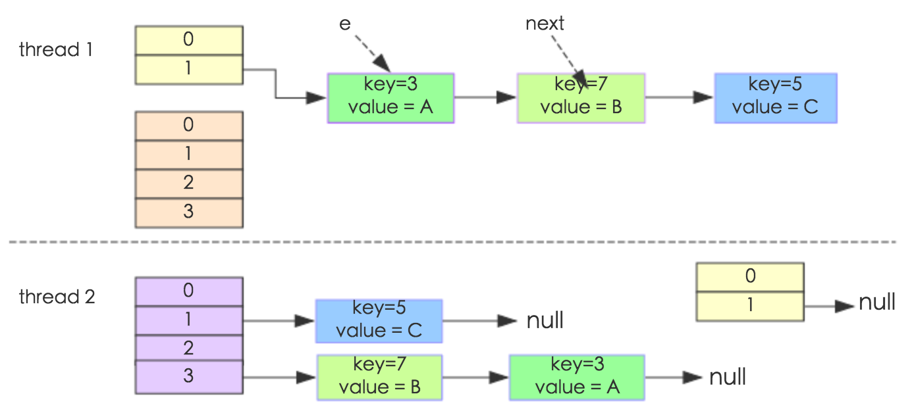
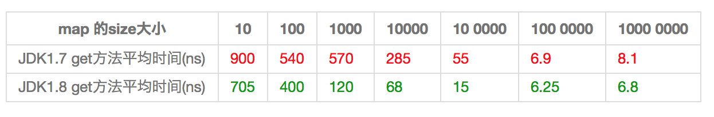

## JAVA 集合

### 1.ArrayList与LinkedList的实现和区别

ArrayList和LinkedList都是实现了List接口的类，他们都是元素的容器，用于存放对象的引用；

他们都可以对存放的元素进行增删改查的操作，还可以进行排序。

但是，他们还是有区别的。

除了实现对List接口的实现，他们还实现了其他的接口，由此造就了他们之间的差异；

#### ArrayList

ArrayList：内部使用数组的形式实现了存储，实现了RandomAccess接口，利用数组的下面进行元素的访问，因此对元素的随机访问速度非常快。

因为是数组，所以ArrayList在初始化的时候，有初始大小10，插入新元素的时候，会判断是否需要扩容，扩容的步长是0.5倍原容量，扩容方式是利用数组的复制，因此有一定的开销；

另外，ArrayList在进行元素插入的时候，需要移动插入位置之后的所有元素，位置越靠前，需要位移的元素越多，开销越大，相反，插入位置越靠后的话，开销就越小了，如果在最后面进行插入，那就不需要进行位移；

#### LinkedList
LinkedList：内部使用双向链表的结构实现存储，LinkedList有一个内部类作为存放元素的单元，里面有三个属性，用来存放元素本身以及前后2个单元的引用，另外LinkedList内部还有一个header属性，用来标识起始位置，LinkedList的第一个单元和最后一个单元都会指向header，因此形成了一个双向的链表结构。

LinkedList是采用双向链表实现的。所以它也具有链表的特点，每一个元素（结点）的地址不连续，通过引用找到当前结点的上一个结点和下一个结点，即插入和删除效率较高，只需要常数时间，而get和set则较为低效。
LinkedList的方法和使用和ArrayList大致相同，由于LinkedList是链表实现的，所以额外提供了在头部和尾部添加/删除元素的方法，也没有ArrayList扩容的问题了。另外，ArrayList和LinkedList都可以实现栈、队列等数据结构，但LinkedList本身实现了队列的接口，所以更推荐用LinkedList来实现队列和栈。

#### ArrayList和LinkedList区别

通常情况下，ArrayList和LinkedList的区别有以下几点：

- 1.ArrayList是实现了基于动态数组的数据结构，而LinkedList是基于链表的数据结构；

- 2.对于随机访问get和set，ArrayList要优于LinkedList，因为LinkedList要移动指针；

- 3.对于添加和删除操作add和remove，一般大家都会说LinkedList要比ArrayList快，因为ArrayList要移动数据。但是实际情况并非这样，对于添加或删除，LinkedList和ArrayList并不能明确说明谁快谁慢，下面会详细分析。

ArrayList中的随机访问、添加和删除部分源码如下：

```
//获取index位置的元素值
public E get(int index) {
    rangeCheck(index); //首先判断index的范围是否合法
 
    return elementData(index);
}
 
//将index位置的值设为element，并返回原来的值
public E set(int index, E element) {
    rangeCheck(index);
 
    E oldValue = elementData(index);
    elementData[index] = element;
    return oldValue;
}
 
//将element添加到ArrayList的指定位置
public void add(int index, E element) {
    rangeCheckForAdd(index);
 
    ensureCapacityInternal(size + 1);  // Increments modCount!!
    //将index以及index之后的数据复制到index+1的位置往后，即从index开始向后挪了一位
    System.arraycopy(elementData, index, elementData, index + 1,
                     size - index); 
    elementData[index] = element; //然后在index处插入element
    size++;
}
 
//删除ArrayList指定位置的元素
public E remove(int index) {
    rangeCheck(index);
 
    modCount++;
    E oldValue = elementData(index);
 
    int numMoved = size - index - 1;
    if (numMoved > 0)
        //向左挪一位，index位置原来的数据已经被覆盖了
        System.arraycopy(elementData, index+1, elementData, index,
                         numMoved);
    //多出来的最后一位删掉
    elementData[--size] = null; // clear to let GC do its work
 
    return oldValue;
}
```

LinkedList中的随机访问、添加和删除部分源码如下：

```
//获得第index个节点的值
public E get(int index) {
	checkElementIndex(index);
	return node(index).item;
}
 
//设置第index元素的值
public E set(int index, E element) {
	checkElementIndex(index);
	Node<E> x = node(index);
	E oldVal = x.item;
	x.item = element;
	return oldVal;
}
 
//在index个节点之前添加新的节点
public void add(int index, E element) {
	checkPositionIndex(index);
 
	if (index == size)
		linkLast(element);
	else
		linkBefore(element, node(index));
}
 
//删除第index个节点
public E remove(int index) {
	checkElementIndex(index);
	return unlink(node(index));
}
 
//定位index处的节点
Node<E> node(int index) {
	// assert isElementIndex(index);
	//index<size/2时，从头开始找
	if (index < (size >> 1)) {
		Node<E> x = first;
		for (int i = 0; i < index; i++)
			x = x.next;
		return x;
	} else { //index>=size/2时，从尾开始找
		Node<E> x = last;
		for (int i = size - 1; i > index; i--)
			x = x.prev;
		return x;
	}
}
```

从源码可以看出，ArrayList想要get(int index)元素时，直接返回index位置上的元素，而LinkedList需要通过for循环进行查找，虽然LinkedList已经在查找方法上做了优化，比如index < size / 2，则从左边开始查找，反之从右边开始查找，但是还是比ArrayList要慢。这点是毋庸置疑的。

ArrayList想要在指定位置插入或删除元素时，主要耗时的是System.arraycopy动作，会移动index后面所有的元素；LinkedList主耗时的是要先通过for循环找到index，然后直接插入或删除。这就导致了两者并非一定谁快谁慢，下面通过一个测试程序来测试一下两者插入的速度：

主要有两个因素决定他们的效率，插入的数据量和插入的位置。我们可以在程序里改变这两个因素来测试它们的效率。
当数据量较小时，测试程序中，大约小于30的时候，两者效率差不多，没有显著区别；当数据量较大时，大约在容量的1/10处开始，LinkedList的效率就开始没有ArrayList效率高了，特别到一半以及后半的位置插入时，LinkedList效率明显要低于ArrayList，而且数据量越大，越明显。

所以当插入的数据量很小时，两者区别不太大，当插入的数据量大时，大约在容量的1/10之前，LinkedList会优于ArrayList，在其后就劣与ArrayList，且越靠近后面越差。所以个人觉得，一般首选用ArrayList，由于LinkedList可以实现栈、队列以及双端队列等数据结构，所以当特定需要时候，使用LinkedList，当然咯，数据量小的时候，两者差不多，视具体情况去选择使用；当数据量大的时候，如果只需要在靠前的部分插入或删除数据，那也可以选用LinkedList，反之选择ArrayList反而效率更高。

### 2.HashMap了解其数据结构、hash冲突如何解决（链表和红黑树）、扩容时机、扩容时避免rehash的优化

HashMap是Java程序员使用频率最高的用于映射(键值对)处理的数据类型。随着JDK（Java Developmet Kit）版本的更新，JDK1.8对HashMap底层的实现进行了优化，例如引入红黑树的数据结构和扩容的优化等。本文结合JDK1.7和JDK1.8的区别，深入探讨HashMap的结构实现和功能原理。

Java为数据结构中的映射定义了一个接口java.util.Map，此接口主要有四个常用的实现类，分别是HashMap、Hashtable、LinkedHashMap和TreeMap，类继承关系如下图所示：


下面针对各个实现类的特点做一些说明：

(1) HashMap：它根据键的hashCode值存储数据，大多数情况下可以直接定位到它的值，因而具有很快的访问速度，但遍历顺序却是不确定的。 HashMap最多只允许一条记录的键为null，允许多条记录的值为null。HashMap非线程安全，即任一时刻可以有多个线程同时写HashMap，可能会导致数据的不一致。如果需要满足线程安全，可以用 Collections的synchronizedMap方法使HashMap具有线程安全的能力，或者使用ConcurrentHashMap。

(2) Hashtable：Hashtable是遗留类，很多映射的常用功能与HashMap类似，不同的是它承自Dictionary类，并且是线程安全的，任一时间只有一个线程能写Hashtable，并发性不如ConcurrentHashMap，因为ConcurrentHashMap引入了分段锁。Hashtable不建议在新代码中使用，不需要线程安全的场合可以用HashMap替换，需要线程安全的场合可以用ConcurrentHashMap替换。

(3) LinkedHashMap：LinkedHashMap是HashMap的一个子类，保存了记录的插入顺序，在用Iterator遍历LinkedHashMap时，先得到的记录肯定是先插入的，也可以在构造时带参数，按照访问次序排序。

(4) TreeMap：TreeMap实现SortedMap接口，能够把它保存的记录根据键排序，默认是按键值的升序排序，也可以指定排序的比较器，当用Iterator遍历TreeMap时，得到的记录是排过序的。如果使用排序的映射，建议使用TreeMap。在使用TreeMap时，key必须实现Comparable接口或者在构造TreeMap传入自定义的Comparator，否则会在运行时抛出java.lang.ClassCastException类型的异常。

对于上述四种Map类型的类，要求映射中的key是不可变对象。不可变对象是该对象在创建后它的哈希值不会被改变。如果对象的哈希值发生变化，Map对象很可能就定位不到映射的位置了。

通过上面的比较，我们知道了HashMap是Java的Map家族中一个普通成员，鉴于它可以满足大多数场景的使用条件，所以是使用频度最高的一个。下文我们主要结合源码，从存储结构、常用方法分析、扩容以及安全性等方面深入讲解HashMap的工作原理。

#### 内部实现

##### 存储结构-字段

从结构实现来讲，HashMap是数组+链表+红黑树（JDK1.8增加了红黑树部分）实现的，如下如所示。


这里需要讲明白两个问题：数据底层具体存储的是什么？这样的存储方式有什么优点呢？

(1) 从源码可知，HashMap类中有一个非常重要的字段，就是 Node[] table，即哈希桶数组，明显它是一个Node的数组。我们来看Node[JDK1.8]是何物。

```
static class Node<K,V> implements Map.Entry<K,V> {
        final int hash;    //用来定位数组索引位置
        final K key;
        V value;
        Node<K,V> next;   //链表的下一个node

        Node(int hash, K key, V value, Node<K,V> next) { ... }
        public final K getKey(){ ... }
        public final V getValue() { ... }
        public final String toString() { ... }
        public final int hashCode() { ... }
        public final V setValue(V newValue) { ... }
        public final boolean equals(Object o) { ... }
}
```

Node是HashMap的一个内部类，实现了Map.Entry接口，本质是就是一个映射(键值对)。上图中的每个黑色圆点就是一个Node对象。

(2) HashMap就是使用哈希表来存储的。哈希表为解决冲突，可以采用开放地址法和链地址法等来解决问题，Java中HashMap采用了**链地址法**。链地址法，简单来说，就是数组加链表的结合。在每个数组元素上都一个链表结构，当数据被Hash后，得到数组下标，把数据放在对应下标元素的链表上。例如程序执行下面代码：

`map.put("hello","小美");`

系统将调用”hello”这个key的hashCode()方法得到其hashCode 值（该方法适用于每个Java对象），然后再通过Hash算法的后两步运算（高位运算和取模运算，下文有介绍）来定位该键值对的存储位置，有时两个key会定位到相同的位置，表示发生了Hash碰撞。当然Hash算法计算结果越分散均匀，Hash碰撞的概率就越小，map的存取效率就会越高。

如果哈希桶数组很大，即使较差的Hash算法也会比较分散，如果哈希桶数组数组很小，即使好的Hash算法也会出现较多碰撞，所以就需要在空间成本和时间成本之间权衡，其实就是在根据实际情况确定哈希桶数组的大小，并在此基础上设计好的hash算法减少Hash碰撞。那么通过什么方式来控制map使得Hash碰撞的概率又小，哈希桶数组（Node[] table）占用空间又少呢？答案就是好的Hash算法和扩容机制。

在理解Hash和扩容流程之前，我们得先了解下HashMap的几个字段。从HashMap的默认构造函数源码可知，构造函数就是对下面几个字段进行初始化，源码如下：

```
int threshold;             // 所能容纳的key-value对极限 
final float loadFactor;    // 负载因子
int modCount;  
int size;  
```

首先，Node[] table的**初始化长度length(默认值是16)**，Load factor为**负载因子(默认值是0.75)**，threshold是HashMap所能容纳的最大数据量的Node(键值对)个数。threshold = length * Load factor。也就是说，在数组定义好长度之后，负载因子越大，所能容纳的键值对个数越多。

结合负载因子的定义公式可知，threshold就是在此Load factor和length(数组长度)对应下允许的最大元素数目，**超过这个数目就重新resize(扩容)，扩容后的HashMap容量是之前容量的两倍**。默认的负载因子0.75是对空间和时间效率的一个平衡选择，建议大家不要修改，除非在时间和空间比较特殊的情况下，如果内存空间很多而又对时间效率要求很高，可以降低负载因子Load factor的值；相反，如果内存空间紧张而对时间效率要求不高，可以增加负载因子loadFactor的值，这个值可以大于1。

size这个字段其实很好理解，就是HashMap中实际存在的键值对数量。注意和table的长度length、容纳最大键值对数量threshold的区别。而modCount字段主要用来记录HashMap内部结构发生变化的次数，主要用于迭代的快速失败。强调一点，内部结构发生变化指的是结构发生变化，例如put新键值对，但是某个key对应的value值被覆盖不属于结构变化。

在HashMap中，**哈希桶数组table的长度length大小必须为2的n次方(一定是合数)**，这是一种非常规的设计，常规的设计是把桶的大小设计为素数。相对来说素数导致冲突的概率要小于合数，具体证明可以参考这篇文章，Hashtable初始化桶大小为11，就是桶大小设计为素数的应用（Hashtable扩容后不能保证还是素数）。HashMap采用这种非常规设计，主要是为了在取模和扩容时做优化，同时为了减少冲突，HashMap定位哈希桶索引位置时，也加入了高位参与运算的过程。

这里存在一个问题，即使负载因子和Hash算法设计的再合理，也免不了会出现拉链过长的情况，一旦出现拉链过长，则会严重影响HashMap的性能。于是，**在JDK1.8版本中，对数据结构做了进一步的优化，引入了红黑树。而当链表长度太长（默认超过8）时，链表就转换为红黑树，利用红黑树快速增删改查的特点提高HashMap的性能，其中会用到红黑树的插入、删除、查找等算法**。本文不再对红黑树展开讨论，想了解更多红黑树数据结构的工作原理可以参考这篇文章。

#### 功能实现-方法

HashMap的内部功能实现很多，本文主要从根据key获取哈希桶数组索引位置、put方法的详细执行、扩容过程三个具有代表性的点深入展开讲解。

##### 1. 确定哈希桶数组索引位置

不管增加、删除、查找键值对，定位到哈希桶数组的位置都是很关键的第一步。前面说过HashMap的数据结构是数组和链表的结合，所以我们当然希望这个HashMap里面的元素位置尽量分布均匀些，尽量使得每个位置上的元素数量只有一个，那么当我们用hash算法求得这个位置的时候，马上就可以知道对应位置的元素就是我们要的，不用遍历链表，大大优化了查询的效率。HashMap定位数组索引位置，直接决定了hash方法的离散性能。先看看源码的实现(方法一+方法二):

```
方法一：
static final int hash(Object key) {   //jdk1.8 & jdk1.7
     int h;
     // h = key.hashCode() 为第一步 取hashCode值
     // h ^ (h >>> 16)  为第二步 高位参与运算
     return (key == null) ? 0 : (h = key.hashCode()) ^ (h >>> 16);
}
方法二：
static int indexFor(int h, int length) {  //jdk1.7的源码，jdk1.8没有这个方法，但是实现原理一样的
     return h & (length-1);  //第三步 取模运算
}
```

这里的Hash算法本质上就是三步：**取key的hashCode值、高位运算、取模运算**。

对于任意给定的对象，只要它的hashCode()返回值相同，那么程序调用方法一所计算得到的Hash码值总是相同的。我们首先想到的就是把hash值对数组长度取模运算，这样一来，元素的分布相对来说是比较均匀的。但是，模运算的消耗还是比较大的，在HashMap中是这样做的：调用方法二来计算该对象应该保存在table数组的哪个索引处。

这个方法非常巧妙，它通过h & (table.length -1)来得到该对象的保存位，而HashMap底层数组的长度总是2的n次方，这是HashMap在速度上的优化。当length总是2的n次方时，h& (length-1)运算等价于对length取模，也就是h%length，但是&比%具有更高的效率。

在JDK1.8的实现中，优化了高位运算的算法，通过hashCode()的高16位异或低16位实现的：(h = k.hashCode()) ^ (h >>> 16)，主要是从速度、功效、质量来考虑的，这么做可以在数组table的length比较小的时候，也能保证考虑到高低Bit都参与到Hash的计算中，同时不会有太大的开销。

下面举例说明下，n为table的长度。


##### 2. 分析HashMap的put方法

HashMap的put方法执行过程可以通过下图来理解，自己有兴趣可以去对比源码更清楚地研究学习。


①.判断键值对数组table[i]是否为空或为null，否则执行resize()进行扩容； 
②.根据键值key计算hash值得到插入的数组索引i，如果table[i]==null，直接新建节点添加，转向⑥，如果table[i]不为空，转向③； 
③.判断table[i]的首个元素是否和key一样，如果相同直接覆盖value，否则转向④，这里的相同指的是hashCode以及equals； 
④.判断table[i] 是否为treeNode，即table[i] 是否是红黑树，如果是红黑树，则直接在树中插入键值对，否则转向⑤； 
⑤.遍历table[i]，判断链表长度是否大于8，大于8的话把链表转换为红黑树，在红黑树中执行插入操作，否则进行链表的插入操作；遍历过程中若发现key已经存在直接覆盖value即可； 
⑥.插入成功后，判断实际存在的键值对数量size是否超多了最大容量threshold，如果超过，进行扩容。

JDK1.8HashMap的put方法源码如下:

```
 1 public V put(K key, V value) {
 2     // 对key的hashCode()做hash
 3     return putVal(hash(key), key, value, false, true);
 4 }
 5 
 6 final V putVal(int hash, K key, V value, boolean onlyIfAbsent,
 7                boolean evict) {
 8     Node<K,V>[] tab; Node<K,V> p; int n, i;
 9     // 步骤①：tab为空则创建
10     if ((tab = table) == null || (n = tab.length) == 0)
11         n = (tab = resize()).length;
12     // 步骤②：计算index，并对null做处理 
13     if ((p = tab[i = (n - 1) & hash]) == null) 
14         tab[i] = newNode(hash, key, value, null);
15     else {
16         Node<K,V> e; K k;
17         // 步骤③：节点key存在，直接覆盖value
18         if (p.hash == hash &&
19             ((k = p.key) == key || (key != null && key.equals(k))))
20             e = p;
21         // 步骤④：判断该链为红黑树
22         else if (p instanceof TreeNode)
23             e = ((TreeNode<K,V>)p).putTreeVal(this, tab, hash, key, value);
24         // 步骤⑤：该链为链表
25         else {
26             for (int binCount = 0; ; ++binCount) {
27                 if ((e = p.next) == null) {
28                     p.next = newNode(hash, key,value,null);
                        //链表长度大于8转换为红黑树进行处理
29                     if (binCount >= TREEIFY_THRESHOLD - 1) // -1 for 1st  
30                         treeifyBin(tab, hash);
31                     break;
32                 }
                    // key已经存在直接覆盖value
33                 if (e.hash == hash &&
34                     ((k = e.key) == key || (key != null && key.equals(k)))) 
35							break;
36                 p = e;
37             }
38         }
39         
40         if (e != null) { // existing mapping for key
41             V oldValue = e.value;
42             if (!onlyIfAbsent || oldValue == null)
43                 e.value = value;
44             afterNodeAccess(e);
45             return oldValue;
46         }
47     }

48     ++modCount;
49     // 步骤⑥：超过最大容量 就扩容
50     if (++size > threshold)
51         resize();
52     afterNodeInsertion(evict);
53     return null;
54 }
```

##### 3. 扩容机制

扩容(resize)就是重新计算容量，向HashMap对象里不停的添加元素，而HashMap对象内部的数组无法装载更多的元素时，对象就需要扩大数组的长度，以便能装入更多的元素。当然Java里的数组是无法自动扩容的，方法是使用一个新的数组代替已有的容量小的数组，就像我们用一个小桶装水，如果想装更多的水，就得换大水桶。

我们分析下resize的源码，鉴于JDK1.8融入了红黑树，较复杂，为了便于理解我们仍然使用JDK1.7的代码，好理解一些，本质上区别不大，具体区别后文再说。

```
1 void resize(int newCapacity) {   //传入新的容量
2     Entry[] oldTable = table;    //引用扩容前的Entry数组
3     int oldCapacity = oldTable.length;         
4     if (oldCapacity == MAXIMUM_CAPACITY) {  //扩容前的数组大小如果已经达到最大(2^30)了
5         threshold = Integer.MAX_VALUE; //修改阈值为int的最大值(2^31-1)，这样以后就不会扩容了
6         return;
7     }
8  
9     Entry[] newTable = new Entry[newCapacity];  //初始化一个新的Entry数组
10     transfer(newTable);                         //！！将数据转移到新的Entry数组里
11     table = newTable;                           //HashMap的table属性引用新的Entry数组
12     threshold = (int)(newCapacity * loadFactor);//修改阈值
13 }
```

这里就是使用一个容量更大的数组来代替已有的容量小的数组，transfer()方法将原有Entry数组的元素拷贝到新的Entry数组里。

```
1 void transfer(Entry[] newTable) {
2     Entry[] src = table;                   //src引用了旧的Entry数组
3     int newCapacity = newTable.length;
4     for (int j = 0; j < src.length; j++) { //遍历旧的Entry数组
5         Entry<K,V> e = src[j];             //取得旧Entry数组的每个元素
6         if (e != null) {
7             src[j] = null;//释放旧Entry数组的对象引用（for循环后，旧的Entry数组不再引用任何对象）
8             do {
9                 Entry<K,V> next = e.next;
10                 int i = indexFor(e.hash, newCapacity); //！！重新计算每个元素在数组中的位置
11                 e.next = newTable[i]; //标记[1]
12                 newTable[i] = e;      //将元素放在数组上
13                 e = next;             //访问下一个Entry链上的元素
14             } while (e != null);
15         }
16     }
17 } 
```

newTable[i]的引用赋给了e.next，也就是使用了单链表的头插入方式，同一位置上新元素总会被放在链表的头部位置；这样先放在一个索引上的元素终会被放到Entry链的尾部(如果发生了hash冲突的话），这一点和Jdk1.8有区别，下文详解。在旧数组中同一条Entry链上的元素，通过重新计算索引位置后，有可能被放到了新数组的不同位置上。

下面举个例子说明下扩容过程。假设了我们的hash算法就是简单的用key mod 一下表的大小（也就是数组的长度）。其中的哈希桶数组table的size=2， 所以key = 3、7、5，put顺序依次为 5、7、3。在mod 2以后都冲突在table[1]这里了。这里假设负载因子 loadFactor=1，即当键值对的实际大小size 大于 table的实际大小时进行扩容。接下来的三个步骤是哈希桶数组 resize成4，然后所有的Node重新rehash的过程。


下面我们讲解下JDK1.8做了哪些优化。经过观测可以发现，我们使用的是2次幂的扩展(指长度扩为原来2倍)，所以，元素的位置要么是在原位置，要么是在原位置再移动2次幂的位置。看下图可以明白这句话的意思，n为table的长度，图（a）表示扩容前的key1和key2两种key确定索引位置的示例，图（b）表示扩容后key1和key2两种key确定索引位置的示例，其中hash1是key1对应的哈希与高位运算结果。


元素在重新计算hash之后，因为n变为2倍，那么n-1的mask范围在高位多1bit(红色)，因此新的index就会发生这样的变化：


因此，我们在扩充HashMap的时候，不需要像JDK1.7的实现那样重新计算hash，只需要看看原来的hash值新增的那个bit是1还是0就好了，是0的话索引没变，是1的话索引变成“原索引+oldCap”，可以看看下图为16扩充为32的resize示意图：


这个设计确实非常的巧妙，既省去了重新计算hash值的时间，而且同时，由于新增的1bit是0还是1可以认为是随机的，因此resize的过程，均匀的把之前的冲突的节点分散到新的bucket了。这一块就是JDK1.8新增的优化点。有一点注意区别，JDK1.7中rehash的时候，旧链表迁移新链表的时候，如果在新表的数组索引位置相同，则链表元素会倒置，但是从上图可以看出，JDK1.8不会倒置。有兴趣的同学可以研究下JDK1.8的resize源码，写的很赞，如下:

```
1 final Node<K,V>[] resize() {
 2     Node<K,V>[] oldTab = table;
 3     int oldCap = (oldTab == null) ? 0 : oldTab.length;
 4     int oldThr = threshold;
 5     int newCap, newThr = 0;
 6     if (oldCap > 0) {
 7         // 超过最大值就不再扩充了，就只好随你碰撞去吧
 8         if (oldCap >= MAXIMUM_CAPACITY) {
 9             threshold = Integer.MAX_VALUE;
10             return oldTab;
11         }
12         // 没超过最大值，就扩充为原来的2倍
13         else if ((newCap = oldCap << 1) < MAXIMUM_CAPACITY &&
14                  oldCap >= DEFAULT_INITIAL_CAPACITY)
15             newThr = oldThr << 1; // double threshold
16     }
17     else if (oldThr > 0) // initial capacity was placed in threshold
18         newCap = oldThr;
19     else {               // zero initial threshold signifies using defaults
20         newCap = DEFAULT_INITIAL_CAPACITY;
21         newThr = (int)(DEFAULT_LOAD_FACTOR * DEFAULT_INITIAL_CAPACITY);
22     }
23     // 计算新的resize上限
24     if (newThr == 0) {
25 
26         float ft = (float)newCap * loadFactor;
27         newThr = (newCap < MAXIMUM_CAPACITY && ft < (float)MAXIMUM_CAPACITY ?
28                   (int)ft : Integer.MAX_VALUE);
29     }
30     threshold = newThr;
31     @SuppressWarnings({"rawtypes"，"unchecked"})
32         Node<K,V>[] newTab = (Node<K,V>[])new Node[newCap];
33     table = newTab;
34     if (oldTab != null) {
35         // 把每个bucket都移动到新的buckets中
36         for (int j = 0; j < oldCap; ++j) {
37             Node<K,V> e;
38             if ((e = oldTab[j]) != null) {
39                 oldTab[j] = null;
40                 if (e.next == null)
41                     newTab[e.hash & (newCap - 1)] = e;
42                 else if (e instanceof TreeNode)
43                     ((TreeNode<K,V>)e).split(this, newTab, j, oldCap);
44                 else { // 链表优化重hash的代码块
45                     Node<K,V> loHead = null, loTail = null;
46                     Node<K,V> hiHead = null, hiTail = null;
47                     Node<K,V> next;
48                     do {
49                         next = e.next;
50                         // 原索引
51                         if ((e.hash & oldCap) == 0) {
52                             if (loTail == null)
53                                 loHead = e;
54                             else
55                                 loTail.next = e;
56                             loTail = e;
57                         }
58                         // 原索引+oldCap
59                         else {
60                             if (hiTail == null)
61                                 hiHead = e;
62                             else
63                                 hiTail.next = e;
64                             hiTail = e;
65                         }
66                     } while ((e = next) != null);
67                     // 原索引放到bucket里
68                     if (loTail != null) {
69                         loTail.next = null;
70                         newTab[j] = loHead;
71                     }
72                     // 原索引+oldCap放到bucket里
73                     if (hiTail != null) {
74                         hiTail.next = null;
75                         newTab[j + oldCap] = hiHead;
76                     }
77                 }
78             }
79         }
80     }
81     return newTab;
82 }
```

#### 线程安全性

在多线程使用场景中，应该尽量避免使用线程不安全的HashMap，而使用线程安全的ConcurrentHashMap。那么为什么说HashMap是线程不安全的，下面举例子说明在并发的多线程使用场景中使用HashMap可能造成死循环。代码例子如下(便于理解，仍然使用JDK1.7的环境)：

```
public class HashMapInfiniteLoop {  

    private static HashMap<Integer,String> map = new HashMap<Integer,String>(2，0.75f);  
    public static void main(String[] args) {  
        map.put(5， "C");  

        new Thread("Thread1") {  
            public void run() {  
                map.put(7, "B");  
                System.out.println(map);  
            };  
        }.start();  
        new Thread("Thread2") {  
            public void run() {  
                map.put(3, "A);  
                System.out.println(map);  
            };  
        }.start();        
    }  
} 
```

其中，map初始化为一个长度为2的数组，loadFactor=0.75，threshold=2*0.75=1，也就是说当put第二个key的时候，map就需要进行resize。

通过设置断点让线程1和线程2同时debug到transfer方法(3.3小节代码块)的首行。注意此时两个线程已经成功添加数据。放开thread1的断点至transfer方法的“Entry next = e.next;” 这一行；然后放开线程2的的断点，让线程2进行resize。结果如下图。



注意，Thread1的 e 指向了key(3)，而next指向了key(7)，其在线程二rehash后，指向了线程二重组后的链表。

线程一被调度回来执行，先是执行 newTalbe[i] = e， 然后是e = next，导致了e指向了key(7)，而下一次循环的next = e.next导致了next指向了key(3)。


e.next = newTable[i] 导致 key(3).next 指向了 key(7)。注意：此时的key(7).next 已经指向了key(3)， 环形链表就这样出现了。


于是，当我们用线程一调用map.get(11)时，悲剧就出现了——Infinite Loop。

#### JDK1.8与JDK1.7的性能对比

HashMap中，如果key经过hash算法得出的数组索引位置全部不相同，即Hash算法非常好，那样的话，getKey方法的时间复杂度就是O(1)，如果Hash算法技术的结果碰撞非常多，假如Hash算极其差，所有的Hash算法结果得出的索引位置一样，那样所有的键值对都集中到一个桶中，或者在一个链表中，或者在一个红黑树中，**时间复杂度分别为O(n)和O(lgn)**。 鉴于JDK1.8做了多方面的优化，总体性能优于JDK1.7，下面我们从两个方面用例子证明这一点。

##### Hash较均匀的情况

任何一个值的hashCode都不会相同，直接使用value当做hashcode。

在测试中会查找不同的值，然后度量花费的时间，为了计算getKey的平均时间，我们遍历所有的get方法，计算总的时间，除以key的数量，计算一个平均值，主要用来比较，绝对值可能会受很多环境因素的影响。结果如下：



通过观测测试结果可知，JDK1.8的性能要高于JDK1.7 15%以上，在某些size的区域上，甚至高于100%。由于Hash算法较均匀，JDK1.8引入的红黑树效果不明显，下面我们看看Hash不均匀的的情况。

##### Hash极不均匀的情况

假设我们又一个非常差的Key，它们所有的实例都返回相同的hashCode值。这是使用HashMap最坏的情况。代码修改如下：


从表中结果中可知，随着size的变大，JDK1.7的花费时间是增长的趋势，而JDK1.8是明显的降低趋势，并且呈现对数增长稳定。当一个链表太长的时候，HashMap会动态的将它替换成一个红黑树，这话的话会将时间复杂度从O(n)降为O(logn)。hash算法均匀和不均匀所花费的时间明显也不相同，这两种情况的相对比较，可以说明一个好的hash算法的重要性。

#### 小结

- 扩容是一个特别耗性能的操作，所以当程序员在使用HashMap的时候，估算map的大小，初始化的时候给一个大致的数值，避免map进行频繁的扩容。
- 负载因子是可以修改的，也可以大于1，但是建议不要轻易修改，除非情况非常特殊。
- HashMap是线程不安全的，不要在并发的环境中同时操作HashMap，建议使用ConcurrentHashMap。
- JDK1.8引入红黑树大程度优化了HashMap的性能。

### 3.LinkedHashMap了解基本原理、哪两种有序、如何用它实现LRU


