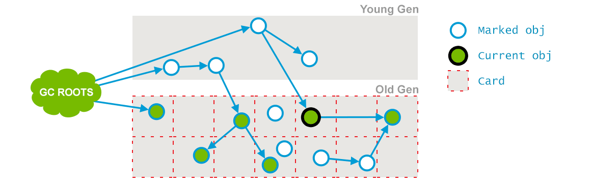
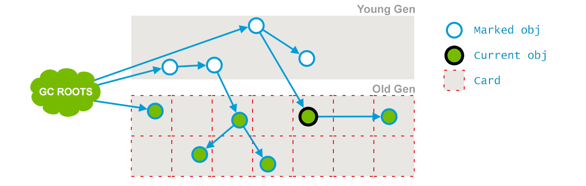

## JVM 分代GC系列问题

本文章所说的 GC 实现没有特殊说明的话，默认指的是 HotSpot 的。

### 1.JVM基础回顾

① 新生代（Young Generation）：大多数对象在新生代中被创建，其中很多对象的生命周期很短。每次新生代的垃圾回收（又称Minor GC）后只有少量对象存活，所以选用复制算法，只需要少量的复制成本就可以完成回收。

新生代内又分三个区：一个Eden区，两个Survivor区（一般而言），大部分对象在Eden区中生成。当Eden区满时，还存活的对象将被复制到两个Survivor区（中的一个）。当这个Survivor区满时，此区的存活且不满足“晋升”条件的对象将被复制到另外一个Survivor区。对象每经历一次Minor GC，年龄加1，达到“晋升年龄阈值”后，被放到老年代，这个过程也称为“晋升”。显然，“晋升年龄阈值”的大小直接影响着对象在新生代中的停留时间，在Serial和ParNew GC两种回收器中，“晋升年龄阈值”通过参数MaxTenuringThreshold设定，默认值为15。

1:1:8

1/3

② 老年代（Old Generation）：在新生代中经历了N次垃圾回收后仍然存活的对象，就会被放到年老代，该区域中对象存活率高。老年代的垃圾回收（又称Major GC）通常使用“标记-清理”或“标记-整理”算法。整堆包括新生代和老年代的垃圾回收称为Full GC（HotSpot VM里，除了CMS之外，其它能收集老年代的GC都会同时收集整个GC堆，包括新生代）。

2/3

③ 永久代（Perm Generation）：主要存放元数据，例如Class、Method的元信息，与垃圾回收要回收的Java对象关系不大。相对于新生代和年老代来说，该区域的划分对垃圾回收影响比较小。

### 2.常见垃圾回收器

不同的垃圾回收器，适用于不同的场景。常用的垃圾回收器：

- 串行（Serial）回收器是单线程的一个回收器，简单、易实现、效率高。
- 并行（ParNew）回收器是Serial的多线程版，可以充分的利用CPU资源，减少回收的时间。
- 吞吐量优先（Parallel Scavenge）回收器，侧重于吞吐量的控制。
- 并发标记清除（CMS，Concurrent Mark Sweep）回收器是一种以获取最短回收停顿时间为目标的回收器，该回收器是基于“标记-清除”算法实现的。

### 3.young gc、old gc、full gc、mixed gc
其实 GC 分为两大类，分别是 Partial GC 和 Full GC。
**Partial GC 即部分收集**，分为 young gc、old gc、mixed gc。

- young gc(Minor GC)：指的是单单收集年轻代的 GC。
- old gc：指的是单单收集老年代的 GC。
- mixed gc：这个是 G1 收集器特有的，指的是收集整个年轻代和部分老年代的 GC。

**Full GC(Major GC) 即整堆回收**，指的是收取整个堆，包括年轻代、老年代，如果有永久代的话还包括永久代。

#### young gc 触发条件是什么？

大致上可以认为在年轻代的 eden 快要被占满的时候会触发 young gc。
为什么要说大致上呢？因为有一些收集器的回收实现是在 full gc 前会让先执行以下 young gc。
比如 Parallel Scavenge，不过有参数可以调整让其不进行 young gc。
可能还有别的实现也有这种操作，不过正常情况下就当做 eden 区快满了即可。

**eden 快满的触发因素有两个，一个是为对象分配内存不够，一个是为 TLAB 分配内存不够。**

#### full gc 触发条件有哪些？

- 在要进行 young gc 的时候，根据之前统计数据发现年轻代平均晋升大小比现在老年代剩余空间要大，那就会触发 full gc。
- 有永久代的话如果永久代满了也会触发 full gc。
- 老年代空间不足，大对象直接在老年代申请分配，如果此时老年代空间不足则会触发 full gc。
- 担保失败即 promotion failure，新生代的 to 区放不下从 eden 和 from 拷贝过来对象，或者新生代对象 gc 年龄到达阈值需要晋升这两种情况，老年代如果放不下的话都会触发 full gc。
- 执行 System.gc()、jmap -dump 等命令会触发 full gc。

### 4.知道TLAB吗

一般而言生成对象需要向堆中的新生代申请内存空间，而堆又是全局共享的，像新生代内存又是规整的，是通过一个指针来划分的。


内存是紧凑的，新对象创建指针就右移对象大小 size 即可，这叫指针加法（bump [up] the pointer）。

可想而知如果多个线程都在分配对象，那么这个指针就会成为热点资源，需要互斥那分配的效率就低了。

于是搞了个 TLAB（Thread Local Allocation Buffer），为一个线程分配的内存申请区域。

**这个区域只允许这一个线程申请分配对象，允许所有线程访问这块内存区域。**

TLAB 的思想其实很简单，就是划一块区域给一个线程，这样每个线程只需要在自己的那亩地申请对象内存，不需要争抢热点指针。

当这块内存用完了之后再去申请即可。

这种思想其实很常见，比如分布式发号器，每次不会一个一个号的取，会取一批号，用完之后再去申请一批。


可以看到每个线程有自己的一块内存分配区域，短一点的箭头代表 TLAB 内部的分配指针。

如果这块区域用完了再去申请即可。

**不过每次申请的大小不固定**，会根据该线程启动到现在的历史信息来调整，比如这个线程一直在分配内存那么 TLAB 就大一些，如果这个线程基本上不会申请分配内存那 TLAB 就小一些。

还有 TLAB 会浪费空间，我们来看下线程C TLAB。

可以看到 TLAB 内部只剩一格大小，申请的对象需要两格，这时候需要再申请一块 TLAB ，之前的那一格就浪费了。

在 HotSpot 中会生成一个填充对象来填满这一块，因为堆需要线性遍历，遍历的流程是通过对象头得知对象的大小，然后跳过这个大小就能找到下一个对象，所以不能有空洞。

当然也可以通过空闲链表等外部记录方式来实现遍历。

**还有 TLAB 只能分配小对象，大的对象还是需要在共享的 eden 区分配。**

所以总的来说 TLAB 是为了避免对象分配时的竞争而设计的。

### 5.知道PLAB吗

可以看到和 TLAB 很像，PLAB 即 Promotion Local Allocation Buffers。

用在年轻代对象晋升到老年代时。

在多线程并行执行 YGC 时，可能有很多对象需要晋升到老年代，此时老年代的指针就“热”起来了，于是搞了个 PLAB。

先从老年代 freelist（空闲链表） 申请一块空间，然后在这一块空间中就可以通过指针加法（bump the pointer）来分配内存，这样对 freelist 竞争也少了，分配空间也快了。


大致就是上图这么个思想，每个线程先申请一块作为 PLAB ，然后在这一块内存里面分配晋升的对象。

这和 TLAB 的思想相似。

### 6.产生 concurrent mode failure 真正的原因

```
《深入理解Java虚拟机》：由于CMS收集器无法处理“浮动垃圾”（FloatingGarbage），有可能出现“Con-current Mode Failure”失败进而导致另一次完全“Stop The World”的Full GC的产生。
```

这段话的意思是因为抛这个错而导致一次 Full GC。

而实际上是**Full GC 导致抛这个错.**

而 acquire_control_and_collect 这个方法是 cms 执行 foreground gc 的。

cms 分为  foreground gc 和 background gc。

foreground 其实就是 Full gc。

因此是 full gc 的时候 cms gc 还在进行中导致抛这个错。

究其原因是因为分配速率太快导致堆不够用，回收不过来因此产生 full gc。

也有可能是发起 cms gc 设置的堆的阈值太高。

### 7.新生代的 GC 如何避免全堆扫描

在常见的分代 GC 中就是利用记忆集来实现的，记录可能存在的老年代中有新生代的引用的对象地址，来避免全堆扫描。

把堆中分为很多块，每块 512 字节（卡页），用字节数组来中的一个元素来表示某一块，1表示脏块，里面存在跨代引用。

cms 中需要记录老年代指向年轻代的引用，但是写屏障的实现并没有做任何条件的过滤。

即不判断当前对象是老年代对象且引用的是新生代对象才会标记对应的卡表为脏。

只要是引用赋值都会把对象的卡标记为脏，当然YGC扫描的时候只会扫老年代的卡表。

这样做是减少写屏障带来的消耗，毕竟引用的赋值非常的频繁。

### 8.简单说下 G1 回收流程

G1 从大局上看分为两大阶段，分别是并发标记和对象拷贝。

并发标记是基于 STAB 的，可以分为四大阶段：

- 1、初始标记（initial marking)，这个阶段是 STW 的，扫描根集合，标记根直接可达的对象即可。在G1中标记对象是利用外部的bitmap来记录，而不是对象头。
- 2、并发阶段（concurrent marking）,这个阶段和应用线程并发，从上一步标记的根直接可达对象开始进行 tracing，递归扫描所有可达对象。 STAB 也会在这个阶段记录着变更的引用。
- 3、最终标记（final marking), 这个阶段是 STW 的，处理 STAB 中的引用。
- 4、清理阶段（clenaup），这个阶段是 STW 的，根据标记的 bitmap 统计每个 region 存活对象的多少，如果有完全没存活的 region 则整体回收。

**对象拷贝阶段（evacuation)**，这个阶段是 STW 的。

根据标记结果选择合适的 reigon 组成收集集合（collection set 即 CSet），然后将 CSet 存活对象拷贝到新 region 中。

G1 的瓶颈在于对象拷贝阶段，需要花较多的瓶颈来转移对象。

### 9.简单说下 cms 回收流程

其实从之前问题的 CollectorState 枚举可以得知几个流程了。

- 1、初始标记(initial mark)，这个阶段是 STW 的，扫描根集合，标记根直接可达的对象即可。
- 2、并发标记(Concurrent marking)，这个阶段和应用线程并发，从上一步标记的根直接可达对象开始进行 tracing，递归扫描所有可达对象。
- 3、并发预清理(Concurrent precleaning)，这个阶段和应用线程并发，就是想帮重新标记阶段先做点工作，扫描一下卡表脏的区域和新晋升到老年代的对象等，因为重新标记是 STW 的，所以分担一点。
- 4、可中断的预清理阶段（AbortablePreclean），这个和上一个阶段基本上一致，就是为了分担重新标记标记的工作。
- 5、重新标记(remark)，这个阶段是 STW 的，因为并发阶段引用关系会发生变化，所以要重新遍历一遍新生代对象、Gc Roots、卡表等，来修正标记。
- 6、并发清理(Concurrent sweeping)，这个阶段和应用线程并发，用于清理垃圾。
- 7、并发重置(Concurrent reset)，这个阶段和应用线程并发，重置 cms 内部状态。

cms 的瓶颈就在于重新标记阶段，需要较长花费时间来进行重新扫描。

### 10.GC 调优的两大目标是啥

分别是**最短暂停时间(延迟)** 和 **吞吐量**。

- 最短暂停时间(延迟)：因为 GC 会 STW 暂停所有应用线程，这时候对于用户而言就等于卡顿了，因此对于时延敏感的应用来说减少 STW 的时间是关键。<br>
也可以理解为最大停顿时间，即垃圾收集过程中一次 STW 的最长时间，越短越好，一定程度上可以接受频次的增大，GC 技术的主要发展方向。
<br>

- 吞吐量：对于一些对时延不敏感的应用比如一些后台计算应用来说，吞吐量是关注的重点，它们不关注每次 GC 停顿的时间，只关注总的停顿时间少，吞吐量高。<br>
应用系统的生命周期内，由于 GC 线程会占用 Mutator 当前可用的 CPU 时钟周期，吞吐量即为 Mutator 有效花费的时间占系统总运行时间的百分比，例如系统运行了 100 min，GC 耗时 1 min，则系统吞吐量为 99%，吞吐量优先的收集器可以接受较长的停顿。

举个例子：

方案一：每次 GC 停顿 100 ms，每秒停顿 5 次。

方案二：每次 GC 停顿 200 ms，每秒停顿 2 次。

两个方案相对而言第一个时延低，第二个吞吐高，基本上两者不可兼得。

所以调优时候需要明确应用的目标。

### 11.GC 如何调优

这个问题在面试中很容易问到，抓住核心回答。

现在都是分代 GC，调优的思路就是尽量让对象在新生代就被回收，防止过多的对象晋升到老年代，减少大对象的分配。

**需要平衡分代的大小、垃圾回收的次数和停顿时间。**

需要对 GC 进行完整的监控，监控各年代占用大小、YGC 触发频率、Full GC 触发频率，对象分配速率等等。

然后根据实际情况进行调优。

比如进行了莫名其妙的 Full GC，有可能是某个第三方库调了 System.gc。

Full GC 频繁可能是 CMS GC 触发内存阈值过低，导致对象分配不过来。

还有对象年龄晋升的阈值、survivor 过小等等，具体情况还是得具体分析，反正核心是不变的。

#### 参数基本策略

各分区的大小对GC的性能影响很大。如何将各分区调整到合适的大小，分析活跃数据的大小是很好的切入点。

活跃数据的大小是指，应用程序稳定运行时长期存活对象在堆中占用的空间大小，也就是Full GC后堆中老年代占用空间的大小。可以通过GC日志中Full GC之后老年代数据大小得出，比较准确的方法是在程序稳定后，多次获取GC数据，通过取平均值的方式计算活跃数据的大小。活跃数据和各分区之间的比例关系如下（见参考文献1）：

| 空间	| 倍数 |
|-----|-----|
| 总大小 |	3-4 倍活跃数据的大小 |
| 新生代 |	1-1.5 活跃数据的大小 |
| 老年代 |	2-3 倍活跃数据的大小 |
| 永久代 |	1.2-1.5 倍Full GC后的永久代空间占用 |

例如，根据GC日志获得老年代的活跃数据大小为300M，那么各分区大小可以设为：

总堆：1200MB = 300MB × 4* 新生代：450MB = 300MB × 1.5* 老年代： 750MB = 1200MB - 450MB*

这部分设置仅仅是堆大小的初始值，后面的优化中，可能会调整这些值，具体情况取决于应用程序的特性和需求。

#### 优化步骤

GC优化一般步骤可以概括为：确定目标、优化参数、验收结果。

##### 确定目标

明确应用程序的系统需求是性能优化的基础，系统的需求是指应用程序运行时某方面的要求，譬如： - 高可用，可用性达到几个9。 - 低延迟，请求必须多少毫秒内完成响应。 - 高吞吐，每秒完成多少次事务。

明确系统需求之所以重要，是因为上述性能指标间可能冲突。比如通常情况下，缩小延迟的代价是降低吞吐量或者消耗更多的内存或者两者同时发生。

由于笔者所在团队主要关注高可用和低延迟两项指标，所以接下来分析，如何量化GC时间和频率对于响应时间和可用性的影响。通过这个量化指标，可以计算出当前GC情况对服务的影响，也能评估出GC优化后对响应时间的收益，这两点对于低延迟服务很重要。

举例：假设单位时间T内发生一次持续25ms的GC，接口平均响应时间为50ms，且请求均匀到达，根据下图所示：


那么有(50ms+25ms)/T比例的请求会受GC影响，其中GC前的50ms内到达的请求都会增加25ms，GC期间的25ms内到达的请求，会增加0-25ms不等，如果时间T内发生N次GC，受GC影响请求占比=(接口响应时间+GC时间)×N/T 。可见无论降低单次GC时间还是降低GC次数N都可以有效减少GC对响应时间的影响。

##### 优化

通过收集GC信息，结合系统需求，确定优化方案，例如选用合适的GC回收器、重新设置内存比例、调整JVM参数等。

进行调整后，将不同的优化方案分别应用到多台机器上，然后比较这些机器上GC的性能差异，有针对性的做出选择，再通过不断的试验和观察，找到最合适的参数。

##### 验收优化结果

将修改应用到所有服务器，判断优化结果是否符合预期，总结相关经验。

接下来，我们通过三个案例来实践以上的优化流程和基本原则（本文中三个案例使用的垃圾回收器均为ParNew+CMS，CMS失败时Serial Old替补)。

##### 常用工具
###### 命令行终端

- 标准终端类：jps、jinfo、jstat、jstack、jmap
- 功能整合类：jcmd、vjtools、arthas、greys

##### 可视化界面
- 简易：JConsole、JVisualvm、HA、GCHisto、GCViewer
- 进阶：MAT、JProfiler

##### GC优化案例
Refer to
https://tech.meituan.com/2017/12/29/jvm-optimize.html

<br/>
#### Reference
https://juejin.cn/post/6894435290350845959
https://tech.meituan.com/2020/11/12/java-9-cms-gc.html 
https://tech.meituan.com/2017/12/29/jvm-optimize.html

### 12.G1垃圾回收器 vs CMS 垃圾回收器

#### CMS

CMS（Concurrent Mark and Sweep）是以牺牲吞吐量为代价来获得最短停顿时间的垃圾回收器，主要适用于对响应时间的侧重性大于吞吐量的场景。仅针对老年代（Tenured Generation）的回收。

为求达到该目标主要是因为以下两个原因：

- 没有采取compact操作，而是简单的mark and sweep，同时维护了一个free list来管理内存空间，所以也产生了大量的内存碎片。
- mark and sweep分为多个阶段，其中大部分的阶段的GC线程是和用户线程并发执行，默认的GC线程数为物理CPU核心数的1/4。

因为是并发地进行清理，所以必须预留部分堆空间给正在运行的应用程序，默认情况下在老年代使用了68%及以上的内存的时候就开始CMS。

##### 过程

- 初始标记（initial mark）**Stop The World**


本阶段需要stop the world，一是标记老年代中所有的GC Roots所指的**直接对象**；二是标记被年轻代中存活对象引用的**直接对象**。因为仅标记少量节点，所以很快就能完成。

- 并发标记（concurrent mark）


在初始标记的基础上继续往下遍历其他的对象引用并进行标记，，该过程会和用户线程并发地执行，不会发生停顿。这个阶段会从initial mark阶段中所标记的节点往下检索，标记出所有老年代中存活的对象。注意此时会有部分对象的引用被改变，如上图中的current obj原本所引用的节点已经失去了关联。

- 并发预清理（concurrent preclean）


前一个阶段在并行运行的时候，一些对象的引用已经发生了变化，当这些引用发生变化的时候，JVM会标记堆的这个区域为Dirty Card，这就是 Card Marking。



在本阶段，那些能够从dirty card对象到达的对象也会被标记，这个标记做完之后，dirty card标记就会被清除了，如上图所示。

总的来说，本阶段会并发地更新并发标记阶段的引用变化和查找在并发标记阶段新进入老年代的对象，如刚晋升的对象和直接被分配在老年代的对象。通过重新扫描，以减少下一阶段的工作。

- 可中止的并发预清理（concurrent abortable preclean）

这个阶段尝试着去承担STW的Final Remark阶段足够多的工作。这个阶段持续的时间依赖好多的因素，由于这个阶段是重复的做相同的事情直到发生aboart的条件之一（比如：重复的次数、多少量的工作、持续的时间等等）才会停止。

- 重新标记 / 最终标记（final remark）**Stop The World**

本阶段需要stop the world，通常来说此次暂时都会比较长，因为并发预清理是并发执行的，对象的引用可能会发生进一步的改变，需要确保在清理之前保持一个正确的对象引用视图，那么就需要stop the world来处理复杂的情况。

- 并发清理（concurrent sweep）



使用标记-清除法回收老年代的垃圾对象，与用户线程并发执行。

- 并发标记重置（concurrent reset）

清空现场，为下一次GC做准备。

##### GC参数

-XX:+UseConcMarkSweepGC - 启用CMS，同时-XX:+UseParNewGC会被自动打开。

-XX:CMSInitiatingOccupancyFraction - 设置第一次启动CMS的阈值，默认是68%。

-XX:+UseCMSInitiatingOccupancyOnly - 只是用设定的回收阈值，如果不指定，JVM仅在第一次使用设定值，后续则自动调整。

-XX:+CMSPermGenSweepingEnabled - 回收perm区。

-XX:+CMSClassUnloadingEnabled - 相对于并行收集器，CMS收集器默认不会对永久代进行垃圾回收（在1.7中是默认关闭，但是在1.8中是默认打开的）。如果希望对永久代进行垃圾回收，则可以打开此标志，同时打开-XX:+CMSPermGenSweepingEnabled。

-XX:+CMSConcurrentMTEnabled - 并发的CMS阶段将会启动多个GC线程和其他线程并发工作，默认为true。

-XX:+UseCMSCompactAtFullCollection - 在full GC的时候进行整理(mark sweep compact)，默认为true。

-XX:+CMSFullGCsBeforeCompaction - 在上一次CMS并发GC执行过后，到底还要再执行多少次**full GC**（注意不是CMS GC）才会做压缩，默认是0。如果增大这个参数，会使full GC更少做压缩，但也就更容易使CMS的老年代受碎片化问题的困扰。 本来这个参数就是用来配置降低full GC压缩的频率，以期减少某些full GC的暂停时间。CMS回退到full GC时用的算法是mark-sweep-compact，但compaction是可选的，不做的话碎片化会严重些但这次full GC的暂停时间会短些，这是个取舍。

-XX:+CMSParallelRemarkEnabled - 并行remark，以减少remark的等待时间。默认为true。

-XX:+CMSScavengeBeforeRemark - 强制remark之前开始一次minor GC，可以减少remark的等待时间，因为老生代的对象有的会依赖于新生代的对象，当增加了这个命令时会在remark之前执行一次minor GC的操作，从而可以减少老生代到新生代的可到达对象数。默认为false。

#### Garbage First - G1垃圾收集器

G1收集器（或者垃圾优先收集器）的设计初衷是为了尽量缩短处理超大堆时产生的停顿。在回收的时候将对象从一个小堆区复制到另一个小堆区，这意味着G1在回收垃圾的时候同时完成了堆的部分内存压缩，相对于CMS的优势而言就是内存碎片的产生率大大降低。


heap被划分为一系列大小相等的“小堆区”，也称为region。每个小堆区（region）的大小为1~32MB，整个堆大致要划分出2048个小堆区。

与上一代的垃圾收集器一样在逻辑上被划分Eden、Survivor和老年代，但是各种角色的region个数都不是固定的。**上图**的绿色代表Eden小堆区、黄色为Survivor小堆区、蓝色则为老年代小堆区、而灰色则会未被使用的区域。

##### young GC

young GC主要是对Eden区进行GC，它在Eden空间耗尽时会被触发。在这种情况下，Eden空间存活的对象会被**撤离**（代表复制或者移动）到另外一个或是多个Survivor小堆区，如果Survivor空间不够，Eden空间的部分数据会直接晋升到年老代空间。Survivor区的数据移动到新的Survivor区中，也有部分数据晋升到老年代空间中。最终Eden空间的数据为空，GC停止工作，应用线程继续执行。

NOTE：注意上面一段话中有一个用词— 撤离。英语原意为evacuate，为从一个区域复制或移动到其他区域的意思。如果有阅读国内其他关于G1的文章，可以留意到有些博主将其翻译为”疏散“或者”转移“（转移就不是evacuate的本意了），因为译法的不同所以这里特地拿出来说明一下，为免阅读其他文章会对不同译法而感到蒙圈。


本阶段如同老一代的垃圾收集器一般，会有Stop The World暂停。同时计算出Eden的大小和Survivor的大小，为下一次young GC做准备。Accounting信息会被保存用于计算大小。如目标暂停时间的东西会被纳入考虑范围当中。这种方法使得resize小堆区更加容易，使小堆区可以根据需要变得更大或者更小。

最后，存活的对象会被撤离至Survivor小堆区和老年代小堆区，如下图所示。


最近被晋升至老年代的对象用深蓝色表示，Survivor小堆区用绿色表示。

简而言之，G1的young GC规范如下：

- 堆从一个单一的内存空间被划分为众多的小堆区（region）。
- 新生代的内存由一系列不连续的小堆区所组成。这使得在需要的时候更加容易进行resize。
- young GC是一个STW事件，所有应用程序线程都会被暂停。
- young GC会使用多线程并行执行。
- 存活的对象将会复制到新的Survivor小堆区或者老年代小堆区。

##### mixed GC

###### 并发标记阶段 - Concurrent Marking Phase

- 1.初始标记阶段 - Initial Marking Phase（STW）

存活对象的初始标记是捎带在新生代垃圾收集里面，在GC日志里被记录为GC pause (young)(inital-mark)。

注：我知道上面说的不太像是人话，英文原意为Initial marking of live object is piggybacked on a young generation garbage collection. 可以理解为本阶段与新生代的垃圾回收是密切相关的，另外在本阶段会对GC Roots进行标记。


- 2.并发标记阶段 - Concurrent Marking Phase

本阶段会与应用程序并发地查找存活的对象，如果找到了空的小堆区（下图中标记为红叉的），他们会在”重新标记阶段“被马上清除。还有决定了活跃度的”accounting“信息也是在本阶段计算的。


- 3.重新标记阶段 - Remark Phase（STW）

对于G1，它短暂地停止应用线程，停止并发更新日志的写入，处理其中的少量信息，并标记所有在并发标记开始时未被标记的存活对象。这一阶段也执行某些额外的清理，如引用处理（参见 Evacuation Pause log）或者类卸载（class unloading）。空的小堆区被清除和回收，并且现在会计算所有小堆区的活跃度。


- 4.复制/清除阶段 - Copying/Cleanup Phase（部分STW）


    *  清除阶段
       
        - 执行存活对象的accounting和完全释放空的小堆区（STW）；
        - 擦除RSets（RSets全称为Remembered Sets，作用是跟踪从外部指向本小堆区的所有引用。主要是记录老年代到新生代之间的引用的一个集合，至于新生代之间的引用-记录会在每次GC时被扫描，所以不用记录新生代到新生代之间的引用）（STW）
        - 重置空的小堆区并将他们归还给free list，也就是空闲表。（Concurrent）
    
    * 复制阶段

        - 本阶段有STW停顿去撤离存活对象到新的未被使用的区域。在新生代小堆区完成时会被记录为 [GC pause (young)]，如果在新生代和老年代的小堆区一起执行时会被记录为[GC Pause (mixed)]

    本阶段有STW停顿去撤离存活对象到新的未被使用的区域。在新生代小堆区完成时会被记录为 [GC pause (young)]，如果在新生代和老年代的小堆区一起执行时会被记录为[GC Pause (mixed)]


- 5.复制/清除阶段后 - After Copying/Cleanup Phase


如下图所示，所选择的小堆区都被回收和整理为深蓝色的小堆区和深绿色的小堆区。


总结一下G1收集器对老年代的收集

    * 并发标记阶段
        - 在应用程序运行时并发地计算活跃度信息
        - 活跃度信息甄别出哪个小堆区是在撤离暂停时最适合回收的
    * 重新标记阶段
        - 使用Snapshot-at-the-Beginning (SATB) 算法，这个算法比CMS所使用的要快得多
        - 回收空的小堆区
    * 复制/清除阶段
        - 新生代和老年代同时被回收
        - 老年代的小堆区会根据活跃度而进行部分的选定

##### GC参数

-XX:+UseG1GC 启用G1垃圾收集器

-XX:MaxGCPauseMillis=n 指定期望的最大停顿时间，有大概率保证在该范围内，但并非一定能实现。

-XX:G1HeapRegionSize=n 设置的 G1 区域的大小。值是 2 的幂，范围是 1 MB 到 32 MB 之间。目标是根据最小的 Java 堆大小划分出约 2048 个区域。

-XX:ParallelGCThreads=n 设置 STW 工作线程数的值。将 n 的值设置为逻辑处理器的数量。n 的值与逻辑处理器的数量相同，最多为 8。如果逻辑处理器不止八个，则将 n 的值设置为逻辑处理器数的 5/8 左右。这适用于大多数情况，除非是较大的 SPARC 系统，其中 n 的值可以是逻辑处理器数的 5/16 左右。

-XX:ConcGCThreads=n 设置并行标记的线程数。将 n 设置为并行垃圾回收线程数 (ParallelGCThreads) 的 1/4 左右。

-XX:InitiatingHeapOccupancyPercent=45 设置触发标记周期的 Java 堆占用率阈值。默认占用率是整个 Java 堆的 45%。

-XX:G1ReservePercent=n 设置堆内存保留为假天花板的总量，以降低提升失败的可能性，默认值是 10。

NOTE：避免使用 -Xmn 选项或 -XX:NewRatio 等其他相关选项显式设置年轻代大小。固定年轻代的大小会覆盖暂停时间目标。

#### 总结

如果是使用旧的老年代收集器，在面临超大堆的时候会显得力不从心，通常一次full GC就会暂停3s以上。CMS的出现真的是救星，如今G1也在蓬勃发展，并据说将会在JDK9中成为默认的垃圾收集器。我们在上面对老年代收集进行测试时，的确发现了G1收集器相对于CMS是有优势的（当然这可能跟我使用的JDK版本有关，如果使用更旧的JDK，例如1.7的话可能会发现G1不如CMS，这不奇怪）。但是如果我们并不是运行超大堆的Java程序，或者线上的CMS收集器已经运行得很好，我们就不必再迁移到G1了。

### 13.哪些对象可以作为GC Roots

#### GC Root作用

GC Root是很特殊的对象，在GC进行垃圾回收之前，要判断对象是否可以被回收。这里判断的标准需要有依据。就是一个对象如何确定是不是被引用，或者被使用。


在Java中，有一些特殊的对象称为GC垃圾回收根（GC Root）。 它们充当垃圾收集标记机制的根对象（GC Root Object）。
GC Root Object可以从Java堆的外部访问，也就是不受GC的自动回收管制。可以理解为有免死金牌的Java对象。GC这套法律体系约束不了它们。

#### GC Roots类型

|类型|	说明|
|---|---|
|System Class 类型|	由引导程序/系统类加载器加载的类型。例如，rt.jar中的所有内容（如java.util。*）。|
|JNI Local 类型	|本机原生代码中的局部变量，例如用户定义的JNI代码或JVM内部代码。|
|JNI Global 类型|	本机原生代码中的全局变量，例如用户定义的JNI代码或JVM内部代码。|
|Thread Block 类型|	从当前活动的线程块引用的对象。|
|Thread 类型|	已经启动运行的线程 thread.|
|Busy Monitor 类型|	忙碌的监视器代码，调用了wait（）或notify（）或已同步的所有代码。|
|Java Local 类型|	局部变量。例如，输入参数或仍在线程堆栈中的方法的局部创建对象。|
|Native Stack 类型|	本机原生代码中的输入或输出参数，例如用户定义的JNI代码或JVM内部代码。|
|Finalizable 类型	|可终结对象，队列中等待其终结器运行的对象.|
|Unfinalized 类型	|未终结对象，具有finalize方法但尚未完成且尚未在终结器队列中的对象.|
|Unreachable 类型	|不可达对象，无法从任何其他根访问的对象，MAT使用.|
|Java Stack Frame 类型|	Java栈框架，持有局部变量。解析Dump时使用.|
|Unknown 类型|	根类型未知对象。MAT分析Dump文件时的特殊类型，归类不可知类型.|

像系统类型、JNI代码、运行的线程、同步区的对象等还是比较好理解的，基本是不受管控。Finalizable、Unfinalized和Unreachable都是GC回收中比较特殊的对象。剩下的Unknown可以理解为MAT分析过程中其他不可知对象准备的Root类型。

### 14.线程问题排查

linux上进程及进程中线程排查的基本方法，如查看进程中的线程数

#### 查看所有进程信息 top -H  

加上-H这个选项启动top，top一行显示一个线程（指的是（轻量级）进程？ ）。否则，它一行显示一个进程。

先输入top -p 20378  只显示该进程的变化情况 ，但是在按H（shift + h）后，会显示threads的信息，但是总的CPU占用之和远小于没按H之前的占用之和。

##### 轻量级进程（LWP）

轻量级进程（LWP）是一种实现多任务的方法。与普通进程相比，LWP与其他进程共享所有（或大部分）它的逻辑地址空间和系统资源；与线程相比，LWP有它自己的进程标识符，优先级，状态，以及栈和局部存储区，并和其他进程有着父子关系。

后文中的LWP粗略认为是线程。LWP的一个重要作用是提供了一个用户级线程实现的中间系统。LWP可以通过系统调用获得内核提供的服务，因此，当一个用户级线程运行时，只需要将它连接到一个LWP上便可以具有内核支持线程的所有属性。

##### 操作总结

一般通过top -H定位想要具体分析的Java进程对应的PID，此处为22564。

##### htop

install  htop 一个比top更强大的命令，支持点击 %CPU %MEM后进行排序

#### 查看进程下的线程信息

两种命令

- ps -Lf pid 查看对应进程下的线程信息

- pstree -p 22564 通过进程PID查看进程下线程的PID

#### JVM CPU高负载的排查办法

今天线上一个java进程cpu负载100%。按以下步骤查出原因。

1.执行top -c命令，找到cpu最高的进程的id

2.执行top -H -p pid，这个命令就能显示刚刚找到的进程的所有线程的资源消耗情况。找到CPU负载高的线程pid 8627, 把这个数字转换成16进制，21B3（10进制转16进制，用linux命令: printf %x 8627）。

3.执行jstack -l pid，拿到进程的线程dump文件。这个命令会打出这个进程的所有线程的运行堆栈。

4.用记事本打开这个文件，搜索“21B3”，就是搜一下16进制显示的线程id。搜到后，下面的堆栈就是这个线程打出来的。排查问题从这里深入。


