## JAVA 并发编程

### 1.了解LinkedBlockingQueue、ArrayBlockingQueue、DelayQueue、SynchronousQueue

#### 什么是阻塞队列？

阻塞队列（BlockingQueue）是一个支持两个附加操作的队列。这两个附加的操作是：在队列为空时，获取元素的线程会等待队列变为非空。当队列满时，存储元素的线程会等待队列可用。阻塞队列常用于生产者和消费者的场景，生产者是往队列里添加元素的线程，消费者是从队列里拿元素的线程。阻塞队列就是生产者存放元素的容器，而消费者也只从容器里拿元素。

BlockingQueue接口在java.util包Queue接口的基础上提供了put(e)以及take()两个阻塞方法。他的主要使用场景就是多线程下的生产者消费者模式，生产者线程通过put(e)方法将生产元素，消费者线程通过take()消费元素。除了阻塞功能，BlockingQueue接口还定义了定时的offer以及poll，以及一次性移除方法drainTo。

```
//插入元素，队列满后会抛出异常
boolean add(E e);
//移除元素，队列为空时会抛出异常
E remove();

//插入元素，成功反会true
boolean offer(E e);
//移除元素
E poll();

//插入元素，队列满后会阻塞
void put(E e) throws InterruptedException;
//移除元素，队列空后会阻塞
E take() throws InterruptedException;

//限时插入
boolean offer(E e, long timeout, TimeUnit unit)
//限时移除
E poll(long timeout, TimeUnit unit);

//获取所有元素到Collection中
int drainTo(Collection<? super E> c);

```

JDK1.8中的阻塞队列实现共有7个，分别是ArrayBlockingQueue、LinkedBlockingQueue、PriorityBlockingQueue、DelayQueue、SynchronousQueue、LinkedTransferQueue以及LinkedBlockingDeque，下面就来一一对他们进行一个简单的分析。

#### ArrayBlockingQueue

ArrayBlockingQueue是一个底层用数组实现的有界阻塞队列，有界是指他的容量大小是固定的，不能扩充容量，在初始化时就必须确定队列大小。它通过可重入的独占锁ReentrantLock来控制并发，Condition来实现阻塞。

```
//通过数组来存储队列中的元素
final Object[] items;

//初始化一个固定的数组大小，默认使用非公平锁来控制并发
public ArrayBlockingQueue(int capacity) {
    this(capacity, false);
}

//初始化固定的items数组大小，初始化notEmpty以及notFull两个Condition来控制生产消费
public ArrayBlockingQueue(int capacity, boolean fair) {
    if (capacity <= 0)
        throw new IllegalArgumentException();
    this.items = new Object[capacity];
    lock = new ReentrantLock(fair);//通过ReentrantLock来控制并发
    notEmpty = lock.newCondition();
    notFull =  lock.newCondition();
}
```

可以看到ArrayBlockingQueue初始化了一个ReentrantLock以及两个Condition，用来控制并发下队列的生产消费。这里重点看下阻塞的put以及take方法：

```
//插入元素到队列中
public void put(E e) throws InterruptedException {
    checkNotNull(e);
    final ReentrantLock lock = this.lock;
    lock.lockInterruptibly(); //获取独占锁
    try {
        while (count == items.length) //如果队列已满则通过await阻塞put方法
            notFull.await();
        enqueue(e); //插入元素
    } finally {
        lock.unlock();
    }
}

private void enqueue(E x) {
    // assert lock.getHoldCount() == 1;
    // assert items[putIndex] == null;
    final Object[] items = this.items;
    items[putIndex] = x;
    if (++putIndex == items.length) //插入元素后将putIndex+1，当队列使用完后重置为0
        putIndex = 0;
    count++;
    notEmpty.signal(); //队列添加元素后唤醒因notEmpty等待的消费线程
}

//移除队列中的元素
public E take() throws InterruptedException {
    final ReentrantLock lock = this.lock;
    lock.lockInterruptibly(); //获取独占锁
    try {
        while (count == 0) //如果队列已空则通过await阻塞take方法
            notEmpty.await(); 
        return dequeue(); //移除元素
    } finally {
        lock.unlock();
    }
}

private E dequeue() {
    // assert lock.getHoldCount() == 1;
    // assert items[takeIndex] != null;
    final Object[] items = this.items;
    @SuppressWarnings("unchecked")
    E x = (E) items[takeIndex];
    items[takeIndex] = null;
    if (++takeIndex == items.length) //移除元素后将takeIndex+1，当队列使用完后重置为0
        takeIndex = 0;
    count--;
    if (itrs != null)
        itrs.elementDequeued();
    notFull.signal(); //队列消费元素后唤醒因notFull等待的消费线程
    return x;
}
```

在队列添加和移除元素的过程中使用putIndex、takeIndex以及count三个变量来控制生产消费元素的过程，putIndex负责记录下一个可添加元素的下标，takeIndex负责记录下一个可移除元素的下标，count记录了队列中的元素总量。队列满后通过notFull.await()来阻塞生产者线程，消费元素后通过notFull.signal()来唤醒阻塞的生产者线程。队列为空后通过notEmpty.await()来阻塞消费者线程，生产元素后通过notEmpty.signal()唤醒阻塞的消费者线程。

限时插入以及移除方法在ArrayBlockingQueue中通过awaitNanos来实现，在给定的时间过后如果线程未被唤醒则直接返回。

```
public boolean offer(E e, long timeout, TimeUnit unit)
    throws InterruptedException {
    checkNotNull(e);
    long nanos = unit.toNanos(timeout); //获取定时时长
    final ReentrantLock lock = this.lock;
    lock.lockInterruptibly();
    try {
        while (count == items.length) {
            if (nanos <= 0) //指定时长过后，线程仍然未被唤醒则返回false
                return false;
            nanos = notFull.awaitNanos(nanos); //指定时长内阻塞线程
        }
        enqueue(e);
        return true;
    } finally {
        lock.unlock();
    }
}
```

还有一个比较重要的方法：drainTo，drainTo方法可以一次性获取队列中所有的元素，它减少了锁定队列的次数，使用得当在某些场景下对性能有不错的提升。

```
public int drainTo(Collection<? super E> c, int maxElements) {
    checkNotNull(c);
    if (c == this)
        throw new IllegalArgumentException();
    if (maxElements <= 0)
        return 0;
    final Object[] items = this.items;
    final ReentrantLock lock = this.lock; //仅获取一次锁
    lock.lock();
    try {
        int n = Math.min(maxElements, count); //获取队列中所有元素
        int take = takeIndex;
        int i = 0;
        try {
            while (i < n) {
                @SuppressWarnings("unchecked")
                E x = (E) items[take];
                c.add(x); //循环插入元素
                items[take] = null;
                if (++take == items.length)
                    take = 0;
                i++;
            }
            return n;
        } finally {
            // Restore invariants even if c.add() threw
            if (i > 0) {
                count -= i;
                takeIndex = take;
                if (itrs != null) {
                    if (count == 0)
                        itrs.queueIsEmpty();
                    else if (i > take)
                        itrs.takeIndexWrapped();
                }
                for (; i > 0 && lock.hasWaiters(notFull); i--)
                    notFull.signal(); //唤醒等待的生产者线程
            }
        }
    } finally {
        lock.unlock();
    }
}
```

#### LinkedBlockingQueue

LinkedBlockingQueue是一个底层用单向链表实现的有界阻塞队列，和ArrayBlockingQueue一样，采用ReentrantLock来控制并发，不同的是它使用了两个独占锁来控制消费和生产。put以及take方法源码如下：

```
public void put(E e) throws InterruptedException {
    int c = -1;
    Node<E> node = new Node<E>(e);
    final ReentrantLock putLock = this.putLock;
    //因为使用了双锁，需要使用AtomicInteger计算元素总量，避免并发计算不准确
    final AtomicInteger count = this.count; 
    putLock.lockInterruptibly();
    try {
        while (count.get() == capacity) {
            notFull.await(); //队列已满，阻塞生产线程
        }
        enqueue(node); //插入元素到队列尾部
        c = count.getAndIncrement(); //count + 1
        if (c + 1 < capacity) //如果+1后队列还未满，通过其他生产线程继续生产
            notFull.signal();
    } finally {
        putLock.unlock();
    }
    if (c == 0) //只有当之前是空时，消费队列才会阻塞，否则是不需要通知的
        signalNotEmpty(); 
}

private void enqueue(Node<E> node) {
    //将新元素添加到链表末尾，然后将last指向尾部元素
    last = last.next = node;
}

public E take() throws InterruptedException {
    E x;
    int c = -1;
    final AtomicInteger count = this.count;
    final ReentrantLock takeLock = this.takeLock;
    takeLock.lockInterruptibly();
    try {
        while (count.get() == 0) {
            notEmpty.await(); //队列为空，阻塞消费线程
        }
        x = dequeue(); //消费一个元素
        c = count.getAndDecrement(); //count - 1
        if (c > 1) // 通知其他等待的消费线程继续消费
            notEmpty.signal();
    } finally {
        takeLock.unlock();
    }
    if (c == capacity) //只有当之前是满的，生产队列才会阻塞，否则是不需要通知的
        signalNotFull();
    return x;
}

//消费队列头部的下一个元素，同时将新头部置空
private E dequeue() {
    Node<E> h = head;
    Node<E> first = h.next;
    h.next = h; // help GC
    head = first;
    E x = first.item;
    first.item = null;
    return x;
}
```

可以看到LinkedBlockingQueue通过takeLock和putLock两个锁来控制生产和消费，互不干扰，只要队列未满，生产线程可以一直生产，只要队列不为空，消费线程可以一直消费，不会相互因为独占锁而阻塞。

看过了LinkedBlockingQueue以及ArrayBlockingQueue的底层实现，会发现一个问题，正常来说消费者和生产者可以并发执行对队列的吞吐量会有比较大的提升，那么为什么ArrayBlockingQueue中不使用双锁来实现队列的生产和消费呢？我的理解是ArrayBlockingQueue也能使用双锁来实现功能，但由于它底层使用了数组这种简单结构，相当于一个共享变量，如果通过两个锁，需要更加精确的锁控制，这也是为什么JDK1.7中的ConcurrentHashMap使用了分段锁来实现，将一个数组分为多个数组来提高并发量。LinkedBlockingQueue不存在这个问题，链表这种数据结构头尾节点都相对独立，存储上也不连续，双锁控制不存在复杂性。

#### PriorityBlockingQueue

PriorityBlockingQueue是一个底层由数组实现的无界队列，并带有排序功能，同样采用ReentrantLock来控制并发。由于是无界的，所以插入元素时不会阻塞，没有队列满的状态，只有队列为空的状态。通过这两点特征其实可以猜测它应该是有一个独占锁（底层数组）和一个Condition（只通知消费）来实现的。put以及take方法源码分析如下：

```
public void put(E e) {
    offer(e);
}

public boolean offer(E e) {
    if (e == null)
        throw new NullPointerException();
    final ReentrantLock lock = this.lock;
    lock.lock();
    int n, cap;
    Object[] array;
    //无界队列，队列长度不够时会扩容
    while ((n = size) >= (cap = (array = queue).length))
        tryGrow(array, cap);
    try {
        //通过comparator来实现优先级排序
        Comparator<? super E> cmp = comparator;
        if (cmp == null)
            siftUpComparable(n, e, array);
        else
            siftUpUsingComparator(n, e, array, cmp);
        size = n + 1;
        notEmpty.signal(); //和ArrayBlockingQueue一样，每次添加元素后通知消费线程
    } finally {
        lock.unlock();
    }
    return true;
}

public E take() throws InterruptedException {
    final ReentrantLock lock = this.lock;
    lock.lockInterruptibly();
    E result;
    try {
        while ( (result = dequeue()) == null)
            notEmpty.await(); //队列为空，阻塞消费线程
    } finally {
        lock.unlock();
    }
    return result;
}
```

#### DelayQueue

DelayQueue也是一个无界队列，它是在PriorityQueue基础上实现的，先按延迟优先级排序，延迟时间短的排在前面。和PriorityBlockingQueue相似，底层也是数组，采用一个ReentrantLock来控制并发。由于是无界的，所以插入元素时不会阻塞，没有队列满的状态。能想到的最简单的使用场景一般有两个：一个是缓存过期，一个是定时执行的任务。但由于是无界的，缓存过期上一般使用的并不多。简单来看下put以及take方法：

```
private final transient ReentrantLock lock = new ReentrantLock();
private final PriorityQueue<E> q = new PriorityQueue<E>();//优先级队列

public void put(E e) {
    offer(e);
}

public boolean offer(E e) {
    final ReentrantLock lock = this.lock;
    lock.lock();
    try {
        q.offer(e); //插入元素到优先级队列
        if (q.peek() == e) { //如果插入的元素在队列头部
            leader = null;
            available.signal(); //通知消费线程
        }
        return true;
    } finally {
        lock.unlock();
    }
}

public E take() throws InterruptedException {
    final ReentrantLock lock = this.lock;
    lock.lockInterruptibly();
    try {
        for (;;) {
            E first = q.peek(); //获取头部元素
            if (first == null)
                available.await(); //空队列阻塞
            else {
                long delay = first.getDelay(NANOSECONDS); //检查元素是否延迟到期
                if (delay <= 0)
                    return q.poll(); //到期则弹出元素
                first = null; 
                if (leader != null)
                    available.await();
                else {
                    Thread thisThread = Thread.currentThread();
                    leader = thisThread;
                    try {
                        available.awaitNanos(delay); //阻塞未到期的时间
                    } finally {
                        if (leader == thisThread)
                            leader = null;
                    }
                }
            }
        }
    } finally {
        if (leader == null && q.peek() != null)
            available.signal();
        lock.unlock();
    }
}
```

#### SynchronousQueue

SynchronousQueue相比较之前的4个队列就比较特殊了，它是一个没有容量的队列，也就是说它内部时不会对数据进行存储，每进行一次put之后必须要进行一次take，否则相同线程继续put会阻塞。这种特性很适合做一些传递性的工作，一个线程生产，一个线程消费。内部分为公平和非公平访问两种模式，默认使用非公平，未使用锁，全部通过CAS操作来实现并发，吞吐量非常高。这里只对它的非公平实现下的take和put方法做下简单分析：

```
//非公平情况下调用内部类TransferStack的transfer方法put
public void put(E e) throws InterruptedException {
    if (e == null) throw new NullPointerException();
    if (transferer.transfer(e, false, 0) == null) {
        Thread.interrupted();
        throw new InterruptedException();
    }
}
//非公平情况下调用内部类TransferStack的transfer方法take
public E take() throws InterruptedException {
    E e = transferer.transfer(null, false, 0);
    if (e != null)
        return e;
    Thread.interrupted();
    throw new InterruptedException();
}

//具体的put以及take方法，只有E的区别，通过E来区别REQUEST还是DATA模式
E transfer(E e, boolean timed, long nanos) {
    SNode s = null; // constructed/reused as needed
    int mode = (e == null) ? REQUEST : DATA;

    for (;;) {
        SNode h = head;
        //栈无元素或者元素和插入的元素模式相匹配，也就是说都是插入元素
        if (h == null || h.mode == mode) {  
            //有时间限制并且超时
            if (timed && nanos <= 0) {      
                if (h != null && h.isCancelled())
                    casHead(h, h.next);  // 重新设置头节点
                else
                    return null;
            } 
            //未超时cas操作尝试设置头节点
            else if (casHead(h, s = snode(s, e, h, mode))) {
                //自旋一段时间后未消费元素则挂起put线程
                SNode m = awaitFulfill(s, timed, nanos);
                if (m == s) {               // wait was cancelled
                    clean(s);
                    return null;
                }
                if ((h = head) != null && h.next == s)
                    casHead(h, s.next);     
                return (E) ((mode == REQUEST) ? m.item : s.item);
            }
        } 
        //栈不为空并且和头节点模式不匹配，存在元素则消费元素并重新设置head节点
        else if (!isFulfilling(h.mode)) { // try to fulfill
            if (h.isCancelled())            // already cancelled
                casHead(h, h.next);         // pop and retry
            else if (casHead(h, s=snode(s, e, h, FULFILLING|mode))) {
                for (;;) { // loop until matched or waiters disappear
                    SNode m = s.next;       // m is s match
                    if (m == null) {        // all waiters are gone
                        casHead(s, null);   // pop fulfill node
                        s = null;           // use new node next time
                        break;              // restart main loop
                    }
                    SNode mn = m.next;
                    if (m.tryMatch(s)) {
                        casHead(s, mn);     // pop both s and m
                        return (E) ((mode == REQUEST) ? m.item : s.item);
                    } else                  // lost match
                        s.casNext(m, mn);   // help unlink
                }
            }
        }
        //节点正在匹配阶段 
        else {                            // help a fulfiller
            SNode m = h.next;               // m is h match
            if (m == null)                  // waiter is gone
                casHead(h, null);           // pop fulfilling node
            else {
                SNode mn = m.next;
                if (m.tryMatch(h))          // help match
                    casHead(h, mn);         // pop both h and m
                else                        // lost match
                    h.casNext(m, mn);       // help unlink
            }
        }
    }
}

//先自旋后挂起的核心方法
SNode awaitFulfill(SNode s, boolean timed, long nanos) {
    final long deadline = timed ? System.nanoTime() + nanos : 0L;
    Thread w = Thread.currentThread();
    //计算自旋的次数
    int spins = (shouldSpin(s) ?
                    (timed ? maxTimedSpins : maxUntimedSpins) : 0);
    for (;;) {
        if (w.isInterrupted())
            s.tryCancel();
        SNode m = s.match;
        //匹配成功过返回节点
        if (m != null)
            return m;
        //超时控制
        if (timed) {
            nanos = deadline - System.nanoTime();
            if (nanos <= 0L) {
                s.tryCancel();
                continue;
            }
        }
        //自旋检查，是否进行下一次自旋
        if (spins > 0)
            spins = shouldSpin(s) ? (spins-1) : 0;
        else if (s.waiter == null)
            s.waiter = w; // establish waiter so can park next iter
        else if (!timed)
            LockSupport.park(this); //在这里挂起线程
        else if (nanos > spinForTimeoutThreshold)
            LockSupport.parkNanos(this, nanos);
    }
}
```

代码非常复杂，这里说下我所理解的核心逻辑。代码中可以看到put以及take方法都是通过调用transfer方法来实现的，然后通过参数mode来区别，在生产元素时如果是同一个线程多次put则会采取自旋的方式多次尝试put元素，可能自旋过程中元素会被消费，这样可以及时put，降低线程挂起的性能损耗，高吞吐量的核心也在这里，消费线程一样，空栈时也会先自旋，自旋失败然后通过线程的LockSupport.park方法挂起。

#### LinkedTransferQueue

LinkedTransferQueue是一个无界的阻塞队列，底层由链表实现。虽然和LinkedBlockingQueue一样也是链表实现的，但并发控制的实现上却很不一样，和SynchronousQueue类似，采用了大量的CAS操作，没有使用锁，由于是无界的，所以不会put生产线程不会阻塞，只会在take时阻塞消费线程，消费线程挂起时同样使用LockSupport.park方法。

LinkedTransferQueue相比于以上的队列还提供了一些额外的功能，它实现了TransferQueue接口，有两个关键方法transfer(E e)和tryTransfer(E e)方法，transfer在没有消费时会阻塞，tryTransfer在没有消费时不会插入到队列中，也不会等待，直接返回false。

```
private static final int NOW   = 0; // for untimed poll, tryTransfer
private static final int ASYNC = 1; // for offer, put, add
private static final int SYNC  = 2; // for transfer, take
private static final int TIMED = 3; // for timed poll, tryTransfer

//通过SYNC状态来实现生产阻塞
public void transfer(E e) throws InterruptedException {
    if (xfer(e, true, SYNC, 0) != null) {
        Thread.interrupted(); // failure possible only due to interrupt
        throw new InterruptedException();
    }
}
//通过NOW状态跳过添加元素以及阻塞
public boolean tryTransfer(E e) {
    return xfer(e, true, NOW, 0) == null;
}

//通过ASYNC状态跳过阻塞
public void put(E e) {
    xfer(e, true, ASYNC, 0);
}
//通过SYNC状态来实现消费阻塞
public E take() throws InterruptedException {
    E e = xfer(null, false, SYNC, 0);
    if (e != null)
        return e;
    Thread.interrupted();
    throw new InterruptedException();
}

//生产消费调用同一个方法，通过e是否为空，haveData，how等参数来区分具体逻辑
private E xfer(E e, boolean haveData, int how, long nanos) {
    if (haveData && (e == null))
        throw new NullPointerException();
    Node s = null;                        // the node to append, if needed

    retry:
    for (;;) {                            // restart on append race
        //找出第一个可用节点
        for (Node h = head, p = h; p != null;) { // find & match first node
            boolean isData = p.isData;
            Object item = p.item;
            //队列为空时直接跳过
            if (item != p && (item != null) == isData) { // unmatched
                //节点类型相同，跳过
                if (isData == haveData)   // can not match
                    break;
                if (p.casItem(item, e)) { // match
                    for (Node q = p; q != h;) {
                        Node n = q.next;  // update by 2 unless singleton
                        if (head == h && casHead(h, n == null ? q : n)) {
                            h.forgetNext();
                            break;
                        }                 // advance and retry
                        if ((h = head)   == null ||
                            (q = h.next) == null || !q.isMatched())
                            break;        // unless slack < 2
                    }
                    LockSupport.unpark(p.waiter);
                    return LinkedTransferQueue.<E>cast(item);
                }
            }
            Node n = p.next;
            p = (p != n) ? n : (h = head); // Use head if p offlist
        }
        //插入节点或移除节点具体逻辑
        //tryTransfer方法会直接跳过并返回结果
        if (how != NOW) {                 // No matches available
            if (s == null)
                s = new Node(e, haveData);
            Node pred = tryAppend(s, haveData); //加入节点
            if (pred == null)
                continue retry;           // lost race vs opposite mode
            if (how != ASYNC)
                //自旋以及阻塞消费线程逻辑，和SynchronousQueue类似，先尝试自选，失败后挂起线程
                //transfer方法在没有消费线程时也会阻塞在这里
                return awaitMatch(s, pred, e, (how == TIMED), nanos);
        }
        return e; // not waiting
    }
}
```

#### LinkedBlockingDeque

LinkedBlockingDeque是一个有界的双端队列，底层采用一个双向的链表来实现，在LinkedBlockingQeque的Node实现多了指向前一个节点的变量prev。并发控制上和ArrayBlockingQueue类似，采用单个ReentrantLock来控制并发，这里是因为双端队列头尾都可以消费和生产，所以使用了一个共享锁。它实现了BlockingDeque接口，继承自BlockingQueue接口，多了addFirst，addLast，offerFirst，offerLast，peekFirst，peekLast等方法，用来头尾生产和消费。LinkedBlockingDeque的实现代码比较简单，基本就是综合了LinkedBlockingQeque和ArrayBlockingQueue的代码逻辑，这里就不做分析了。

### 2.了解AtomicInteger实现原理、CAS适用场景、如何实现乐观锁

乐观锁和悲观锁是两种思想，用于解决并发场景下的数据竞争问题。

- 乐观锁：乐观锁在操作数据时非常乐观，认为别人不会同时修改数据。因此乐观锁不会上锁，只是在执行更新的时候判断一下在此期间别人是否修改了数据：如果别人修改了数据则放弃操作，否则执行操作。
- 悲观锁：悲观锁在操作数据时比较悲观，认为别人会同时修改数据。因此操作数据时直接把数据锁住，直到操作完成后才会释放锁；上锁期间其他人不能修改数据。


悲观锁的实现方式是加锁，加锁既可以是对代码块加锁（如Java的synchronized关键字），也可以是对数据加锁（如MySQL中的排它锁）。

乐观锁的实现方式主要有两种：CAS机制和版本号机制，下面详细介绍。

#### CAS（Compare And Swap）

CAS操作包括了3个操作数：

- 需要读写的内存位置(V)
- 进行比较的预期值(A)
- 拟写入的新值(B)

CAS操作逻辑如下：如果内存位置V的值等于预期的A值，则将该位置更新为新值B，否则不进行任何操作。许多CAS的操作是自旋的：如果操作不成功，会一直重试，直到操作成功为止。

这里引出一个新的问题，既然CAS包含了Compare和Swap两个操作，它又如何保证原子性呢？答案是：CAS是由CPU支持的原子操作，其原子性是在硬件层面进行保证的。

#### AtomicInteger

来介绍AtomicInteger。AtomicInteger是java.util.concurrent.atomic包提供的原子类，利用CPU提供的CAS操作来保证原子性；除了AtomicInteger外，还有AtomicBoolean、AtomicLong、AtomicReference等众多原子类。

下面看一下AtomicInteger的源码，了解下它的自增操作getAndIncrement()是如何实现的（源码以Java7为例，Java8有所不同，但思想类似）。

```
public class AtomicInteger extends Number implements java.io.Serializable {
    //存储整数值，volatile保证可视性
    private volatile int value;
    //Unsafe用于实现对底层资源的访问
    private static final Unsafe unsafe = Unsafe.getUnsafe();
 
    //valueOffset是value在内存中的偏移量
    private static final long valueOffset;
    //通过Unsafe获得valueOffset
    static {
        try {
            valueOffset = unsafe.objectFieldOffset(AtomicInteger.class.getDeclaredField("value"));
        } catch (Exception ex) { throw new Error(ex); }
    }
 
    public final boolean compareAndSet(int expect, int update) {
        return unsafe.compareAndSwapInt(this, valueOffset, expect, update);
    }
 
    public final int getAndIncrement() {
        for (;;) {
            int current = get();
            int next = current + 1;
            if (compareAndSet(current, next))
                return current;
        }
    }
}
```

源码分析说明如下：

（1）getAndIncrement()实现的自增操作是自旋CAS操作：在循环中进行compareAndSet，如果执行成功则退出，否则一直执行。

（2）其中compareAndSet是CAS操作的核心，它是利用Unsafe对象实现的。

（3）Unsafe又是何许人也呢？Unsafe是用来帮助Java访问操作系统底层资源的类（如可以分配内存、释放内存），通过Unsafe，Java具有了底层操作能力，可以提升运行效率；强大的底层资源操作能力也带来了安全隐患(类的名字Unsafe也在提醒我们这一点)，因此正常情况下用户无法使用。AtomicInteger在这里使用了Unsafe提供的CAS功能。

（4）valueOffset可以理解为value在内存中的偏移量，对应了CAS三个操作数(V/A/B)中的V；偏移量的获得也是通过Unsafe实现的。

（5）value域的volatile修饰符：Java并发编程要保证线程安全，需要保证原子性、可视性和有序性；CAS操作可以保证原子性，而volatile可以保证可视性和一定程度的有序性；在AtomicInteger中，volatile和CAS一起保证了线程安全性。关于volatile作用原理的说明涉及到Java内存模型(JMM)，这里不详细展开。

#### 适用场景

##### 功能限制

与悲观锁相比，乐观锁适用的场景受到了更多的限制，无论是CAS还是版本号机制。

例如，CAS只能保证单个变量操作的原子性，当涉及到多个变量时，CAS是无能为力的，而synchronized则可以通过对整个代码块加锁来处理。再比如版本号机制，如果query的时候是针对表1，而update的时候是针对表2，也很难通过简单的版本号来实现乐观锁。

##### 竞争激烈程度
如果悲观锁和乐观锁都可以使用，那么选择就要考虑竞争的激烈程度：

- 当竞争不激烈 (出现并发冲突的概率小)时，乐观锁更有优势，因为悲观锁会锁住代码块或数据，其他线程无法同时访问，影响并发，而且加锁和释放锁都需要消耗额外的资源。
- 当竞争激烈(出现并发冲突的概率大)时，悲观锁更有优势，因为乐观锁在执行更新时频繁失败，需要不断重试，浪费CPU资源。

### 3.了解AQS内部实现、及依靠AQS的同步类比如ReentrantLock、Semaphore、CountDownLatch、CyclicBarrier等的实现

#### AbstractQueuedSynchronizer

AQS,是AbstractQuenedSynchronizer的缩写,中文名称为抽象的队列式同步器,是java并发编程这一块的半壁江山,这个类存在于在java.util.concurrent.locks包,AQS定义了一套多线程访问共享资源的同步器框架，许多同步类实现都依赖于它,比如之前写的显示锁ReentrantLock,,读写锁ReentrantReadWriteLock,JUC的四大并发工具类中的Semaphore,CountDownLatch,CyclicBarrier等。

##### 核心思想:

如果被请求的共享资源空闲，则将当前请求资源的线程设置为有效的工作线程，并将共享资源设置为锁定状态，如果被请求的共享资源被占用，那么就需要一套线程阻塞等待以及被唤醒时锁分配的机制，这个机制AQS是用CLH队列锁实现的，即将暂时获取不到锁的线程加入到队列中。

CLH（Craig，Landin，and Hagersten）队列是一个虚拟的双向队列，虚拟的双向队列即不存在队列实例，仅存在节点之间的关联关系。
AQS是将每一条请求共享资源的线程封装成一个CLH锁队列的一个结点（Node），来实现锁的分配。

其实在我理解来说,AQS就是基于CLH队列，用volatile修饰共享变量state,来保证变量的可见性，线程通过CAS去改变状态符,保证状态的原子性，成功则获取锁成功，失败则进入等待队列，等待被唤醒。

注意：AQS是自旋锁：在等待唤醒的时候，经常会使用自旋（while(!cas())）的方式，不停地尝试获取锁，直到被其他线程获取成功


AQS维护了一个**volatile int state和一个FIFO线程等待队列**，多线程争用资源被阻塞的时候就会进入这个队列。state就是共享资源，其访问方式有如下三种：
- getState();
- setState();
- compareAndSetState();

AQS 定义了两种资源共享方式：
- 1.Exclusive：**独占**，只有一个线程能执行，如ReentrantLock
- 2.Share：**共享**，多个线程可以同时执行，如Semaphore、CountDownLatch、ReadWriteLock，CyclicBarrier

不同的自定义的同步器争用共享资源的方式也不同。

##### AQS底层使用了模板方法模式

同步器的设计是基于模板方法模式的:

- 1.使用者继承AbstractQueuedSynchronizer并重写指定的方法。
- 2.将AQS组合在自定义同步组件的实现中，并调用其模板方法，而这些模板方法会调用使用者重写的方法,就类似于我定义了一个骨架,你填充东西一样

自定义同步器在实现的时候只需要实现共享资源state的获取和释放方式即可，至于具体线程等待队列的维护，AQS已经在顶层实现好了。自定义同步器实现的时候主要实现下面几种方法：

- isHeldExclusively()：该线程是否正在独占资源。只有用到condition才需要去实现它。
- tryAcquire(int)：独占方式。尝试获取资源，成功则返回true，失败则返回false。
- tryRelease(int)：独占方式。尝试释放资源，成功则返回true，失败则返回false。
- tryAcquireShared(int)：共享方式。尝试获取资源。负数表示失败；0表示成功，但没有剩余可用资源；正数表示成功，且有剩余资源。
- tryReleaseShared(int)：共享方式。尝试释放资源，如果释放后允许唤醒后续等待结点返回true，否则返回false。

以ReentrantLock为例，state初始化为0，表示未锁定状态。A线程lock()时，会调用tryAcquire()独占该锁并将state+1。此后，其他线程再tryAcquire()时就会失败，直到A线程unlock()到state=0（即释放锁）为止，其它线程才有机会获取该锁。当然，释放锁之前，A线程自己是可以重复获取此锁的（state会累加），这就是可重入的概念。但要注意，获取多少次就要释放多么次，这样才能保证state是能回到零态的。

再以CountDownLatch以例，任务分为N个子线程去执行，state也初始化为N（注意N要与线程个数一致）。这N个子线程是并行执行的，每个子线程执行完后countDown()一次，state会CAS减1。等到所有子线程都执行完后(即state=0)，会unpark()主调用线程，然后主调用线程就会从await()函数返回，继续后余动作。

一般来说，自定义同步器要么是独占方法，要么是共享方式，他们也只需实现tryAcquire-tryRelease、tryAcquireShared-tryReleaseShared中的一种即可。但AQS也支持自定义同步器同时实现独占和共享两种方式，如ReentrantReadWriteLock。

在acquire() acquireShared()两种方式下，线程在等待队列中都是忽略中断的，acquireInterruptibly()/acquireSharedInterruptibly()是支持响应中断的。

##### AbstractQueuedSynchronizer的排队区实现原理：同步、条件队列

AbstractQueuedSynchronizer内部其实有两个排队区，一个是同步队列，一个是条件队列。从上图可以看出，同步队列只有一条，而条件队列可以有多条。其中唯一的同步队列的管理者是AQS对象本身，而条件队列由AQS内部的Conditon接口对象管理，每一个Condition对象都对应着一个由其管理的条件等待队列。同步队列的结点分别持有前后结点的引用（双向队列），而条件队列的结点只有一个指向后继结点的引用（向后指向的单向队列）。

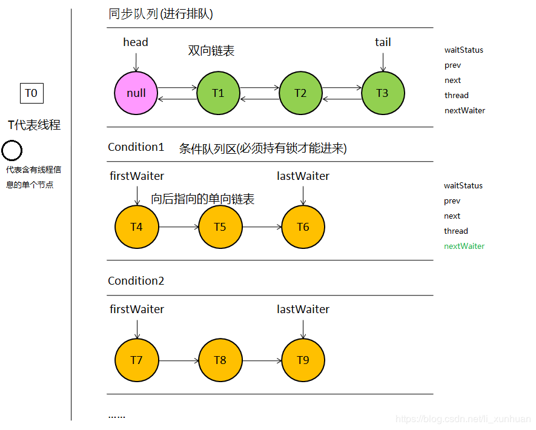

```
//同步队列的结点
static final class Node {
    
    static final Node SHARED = new Node(); //表示当前线程以共享模式持有锁
    
    static final Node EXCLUSIVE = null;    //表示当前线程以独占模式持有锁

    static final int CANCELLED =  1;       //表示当前结点已经取消获取锁
    
    static final int SIGNAL    = -1;       //表示后继结点的线程需要运行
    
    static final int CONDITION = -2;       //表示当前结点在条件队列中排队
    
    static final int PROPAGATE = -3;       //表示后继结点可以直接获取锁

    volatile int waitStatus; //表示当前结点的等待状态
   
    volatile Node prev;      //表示同步队列中的前继结点

    volatile Node next;      //表示同步队列中的后继结点  

    volatile Thread thread;  //当前结点持有的线程引用
    
    Node nextWaiter;         //表示条件队列中的后继结点,条件队列中节点没有前继节点

    //当前结点状态是否是共享模式
    final boolean isShared() {
        return nextWaiter == SHARED;
    }

    //返回当前结点的前继结点
    final Node predecessor() throws NullPointerException {
        Node p = prev;
        if (p == null) {
            throw new NullPointerException();
        } else {
            return p;
        }
    }
    
    //构造器1
    Node() {}
    
    //构造器2, 默认用这个构造器
    Node(Thread thread, Node mode) {
        //注意持有模式是赋值给nextWaiter
        this.nextWaiter = mode;
        this.thread = thread;
    }
    
    //构造器3, 只在条件队列中用到
    Node(Thread thread, int waitStatus) {
        this.waitStatus = waitStatus;
        this.thread = thread;
    }
}
```

Node代表同步队列和条件队列中的一个结点，它是AbstractQueuedSynchronizer的内部类。Node有很多属性，比如持有模式，等待状态，同步队列中的前继和后继，以及条件队列中的后继引用等等。每个节点都存储着指向一个线程对象的引用变量，所以一定程度上我们完全可以把节点理解为线程对象。

###### 理解结点的等待状态

我们还看到每个结点都有一个等待状态（节点在等待序列中，自然状态名为等待状态），这个等待状态分为CANCELLED，SIGNAL，CONDITION，PROPAGATE四种状态：

```
volatile int waitStatus; //表示当前结点的等待状态
```

- CANCELLED :当这个线程在排队过程中已经打算放弃了，它就会将自己座位上的牌子设置为CANCELLED，此状态的旧节点在新节点遍历向前找时会被清理出队列。具体见：shouldParkAfterFailedAcquire方法；
- SIGNAL :状态为SIGNAL的线程在执行完自己的代码后，退出线程前，回去唤醒下一个在等待队列中的线程/节点。只有保证前面节点的状态为SIGNAL，当前节点才能够保证被唤醒；
- CONDITION：表示该线程在条件队列中排队；
- PROPAGATE：提醒后面来的线程可以直接获取锁，这个状态只在共享模式用到，后面单独讲共享模式的时候会讲到。

这几种waitStates状态用表格表示就是：

|状态值|状态|说明|
|---|---|---|
|1|CANCELLED|取消状态|
|-1|SIGNAL|等待触发状态|
|-1|SIGNAL|等待触发状态|
|-3|PROPAGATE|状态需要向后传播(只在共享模式下使用)|

AQS中有一个**state**变量，该变量对不同的子类实现具有不同的意义，对ReentrantLock来说，它表示加锁的状态：

- 无锁时state=0，有锁时state>0；
- 第一次加锁时，将state设置为1；
- 由于ReentrantLock是可重入锁，所以持有锁的线程可以多次加锁，经过判断加锁线程就是当前持有锁的线程时（即exclusiveOwnerThread==Thread.currentThread()），即可加锁，每次加锁都会将state的值+1，state等于几，就代表当前持有锁的线程加了几次锁;
- 解锁时每解一次锁就会将state减1，state减到0后，锁就被释放掉，这时其它线程可以加锁；
- 当持有锁的线程释放锁以后，如果是等待队列获取到了加锁权限，则会在等待队列头部取出第一个线程去获取锁，获取锁的线程会被移出队列；

##### 总结

- 通过上面的介绍，我们应该猜能测出，AQS同步器其实就是主要做了三件事：

    * 管理同步状态
    * 线程的阻塞与唤醒
    * 同步队列的维护

- AQS内部维护的head和tail两个Node引用

其中head在逻辑上代表当前持有锁的线程，且head节点是不存储thread线程信息和前驱节点信息的，当唤醒后继节点后，后继节点线程会将后继节点设置为head，并将对节点内的prev和thread属性设置为null。
这两个属性是延迟初始化的，也就是说在第一次且第一个线程持有锁时，第二个线程因为获取失败，进入同步队列时会对head和tail进行初始化，也就是说在所有线程都能获取到锁时，其内部的head和tail都为null，一旦head 和 tail被初始化后，即使没有线程持有锁，其内部的head 和 tail 依然保留最后一个持有锁的线程节点！（head 和 tail都指向一个内存地址）

- 当一个线程获取锁失败而被加入到同步队列时，会用CAS来设置尾节点tail为当前线程对应的Node节点。

- AQS内部的cas操作，都是依赖Unsafe类的，自Java9之后的版本，Unsafe类被移除，取而代之的是VarHandle类。

##### 思路(代码)

AQS中获取操作和释放操作的标准形式：

```
  boolean acquire() throws InterruptedException {
    while(当前状态不允许获取操作) {
      if(需要阻塞获取请求) {
        如果当前线程不在队列中，则将气插入队列
        阻塞当前线程
      }
      else
        返回失败
    }
    可能更新同步器的状态
    如果线程位于队列中，则将其移出队列
    返回成功
  }

---------------------------------------------------------------------------------------
---------------------------------------------------------------------------------------

  void release() {
    更新同步器的状态
    if (新的状态允许某个被阻塞的线程获取成功)
      接触队列中一个或多个线程的阻塞状态
  }
```

###### 独占锁实现思路

**获取锁：**

```
    /**
     * 获取独占锁，忽略中断。
     * 首先尝试获取锁，如果成功，则返回true；否则会把当前线程包装成Node插入到队列中，在队列中会检测是否为head的直接后继，并尝试获取锁,
     * 如果获取失败，则会通过LockSupport阻塞当前线程，直至被释放锁的线程唤醒或者被中断，随后再次尝试获取锁，如此反复。被唤醒后继续之前的代码执行
     */
    public final void acquire(int arg) {
        if (!tryAcquire(arg) && acquireQueued(addWaiter(Node.EXCLUSIVE), arg))
            selfInterrupt();
    }
    ---------------------------------------------------------------------------------------
    其中tryAcquire()方法需要由子类实现，ReentrantLock通过覆写这个方法实现了公平锁和非公平锁
    ---------------------------------------------------------------------------------------

    /**
     * 在同步队列中插入节点。
     */
    private Node addWaiter(Node mode) {
        Node node = new Node(Thread.currentThread(), mode);
        Node pred = tail;
        // 判断尾节点是否为null
        if (pred != null) {
            node.prev = pred;
            // 通过CAS在队尾插入当前节点
            if (compareAndSetTail(pred, node)) {
                pred.next = node;
                return node;
            }
        }
        // 为null 将节点插入队列，必要时进行初始化
        enq(node);
        return node;
    }
    
    /**
     * 通过无限循环和CAS操作在队列中插入一个节点成功后返回。
     * 将节点插入队列，必要时进行初始化
     */
    private Node enq(final Node node) {
        for (;;) {
            Node t = tail;
            // 初始化head和tail
            if (t == null) {
                if (compareAndSetHead(new Node()))
                    tail = head;
            } else {
                node.prev = t;
                /* CAS设置tail为node
                 * 表面上看是把老tail的next连接到node。
                 * 如果同步队列head节点和tail节点刚刚被这个线程初始化，实际上也把head的next也连接到了node，而老tail属性被node覆盖了。
                 * 反之则是，把老tail的next连接到node，head并没有与node产生连接，这样就形成了链表
                 */
                if (compareAndSetTail(t, node)) {
                    t.next = node;
                    return t;
                }
            }
        }
    }

    /**
     * 在队列中的节点通过此方法获取锁，忽略中断。
     * 这个方法很重要，如果上述没有获取到锁，将线程包装成Node节点加入到同步队列的尾节点，然后看代码里的注释
     */
    final boolean acquireQueued(final Node node, int arg) {
        boolean failed = true;
        try {
            boolean interrupted = false;
            for (;;) {
                final Node p = node.predecessor();
                /*
                 * 检测当前节点前驱是否head，这是试获取锁。
                 * 如果是的话，则调用tryAcquire尝试获取锁,
                 * 成功，则将head置为当前节点。原head节点的next被置为null等待垃圾回收
                 */
                if (p == head && tryAcquire(arg)) {
                    setHead(node);
                    p.next = null; // help GC
                    failed = false;
                    return interrupted;
                }
                /*
                 * 如果未成功获取锁则根据前驱节点判断是否要阻塞。
                 * 如果阻塞过程中被中断，则置interrupted标志位为true。
                 * shouldParkAfterFailedAcquire方法在前驱状态不为SIGNAL的情况下都会循环重试获取锁。
                 */
                if (shouldParkAfterFailedAcquire(p, node) &&
                    parkAndCheckInterrupt())
                    interrupted = true;
            }
        } finally {
            if (failed)
                cancelAcquire(node);
        }
    }

    /**
     * 根据前驱节点中的waitStatus来判断是否需要阻塞当前线程。
     */
    private static boolean shouldParkAfterFailedAcquire(Node pred, Node node) {
        int ws = pred.waitStatus;
        if (ws == Node.SIGNAL)
            /*
             * 前驱节点设置为SIGNAL状态，在释放锁的时候会唤醒后继节点，
             * 所以后继节点（也就是当前节点）现在可以阻塞自己。
             */
            return true;
        if (ws > 0) {
            /*
             * 前驱节点状态为取消,向前遍历，更新当前节点的前驱为往前第一个非取消节点。
             * 当前线程会之后会再次回到循环并尝试获取锁。
             */
            do {
                node.prev = pred = pred.prev;
            } while (pred.waitStatus > 0);
            pred.next = node;
        } else {
             /**
              * 等待状态为0或者PROPAGATE(-3)，设置前驱的等待状态为SIGNAL,
              * 并且之后会回到循环再次重试获取锁。
              */
            compareAndSetWaitStatus(pred, ws, Node.SIGNAL);
        }
        return false;
    }
    
    /**
     * 该方法实现某个node取消获取锁。
     */
    private void cancelAcquire(Node node) {
       if (node == null)
           return;
    
       node.thread = null;
    
       // 遍历并更新节点前驱，把node的prev指向前部第一个非取消节点。
       Node pred = node.prev;
       while (pred.waitStatus > 0)
           node.prev = pred = pred.prev;
    
       // 记录pred节点的后继为predNext，后续CAS会用到。
       Node predNext = pred.next;
    
       // 直接把当前节点的等待状态置为取消,后继节点即便也在cancel可以跨越node节点。
       node.waitStatus = Node.CANCELLED;
    
       /*
        * 如果CAS将tail从node置为pred节点了
        * 则剩下要做的事情就是尝试用CAS将pred节点的next更新为null以彻底切断pred和node的联系。
        * 这样一来就断开了pred与pred的所有后继节点，这些节点由于变得不可达，最终会被回收掉。
        * 由于node没有后继节点，所以这种情况到这里整个cancel就算是处理完毕了。
        *
        * 这里的CAS更新pred的next即使失败了也没关系，说明有其它新入队线程或者其它取消线程更新掉了。
        */
       if (node == tail && compareAndSetTail(node, pred)) {
           compareAndSetNext(pred, predNext, null);
       } else {
           // 如果node还有后继节点，这种情况要做的事情是把pred和后继非取消节点拼起来。
           int ws;
           if (pred != head &&
               ((ws = pred.waitStatus) == Node.SIGNAL ||
                (ws <= 0 && compareAndSetWaitStatus(pred, ws, Node.SIGNAL))) &&
               pred.thread != null) {
               Node next = node.next;
               /* 
                * 如果node的后继节点next非取消状态的话，则用CAS尝试把pred的后继置为node的后继节点
                * 这里if条件为false或者CAS失败都没关系，这说明可能有多个线程在取消，总归会有一个能成功的。
                */
               if (next != null && next.waitStatus <= 0)
                   compareAndSetNext(pred, predNext, next);
           } else {
               /*
                * 这时说明pred == head或者pred状态取消或者pred.thread == null
                * 在这些情况下为了保证队列的活跃性，需要去唤醒一次后继线程。
                * 举例来说pred == head完全有可能实际上目前已经没有线程持有锁了，
                * 自然就不会有释放锁唤醒后继的动作。如果不唤醒后继，队列就挂掉了。
                * 
                * 这种情况下看似由于没有更新pred的next的操作，队列中可能会留有一大把的取消节点。
                * 实际上不要紧，因为后继线程唤醒之后会走一次试获取锁的过程，
                * 失败的话会走到shouldParkAfterFailedAcquire的逻辑。
                * 那里面的if中有处理前驱节点如果为取消则维护pred/next,踢掉这些取消节点的逻辑。
                */
               unparkSuccessor(node);
           }
           
           /*
            * 取消节点的next之所以设置为自己本身而不是null,
            * 是为了方便AQS中Condition部分的isOnSyncQueue方法,
            * 判断一个原先属于条件队列的节点是否转移到了同步队列。
            *
            * 因为同步队列中会用到节点的next域，取消节点的next也有值的话，
            * 可以断言next域有值的节点一定在同步队列上。
            *
            * 在GC层面，和设置为null具有相同的效果。
            */
           node.next = node; 
       }
    }
    
    /**
     * 唤醒后继线程。
     */
    private void unparkSuccessor(Node node) {
        int ws = node.waitStatus;
        // 尝试将node的等待状态置为0,这样的话,后继争用线程可以有机会再尝试获取一次锁。
        if (ws < 0)
            compareAndSetWaitStatus(node, ws, 0);
    
        Node s = node.next;
        /*
         * 这里的逻辑就是如果node.next存在并且状态不为取消，则直接唤醒s即可
         * 否则需要从tail开始向前找到node之后最近的非取消节点。
         *
         * 这里为什么要从tail开始向前查找也是值得琢磨的:
         * 如果读到s == null，不代表node就为tail，参考addWaiter以及enq函数中的我的注释。
         * 不妨考虑到如下场景：
         * 1. node某时刻为tail
         * 2. 有新线程通过addWaiter中的if分支或者enq方法添加自己
         * 3. compareAndSetTail成功
         * 4. 此时这里的Node s = node.next读出来s == null，但事实上node已经不是tail，它有后继了!
         */
        if (s == null || s.waitStatus > 0) {
            s = null;
            for (Node t = tail; t != null && t != node; t = t.prev)
                if (t.waitStatus <= 0)
                    s = t;
        }
        if (s != null)
            LockSupport.unpark(s.thread);
    }
```

**释放锁：**

对于释放独占锁，会调用tryRelaes(int)方法，该方法由子类实现，在完全释放掉锁后，释放掉锁的线程会将后继线程唤醒，后继线程进行锁争用。

```
    public final boolean release(int arg) {
        if (tryRelease(arg)) {
            /*
            * 此时的head节点可能有3种情况:
            * 1. null (AQS的head延迟初始化+无竞争的情况)
            * 2. 当前线程在获取锁时new出来的节点通过setHead设置的
            * 3. 由于通过tryRelease已经完全释放掉了独占锁，有新的节点在acquireQueued中获取到了独占锁，并设置了head
            * 第三种情况可以再分为两种情况：
            * （一）时刻1:线程A通过acquireQueued，持锁成功，set了head
            *      时刻2:线程B通过tryAcquire试图获取独占锁失败失败，进入acquiredQueued
            *      时刻3:线程A通过tryRelease释放了独占锁
            *      时刻4:线程B通过acquireQueued中的tryAcquire获取到了独占锁并调用setHead
            *      时刻5:线程A读到了此时的head实际上是线程B对应的node
            * （二）时刻1:线程A通过tryAcquire直接持锁成功，head为null
            *      时刻2:线程B通过tryAcquire试图获取独占锁失败失败，入队过程中初始化了head，进入acquiredQueued
            *      时刻3:线程A通过tryRelease释放了独占锁，此时线程B还未开始tryAcquire
            *      时刻4:线程A读到了此时的head实际上是线程B初始化出来的傀儡head
            * 以上这段是从网上某位大神那里摘抄的。甚是经典，这AQS的源码真真的是精妙无比啊！
            */
            Node h = head;
            if (h != null && h.waitStatus != 0)
                unparkSuccessor(h);
            return true;
        }
        return false;
    }
```

###### 获取共享锁实现思路

**获取锁：**

与获取独占锁不同，关键在于，共享锁可以被多个线程持有。
如果需要AQS实现共享锁，在实现tryAcquireShared()方法时，返回负数，表示获取失败；返回0，表示获取成功，但是后继争用线程不会成功；返回正数，表示获取成功，表示后继争用线程也可能成功。

```
    public final void acquireShared(int arg) {
        if (tryAcquireShared(arg) < 0)
            doAcquireShared(arg);
    }
    
    private void doAcquireShared(int arg) {
        final Node node = addWaiter(Node.SHARED);
        boolean failed = true;
        try {
            boolean interrupted = false;
            for (;;) {
                final Node p = node.predecessor();
                if (p == head) {
                    int r = tryAcquireShared(arg);
                    // 一旦共享获取成功，设置新的头结点，并且唤醒后继线程
                    if (r >= 0) {
                        setHeadAndPropagate(node, r);
                        p.next = null; // help GC
                        if (interrupted)
                            selfInterrupt();
                        failed = false;
                        return;
                    }
                }
                if (shouldParkAfterFailedAcquire(p, node) &&
                    parkAndCheckInterrupt())
                    interrupted = true;
            }
        } finally {
            if (failed)
                cancelAcquire(node);
        }
    }
    
    /**
     * 这个函数做的事情有两件:
     * 1. 在获取共享锁成功后，设置head节点
     * 2. 根据调用tryAcquireShared返回的状态以及节点本身的等待状态来判断是否要需要唤醒后继线程。
     */
    private void setHeadAndPropagate(Node node, int propagate) {
        // 把当前的head封闭在方法栈上，用以下面的条件检查。
        Node h = head;
        setHead(node);
        /*
         * propagate是tryAcquireShared的返回值，这是决定是否传播唤醒的依据之一。
         * h.waitStatus为SIGNAL或者PROPAGATE时也根据node的下一个节点共享来决定是否传播唤醒，
         */
        if (propagate > 0 || h == null || h.waitStatus < 0 ||
            (h = head) == null || h.waitStatus < 0) {
            Node s = node.next;
            if (s == null || s.isShared())
                doReleaseShared();
        }
    }
    
    /**
     * 这是共享锁中的核心唤醒函数，主要做的事情就是唤醒下一个线程或者设置传播状态。
     * 后继线程被唤醒后，会尝试获取共享锁，如果成功之后，则又会调用setHeadAndPropagate,将唤醒传播下去。
     * 这个函数的作用是保障在acquire和release存在竞争的情况下，保证队列中处于等待状态的节点能够有办法被唤醒。
     */
    private void doReleaseShared() {
        /*
         * 以下的循环做的事情就是，在队列存在后继线程的情况下，唤醒后继线程；
         * 或者由于多线程同时释放共享锁由于处在中间过程，读到head节点等待状态为0的情况下，
         * 虽然不能unparkSuccessor，但为了保证唤醒能够正确稳固传递下去，设置节点状态为PROPAGATE。
         * 这样的话获取锁的线程在执行setHeadAndPropagate时可以读到PROPAGATE，从而由获取锁的线程去释放后继等待线程。
         */
        for (;;) {
            Node h = head;
            // 如果队列中存在后继线程。
            if (h != null && h != tail) {
                int ws = h.waitStatus;
                if (ws == Node.SIGNAL) {
                    if (!compareAndSetWaitStatus(h, Node.SIGNAL, 0))
                        continue;
                    unparkSuccessor(h);
                }
                // 如果h节点的状态为0，需要设置为PROPAGATE用以保证唤醒的传播。
                else if (ws == 0 &&
                         !compareAndSetWaitStatus(h, 0, Node.PROPAGATE))
                    continue;
            }
            // 检查h是否仍然是head，如果不是的话需要再进行循环。
            if (h == head)
                break;
        }
    }
```

**释放锁：**

释放共享锁与获取共享锁的代码都使用了doReleaseShared(int)

```
    public final boolean releaseShared(int arg) {
        if (tryReleaseShared(arg)) {
            // doReleaseShared的实现上面获取共享锁已经介绍
            doReleaseShared();
            return true;
        }
        return false;
    }
```

#### ReentrantLock

基于公平锁来跟进下ReentrantLock.lock()代码

大致流程图


##### 抢锁流程

```
//这个是公平锁的lock方法。ReentraLock的内部类 FairSync类关系 FairSync extend Sync（抽象类） extends AbstractQueuedSynchronizer
//sync定义了lock抽象方法给 子类实现，FairSync的实现具体是依赖 aqs的 acquire来看下acquire方法【这是个小模版方法，具体实现还是各类自己实现】
//tryAcquire和acquireQueued都会尝试抢锁

    public final void acquire(int arg) {
        if (!tryAcquire(arg) && acquireQueued(addWaiter(Node.EXCLUSIVE), arg))
            selfInterrupt();
    }
 
//代码也比较简单，前面没有排队的就cas抢锁。如果有线程持有锁，正好那个线程就是自己statue+1
    protected final boolean tryAcquire(int acquires) {
        final Thread current = Thread.currentThread();
        int c = getState();
        //0表示没有线程持有锁
        if (c == 0) {
            //如果前面没有节点 就来一次cas 成功了 把当前线程设置成独占线程
            if (!hasQueuedPredecessors() &&
                compareAndSetState(0, acquires)) {
                setExclusiveOwnerThread(current);
                return true;
            }
        }
        //这个看持有锁的线程是否是自己，如果是的，在进一次 就是可重入的实现
        else if (current == getExclusiveOwnerThread()) {
            int nextc = c + acquires;
            if (nextc < 0)
                throw new Error("Maximum lock count exceeded");
            setState(nextc);
            return true;
        }
        return false;
    }
 
//再看下入队逻辑    
    private Node addWaiter(Node mode) {
        Node node = new Node(Thread.currentThread(), mode);
        // Try the fast path of enq; backup to full enq on failure
        Node pred = tail;
        if (pred != null) {
            node.prev = pred;
            if (compareAndSetTail(pred, node)) {
                pred.next = node;
                return node;
            }
        }
        enq(node);
        return node;
    }
 
//如果队列为空enq，看下初始化代码 注意下header节点是个空的，里面没有线程
//先初始化链表，再把自己设置成tail节点
    private Node enq(final Node node) {
        for (;;) {
            Node t = tail;
            if (t == null) { // Must initialize
                if (compareAndSetHead(new Node()))
                    tail = head;
            } else {
                node.prev = t;
                if (compareAndSetTail(t, node)) {
                    t.next = node;
                    return t;
                }
            }
        }
    }
 
//这个方法如果返回了 说明是抢到锁了 返回结果代表线程的中断状态
//第二次抢锁，前继节点是head节点 就会尝试抢一次。
//第一次抢锁成功返回false，如果第一次阻塞自己，第二次再抢锁成功 返回true
//抢锁失败，把自己的前面那个节点的waitStatue设置成-1，阻塞当前线程
final boolean acquireQueued(final Node node, int arg) {
        boolean failed = true;
        try {
            boolean interrupted = false;
            for (;;) {
                final Node p = node.predecessor();
                if (p == head && tryAcquire(arg)) {
                    setHead(node);
                    p.next = null; // help GC
                    failed = false;
                    return interrupted;
                }
 //把前继节点的signal设置成-1，同时清理阻塞队列中取消等待的节点
 //第二个函数很简单 就是park自己 同时返回中断状态
 if (shouldParkAfterFailedAcquire(p, node) && parkAndCheckInterrupt())
                    interrupted = true;
            }
        } finally {
            if (failed)
                cancelAcquire(node);
        }
    }
 
//是否需要阻塞，这个函数主要是把前面那个节点waitStatus改成-1，
//清除队列中取消抢锁的线程
//完成了上述工作才会安心的返回true 最后把自己静静的挂起来
    private static boolean shouldParkAfterFailedAcquire(Node pred, Node node) {
        int ws = pred.waitStatus;
        if (ws == Node.SIGNAL)
            return true;
        if (ws > 0) {
            do {
                node.prev = pred = pred.prev;
            } while (pred.waitStatus > 0);
            pred.next = node;
        } else {
            compareAndSetWaitStatus(pred, ws, Node.SIGNAL);
        }
        return false;
    }
 
//上面是否需要阻塞，主要就是剔除取消节点和把前面节点的waitStatue改成-1
//准备工作做好了，把自己阻塞起来 等待唤醒 [中断和释放锁的动作会释放park]
    private final boolean parkAndCheckInterrupt() {
        LockSupport.park(this);
        return Thread.interrupted();
    }
```

##### 释放锁

```
    public void unlock() {
        sync.release(1);
    }
 
    public final boolean release(int arg) {
        if (tryRelease(arg)) {
            Node h = head;
            if (h != null && h.waitStatus != 0)
                unparkSuccessor(h);
            return true;
        }
        return false;
    }
 
//判断当前线程是否是持有锁的线程，如果statue=0（代表完全释放了） 把当前支持的锁的线程设置为空
        protected final boolean tryRelease(int releases) {
            int c = getState() - releases;
            if (Thread.currentThread() != getExclusiveOwnerThread())
                throw new IllegalMonitorStateException();
            boolean free = false;
            if (c == 0) {
                free = true;
                setExclusiveOwnerThread(null);
            }
            setState(c);
            return free;
        }
 
//如果锁释放干净了，先把head的waitStatus设置为0，通知后面等待的兄弟们 起来拿锁
//拿锁有两个动作 
//如果同步队列里面第一把交椅还活着（不算header），直接唤醒这个对应的线程
//如果不存在，之前代码会经常把next=null（帮助gc），只能从tail往前遍历第一个waitStatus<=0的
//（代表没有放弃等待的节点，效率不是很高，其实同步队列一般也没那么长）
    private void unparkSuccessor(Node node) {
        int ws = node.waitStatus;
        if (ws < 0)
            compareAndSetWaitStatus(node, ws, 0);
        Node s = node.next;
        if (s == null || s.waitStatus > 0) {
            s = null;
            for (Node t = tail; t != null && t != node; t = t.prev)
                if (t.waitStatus <= 0)
                    s = t;
        }
        if (s != null)
            LockSupport.unpark(s.thread);
    }
```

##### 公平与非公平的差异

主要差异在抢锁会判断有没有前继节点，非公平直接来个cas 不上路子的操作（有两个地方会尝试直接抢锁 下面代码有标注），吞吐量会好一些，不过可能会造成之前排队中的线程产生长时间的饥饿等待。

ReeranterLock默认就是非公平

```
        final void lock() {
//第一次-先直接cas抢一次
            if (compareAndSetState(0, 1))
                setExclusiveOwnerThread(Thread.currentThread());
            else
                acquire(1);
        }
 
 
    public final void acquire(int arg) {
        if (!tryAcquire(arg) &&
            acquireQueued(addWaiter(Node.EXCLUSIVE), arg))
            selfInterrupt();
    }
 
        final boolean nonfairTryAcquire(int acquires) {
            final Thread current = Thread.currentThread();
            int c = getState();
            if (c == 0) {
//第二次-这里也不看是否是有前继节点
                if (compareAndSetState(0, acquires)) {
                    setExclusiveOwnerThread(current);
                    return true;
                }
            }
            else if (current == getExclusiveOwnerThread()) {
                int nextc = c + acquires;
                if (nextc < 0) // overflow
                    throw new Error("Maximum lock count exceeded");
                setState(nextc);
                return true;
            }
            return false;
        }
 
```

##### 条件队列

大致处理流程图

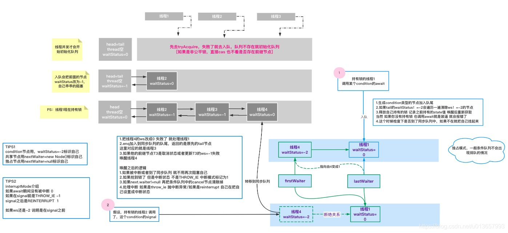

###### AWAIT|SIGNAL-细节代码

await主要是把自己加入到条件队列中，释放自己持有的锁，开始把自己挂起（一般第一次肯定不在同步队列中）

其他线程调用signal会把对应的线程唤起，正常逻辑 在同步队列中抢到锁就直接返回了

如果是被中断的，也会去抢锁，如果是在signal之后的 node一般在同步队列中，会尝试去抢锁，抢到之后设置自己中断

如果是signal之前的，最后还是会抛中断异常

```
        public final void await() throws InterruptedException {
//响应中断            
if (Thread.interrupted())
                throw new InterruptedException();
//进入条件队列（单向链表）把自己加入到队尾 同时会把所有取消的节点清除出队列
            Node node = addConditionWaiter();
//释放所有的锁，同时记录下 之前持有的锁记录[被唤醒后会重新获取锁]
//这里顺带说一句 和wait notify有点类似，如果当前线程不持有锁，直接await会直接报错 IllegalMonitorStateException
            int savedState = fullyRelease(node);
            int interruptMode = 0;
//如果没有进入阻塞队列，把自己挂起来 =====while开始
            while (!isOnSyncQueue(node)) {
//这里就告一段落了，自己进入了队尾，清理了条件队列，把自己挂起来了
下面两种情况都会打破这个循环
[1.有线程来signal操作-加入阻塞队列 前继节点取消了或者更新前继节点waitStatus=-1失败
|2.对该线程做了中断操作 可能会唤醒他]
                LockSupport.park(this);
//下面这个方法的意思是发生过中断 跳出循环
//interruptMode的逻辑如下  signal操作是个分水岭
//如果没有发生中断值是0
//如果在别的线程signal前被中断的是THROW_IE （根据waitStatus！=-2来识别的）
//如果在waitStatus=0 但是不在阻塞队列中 这个时候会一直自旋 直到进入阻塞队列 REINTERRUPT
//Thread.interrupted?(transferAfterCancelledWait(node)？THROW_IE:REINTERRUPT):0
 
//附上作者的注释 清晰明了 是signal之前中断的Throw_IE 如果是在之后REINTERRUPT
//returning THROW_IE if interrupted
//before signalled, REINTERRUPT if after signalled 0 if not interrupted.
            if ((interruptMode = checkInterruptWhileWaiting(node)) != 0)
                    break;
            }
} //===========while结束
//如果在阻塞队列中抢锁成功，状态是中断的并且不是在signal之前中断 把这个中断模式设置成1
//两种情况1-正常进入到阻塞队列中 或者在signal之后被中断的 
            if (acquireQueued(node, savedState) && interruptMode != THROW_IE)
                interruptMode = REINTERRUPT;
//这里一定都到了阻塞队列中了，和条件队列中的小兄弟断绝关系
            if (node.nextWaiter != null) // clean up if cancelled
                unlinkCancelledWaiters();
//发生了中断，这里统一处理
            if (interruptMode != 0)
                reportInterruptAfterWait(interruptMode);
        }
 
//如果await期间，signal之前被中断 抛中断异常
//如果是signal之后被中断的，自己调用一次中断
注意第二个场景 如果在signal前被中断 但是抢锁成功了也走Throw_ie逻辑
private void reportInterruptAfterWait(int interruptMode)
            throws InterruptedException {
            if (interruptMode == THROW_IE)
                throw new InterruptedException();
            else if (interruptMode == REINTERRUPT)
                selfInterrupt();
        }
```

```
//从条件队列里面唤醒节点，依此头节点到后面。成功了就返回
//具体就是把对应节点waitStatus设置成0，enq。如果前继节点取消了等待或者更新前继节点waitStatus=-1失败，换新node对应的线程
public final void signal() {
            if (!isHeldExclusively())
                throw new IllegalMonitorStateException();
            Node first = firstWaiter;
            if (first != null)
                doSignal(first);
}
 
//从第一个开始唤醒，如果失败 尝试唤醒第二个 依此类推
        private void doSignal(Node first) {
            do {
                if ( (firstWaiter = first.nextWaiter) == null)
                    lastWaiter = null;
                first.nextWaiter = null;
            } while (!transferForSignal(first) && (first = firstWaiter) != null);
        }
 
//把条件队列里面的node搞到阻塞队列中，先把waitStatus设置成0，然后加入队尾
//如果前继节点的waitStatus>0 说明取消了，或者把前节点更新成-1失败 唤醒node对应的线程
    final boolean transferForSignal(Node node) {
        if (!compareAndSetWaitStatus(node, Node.CONDITION, 0))
            return false;
        Node p = enq(node);
//这个一般是0
        int ws = p.waitStatus;
        if (ws > 0 || !compareAndSetWaitStatus(p, ws, Node.SIGNAL))
            LockSupport.unpark(node.thread);
        return true;
    }
```

#### CountDownLatch

CountDownLatch可以理解为是同步计数器，作用是允许一个或多个线程等待其他线程执行完成之后才继续执行，比如打dota、LoL或者王者荣耀时，创建了一个五人房，只有当五个玩家都准备了之后，游戏才能正式开始，否则游戏主线程会一直等待着直到玩家全部准备。在玩家没准备之前，游戏主线程会一直处于等待状态。

##### CountDownLatch的实现完整逻辑如下：

- 1、初始化CountDownLatch实际就是设置了AQS的state为计数的值

- 2、调用CountDownLatch的countDown方法时实际就是调用AQS的释放同步状态的方法，每调用一次就自减一次state值

- 3、调用await方法实际就调用AQS的共享式获取同步状态的方法acquireSharedInterruptibly(1)，这个方法的实现逻辑就调用子类Sync的tryAcquireShared方法，只有当子类Sync的tryAcquireShared方法返回大于0的值时才算获取同步状态成功，

否则就会一直在死循环中不断重试，直到tryAcquireShared方法返回大于等于0的值，而Sync的tryAcquireShared方法只有当AQS中的state值为0时才会返回1，否则都返回-1，也就相当于只有当AQS的state值为0时，await方法才会执行成功，否则

就会一直处于死循环中不断重试。

CountDownLatch实际完全依靠AQS的共享式获取和释放同步状态来实现，初始化时定义AQS的state值，每调用countDown实际就是释放一次AQS的共享式同步状态，await方法实际就是尝试获取AQS的同步状态，只有当同步状态值为0时才能获取成功。

##### CountDownLatch的实现原理

主要是通过内部类Sync来实现的，内部类Sync是AQS的子类，主要是通过重写AQS的共享式获取和释放同步状态方法来实现的。

CountDownLatch初始化时需要定义调用count的次数，然后每调用一次countDown方法都会计数减一，源码如下：

```
public CountDownLatch(int count) {
    if (count < 0) throw new IllegalArgumentException("count < 0");
    this.sync = new Sync(count);
}
 

public void countDown() {
    sync.releaseShared(1);
}
 

public void await() throws InterruptedException {
    sync.acquireSharedInterruptibly(1);
}
```

可以看出CountDownLatch的实现逻辑全部都是调用内部类Sync的对应方法实现的，Sync源码如下：

```
private static final class Sync extends AbstractQueuedSynchronizer {
        private static final long serialVersionUID = 4982264981922014374L;

        Sync(int count) {
            /**初始化设置计数值实际就是设置AQS的同步状态值*/
            setState(count);
        }

        int getCount() {
            return getState();
        }

        protected int tryAcquireShared(int acquires) {
            return (getState() == 0) ? 1 : -1;
        }

        /**CountDownLatch的countDown方法的实际执行逻辑*/
        protected boolean tryReleaseShared(int releases) {
            // Decrement count; signal when transition to zero
            for (;;) {
                int c = getState();
                /**当CountDownLatch的计数值为0时,表示倒计数已完成,则直接返回false*/
                if (c == 0)
                    return false;
                int nextc = c-1;
                /**通过CAS操作来设置同步状态自减1操作*/
                if (compareAndSetState(c, nextc))
                    /**返回当前同步状态值是否为0,只有当状态值为0时才返回true,否则返回false*/
                    return nextc == 0;
            }
        }
    }
```

#### CyclicBarrier

CyclicBarrier可以理解为一个循环同步屏障，定义一个同步屏障之后，当一组线程都全部达到同步屏障之前都会被阻塞，直到最后一个线程达到了同步屏障之后才会被打开，其他线程才可继续执行。

另外CyclicBarrier是循环同步屏障，同步屏障打开之后立马会继续计数，等待下一组线程达到同步屏障。而CountDownLatch仅单次有效。

##### CyclicBarrier的实现原理

先看下CyclicBarrier的构造方法

```
public CyclicBarrier(int parties) {
    this(parties, null);
}

public CyclicBarrier(int parties, Runnable barrierAction) {
    if (parties <= 0) throw new IllegalArgumentException();
    this.parties = parties;//同步屏障总需线程数
    this.count = parties;//当前剩余需要达到的线程数
    this.barrierCommand = barrierAction;
}
```

CyclicBarrier的构造方法没有特殊之处，主要是给两个属性parties(总线程数)、count(当前剩余线程数)进行赋值，这里需要两个值的原因是CyclicBarrier提供了重置的功能，当调用reset方法重置时就需要将count值再赋值成parties的值

再看下await方法的实现逻辑

```
public int await() throws InterruptedException, BrokenBarrierException {
    try {
        //调用私有方法dowait方法
        return dowait(false, 0L);
    } catch (TimeoutException toe) {
        throw new Error(toe); // cannot happen
    }
}

/**
    * Main barrier code, covering the various policies.
    */
private int dowait(boolean timed, long nanos)
        throws InterruptedException, BrokenBarrierException,
        TimeoutException {
    //CyclicBarrier有个ReentrantLock属性的lock
    final ReentrantLock lock = this.lock;
    //加锁操作
    lock.lock();
    try {
        final Generation g = generation;

        if (g.broken)
            throw new BrokenBarrierException();
        //响应线程中断
        if (Thread.interrupted()) {
            breakBarrier();
            throw new InterruptedException();
        }
        //count自减操作
        int index = --count;
        //判断当前还需达到同步屏障的线程数是否为0
        if (index == 0) {  // tripped
            boolean ranAction = false;
            try {
                //barrierCommand是同步屏障打开之后需要执行的Runnable对象
                final Runnable command = barrierCommand;
                if (command != null)
                    //如果Runnable对象不为空直接执行Runnable线程任务
                    command.run();
                ranAction = true;
                //本次同步屏障全部达成,唤醒所有线程并开始下一次同步屏障
                nextGeneration();
                return 0;
            } finally {
                if (!ranAction)
                    breakBarrier();
            }
        }

        // loop until tripped, broken, interrupted, or timed out
        for (;;) {
            try {
                if (!timed)
                    //调用Condition对象的await方法使当前线程进入等待状态
                    trip.await();
                else if (nanos > 0L)
                    nanos = trip.awaitNanos(nanos);
            } catch (InterruptedException ie) {
                if (g == generation && ! g.broken) {
                    breakBarrier();
                    throw ie;
                } else {
                    // We're about to finish waiting even if we had not
                    // been interrupted, so this interrupt is deemed to
                    // "belong" to subsequent execution.
                    Thread.currentThread().interrupt();
                }
            }

            if (g.broken)
                throw new BrokenBarrierException();

            if (g != generation)
                return index;

            if (timed && nanos <= 0L) {
                breakBarrier();
                throw new TimeoutException();
            }
        }
    } finally {
        lock.unlock();
    }
}

private void nextGeneration() {
    // signal completion of last generation
    //唤醒所有线程
    trip.signalAll();
    // set up next generation
    count = parties;
    generation = new Generation();
}
```

从源码可以看出CyclicBarrier的实现原理主要是通过ReentrantLock和Condition来实现的，主要实现流程如下：

- 1、创建CyclicBarrier时定义了CyclicBarrier对象需要达到的线程数count

- 2、每当一个线程执行了await方法时，需要先通过ReentrantLock进行加锁操作，然后对count进行自减操作，操作成功则判断当前count是否为0；

- 3、如果当前count不为0则调用Condition的await方法使当前线程进入等待状态；

- 4、如果当前count为0则表示同步屏障已经完全，此时调用Condition的signalAll方法唤醒之前所有等待的线程，并开启循环的下一次同步屏障功能；

- 5、唤醒其他线程之后，其他线程继续执行剩余的逻辑。

#### CountDownLatch 和 CyclicBarrier的区别？

CountDownLatch和CyclicBarrier实现的效果看似都是某个线程等待一组线程达到条件之后才可继续执行，但是实际上两者存在很多区别。

- 1、CountDownLatch阻塞的是调用await()的线程，不会阻塞达到条件的线程；CyclicBarrier阻塞的是达到同步屏障的所有线程

- 2、CountDownLatch采用倒数计数，定义数量之后，每当一个线程达到要求之后就减一；CyclicBarrier是正数计数，当数量达到定义的数量之后就打开同步屏障

- 3、CountDownLatch仅单次有效，不可重复使用；CyclicBarrir可以循环重复使用

- 4、CountDownLatch定义的数量和实际线程数无关，可以有一个线程执行多次countDown()；CyclicBarrier定义的数量和实际线程数一致，必须由多个线程都达到要求执行才行(线程调用await()方法之后就会被阻塞，想调用多次也不行的)

- 5、CountDownLatch是通过内部类Sync继承AQS来实现的；CyclicBarrier是通过重入锁ReentrantLock来实现的

- 6、CountDownLatch不可重置；CyclicBarrier可以调用reset方法进行重置

#### Semaphore

Semaphore字面意思是信号量，实际可以看作是一个限流器，初始化Semaphore时就定义好了最大通行证数量，每次调用时调用方法来消耗，业务执行完毕则释放通行证，如果通行证消耗完，再获取通行证时就需要阻塞线程直到有通行证可以获取。

Semaphore调用acquire方法获取许可证，可以同时获取多个，但是也需要对应的释放多个，否则会造成其他线程获取不到许可证的情况。一旦许可证被消耗完，那么线程就需要被阻塞，直到许可证被释放才可继续执行。

另外Semaphore还具有公平模式和非公平模式两种用法，公平模式则遵循FIFO原则先排队的线程先拿到许可证；非公平模式则自行争取。

##### Semaphore实现原理

构造方法：

```
public Semaphore(int permits) {
    //非公平模式
    sync = new NonfairSync(permits);
}

public Semaphore(int permits, boolean fair) {
    //公平模式
    sync = fair ? new FairSync(permits) : new NonfairSync(permits);
}
```

构造方法只有两个参数，一个是许可证总数量，一个是是否为公平模式；默认是非公平模式

Semaphore的实现全部是通过其内部类Sync来实现了，Sync也是AQS的子类，Semaphore的实现方式基本上和ReentrantLock的实现原理如出一辙。

###### 公平模式实现原理：

```
FairSync(int permits) {
    //初始化AQS的state的值
    super(permits);
}

protected int tryAcquireShared(int acquires) {
    for (;;) {
        //当首节点的后继节点不是当前线程时直接return -1
        if (hasQueuedPredecessors())
            return -1;
        //获取当前AQS的state值
        int available = getState();
        //将state减去需要占用的许可证数量得到剩余的许可证数量
        int remaining = available - acquires;
        /**
            * 当remaining<0时返回remaining则表示获取许可证失败,会进入AQS的死循环不停重试
            * 当remain>0时,并且CAS成功了则返回remaining,表示获取许可证成功了
            * */
        if (remaining < 0 ||
                compareAndSetState(available, remaining))
            return remaining;
    }
}
```

公平模式就是当当前线程是AQS同步队列首节点的后继节点时才有权利尝试获取共享式的同步状态，并将同步状态值减去需要占用的许可证数量，如果剩余许可证数量小于0则表示获取失败进入AQS的死循环不停重试；

如果许可证数量大于0并且CAS设置成功了，则返回剩余许可证数量表示抢占许可证成功；

###### 非公平模式实现原理：

```
static final class NonfairSync extends Sync {
    private static final long serialVersionUID = -2694183684443567898L;

    NonfairSync(int permits) {
        super(permits);
    }

    protected int tryAcquireShared(int acquires) {
        return nonfairTryAcquireShared(acquires);
    }
}

final int nonfairTryAcquireShared(int acquires) {
    for (;;) {
        int available = getState();
        int remaining = available - acquires;
        if (remaining < 0 ||
                compareAndSetState(available, remaining))
            return remaining;
    }
}
```

了解完Semaphore的公平模式和非公平模式的占有许可证的方法，再分析释放许可证的方法，不过可以先自行猜测下会是如何实现的，既然获取许可证是通过state字段不断减少来实现的，那么毫无疑问释放许可证就肯定是不断给state增加来实现的。

释放许可证源码如下：

```
/**尝试释放许可证*/
protected final boolean tryReleaseShared(int releases) {
    for (;;) {
        int current = getState();
        int next = current + releases;
        if (next < current) // overflow
            throw new Error("Maximum permit count exceeded");
        if (compareAndSetState(current, next))
            return true;
    }
}
```

### 4.ThreadLocal使用场景和内部实现

#### 使用场景

自JDK1.2的版本中就提供java.lang.ThreadLocal类，每一个ThreadLocal能够放一个线程级别的变量， 它本身能够被多个线程共享使用，并且又能够达到线程安全的目的，且绝对线程安全。

ThreadLocal包含了四个方法:

```
void set(Object value)设置当前线程的线程局部变量的值。
public Object get()该方法返回当前线程所对应的线程局部变量。
public void remove()将当前线程局部变量的值删除，其目的是为了减少内存使用，加快内存回收。
protected Object initialValue()返回该线程局部变量的初始值，该方法是一个protected的方法，目的是为了让子类覆盖而设计的。
```

三个使用场景：

##### 场景一：代替参数的显式传递

当我们在写API接口的时候，通常Controller层会接受来自前端的入参，当这个接口功能比较复杂的时候，可能我们调用的Service层内部还调用了 很多其他的很多方法，通常情况下，我们会在每个调用的方法上加上需要传递的参数。

但是如果我们将参数存入ThreadLocal中，那么就不用显式的传递参数了，而是只需要ThreadLocal中获取即可。

这个场景其实使用的比较少，一方面显式传参比较容易理解，另一方面我们可以将多个参数封装为对象去传递。

##### 场景二：全局存储用户信息

在现在的系统设计中，前后端分离已基本成为常态，分离之后如何获取用户信息就成了一件麻烦事，通常在用户登录后， 用户信息会保存在Session或者Token中。这个时候，我们如果使用常规的手段去获取用户信息会很费劲，拿Session来说，我们要在接口参数中加上HttpServletRequest对象，然后调用 getSession方法，且每一个需要用户信息的接口都要加上这个参数，才能获取Session，这样实现就很麻烦了。

在实际的系统设计中，我们肯定不会采用上面所说的这种方式，而是使用ThreadLocal，我们会选择在拦截器的业务中， 获取到保存的用户信息，然后存入ThreadLocal，那么当前线程在任何地方如果需要拿到用户信息都可以使用ThreadLocal的get()方法 (异步程序中ThreadLocal是不可靠的)

对于笔者而言，这个场景使用的比较多，当用户登录后，会将用户信息存入Token中返回前端，当用户调用需要授权的接口时，需要在header中携带 Token，然后拦截器中解析Token，获取用户信息，调用自定义的类(AuthNHolder)存入ThreadLocal中，当请求结束的时候，将ThreadLocal存储数据清空， 中间的过程无需在关注如何获取用户信息，只需要使用工具类的get方法即可。


##### 场景三：解决线程安全问题

在Spring的Web项目中，我们通常会将业务分为Controller层，Service层，Dao层， 我们都知道@Autowired注解默认使用单例模式，那么不同请求线程进来之后，由于Dao层使用单例，那么负责数据库连接的Connection也只有一个， 如果每个请求线程都去连接数据库，那么就会造成线程不安全的问题，Spring是如何解决这个问题的呢？

在Spring项目中Dao层中装配的Connection肯定是线程安全的，其解决方案就是采用ThreadLocal方法，当每个请求线程使用Connection的时候， 都会从ThreadLocal获取一次，如果为null，说明没有进行过数据库连接，连接后存入ThreadLocal中，如此一来，每一个请求线程都保存有一份 自己的Connection。于是便解决了线程安全问题

ThreadLocal在设计之初就是为解决并发问题而提供一种方案，每个线程维护一份自己的数据，达到线程隔离的效果。

#### 内部实现

ThreadLocal实现结构以及执行的过程如下图所示。


ThreadLocal的几个关键词。

- **哈希**，每个线程内部独立维护着一个ThreadLocalMap，这是一个Entry[]数组，通过对ThreadLocal进行hash（具体细节读者可以从源码了解）获取到Entry的下标
- 哈希冲突的解决办法采用了**开放地址法**，对于如图所示hash冲突的情况则下标挪一位再找（哈希冲突的三种解决办法：HashMap常用的拉链法、开放地址法、再哈希法，感兴趣的读者可以自行搜索：哈希冲突的解决办法）。ThreadLocal通常存放的数据量不会特别大，并且使用开放地址法（或叫开放寻址法）相对于拉链法而言节省了存储指针的空间
- **WeakReference弱引用**，ThreadLocalMap中对于ThreadLocal的引用使用了弱引用，弱引用的作用是当该引用是该对象的唯一一个引用时，不阻碍GC的回收，下面将展开讨论下ThreadLocal中弱引用与内存泄漏的问题

##### ThreadLocalMap中的弱引用与使用注意

ThreadLocalMap其实是一个ThreadLocal --> value的映射，具体的实现关系如下图


当线程中使用的ThreadLocal置为null的时候，ThreadLocalMap中的弱引用作为最后一个指向ThreadLocal的引用，发生GC的时候直接被回收掉，但是这时Entry中的value不会被回收
ThreadLocal的set/get/remove方法中在遇到key==null的节点时（被称为stale腐烂节点），会进行清理等处理逻辑。

- 1.如果Thread1执行完销毁了，那么ThreadLocalMap会整个销毁，也就不会有内存泄漏的问题了
- 2.如果Thread1长期存在，并且一直在创建新的ThreadLocal，并且从来没有执行过set/get/remove方法是有一定可能导致内存泄漏的
- 3.一般情况下我们会使用线程池，这样会在执行完后表现为线程结束，实际上线程只是回到了池子中等待下次调度的时候再次使用，这种情况时ThreadLocal是会被复用的，假如前面的使用场景中我们使用ThreadLocal保存了traceId，如果线程执行完没有进行回收并且下次执行的时候没有重新设置traceId的话，那么在打印日志的时候又会打印前一次的traceId，这样也会导致很多逻辑上的错误

因此，必须在使用了ThreadLocal的线程执行完后finally中调用**threadLocal.remove()**，或者如果ThreadLocal<HashMap>的话则调用threadlocal.get().remove()清空HashMap.

##### ThreadLocal源码分析

对象实例与 ThreadLocal 变量的映射关系是由线程 Thread 来维护的.

换句话说就是对象实例与 ThreadLocal 变量的映射关系是存放的一个 Map 里面（这个 Map 是个抽象的 Map 并不是 java.util 中的 Map ），而这个 Map 是 Thread 类的一个字段！而真正存放映射关系的 Map 就是 ThreadLocalMap。

```
//set 方法
public void set(T value) {
    Thread t = Thread.currentThread();
    ThreadLocalMap map = getMap(t);
    if (map != null)
        map.set(this, value);
    else
        createMap(t, value);
}

//获取线程中的ThreadLocalMap 字段！！
ThreadLocalMap getMap(Thread t) {
    return t.threadLocals;
}

//创建线程的变量
void createMap(Thread t, T firstValue) {
     t.threadLocals = new ThreadLocalMap(this, firstValue);
}
```

在 set 方法中首先获取当前线程，然后通过 getMap 获取到当前线程的 ThreadLocalMap 类型的变量 threadLocals，如果存在则直接赋值，如果不存在则给该线程创建 ThreadLocalMap 变量并赋值。赋值的时候这里的 this 就是调用变量的对象实例本身。

```

public T get() {
    Thread t = Thread.currentThread();
    ThreadLocalMap map = getMap(t);
    if (map != null) {
        ThreadLocalMap.Entry e = map.getEntry(this);
        if (e != null) {
            @SuppressWarnings("unchecked")
            T result = (T)e.value;
            return result;
        }
    }
    return setInitialValue();
}


private T setInitialValue() {
    T value = initialValue();
    Thread t = Thread.currentThread();
    ThreadLocalMap map = getMap(t);
    if (map != null)
        map.set(this, value);
    else
        createMap(t, value);
    return value;
}
```

##### ThreadLocalMap 源码分析

ThreadLocal 的底层实现都是通过 ThreadLocalMap 来实现的，我们先看下 ThreadLocalMap 的定义，然后再看下相应的 set 和 get 方法。

```
static class ThreadLocalMap {

    /**
     * The entries in this hash map extend WeakReference, using
     * its main ref field as the key (which is always a
     * ThreadLocal object).  Note that null keys (i.e. entry.get()
     * == null) mean that the key is no longer referenced, so the
     * entry can be expunged from table.  Such entries are referred to
     * as "stale entries" in the code that follows.
     */
    static class Entry extends WeakReference<ThreadLocal<?>> {
        /** The value associated with this ThreadLocal. */
        Object value;

        Entry(ThreadLocal<?> k, Object v) {
            super(k);
            value = v;
        }
    }
    
    /**
     * The table, resized as necessary.
     * table.length MUST always be a power of two.
     */
    private Entry[] table;
}
```

ThreadLocalMap 中使用 Entry[] 数组来存放对象实例与变量的关系，并且实例对象作为 key，变量作为 value 实现对应关系。并且这里的 key 采用的是对实例对象的弱引用，（因为我们这里的 key 是对象实例，每个对象实例有自己的生命周期，这里采用弱引用就可以在不影响对象实例生命周期的情况下对其引用）。

```
private void set(ThreadLocal<?> key, Object value) {

    Entry[] tab = table;
    int len = tab.length;
    //获取 hash 值，用于数组中的下标
    int i = key.threadLocalHashCode & (len-1);

    //如果数组该位置有对象则进入
    for (Entry e = tab[i];
         e != null;
         e = tab[i = nextIndex(i, len)]) {
        ThreadLocal<?> k = e.get();

        //k 相等则覆盖旧值
        if (k == key) {
            e.value = value;
            return;
        }

        //此时说明此处 Entry 的 k 中的对象实例已经被回收了，需要替换掉这个位置的 key 和 value
        if (k == null) {
            replaceStaleEntry(key, value, i);
            return;
        }
    }

    //创建 Entry 对象
    tab[i] = new Entry(key, value);
    int sz = ++size;
    if (!cleanSomeSlots(i, sz) && sz >= threshold)
        rehash();
}


//获取 Entry
private Entry getEntry(ThreadLocal<?> key) {
    int i = key.threadLocalHashCode & (table.length - 1);
    Entry e = table[i];
    if (e != null && e.get() == key)
        return e;
    else
        return getEntryAfterMiss(key, i, e);
}
```

### 5.线程及状态

##### 创建线程有三种方式：

- 继承 Thread 重写 run 方法

- 实现 Runnable 接口

- 实现 Callable 接口 （有返回值）

##### 线程有哪些状态？

- NEW（初始），新建状态，线程被创建出来，但尚未启动时的线程状态；

- RUNNABLE（就绪状态），表示可以运行的线程状态，它可能正在运行，或者是在排队等待操作系统给它分配 CPU 资源；

- BLOCKED（阻塞），阻塞等待锁的线程状态，表示处于阻塞状态的线程正在等待监视器锁，比如等待执行 synchronized 代码块或者使用 synchronized 标记的方法；

- WAITING（等待），等待状态，一个处于等待状态的线程正在等待另一个线程执行某个特定的动作，比如，一个线程调用了 Object.wait() 方法，那它就在等待另一个线程调用 Object.notify() 或 Object.notifyAll() 方法；

- TIMED_WAITING（超时等待），计时等待状态，和等待状态（WAITING）类似，它只是多了超时时间，比如调用了有超时时间设置的方法 Object.wait(long timeout) 和 Thread.join(long timeout) 等这些方法时，它才会进入此状态；

- TERMINATED，终止状态，表示线程已经执行完成。

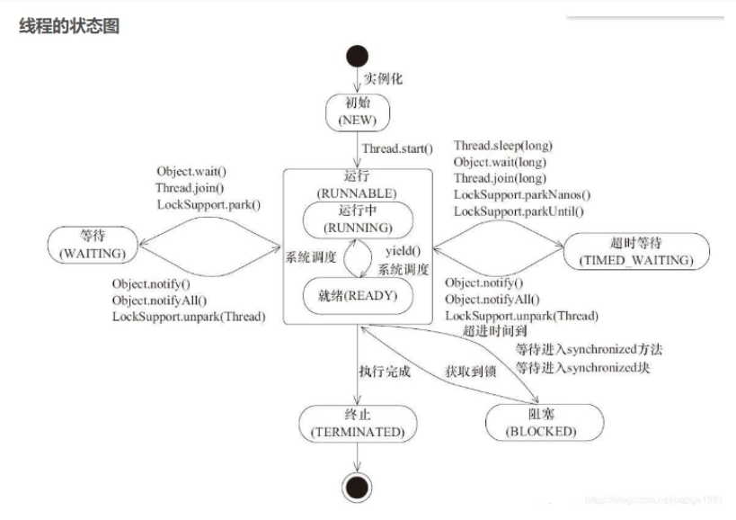

### 5.线程池的工作原理以及几个重要参数的设置

使用线程池的优势:

Java 中的线程池是运用场景最多的并发框架，几乎所有需要异步或并发执行任务的程序都可以使用线程池。

- 降低资源消耗。 通过重复利用已创建的线程降低线程创建和销毁造成的消耗。
- 提高响应速度。 当任务到达时，任务可以不需要等到线程创建就能立即执行。
- 提高线程的可管理性。 线程是稀缺资源，如果无限制地创建，不仅会消耗系统资源，还会降低系统的稳定性，使用线程池可以进行统一分配、调优和监控。但是，要做到合理利用线程池，必须对其实现原理了如指掌。

#### 线程池的实现原理

当提交一个新任务到线程池时，线程池的处理流程如下：

- 线程池判断核心线程池里的线程是否都在执行任务。如果不是，则创建一个新的工作线程来执行任务。如果核心线程池里的线程都在执行任务，则进入下个流程。

- 线程池判断工作队列是否已经满。如果工作队列没有满，则将新提交的任务存储在这个工作队列里。如果工作队列满了，则进入下个流程。

- 线程池判断线程池的线程是否都处于工作状态。如果没有，则创建一个新的工作线程来执行任务。如果已经满了，则交给饱和策略来处理这个任务。

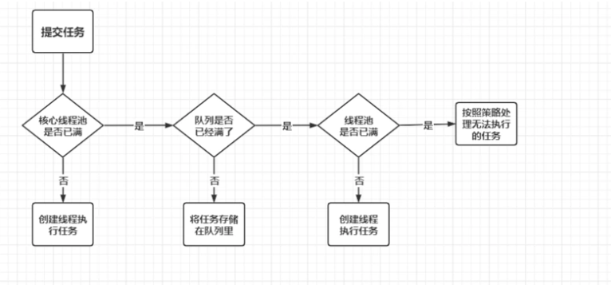

ThreadPoolExecutor执行execute()方法的示意图 如下:


ThreadPoolExecutor执行execute方法分下面 4 种情况:

- 1、如果当前运行的线程少于corePoolSize，则创建新线程来执行任务（注意，执行这一步骤需要获取全局锁）。

- 2、如果运行的线程等于或多于corePoolSize，则将任务加入BlockingQueue。

- 3、如果无法将任务加入BlockingQueue（队列已满），则创建新的线程来处理任务（注意，执行这一步骤需要获取全局锁）。

- 4、如果创建新线程将使当前运行的线程超出maximumPoolSize，任务将被拒绝，并调用RejectedExecutionHandler.rejectedExecution()方法。

ThreadPoolExecutor采取上述步骤的总体设计思路，是为了在执行execute()方法时，尽可能地避免获取全局锁（那将会是一个严重的可伸缩瓶颈）。在ThreadPoolExecutor完成预热之后（当前运行的线程数大于等于corePoolSize），几乎所有的execute()方法调用都是执行步骤 2，而步骤2不需要获取全局锁。

##### 线程池的状态有那些？

- running ：这是最正常的状态，接受新的任务，处理等待队列中的任务。

- shutdown：不接受新的任务提交，但是会继续处理等待队列中的任务。

- stop：不接受新的任务提交，不再处理等待队列中的任务，中断正在执行任务的线程。

- tidying：所有的任务都销毁了，workcount 为 0，线程池的状态再转换 tidying 状态时，会执行钩子方法 terminated()。

- terminated： terminated() 方法结束后，线程池的状态就会变成这个。

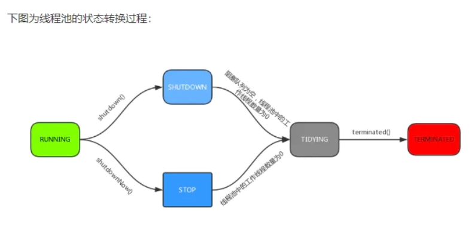

##### 线程池中 sumbit() 和 execute() 方法有什么区别？

- execute(): 只能执行 Runable 类型的任务。

- submit() 可以执行 Runable 和 Callable 类型的任务。

Callable 类型的任务可以获取执行的返回值，而 Runnable 执行无返回值。

##### 线程池创建的方式:

- newSingleThreadExecutor(): 他的特点是在于线程数目被限制位1：操作一个无界的工作队列，所以它保证了所有的任务的都是顺序执行，最多会有一个任务处于活动状态，并且不允许使用者改动线程池实例，因此可以避免其改变线程数目。

- newCachedThreadPool():它是一种用来处理大量短时间工作任务的线程，具有几个鲜明的特点，它会试图缓存线程并重用，当无缓存线程可用时，就会创建新的工作线程，如果线程闲置的时间超过 60 秒，则被终止并移除缓存；长时间闲置时，这种线程池不会消耗什么资源，其内部使用 synchronousQueue 作为工作队列。

- newFixedThreadPool(int nThreads) ：重用指定数目 nThreads 的线程，其背后使用的无界的工作队列，任何时候最后有 nThreads 个工作线程活动的，这意味着 如果任务数量超过了活动队列数目，将在工作队列中等待空闲线程出现，如果有工作线程退出，将会有新的工作线程被创建，以补足指定的数目 nThreads。

- newSingleThreadScheduledExecutor(): 创建单线程池，返回ScheduleExecutorService 可以进行定时或周期性的工作强度。

- newScheduleThreadPool(int corePoolSize): 和 newSingleThreadSceduleExecutor() 类似，创建的ScheduledExecutorService可以进行定时或周期的工作调度，区别在于单一工作线程还是工作线程。

- newWorkStrealingPool(int parallelism):这是一个经常被人忽略的线程池，Java 8 才加入这个创建方法，其内部会构建ForkJoinPool利用 work-strealing 算法 并行的处理任务，不保证处理顺序。

- ThreadPollExecutor ： 是最原始的线程池创建，上面 1-3 创建方式 都是对ThreadPoolExecutor 的封装。

上面 7 种创建方式中，前 6 种 通过Executors工厂方法创建，ThreadPoolExecutor 手动创建。

##### ThreadPollExecutor 构造方法

下面介绍下 ThreadPoolExecutor 接收 7 个参数的构造方法

```
/**

    * 用给定的初始参数创建一个新的ThreadPoolExecutor。

    */

public ThreadPoolExecutor(int corePoolSize,//线程池的核心线程数量

        int maximumPoolSize,//线程池的最大线程数

        long keepAliveTime,//当线程数大于核心线程数时，多余的空闲线程存活的最长时间

        TimeUnit unit,//时间单位

        BlockingQueue<Runnable> workQueue,//任务队列

        ThreadFactory threadFactory,//线程工厂

        RejectedExecutionHandler handler//拒绝策略

        )
```

- corePoolSize : 核心线程数线程数定义了最小可以同时运行的线程数量。

- maximumPoolSize : 当队列中存放的任务达到队列容量的时候，当前可以同时运行的线程数量变为最大线程数。

- workQueue: 当新任务来的时候会先判断当前运行的线程数量是否达到核心线程数，如果达到的话，信任就会被存放在队列中。

- keepAliveTime:线程活动保持时间,当线程池中的线程数量大于 corePoolSize 的时候，如果这时没有新的任务提交，核心线程外的线程不会立即销毁，而是会等待，直到等待的时间超过了 keepAliveTime才会被回收销毁；

- unit : keepAliveTime 参数的时间单位。

- threadFactory : 任务队列，用于保存等待执行的任务的阻塞队列。可以选择以下几个阻塞队列。

    * ArrayBlockingQueue：是一个基于数组结构的有界阻塞队列，此队列按 FIFO（先进先出）原则对元素进行排序。

    * LinkedBlockingQueue：一个基于链表结构的阻塞队列，此队列按FIFO排序元素，吞吐量通常要高于ArrayBlockingQueue。静态工厂方法Executors.newFixedThreadPool()使用了这个队列。

    * SynchronousQueue：一个不存储元素的阻塞队列。每个插入操作必须等到另一个线程调用移除操作，否则插入操作一直处于阻塞状态，吞吐量通常要高于Linked-BlockingQueue，静态工厂方法Executors.newCachedThreadPool使用了这个队列。

    * PriorityBlockingQueue：一个具有优先级的无限阻塞队列。

- handler :饱和策略(又称拒绝策略)。当队列和线程池都满了，说明线程池处于饱和状态，那么必须采取一种策略处理提交的新任务。这个策略默认情况下是AbortPolicy，表示无法处理新任务时抛出异常。在JDK 1.5 中 Java 线程池框架提供了以下4种策略。

    * AbortPolicy：直接抛出异常。

    *  CallerRunsPolicy：只用调用者所在线程来运行任务。

    * DiscardOldestPolicy：丢弃队列里最近的一个任务，并执行当前任务。

    * DiscardPolicy：不处理，丢弃掉

### 5.sleep 与 wait 区别

- 1.对于sleep()方法，我们首先要知道该方法是属于Thread 类中的。而wait()方法，则是属于Object 类中的。
- 2.sleep()方法导致了程序暂停执行指定的时间，让出cpu 该其他线程，但是他的监控状态依然保持者，当指定的时间到了又会自动恢复运行状态。
- 3.在调用sleep()方法的过程中，线程不会释放对象锁。
- 4.而当调用wait()方法的时候，线程会放弃对象锁，进入等待此对象的等待锁定池，只有针对此对象调用notify()方法后本线程才进入对象锁定池准备获取对象锁进入运行状态。

### 6.如何排查死锁及避免

死锁的本质，举个例子如果此时有一个线程 A ，按照先获持有锁 a 再获取锁 b的顺序获得锁，同时另外一个线程 B，按照先获取锁 b 再获取锁 a 的顺序获取锁。

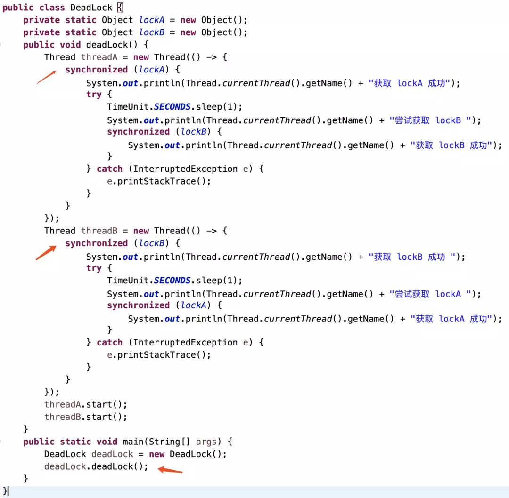

直接运行，发现主线程一直处于执行中,一直无法结束


#### 如何排查死锁

##### 1.通过jdk工具jps、jstack排查死锁问题

###### 步骤一：使用jps查找程序进行

jps：jdk提供的一个工具，可以查看到正在运行的java进程


###### 步骤二：使用jstack查看线程堆栈信息

jstack：jdk提供的一个工具，可以查看java进程中线程堆栈信息。更详细的用法见文档最后。

`$ jstack 96521`

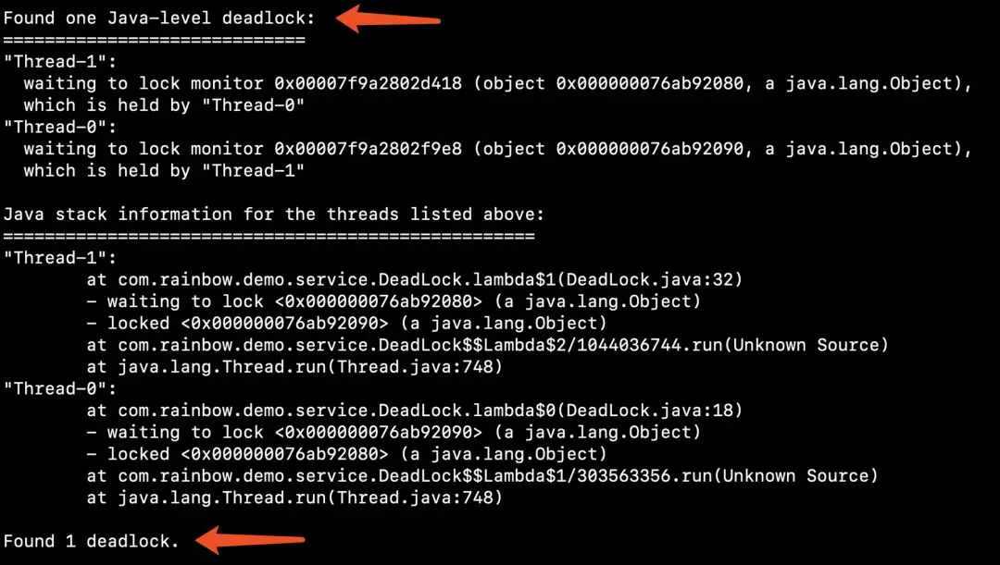

死锁的代码是在DeadLock.java的32行和18行，此时我们就可以去优化代码，解决死锁问题。

##### 2.通过jdk提供的工具jconsole排查死锁问题

jconsole：jdk提供的一个可视化的工具，方便排查程序的一些问题，如：程序内存溢出、死锁问题等等。更详细的用法见文档最后。jconsole位于jdk的bin目录中

`$ jconsole`

在jconsole窗口中查看线程堆栈信息, 点击“检测死锁”，可以看到程序死锁信息

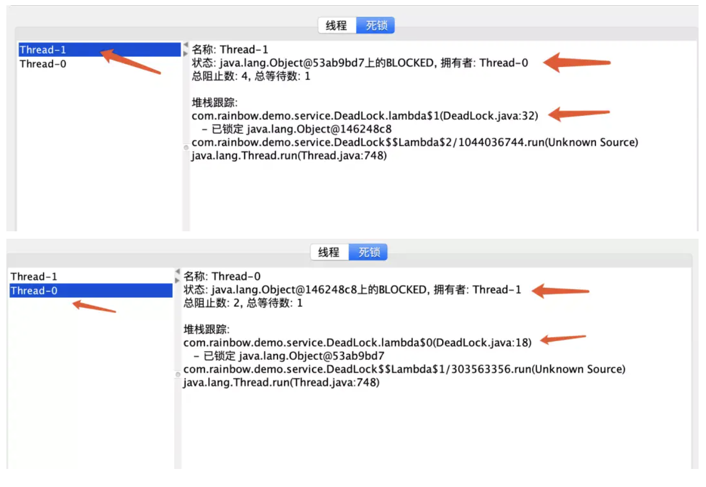

##### 3.通过jdk提供的工具VisualVM排查死锁问题

VisualVM：jdk提供的一个非常强大的排查java程序问题的一个工具，可以监控程序的性能、查看jvm配置信息、堆快照、线程堆栈信息。算是程序优化的必备工具。工具位于jdk的bin目录中。

`$ jvisualvm`

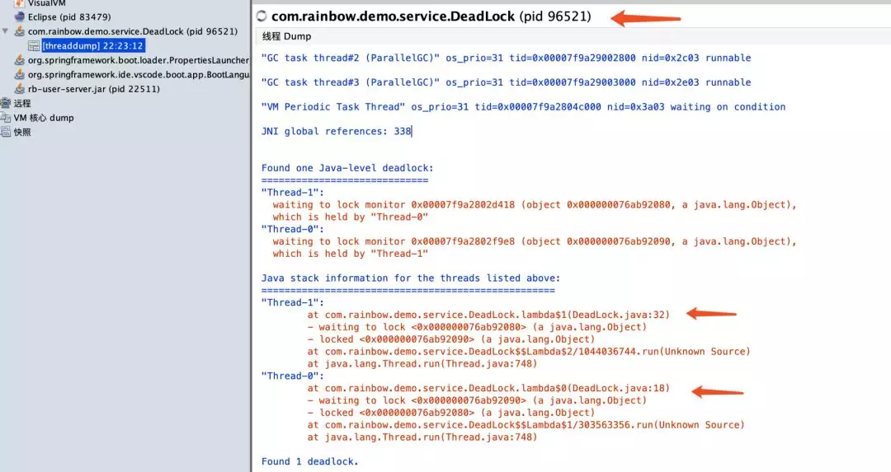

##### 4.阿里开源的问题定位神器 arthas 来定位问题。

线程堆栈快照的信息和jstack查看到的信息一样，即可发现死锁代码。

#### 如何避免死锁？

##### 1.正确的顺序获得锁
我们知道了死锁如何产生的，那么就知道该如何去预防。如果一个线程每次只能获取一个锁，那么就不会出现由于嵌套持有锁顺序导致的死锁。

如果必须获取多个锁，我们就要考虑不同线程获取锁的顺序。

上面的例子出现死锁的根本原因就是获取所的顺序是乱序的，超乎我们控制的。上面例子最理想的情况就是把业务逻辑抽离出来，把获取锁的代码放在一个公共的方法里面，让这两个线程获取锁都是从我的公共的方法里面获取。

比如前面的例子我们改成


查看打印结果，我们发现 线程0 获取成功然后线程1才能继续获取

##### 2.超时放弃

当线程获取锁超时了则放弃，这样就避免了出现死锁获取的情况。当使用synchronized关键词提供的内置锁时，只要线程没有获得锁，那么就会永远等待下去，**然而Lock接口提供了boolean tryLock(long time, TimeUnit unit) throws InterruptedException方法**，该方法可以按照固定时长等待锁，因此线程可以在获取锁超时以后，主动释放之前已经获得的所有的锁。通过这种方式，也可以很有效地避免死锁

### 7.ConcurrentHashMap高并发机制

#### 简介

HashMap是Java程序员使用频率最高的用于映射(键值对)处理的数据类型。但HashMap不是线程安全的，即在多线程并发操作HashMap时可能会发生意向不到的结果。想在并发下操作Map,主要有以下方法：

第一种：使用Hashtable线程安全类（现在已经被高效ConcurrentHashMap替代）
第二种：使用Collections.synchronizedMap方法，对方法进行加同步锁；
第三种：使用并发包中的ConcurrentHashMap类；

第一种方法是通过对Hashtable中的方法添加synchronized同步锁来保证线程安全的，第二种是通过对对象加synchronized锁来保证线程安全，相当于给整个哈希表加了一把大锁，多线程访问时候，只要有一个线程访问或操作该对象，那其他线程只能阻塞等待需要的锁被释放，在竞争激烈的多线程场景中性能就会非常差。前两种方法在多线程操作时效率都比较低下，所以不建议采用。**ConcurrentHashMap是线程安全且高效的HashMap**，JDK7中ConcurrentHashMap采用锁分段技术，首先将数据分成一段段的存储，然后给每一段数据配一把锁，当一个线程占用锁访问其中一个段数据的时候，其他段的数据也能被其他线程方法，这样我们就不用像前两种方法直接对整个HashMap加锁，采用锁分段技术来提升性能。

JDK7中ConcurrentHashMap结构如下图所示：


其中Segment是一种可重入锁（ReentrantLock），在JDK7的ConcurrentHashMap中扮演锁的角色。Segment结构和HashMap类似，是一种数组和链表结构。

JDK8中对HashMap做了改造，当冲突链表长度大于8时，会将链表转变成红黑树结构，**JDK8中ConcurrentHashMap类取消了Segment分段锁，采用CAS+sychronized来保证并发安全**，数据结构跟JDK8中的HashMap结构类似，都是数组加链表（当链表长度大于8时，链表结构转为红黑树）结构。**JDK8中的、ConcurrentHashMap synchronized只锁定当前链表或红黑二叉树的首节点，只要节点hash不冲突，就不会产生并发**，相比 JDK7中的ConcurrentHashMap效率又提升了N倍。JDK8中ConcurrentHashMap的结构如下所示：


#### JDK7中ConcurrentHashMap实现同步的方式

Segment继承自ReentrantLock，所以我们可以很方便的对每一个Segment上锁。

**读操作**：获取Key所在的Segment时，需要保证可见性，具体实现上可以使用volatile关键字，也可使用锁。但使用锁开销太大，而使用volatile时每次写操作都会让所有CPU内缓存无效，也有一定开销。ConcurrentHashMap使用如下方法保证可见性，取得最新的Segment。

```
Segment<K,V> s = (Segment<K,V>)UNSAFE.getObjectVolatile(segments, u)；
```

获取Segment中的HashEntry时也使用了类似方法：

```
HashEntry<K,V> e = (HashEntry<K,V>) UNSAFE.getObjectVolatile(tab, ((long)(((tab.length - 1) & h)) << TSHIFT) + TBASE)
```

**写操作**：并不要求同时获取所有Segment的锁，因为那样相当于锁住了整个Map。它会先获取该Key-Value对所在的Segment的锁，获取成功后就可以像操作一个普通的HashMap一样操作该Segment，并保证该Segment的安全性。同时由于其它Segment的锁并未被获取，因此理论上可支持concurrencyLevel（等于Segment的个数）个线程安全的并发读写。获取锁时，并不直接使用lock来获取，因为该方法获取锁失败时会挂起（参考可重入锁）。事实上，它使用了自旋锁，如果tryLock获取锁失败，说明锁被其它线程占用，此时通过循环再次以tryLock的方式申请锁。如果在循环过程中该Key所对应的链表头被修改，则重置retry次数。如果retry次数超过一定值，则使用lock方法申请锁。

#### JDK8中ConcurrentHashMap实现同步的方式

JDK8中ConcurrentHashMap保证线程安全主要有三个地方。

- （1）使用volatile保证当Node中的值变化时对于其他线程是可见的，以此来保证读安全
- （2）写安全（头结点不为null）：使用table数组的头结点作为synchronized的锁来保证写操作的安全。
- （3）写安全（头结点为null）：使用CAS操作来保证数据能正确的写入。

**使用volatile保证读安全**

```
    static class Node<K,V> implements Map.Entry<K,V> {
        final int hash;
        final K key;
        volatile V val;
        volatile Node<K,V> next;
    }
```

可以看到，Node中的val和next都被volatile关键字修饰。也就是说，我们改动val的值或者next的值对于其他线程是可见的，因为volatile关键字，会在读指令前插入读屏障，可以让高速缓存中的数据失效，重新从主内存加载数据。ConcurrentHashMap提供类似tabAt来读取Table数组中的元素，这里是以volatile读的方式读取table数组中的元素，主要通过Unsafe这个类来实现的，保证其他线程改变了这个数组中的值的情况下，在当前线程get的时候能拿到。

```
    static final <K,V> Node<K,V> tabAt(Node<K,V>[] tab, int i) {
        return (Node<K,V>)U.getObjectVolatile(tab, ((long)i << ASHIFT) + ABASE);
    }
```

而与之对应的，是setTabAt,这里是以volatile写的方式往数组写入元素，这样能保证修改后能对其他线程可见。

```
    static final <K,V> void setTabAt(Node<K,V>[] tab, int i, Node<K,V> v) {
        U.putObjectVolatile(tab, ((long)i << ASHIFT) + ABASE, v);
    }   
```

**写安全（头结点为null）**

当table数组的头结点为null时，使用for循环+CAS来保证线程安全，头结点为null时，可能多个线程并发写入头结点，所以需要保证线程安全。当有一个新的值需要put到ConcurrentHashMap中时，首先会遍历ConcurrentHashMap的table数组，然后根据key的hashCode来定位到需要将这个value放到数组的哪个位置。tabAt(tab, i = (n - 1) & hash))就是定位到这个数组的位置，**如果当前这个位置的Node为null，则通过CAS方式的方法写入**。所谓的CAS，即compareAndSwap，执行CAS操作的时候，将内存位置的值与预期原值比较，如果相匹配，那么处理器会自动将该位置值更新为新值，否则，处理器不做任何操作。这里就是调用casTabAt方法来实现的。

```
     static final <K,V> boolean casTabAt(Node<K,V>[] tab, int i,
                                        Node<K,V> c, Node<K,V> v) {
        return U.compareAndSwapObject(tab, ((long)i << ASHIFT) + ABASE, c, v);
    }
```

casTabAt同样是通过调用Unsafe类来实现的，调用Unsafe的compareAndSwapObject来实现，其实如果仔细去追踪这条线路，会发现其实最终调用的是cmpxchg这个CPU指令来实现的，这是一个CPU的原子指令，能保证数据的一致性问题。
Java原子类的自增操作，也是通过for循环+CAS操作的方式实现的

```
    // AtomicInteger 类的原子自增操作
    public final int getAndIncrement() {
        for (;;) {
            //获取value
            int current = get();
            int next = current + 1;
            //value值没有变，说明其他线程没有自增过,将value设置为next
            if (compareAndSet(current, next))
                return current;
            //否则说明value值已经改变，回到循环开始处，重新获取value。
        }
    }
```

**写安全（头结点不为bull）**

当头结点不为null时，对头结点使用sychronized加锁来保证线程安全：当头结点不为null时，则使用该头结点加锁，这样就能多线程去put hashCode相同的时候不会出现数据丢失的问题。synchronized是互斥锁，有且只有一个线程能够拿到这个锁，从而保证了put操作是线程安全的。

写安全总结：**头结点为null 使用for循环+cas保证线程安全；头结点不为null 使用sychronized保证线程安全.**

#### JDK7与JDK8主要区别

- （1）更小的锁粒度

JDK8中摒弃了Segment锁，直接将hash桶的头结点当做锁。旧版本的一个segment锁，保护了多个hash桶，而JDK8版本的一个锁只保护一个hash桶，由于锁的粒度变小了，写操作的并发性得到了极大的提升。 

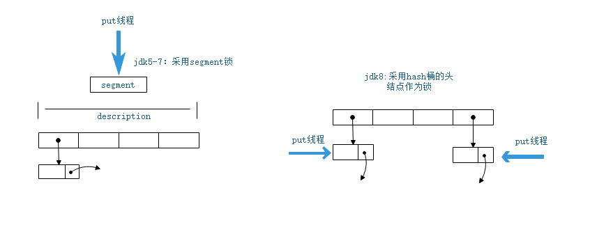

- （2）更高效的扩容

更多的扩容线程：扩容时，需要锁的保护。因此：旧版本最多可以同时扩容的线程数是segment锁的个数。而JDK8的版本，理论上最多可以同时扩容的线程数是：hash桶的个数。扩容期间，依然保证较高的并发度，旧版本的segment锁，锁定范围太大，导致扩容期间，写并发度，严重下降。而新版本的采用更加细粒度的hash桶级别锁，扩容期间，依然可以保证写操作的并发度。如下图所示：


#### ConcurrentHashMap JDK8的PUT操作

- 1.计算出 hash。（hash值的计算是通过hashCode进行spread方法的再次计算，一定是一个正数，也是后面再次计算取模得到在table中位置的依据）

- 2.判断是否需要进行初始化，也就是第一次put 的时候将容器进行初始化，**初始化调用的是 initTable 方法**。（这个方法里面利用到了上面的 sizeCtl 参数，通过**CAS** 操作来判断是不是有别的线程同时在做初始化，保证只有一个线程在做初始化的操作，没有加锁）

- 3.**f 即为当前 key 定位出的 Node**，node 的位置就是通过括号里面的 tabAt 计算的，如果为空表示当前位置，也就是数组的这个位置是个空，可以写入数据。也是利用 CAS 尝试写入，失败则自旋保证成功，可以看到这里，因为定位到的那个 Node 是个空链表，所以就直接利用了 CAS 操作（也没有加锁）

- 4.那如果不是空，就进行到下面的 else if，如果判断哈希值 == MOVED，代表数组正在扩容，那么就会进行 **helperTransfer 方法进行协助扩容**，因为没办法继续put了

- 5.否则进入下一个 else if ，这里是jdk11有，但是8是没有的，这里用到了OnlyIfAbsent变量，实现的是而 putIfAbsent，也就是在放入数据时，如果存在重复的key，那么putIfAbsent不会放入值（并不像put 那样覆盖）。

- 6.否则进入下一个 else，也就是不属于上面任何一个特殊情况的插入，需要遍历这里面的链表进行插入，可以看到利用了 **synchronized 加锁** 然后，遍历链表写入数据，那如果不是链表，是树节点，就走另一个分支去遍历插入。插入完成之后，就常规的将元素个数+1 并结束，那么+1的时候调用的是 addCount 方法，这个方法就涉及到可能会扩容，下面有详细讲解。

#### ConcurrentHashMap JDK8的多线程扩容

transfer 方法主要就是完成将扩容任务分配给多个线程去处理，根据了CPU核心数和集合 length 计算每个核一轮处理桶的个数。

然后每个线程处理的最小单位只能是一个数组的位置，这个时候扩容之后，和HashMap 一样，其实只有原位置或者 原位置+数组长度 的位置，因为仍然有可能多个线程操作之间发生哈希冲突，就用到 synchronized。

```
/**
* Moves and/or copies the nodes in each bin to new table. See
* above for explanation.
*
* transferIndex 表示转移时的下标，初始为扩容前的 length。
*
* 我们假设长度是 32
*/
private final void transfer(Node<K,V>[] tab, Node<K,V>[] nextTab) {
    int n = tab.length, stride;
    // 将 length / 8 然后除以 CPU核心数。如果得到的结果小于 16，那么就使用 16。
    // 这里的目的是让每个 CPU 处理的桶一样多，避免出现转移任务不均匀的现象，如果桶较少的话，默认一个 CPU（一个线程）处理 16 个桶
    if ((stride = (NCPU > 1) ? (n >>> 3) / NCPU : n) < MIN_TRANSFER_STRIDE)
        stride = MIN_TRANSFER_STRIDE; // subdivide range 细分范围 stridea：TODO
    // 新的 table 尚未初始化
    if (nextTab == null) {            // initiating
        try {
            // 扩容  2 倍
            Node<K,V>[] nt = (Node<K,V>[])new Node<?,?>[n << 1];
            // 更新
            nextTab = nt;
        } catch (Throwable ex) {      // try to cope with OOME
            // 扩容失败， sizeCtl 使用 int 最大值。
            sizeCtl = Integer.MAX_VALUE;
            return;// 结束
        }
        // 更新成员变量
        nextTable = nextTab;
        // 更新转移下标，就是 老的 tab 的 length
        transferIndex = n;
    }
    // 新 tab 的 length
    int nextn = nextTab.length;
    // 创建一个 fwd 节点，用于占位。当别的线程发现这个槽位中是 fwd 类型的节点，则跳过这个节点。
    ForwardingNode<K,V> fwd = new ForwardingNode<K,V>(nextTab);
    // 首次推进为 true，如果等于 true，说明需要再次推进一个下标（i--），反之，如果是 false，那么就不能推进下标，需要将当前的下标处理完毕才能继续推进
    boolean advance = true;
    // 完成状态，如果是 true，就结束此方法。
    boolean finishing = false; // to ensure sweep before committing nextTab
    // 死循环,i 表示下标，bound 表示当前线程可以处理的当前桶区间最小下标，死循环的作用是保证拷贝全部完成。
    for (int i = 0, bound = 0;;) {
        Node<K,V> f; int fh;
        // 如果当前线程可以向后推进；这个循环就是控制 i 递减。同时，每个线程都会进入这里取得自己需要转移的桶的区间        //这个循环只是用来控制每个线程每轮最多copy的桶的个数，如果只有一个线程在扩容，也是可以完成的，只是分成多轮
        while (advance) {
            int nextIndex, nextBound;
            // 对 i 减一，判断是否大于等于 bound （正常情况下，如果大于 bound 不成立，说明该线程上次领取的任务已经完成了。那么，需要在下面继续领取任务）
            // 如果对 i 减一大于等于 bound（还需要继续做任务），或者完成了，修改推进状态为 false，不能推进了。任务成功后修改推进状态为 true。
            // 通常，第一次进入循环，i-- 这个判断会无法通过，从而走下面的 nextIndex 赋值操作（获取最新的转移下标）。其余情况都是：如果可以推进，            //将 i 减一，然后修改成不可推进。如果 i 对应的桶处理成功了，改成可以推进。
            if (--i >= bound || finishing)
                advance = false;// 这里设置 false，是为了防止在没有成功处理一个桶的情况下却进行了推进
                // 这里的目的是：1. 当一个线程进入时，会选取最新的转移下标。2. 当一个线程处理完自己的区间时，如果还有剩余区间的没有别的线程处理。再次获取区间。
            else if ((nextIndex = transferIndex) <= 0) {
                // 如果小于等于0，说明没有区间了 ，i 改成 -1，推进状态变成 false，不再推进，表示，扩容结束了，当前线程可以退出了
                // 这个 -1 会在下面的 if 块里判断，从而进入完成状态判断
                i = -1;
                advance = false;// 这里设置 false，是为了防止在没有成功处理一个桶的情况下却进行了推进
            }// CAS 修改 transferIndex，即 length - 区间值，留下剩余的区间值供后面的线程使用
            else if (U.compareAndSwapInt
                    (this, TRANSFERINDEX, nextIndex,
                            nextBound = (nextIndex > stride ?
                                    nextIndex - stride : 0))) {
                bound = nextBound;// 这个值就是当前线程可以处理的最小当前区间最小下标
                i = nextIndex - 1; // 初次对i 赋值，这个就是当前线程可以处理的当前区间的最大下标
                advance = false; // 这里设置 false，是为了防止在没有成功处理一个桶的情况下却进行了推进，这样对导致漏掉某个桶。下面的 if (tabAt(tab, i) == f) 判断会出现这样的情况。
            }
        }
        // 如果 i 小于0 （不在 tab 下标内，按照上面的判断，领取最后一段区间的线程扩容结束）
        //  如果 i >= tab.length(不知道为什么这么判断)
        //  如果 i + tab.length >= nextTable.length  （不知道为什么这么判断）
        if (i < 0 || i >= n || i + n >= nextn) {
            int sc;
            if (finishing) { // 如果完成了扩容
                nextTable = null;// 删除成员变量
                table = nextTab;// 更新 table
                sizeCtl = (n << 1) - (n >>> 1); // 更新阈值
                return;// 结束方法。
            }// 如果没完成             //说明1
            if (U.compareAndSwapInt(this, SIZECTL, sc = sizeCtl, sc - 1)) {// 尝试将 sc -1. 表示这个线程结束帮助扩容了，将 sc 的低 16 位减一。
                if ((sc - 2) != resizeStamp(n) << RESIZE_STAMP_SHIFT)// 如果 sc - 2 不等于标识符左移 16 位。如果他们相等了，说明没有线程在帮助他们扩容了。也就是说，扩容结束了。
                    return;// 不相等，说明没结束，当前线程结束方法。
                finishing = advance = true;// 如果相等，扩容结束了，更新 finising 变量
                i = n; // 再次循环检查一下整张表
            }
        }
        else if ((f = tabAt(tab, i)) == null) // 获取老 tab i 下标位置的变量，如果是 null，就使用 fwd 占位。
            advance = casTabAt(tab, i, null, fwd);// 如果成功写入 fwd 占位，再次推进一个下标
        else if ((fh = f.hash) == MOVED)// 如果不是 null 且 hash 值是 MOVED。
            advance = true; // already processed // 说明别的线程已经处理过了，再次推进一个下标
        else {// 到这里，说明这个位置有实际值了，且不是占位符。对这个节点上锁。为什么上锁，防止 putVal 的时候向链表插入数据
            synchronized (f) {
                // 判断 i 下标处的桶节点是否和 f 相同
                if (tabAt(tab, i) == f) {
                    Node<K,V> ln, hn;// low, height 高位桶，低位桶
                    // 如果 f 的 hash 值大于 0 。TreeBin 的 hash 是 -2
                    if (fh >= 0) {
                        // 对老长度进行与运算（第一个操作数的的第n位于第二个操作数的第n位如果都是1，那么结果的第n为也为1，否则为0）
                        // 由于 Map 的长度都是 2 的次方（000001000 这类的数字），那么取于 length 只有 2 种结果，一种是 0，一种是1
                        //  如果是结果是0 ，Doug Lea 将其放在低位，反之放在高位，目的是将链表重新 hash，放到对应的位置上，让新的取于算法能够击中他。
                        int runBit = fh & n;
                        Node<K,V> lastRun = f; // 尾节点，且和头节点的 hash 值取于不相等
                        // 遍历这个桶                        //说明2
                        for (Node<K,V> p = f.next; p != null; p = p.next) {
                            // 取于桶中每个节点的 hash 值
                            int b = p.hash & n;
                            // 如果节点的 hash 值和首节点的 hash 值取于结果不同
                            if (b != runBit) {
                                runBit = b; // 更新 runBit，用于下面判断 lastRun 该赋值给 ln 还是 hn。
                                lastRun = p; // 这个 lastRun 保证后面的节点与自己的取于值相同，避免后面没有必要的循环
                            }
                        }
                        if (runBit == 0) {// 如果最后更新的 runBit 是 0 ，设置低位节点
                            ln = lastRun;
                            hn = null;
                        }
                        else {
                            hn = lastRun; // 如果最后更新的 runBit 是 1， 设置高位节点
                            ln = null;
                        }// 再次循环，生成两个链表，lastRun 作为停止条件，这样就是避免无谓的循环（lastRun 后面都是相同的取于结果）
                        for (Node<K,V> p = f; p != lastRun; p = p.next) {
                            int ph = p.hash; K pk = p.key; V pv = p.val;
                            // 如果与运算结果是 0，那么就还在低位
                            if ((ph & n) == 0) // 如果是0 ，那么创建低位节点
                                ln = new Node<K,V>(ph, pk, pv, ln);
                            else // 1 则创建高位
                                hn = new Node<K,V>(ph, pk, pv, hn);
                        }
                        // 其实这里类似 hashMap
                        // 设置低位链表放在新链表的 i
                        setTabAt(nextTab, i, ln);
                        // 设置高位链表，在原有长度上加 n
                        setTabAt(nextTab, i + n, hn);
                        // 将旧的链表设置成占位符
                        setTabAt(tab, i, fwd);
                        // 继续向后推进
                        advance = true;
                    }// 如果是红黑树
                    else if (f instanceof TreeBin) {
                        TreeBin<K,V> t = (TreeBin<K,V>)f;
                        TreeNode<K,V> lo = null, loTail = null;
                        TreeNode<K,V> hi = null, hiTail = null;
                        int lc = 0, hc = 0;
                        // 遍历
                        for (Node<K,V> e = t.first; e != null; e = e.next) {
                            int h = e.hash;
                            TreeNode<K,V> p = new TreeNode<K,V>
                                    (h, e.key, e.val, null, null);
                            // 和链表相同的判断，与运算 == 0 的放在低位
                            if ((h & n) == 0) {
                                if ((p.prev = loTail) == null)
                                    lo = p;
                                else
                                    loTail.next = p;
                                loTail = p;
                                ++lc;
                            } // 不是 0 的放在高位
                            else {
                                if ((p.prev = hiTail) == null)
                                    hi = p;
                                else
                                    hiTail.next = p;
                                hiTail = p;
                                ++hc;
                            }
                        }
                        // 如果树的节点数小于等于 6，那么转成链表，反之，创建一个新的树
                        ln = (lc <= UNTREEIFY_THRESHOLD) ? untreeify(lo) :
                                (hc != 0) ? new TreeBin<K,V>(lo) : t;
                        hn = (hc <= UNTREEIFY_THRESHOLD) ? untreeify(hi) :
                                (lc != 0) ? new TreeBin<K,V>(hi) : t;
                        // 低位树
                        setTabAt(nextTab, i, ln);
                        // 高位数
                        setTabAt(nextTab, i + n, hn);
                        // 旧的设置成占位符
                        setTabAt(tab, i, fwd);
                        // 继续向后推进
                        advance = true;
                    }
                }
            }
        }
    }
}
```

流程如下：

- 1.根据操作系统的 **CPU 核数和集合 length** 计算每个核一轮处理桶的个数，**最小是16**

- 2.修改 transferIndex 标志位，**每个线程领取完任务**就减去多少，比如初始大小是transferIndex = table.length = 64，每个线程领取的桶个数是16，第一个线程领取完任务后transferIndex = 48，也就是说第二个线程这时进来是从第 48 个桶开始处理，再减去16，依次类推，这就是**多线程协作处理**的原理

- 3.领取完任务之后就开始处理，如果桶为空就设置为 ForwardingNode ,如果不为空就**加锁拷贝**，只有这里用到了 **synchronized** 关键字来加锁，为了防止拷贝的过程有其他线程在put元素进来。拷贝完成之后也设置为 ForwardingNode节点。

- 4.如果某个线程分配的桶处理完了之后，再去申请，发现 transferIndex = 0，这个时候就说明所有的桶都领取完了，但是别的线程领取任务之后有没有处理完并不知道，该线程会将 sizeCtl 的值减1，然后判断是不是所有线程都退出了，如果还有线程在处理，就退出

- 5.直到最后一个线程处理完，发现 sizeCtl = rs<< RESIZE_STAMP_SHIFT 也就是标识符左移 16 位，才会将旧数组干掉，用新数组覆盖，并且会重新设置 sizeCtl 为新数组的扩容点。

以上过程总的来说分成两个部分：

- 分配任务：这部分其实很简单，就是把一个大的数组给切分，切分多个小份，然后每个线程处理其中每一小份，当然可能就只有1个或者几个线程在扩容，那就一轮一轮的处理，一轮处理一份
- 处理任务：复制部分主要有两点，第一点就是加锁，第二点就是处理完之后置为ForwardingNode来占位标识这个位置被迁移过了。

##### JDK8的协助扩容helpTransfer()方法

如果说 put 的时候发现数组正在扩容，会执行 helpTransfer 方法，也就是这个线程来帮助进行扩容。

### 8.CopyOnWriteArrayList并发容器

#### 简介

都清楚 ArrayList 并不是线程安全的，在读线程在读取 ArrayList 的时候如果有写线程在写数据的时候，基于 fast-fail 机制，会抛出ConcurrentModificationException异常，也就是说 ArrayList 并不是一个线程安全的容器，当然您可以用 Vector,或者使用 Collections 的静态方法将 ArrayList 包装成一个线程安全的类，但是这些方式都是采用 java 关键字 synchronzied 对方法进行修饰，利用独占式锁来保证线程安全的。但是，由于独占式锁在同一时刻只有一个线程能够获取到对象监视器，很显然这种方式效率并不是太高。

有很多业务往往是读多写少的，比如系统配置的信息，除了在初始进行系统配置的时候需要写入数据，其他大部分时刻其他模块之后对系统信息只需要进行读取，又比如白名单，黑名单等配置，只需要读取名单配置然后检测当前用户是否在该配置范围以内。类似的还有很多业务场景，它们都是属于读多写少的场景。如果在这种情况用到上述的方法，使用 Vector,Collections 转换的这些方式是不合理的，因为尽管多个读线程从同一个数据容器中读取数据，但是读线程对数据容器的数据并不会发生发生修改。很自然而然的我们会联想到 ReenTrantReadWriteLock（关于读写锁可以看这篇文章），通过读写分离的思想，使得读读之间不会阻塞，无疑如果一个 list 能够做到被多个读线程读取的话，性能会大大提升不少。但是，如果仅仅是将 list 通过读写锁（ReentrantReadWriteLock）进行再一次封装的话，由于读写锁的特性，当写锁被写线程获取后，读写线程都会被阻塞。如果仅仅使用读写锁对 list 进行封装的话，这里仍然存在读线程在读数据的时候被阻塞的情况，如果想 list 的读效率更高的话，这里就是我们的突破口，如果我们保证读线程无论什么时候都不被阻塞，效率岂不是会更高？

Doug Lea 大师就为我们提供 CopyOnWriteArrayList 容器可以保证线程安全，保证读读之间在任何时候都不会被阻塞，CopyOnWriteArrayList 也被广泛应用于很多业务场景之中.

#### COW(Copy-On-Write)的设计思想

回到上面所说的，如果简单的使用读写锁的话，在写锁被获取之后，读写线程被阻塞，只有当写锁被释放后读线程才有机会获取到锁从而读到最新的数据，站在**读线程的角度来看，即读线程任何时候都是获取到最新的数据，满足数据实时性**。既然我们说到要进行优化，必然有 trade-off,我们就可以**牺牲数据实时性满足数据的最终一致性即可**。而 CopyOnWriteArrayList 就是通过 Copy-On-Write(COW)，即写时复制的思想来通过延时更新的策略来实现数据的最终一致性，并且能够保证读线程间不阻塞。

COW 通俗的理解是**当我们往一个容器添加元素的时候，不直接往当前容器添加，而是先将当前容器进行 Copy，复制出一个新的容器，然后新的容器里添加元素，添加完元素之后，再将原容器的引用指向新的容器**。对 CopyOnWrite 容器进行并发的读的时候，不需要加锁，因为当前容器不会添加任何元素。所以 CopyOnWrite 容器也是一种读写分离的思想，延时更新的策略是通过在写的时候针对的是不同的数据容器来实现的，放弃数据实时性达到数据的最终一致性。

#### CopyOnWriteArrayList 的实现原理

现在我们来通过看源码的方式来理解 CopyOnWriteArrayList，实际上 CopyOnWriteArrayList 内部维护的就是一个数组

```
/** The array, accessed only via getArray/setArray. */
private transient volatile Object[] array;
```

并且该数组引用是被 volatile 修饰，注意这里仅仅是修饰的是数组引用，其中另有玄机，稍后揭晓。关于 volatile 很重要的一条性质是它能够够保证可见性。对 list 来说，我们自然而然最关心的就是读写的时候，分别为 get 和 add 方法的实现。

##### get 方法实现原理

```
public E get(int index) {
    return get(getArray(), index);
}
/**
 * Gets the array.  Non-private so as to also be accessible
 * from CopyOnWriteArraySet class.
 */
final Object[] getArray() {
    return array;
}
private E get(Object[] a, int index) {
    return (E) a[index];
}
```

可以看出来 get 方法实现非常简单，几乎就是一个“单线程”程序，没有对多线程添加任何的线程安全控制，也没有加锁也没有 CAS 操作等等，原因是，所有的读线程只是会读取数据容器中的数据，并不会进行修改。

##### add 方法实现原理

```
public boolean add(E e) {
    final ReentrantLock lock = this.lock;
	//1. 使用Lock,保证写线程在同一时刻只有一个
    lock.lock();
    try {
		//2. 获取旧数组引用
        Object[] elements = getArray();
        int len = elements.length;
		//3. 创建新的数组，并将旧数组的数据复制到新数组中
        Object[] newElements = Arrays.copyOf(elements, len + 1);
		//4. 往新数组中添加新的数据
		newElements[len] = e;
		//5. 将旧数组引用指向新的数组
        setArray(newElements);
        return true;
    } finally {
        lock.unlock();
    }
}
```

add 方法的逻辑也比较容易理解，请看上面的注释。需要注意这么几点：

- 1.采用 ReentrantLock，保证同一时刻只有一个写线程正在进行数组的复制，否则的话内存中会有多份被复制的数据；
- 2.前面说过数组引用是 volatile 修饰的，因此将旧的数组引用指向新的数组，根据 volatile 的 happens-before 规则，写线程对数组引用的修改对读线程是可见的。
- 3.由于在写数据的时候，是在新的数组中插入数据的，从而保证读写实在两个不同的数据容器中进行操作。

#### 总结

**CopyOnWriteArrayList利用ReentrantLock + volatile + 数组拷贝实现了线程安全的ArrayList。**

我们知道 COW 和读写锁都是通过读写分离的思想实现的，但两者还是有些不同，可以进行比较：

- 相同点：1. 两者都是通过读写分离的思想实现；2.读线程间是互不阻塞的

- 不同点：对读线程而言，为了实现数据实时性，在写锁被获取后，读线程会等待或者当读锁被获取后，写线程会等待，从而解决“脏读”等问题。也就是说如果使用读写锁依然会出现读线程阻塞等待的情况。而 COW 则完全放开了牺牲数据实时性而保证数据最终一致性，即读线程对数据的更新是延时感知的，因此读线程不会存在等待的情况。

为什么需要复制呢？ 如果将 array 数组设定为 volitile 的， 对 volatile 变量写 happens-before 读，读线程不是能够感知到 volatile 变量的变化。
原因是，这里 volatile 的修饰的仅仅只是数组引用，数组中的元素的修改是不能保证可见性的。因此 COW 采用的是新旧两个数据容器，通过第 5 行代码将数组引用指向新的数组。

这也是为什么 concurrentHashMap 只具有弱一致性的原因.

##### COW 的缺点

CopyOnWrite 容器有很多优点，但是同时也存在两个问题，即内存占用问题和数据一致性问题。所以在开发的时候需要注意一下。

- 内存占用问题：因为 CopyOnWrite 的写时复制机制，所以在进行写操作的时候，内存里会同时驻扎两个对 象的内存，旧的对象和新写入的对象（注意:在复制的时候只是复制容器里的引用，只是在写的时候会创建新对 象添加到新容器里，而旧容器的对象还在使用，所以有两份对象内存）。如果这些对象占用的内存比较大，比 如说 200M 左右，那么再写入 100M 数据进去，内存就会占用 300M，那么这个时候很有可能造成频繁的 minor GC 和 major GC。

- 数据一致性问题：CopyOnWrite 容器只能保证数据的最终一致性，不能保证数据的实时一致性。所以如果你希望写入的的数据，马上能读到，请不要使用 CopyOnWrite 容器。

### 9.如何判断当前线程是否持有锁

Thread 类里有一个holdsLock(obj)方法  assert Thread.holdsLock(obj);

它返回true如果当且仅当当前线程拥有某个具体对象的锁。

```
/**
     * Returns <tt>true</tt> if and only if the current thread holds the
     * monitor lock on the specified object.
     *
     * <p>This method is designed to allow a program to assert that
     * the current thread already holds a specified lock:
     * <pre>
     *     assert Thread.holdsLock(obj);
     * </pre>
     *
     * @param  obj the object on which to test lock ownership
     * @throws NullPointerException if obj is <tt>null</tt>
     * @return <tt>true</tt> if the current thread holds the monitor lock on
     *         the specified object.
     * @since 1.4
     */
    public static native boolean holdsLock(Object obj);
```

### 10.深入分析Volatile的实现原理

#### 引言

在多线程并发编程中synchronized和Volatile都扮演着重要的角色，Volatile是轻量级的synchronized，它在多处理器开发中保证了共享变量的“可见性”。可见性的意思是当一个线程修改一个共享变量时，另外一个线程能读到这个修改的值。它在某些情况下比synchronized的开销更小，本文将深入分析在硬件层面上Inter处理器是如何实现Volatile的，通过深入分析能帮助我们正确的使用Volatile变量。

#### Volatile定义

java编程语言允许线程访问共享变量，为了确保共享变量能被准确和一致的更新，线程应该确保通过排他锁单独获得这个变量。Java语言提供了volatile，在某些情况下比锁更加方便。如果一个字段被声明成volatile，java线程内存模型确保所有线程看到这个变量的值是一致的。**volatile可以保证线程可见性且提供了一定的有序性，但是无法保证原子性**。在JVM底层volatile是**采用“内存屏障”来实现**的。

即一旦一个共享变量（类的成员变量、类的静态成员变量）被volatile修饰之后，那么就具备了两层语义：

- (1）**保证了不同线程对这个变量进行操作时的可见性**，即一个线程修改了某个变量的值，这新值对其他线程来说是立即可见的。保证可见性、不保证原子性。 
- (2）**禁止进行指令重排序**。

#### 为什么要使用Volatile

Volatile变量修饰符如果使用恰当的话，它**比synchronized的使用和执行成本会更低，因为它不会引起线程上下文的切换和调度**。

#### volatile工作原理总结 **

- volatile变量的写操作将会使得当前本地缓存(线程/CPU等工作内存)失效,直接刷新数据到主内存(堆内存)中
- volatile变量的读操作将会使得当前本地缓存失效并从主内存中重新加载读取数据
- volatile的内存语义是基于内存屏障的机制实现,因此读取的数据可以保证写入的数据是最新的

#### 详谈volatile的实现机制和原理

##### 实现机制

前面讲述了源于volatile关键字的一些使用，下面我们来探讨一下volatile到底如何保证可见性和禁止指令重排序的。在x86处理器下通过工具获取JIT编译器生成的汇编指令来看看对Volatile进行写操作CPU会做什么事情。

```
Java代码: instance = new Singleton();//instance是volatile变量
汇编代码:  0x01a3de1d: movb $0x0,0x1104800(%esi);0x01a3de24: lock addl $0x0,(%esp);
```

观察加入volatile关键字和没有加入volatile关键字时所生成的汇编代码发现，加入volatile关键字时，会多出一个lock前缀指令。lock前缀指令实际上相当于一个内存屏障（也成内存栅栏），内存屏障会提供3个功能：

（1）它确保指令重排序时不会把其后面的指令排到内存屏障之前的位置，也不会把前面的指令排到内存屏障的后面；即在执行到内存屏障这句指令时，在它前面的操作已经全部完成；

（2）它会强制将对缓存的修改操作立即写入主内存；

（3）如果是写操作，它会导致其他CPU中对应的缓存行无效。

#### volatile内存语义

```
// shared.java
volatile boolean finished = false;
producer(){
    TimeUnit.SECONDS.sleep(1);
    finised = true;
    System.out.println("have finished product done ....");
}
consumer(){
   while (!finised){
    // nothing
  }
  System.out.println("have consume product done " + full);
}
// producer.java
// 代码仅做演示,忽略其他因素
run(){
	producer();
}
// consumer.java
run(){
	consumer();
}
```

- 代码初始化过程,将数据复制到工作内存中


- 生产者开始对数据进行写操作,基于volatile语义可以看到写操作之后是刷新到主内存中

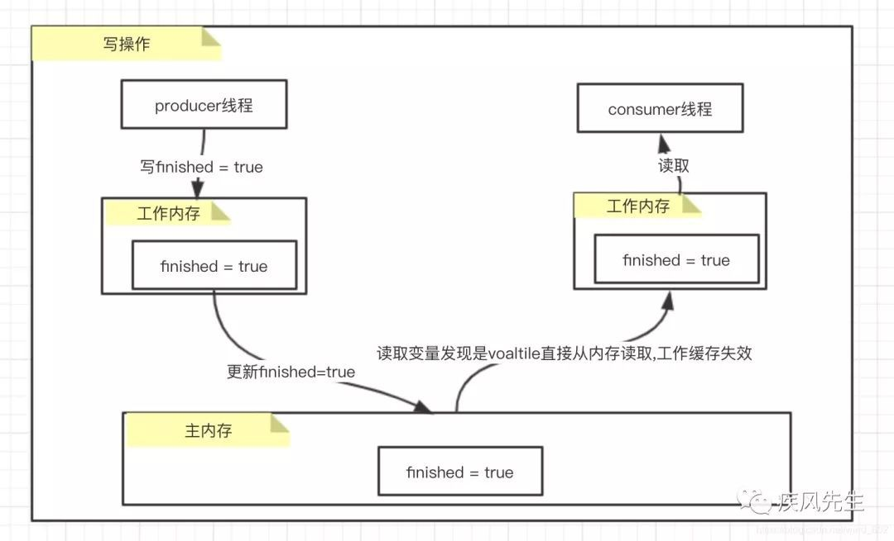

- 运行结果
    * 使用volatile修饰的消费者线程退出循环完成程序的正常执行
    * 不使用volatile修饰的消费者线程由于读取工作内存的数据将会处于不断循环中,没有退出程序

- 基于上述的内存分析,我们也许会存在一个问题
    * 消费者线程在读取的时候看到finshed是volatile修饰为什么工作缓存会失效?
    * 也就是接下来要说明的内存屏障,内存语义的实现机制

##### 实现原理

###### **可见性**

处理器为了提高处理速度，不直接和内存进行通讯，而是将系统内存的数据独到内部缓存后再进行操作，但操作完后不知什么时候会写到内存。

如果对声明了volatile变量进行写操作时，JVM会向处理器发送一条Lock前缀的指令，将这个变量所在缓存行的数据写会到系统内存。这一步确保了如果有其他线程对声明了volatile变量进行修改，则立即更新主内存中数据。

但这时候其他处理器的缓存还是旧的，所以在多处理器环境下，为了保证各个处理器缓存一致，每个处理会通过嗅探在总线上传播的数据来检查 自己的缓存是否过期，当处理器发现自己缓存行对应的内存地址被修改了，就会将当前处理器的缓存行设置成无效状态，当处理器要对这个数据进行修改操作时，会强制重新从系统内存把数据读到处理器缓存里。 这一步确保了其他线程获得的声明了volatile变量都是从主内存中获取最新的。


###### **有序性**

Lock前缀指令实际上相当于一个内存屏障（也成内存栅栏），它确保指令重排序时不会把其后面的指令排到内存屏障之前的位置，也不会把前面的指令排到内存屏障的后面；即在执行到内存屏障这句指令时，在它前面的操作已经全部完成。

首先要讲一下as-if-serial语义，不管怎么重排序，（单线程）程序的执行结果不能被改变。

为了使指令更加符合CPU的执行特性，最大限度的发挥机器的性能，提高程序的执行效率，只要程序的最终结果与它顺序化情况的结果相等，那么指令的执行顺序可以与代码逻辑顺序不一致，这个过程就叫做指令的重排序。

重排序的种类分为三种，分别是：编译器重排序，指令级并行的重排序，内存系统重排序。整个过程如下所示：

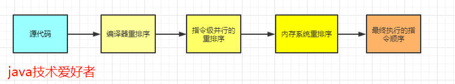

指令重排序在单线程是没有问题的，不会影响执行结果，而且还提高了性能。但是在多线程的环境下就不能保证一定不会影响执行结果了。

所以在多线程环境下，就需要禁止指令重排序。

volatile关键字禁止指令重排序有两层意思：

- 当程序执行到volatile变量的读操作或者写操作时，在其前面的操作的更改肯定全部已经进行，且结果已经对后面的操作可见，在其后面的操作肯定还没有进行。
- 在进行指令优化时，不能将在对volatile变量访问的语句放在其后面执行，也不能把volatile变量后面的语句放到其前面执行。

##### volatile禁止指令重排序的原理是什么 

首先要讲一下内存屏障，内存屏障可以分为以下几类：

- LoadLoad  屏障：对于这样的语句Load1，LoadLoad，Load2。在Load2及后续读取操作要读取的数据被访问前，保证Load1要读取的数据被读取完毕。
- StoreStore屏障：对于这样的语句Store1， StoreStore， Store2，在Store2及后续写入操作执行前，保证Store1的写入操作对其它处理器可见。
- LoadStore 屏障：对于这样的语句Load1， LoadStore，Store2，在Store2及后续写入操作被刷出前，保证Load1要读取的数据被读取完毕。
- StoreLoad 屏障：对于这样的语句Store1， StoreLoad，Load2，在Load2及后续所有读取操作执行前，保证Store1的写入对所有处理器可见。

在每个volatile读操作后插入LoadLoad屏障，在读操作后插入LoadStore屏障。

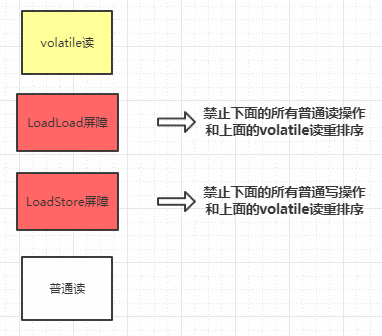

在每个volatile写操作的前面插入一个StoreStore屏障，后面插入一个SotreLoad屏障。


#### 使用volatile关键字的场景

synchronized关键字是防止多个线程同时执行一段代码，那么就会很影响程序执行效率，而volatile关键字在某些情况下性能要优于synchronized，但是要注意volatile关键字是无法替代synchronized关键字的，因为volatile关键字无法保证操作的原子性。通常来说，使用volatile必须具备以下2个条件：

- （1）对变量的写操作不依赖于当前值 
- （2）该变量没有包含在具有其他变量的不变式中

实际上，这些条件表明，可以被写入volatile变量的这些有效值独立于任何程序的状态，包括变量的当前状态。即实际就是上面的2个条件需要保证操作是原子性操作，才能保证使用volatile关键字的程序在并发时能够正确执行。下面列举Java中使用volatile的几个场景。

#### 术语定义

|术语|	英文单词|	描述|
|---|---|---|
|共享变量|		|在多个线程之间能够被共享的变量被称为共享变量。共享变量包括所有的实例变量，静态变量和数组元素。他们都被存放在堆内存中，Volatile只作用于共享变量。|
|内存屏障|	Memory Barriers	|是一组处理器指令，用于实现对内存操作的顺序限制。|
|缓冲行	|Cache line|	缓存中可以分配的最小存储单位。处理器填写缓存线时会加载整个缓存线，需要使用多个主内存读周期。|
|原子操作|	Atomic operations|	不可中断的一个或一系列操作。|
|缓存行填充|	cache line fill|	当处理器识别到从内存中读取操作数是可缓存的，处理器读取整个缓存行到适当的缓存（L1，L2，L3的或所有）|
|缓存命中|	cache hit|	如果进行高速缓存行填充操作的内存位置仍然是下次处理器访问的地址时，处理器从缓存中读取操作数，而不是从内存。|
|写命中|	write hit	|当处理器将操作数写回到一个内存缓存的区域时，它首先会检查这个缓存的内存地址是否在缓存行中，如果存在一个有效的缓存行，则处理器将这个操作数写回到缓存，而不是写回到内存，这个操作被称为写命中。|
|写缺失|	write misses the cache|	一个有效的缓存行被写入到不存在的内存区域。|

### 11.Java内存模型 及 volatile

#### 什么是JMM

JMM就是Java内存模型(java memory model)。因为在不同的硬件生产商和不同的操作系统下，内存的访问有一定的差异，所以会造成相同的代码运行在不同的系统上会出现各种问题。所以**java内存模型(JMM)屏蔽掉各种硬件和操作系统的内存访问差异，以实现让java程序在各种平台下都能达到一致的并发效果**。

Java内存模型规定**所有的变量都存储在主内存**中，包括实例变量，静态变量，但是不包括局部变量和方法参数。每个线程都有自己的工作内存，**线程的工作内存保存了该线程用到的变量和主内存的副本拷贝，线程对变量的操作都在工作内存中进行。线程不能直接读写主内存中的变量**。

不同的线程之间也无法访问对方工作内存中的变量。线程之间变量值的传递均需要通过主内存来完成。


每个线程的工作内存都是独立的，线程操作数据只能在工作内存中进行，然后刷回到主存。这是 Java 内存模型定义的线程基本工作方式。

温馨提醒一下，这里有些人会把Java内存模型误解为Java内存结构，然后答到堆，栈，GC垃圾回收，最后和面试官想问的问题相差甚远。实际上一般问到Java内存模型都是想问多线程，Java并发相关的问题。

#### JMM定义了什么

这个简单，整个Java内存模型实际上是围绕着三个特征建立起来的。分别是：原子性，可见性，有序性。这三个特征可谓是整个Java并发的基础。

##### 原子性 

原子性指的是一个操作是不可分割，不可中断的，一个线程在执行时不会被其他线程干扰。

JMM只能保证基本的原子性，如果要保证一个代码块的原子性，提供了monitorenter 和 moniterexit 两个字节码指令，也就是 synchronized 关键字。因此在 synchronized 块之间的操作都是原子性的。

##### 可见性 

可见性指当一个线程修改共享变量的值，其他线程能够立即知道被修改了。Java是利用volatile关键字来提供可见性的。当变量被volatile修饰时，这个变量被修改后会立刻刷新到主内存，当其它线程需要读取该变量时，会去主内存中读取新值。而普通变量则不能保证这一点。

除了volatile关键字之外，final和synchronized也能实现可见性。

synchronized的原理是，在执行完，进入unlock之前，必须将共享变量同步到主内存中。

final修饰的字段，一旦初始化完成，如果没有对象逸出（指对象为初始化完成就可以被别的线程使用），那么对于其他线程都是可见的。

##### 有序性 

在Java中，可以使用synchronized或者volatile保证多线程之间操作的有序性。实现原理有些区别：

volatile关键字是使用内存屏障达到禁止指令重排序，以保证有序性。

synchronized的原理是，一个线程lock之后，必须unlock后，其他线程才可以重新lock，使得被synchronized包住的代码块在多线程之间是串行执行的。

#### 八种内存交互操作

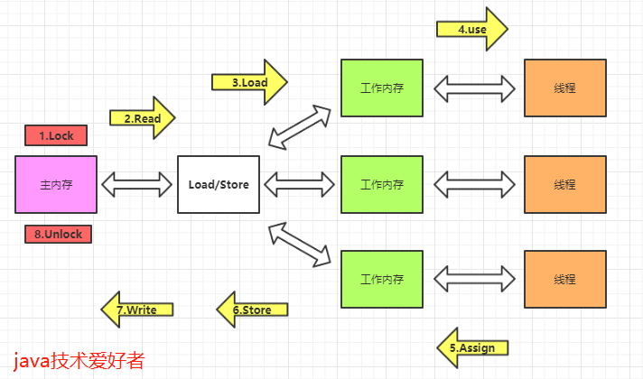

- lock(锁定)，作用于主内存中的变量，把变量标识为线程独占的状态。
- read(读取)，作用于主内存的变量，把变量的值从主内存传输到线程的工作内存中，以便下一步的load操作使用。
- load(加载)，作用于工作内存的变量，把read操作主存的变量放入到工作内存的变量副本中。
- use(使用)，作用于工作内存的变量，把工作内存中的变量传输到执行引擎，每当虚拟机遇到一个需要使用到变量的值的字节码指令时将会执行这个操作。
- assign(赋值)，作用于工作内存的变量，它把一个从执行引擎中接受到的值赋值给工作内存的变量副本中，每当虚拟机遇到一个给变量赋值的字节码指令时将会执行这个操作。
- store(存储)，作用于工作内存的变量，它把一个从工作内存中一个变量的值传送到主内存中，以便后续的write使用。
- write(写入)：作用于主内存中的变量，它把store操作从工作内存中得到的变量的值放入主内存的变量中。
- unlock(解锁)：作用于主内存的变量，它把一个处于锁定状态的变量释放出来，释放后的变量才可以被其他线程锁定。

再补充一下JMM对8种内存交互操作制定的规则吧：

- 不允许read、load、store、write操作之一单独出现，也就是read操作后必须load，store操作后必须write。
- 不允许线程丢弃他最近的assign操作，即工作内存中的变量数据改变了之后，必须告知主存。
- 不允许线程将没有assign的数据从工作内存同步到主内存。
- 一个新的变量必须在主内存中诞生，不允许工作内存直接使用一个未被初始化的变量。就是对变量实施use、store操作之前，必须经过load和assign操作。
- 一个变量同一时间只能有一个线程对其进行lock操作。多次lock之后，必须执行相同次数unlock才可以解锁。
- 如果对一个变量进行lock操作，会清空所有工作内存中此变量的值。在执行引擎使用这个变量前，必须重新load或assign操作初始化变量的值。
- 如果一个变量没有被lock，就不能对其进行unlock操作。也不能unlock一个被其他线程锁住的变量。
- 一个线程对一个变量进行unlock操作之前，必须先把此变量同步回主内存。


