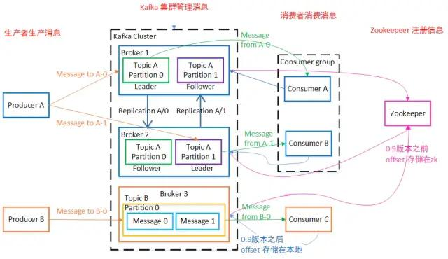
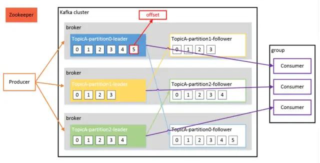

## Kafka 架构原理

Kafka 中最重要的概念，分别是 Broker、Producer、Consumer、Consumer Group、Topic、Partition、Replica、Leader、Follower.

**定义**

Kafka 是一个分布式的基于发布/订阅模式的消息队列(Message Queue)，主要应用与大数据实时处理领域。

**消息队列**

Kafka 本质上是一个 MQ(Message Queue)，使用消息队列的好处?(面试会问)

- 解耦：允许我们独立的扩展或修改队列两边的处理过程。
- 可恢复性：即使一个处理消息的进程挂掉，加入队列中的消息仍然可以在系统恢复后被处理。
- 缓冲：有助于解决生产消息和消费消息的处理速度不一致的情况。
- 灵活性&峰值处理能力：不会因为突发的超负荷的请求而完全崩溃，消息队列能够使关键组件顶住突发的访问压力。
- 异步通信：消息队列允许用户把消息放入队列但不立即处理它。

**发布/订阅模式**

一对多，生产者将消息发布到 Topic 中，有多个消费者订阅该主题，发布到 Topic 的消息会被所有订阅者消费，被消费的数据不会立即从 Topic 清除。

**架构**

Kafka 存储的消息来自任意多被称为 Producer 生产者的进程。数据从而可以被发布到不同的 Topic 主题下的不同 Partition 分区。

在一个分区内，这些消息被索引并连同时间戳存储在一起。其它被称为 Consumer 消费者的进程可以从分区订阅消息。

Kafka 运行在一个由一台或多台服务器组成的集群上，并且分区可以跨集群结点分布。

下面给出 Kafka 一些重要概念，让大家对 Kafka 有个整体的认识和感知，后面还会详细的解析每一个概念的作用以及更深入的原理：

- **Producer**： 消息生产者，向 Kafka Broker 发消息的客户端。
- **Consumer**：消息消费者，从 Kafka Broker 取消息的客户端。
- **Consumer Group**：消费者组(CG)，消费者组内每个消费者负责消费不同分区的数据，提高消费能力。一个分区只能由组内一个消费者消费，消费者组之间互不影响。所有的消费者都属于某个消费者组，即消费者组是逻辑上的一个订阅者。
- **Broker**：一台 Kafka 机器就是一个 Broker。一个集群由多个 Broker 组成。一个 Broker 可以容纳多个 Topic。
- **Topic**：可以理解为一个队列，Topic 将消息分类，生产者和消费者面向的是同一个 Topic。
- **Partition**：为了实现扩展性，提高并发能力，一个非常大的 Topic 可以分布到多个 Broker (即服务器)上，一个 Topic 可以分为多个 Partition，每个 Partition 是一个 有序的队列。
- **Replica**：副本，为实现备份的功能，保证集群中的某个节点发生故障时，该节点上的 Partition 数据不丢失，且 Kafka 仍然能够继续工作，Kafka 提供了副本机制，一个 Topic 的每个分区都有若干个副本，一个 Leader 和若干个 Follower。
- **Leader**：每个分区多个副本的“主”副本，生产者发送数据的对象，以及消费者消费数据的对象，都是 Leader。
- **Follower**：每个分区多个副本的“从”副本，实时从 Leader 中同步数据，保持和 Leader 数据的同步。Leader 发生故障时，某个 Follower 还会成为新的 Leader。
- **Offset**：消费者消费的位置信息，监控数据消费到什么位置，当消费者挂掉再重新恢复的时候，可以从消费位置继续消费。
- **Zookeeper**：Kafka 集群能够正常工作，需要依赖于 Zookeeper，Zookeeper 帮助 Kafka 存储和管理集群信息。

**工作流程**

Kafka 是一个分布式流平台，这到底是什么意思?

- 发布和订阅记录流，类似于消息队列或企业消息传递系统。
- 以容错的持久方式存储记录流。
- 处理记录流。

Kafka 中消息是以 Topic 进行分类的，生产者生产消息，消费者消费消息，面向的都是同一个 Topic。

Topic 是逻辑上的概念，而 Partition 是物理上的概念，每个 Partition 对应于一个 log 文件，该 log 文件中存储的就是 Producer 生产的数据。

Producer 生产的数据会不断追加到该 log 文件末端，且每条数据都有自己的 Offset。

消费者组中的每个消费者，都会实时记录自己消费到了哪个 Offset，以便出错恢复时，从上次的位置继续消费。

**存储机制**

由于生产者生产的消息会不断追加到 log 文件末尾，为防止 log 文件过大导致数据定位效率低下，Kafka 采取了分片和索引机制。

它将每个 Partition 分为多个 Segment，每个 Segment 对应两个文件：“.index” 索引文件和 “.log” 数据文件。

这些文件位于同一文件下，该文件夹的命名规则为：topic 名-分区号

index 和 log 文件以当前 Segment 的第一条消息的 Offset 命名。

“.index” 文件存储大量的索引信息，“.log” 文件存储大量的数据，索引文件中的元数据指向对应数据文件中 Message 的物理偏移量。

**For more details:** 

Refer to https://developer.51cto.com/art/202003/611798.htm

