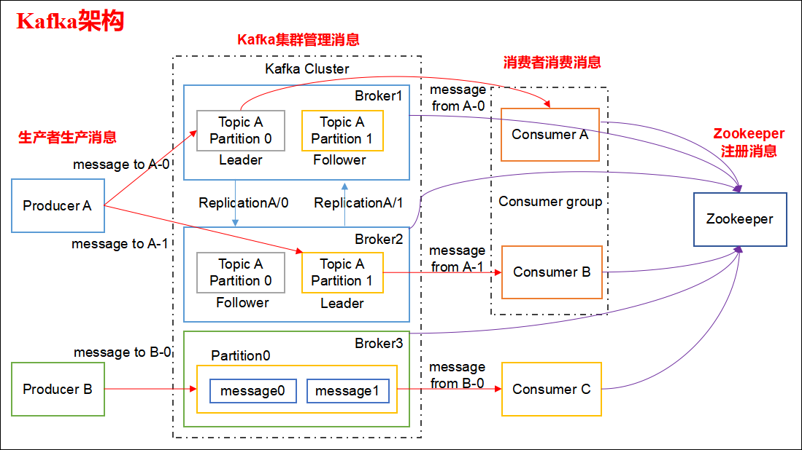
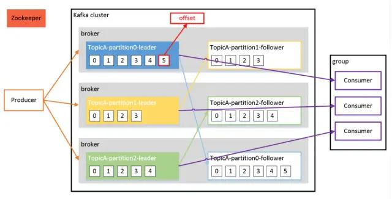

## Kafka

### 1.Kafka都有哪些特点

- 高吞吐量、低延迟：kafka每秒可以处理几十万条消息，它的延迟最低只有几毫秒，每个topic可以分多个partition, consumer group 对partition进行consume操作。
- 可扩展性：kafka集群支持热扩展
- 持久性、可靠性：消息被持久化到本地磁盘，并且支持数据备份防止数据丢失
- 容错性：允许集群中节点失败（若副本数量为n,则允许n-1个节点失败）
- 高并发：支持数千个客户端同时读写

### 2.Kafka 如何做到高吞吐、低延迟的

这里提下 Kafka 写数据的大致方式：先写操作系统的页缓存（Page Cache）,然后由操作系统自行决定何时刷到磁盘。

因此 Kafka 达到高吞吐、低延迟的原因主要有以下 4 点：

- 页缓存是在内存中分配的，所以消息写入的速度很快。
- Kafka 不必和底层的文件系统进行交互，所有繁琐的 I/O 操作都由操作系统来处理。
- Kafka 采用追加写的方式，避免了磁盘随机写操作。
- 使用以 sendfile 为代表的零拷贝技术提高了读取数据的效率。

PS: 使用页缓存而非堆内存还有一个好处，就是当 Kafka broker 的进程崩溃时，堆内存的数据会丢失，但是页缓存的数据依然存在，重启 Kafka broker 后可以继续提供服务。

### 3.在哪些场景下会选择 Kafka

- 日志收集：一个公司可以用Kafka可以收集各种服务的log，通过kafka以统一接口服务的方式开放给各种consumer，例如hadoop、HBase、Solr等。
- 消息系统：解耦和生产者和消费者、缓存消息等。
- 用户活动跟踪：Kafka经常被用来记录web用户或者app用户的各种活动，如浏览网页、搜索、点击等活动，这些活动信息被各个服务器发布到kafka的topic中，然后订阅者通过订阅这些topic来做实时的监控分析，或者装载到hadoop、数据仓库中做离线分析和挖掘。
- 运营指标：Kafka也经常用来记录运营监控数据。包括收集各种分布式应用的数据，生产各种操作的集中反馈，比如报警和报告。
- 流式处理：比如spark streaming和 Flink

### 4.Kafka 的设计架构

Kafka 存储的消息来自任意多被称为 Producer 生产者的进程。数据从而可以被发布到不同的 Topic 主题下的不同 Partition 分区。

在一个分区内，这些消息被索引并连同时间戳存储在一起。其它被称为 Consumer 消费者的进程可以从分区订阅消息。

Kafka 运行在一个由一台或多台服务器组成的集群上，并且分区可以跨集群结点分布。

下面给出 Kafka 一些重要概念，让大家对 Kafka 有个整体的认识和感知，后面还会详细的解析每一个概念的作用以及更深入的原理：

Kafka 架构分为以下几个部分:

- **Producer**： 消息生产者，向 Kafka Broker 发消息的客户端。
- **Consumer**：消息消费者，从 Kafka Broker 取消息的客户端。
- **Consumer Group**：这是 kafka 用来实现一个 topic 消息的广播（发给所有的 consumer）和单播（发给任意一个 consumer）的手段。一个 topic 可以有多个 Consumer Group。
- **Broker**：一台 Kafka 机器就是一个 Broker。一个集群由多个 Broker 组成。一个 Broker 可以容纳多个 Topic。
- **Topic**：可以理解为一个队列，Topic 将消息分类，生产者和消费者面向的是同一个 Topic。
- **Partition**：为了实现扩展性，一个非常大的 topic 可以分布到多个 broker上，每个 partition 是一个有序的队列。partition 中的每条消息都会被分配一个有序的id（offset）。将消息发给 consumer，kafka 只保证按一个 partition 中的消息的顺序，不保证一个 topic 的整体（多个 partition 间）的顺序。
- **Replica**：副本，为实现备份的功能，保证集群中的某个节点发生故障时，该节点上的 Partition 数据不丢失，且 Kafka 仍然能够继续工作，Kafka 提供了副本机制，一个 Topic 的每个分区都有若干个副本，一个 Leader 和若干个 Follower。
- **Leader**：每个分区多个副本的“主”副本，生产者发送数据的对象，以及消费者消费数据的对象，都是 Leader。
- **Follower**：每个分区多个副本的“从”副本，实时从 Leader 中同步数据，保持和 Leader 数据的同步。Leader 发生故障时，某个 Follower 还会成为新的 Leader。
- **Offset**：消费者消费的位置信息，监控数据消费到什么位置，当消费者挂掉再重新恢复的时候，可以从消费位置继续消费。kafka 的存储文件都是按照 offset.kafka 来命名，用 offset 做名字的好处是方便查找。例如你想找位于 2049 的位置，只要找到 2048.kafka 的文件即可。当然 the first offset 就是 00000000000.kafka
- **Zookeeper**：Kafka 集群能够正常工作，需要依赖于 Zookeeper，Zookeeper 帮助 Kafka 存储和管理集群信息。

### 5.Kafka 的 工作流程

Kafka 是一个分布式流平台，这到底是什么意思?

- 发布和订阅记录流，类似于消息队列或企业消息传递系统。
- 以容错的持久方式存储记录流。
- 处理记录流。

Kafka 中消息是以 Topic 进行分类的，生产者生产消息，消费者消费消息，面向的都是同一个 Topic。

Topic 是逻辑上的概念，而 Partition 是物理上的概念，每个 Partition 对应于一个 log 文件，该 log 文件中存储的就是 Producer 生产的数据。

Producer 生产的数据会不断追加到该 log 文件末端，且每条数据都有自己的 Offset。

消费者组中的每个消费者，都会实时记录自己消费到了哪个 Offset，以便出错恢复时，从上次的位置继续消费。

#### producer 工作流程

- ① 封装为 ProducerRecord 实例
- ② 序列化
- ③ 由 partitioner 确定具体分区
- ④ 发送到内存缓冲区
- ⑤ 由 producer 的一个专属 I/O 线程去取消息，并将其封装到一个批次 ，发送给对应分区的 kafka broker
- ⑥ leader 将消息写入本地 log
- ⑦ followers 从 leader pull 消息，写入本地 log 后 leader 发送 ACK
- ⑧ leader 收到所有 ISR 中的 replica 的 ACK 后，增加 HW（high watermark，最后 commit 的 offset） 并向 producer 发送 ACK

#### consumer 工作流程

- ① 连接 ZK 集群，拿到对应 topic 的 partition 信息和 partition 的 leader 的相关信息
- ② 连接到对应 leader 对应的 broker
- ③ consumer 将自己保存的 offset 发送给 leader
- ④ leader 根据 offset 等信息定位到 segment（索引文件和日志文件）
- ⑤ 根据索引文件中的内容，定位到日志文件中该偏移量对应的开始位置读取相应长度的数据并返回给 consumer

### 6.Kafka存储机制

由于生产者生产的消息会不断追加到 log 文件末尾，为防止 log 文件过大导致数据定位效率低下，Kafka 采取了分片和索引机制。

它将每个 Partition 分为多个 Segment，每个 Segment 对应两个文件：“.index” 索引文件和 “.log” 数据文件。

这些文件位于同一文件下，该文件夹的命名规则为：topic 名-分区号

index 和 log 文件以当前 Segment 的第一条消息的 Offset 命名。

“.index” 文件存储大量的索引信息，“.log” 文件存储大量的数据，索引文件中的元数据指向对应数据文件中 Message 的物理偏移量。

### 7.offset存储方式

- 1、在kafka 0.9版本之后，kafka为了降低zookeeper的io读写，减少network data transfer，也自己实现了在kafka server上存储consumer，topic，partitions，offset信息将消费的 offset 迁入到了 Kafka 一个名为**__consumer_offsets** 的Topic中。
- 2、将消费的 offset 存放在 Zookeeper 集群中。
- 3、将offset存放至第三方存储，如Redis, 为了严格实现不重复消费

### 8.Kafka 分区Partition的目的

分区对于 Kafka 集群的好处是：实现负载均衡。分区对于消费者来说，可以提高并发度，提高效率。

#### 如何选择 Partition 的数量

- 在创建 Topic 的时候可以指定 Partiton 数量，也可以在创建完后手动修改。**但 Partiton 数量只能增加不能减少**。中途增加 Partiton 会导致各个 Partiton 之间数据量的不平等。
- Partition 的数量直接决定了该 Topic 的并发处理能力。但也并不是越多越好。Partition 的数量对消息延迟性会产生影响。
- 一般建议选择 **Broker Num * Consumer Num** ，这样平均每个 Consumer 会同时读取 Broker 数目个 Partition ， 这些 Partition 压力可以平摊到每台 Broker 上。

### 9.Kafka 是如何做到消息的有序性

kafka 中的每个 partition 中的消息在写入时都是有序的，而且单独一个 partition 只能由一个消费者去消费，可以在里面保证消息的顺序性。但是分区之间的消息是不保证有序的。

### 10.kafka中consumer group 是什么概念

同样是逻辑上的概念，是Kafka实现单播和广播两种消息模型的手段。c
同一个topic的数据，会广播给不同的group； 
同一个group中的worker，只有一个worker能拿到这个数据。 
换句话说，对于同一个topic，每个group都可以拿到同样的所有数据，但是数据进入group后只能被其中的一个worker消费。group内的worker可以使用多线程或多进程来实现，也可以将进程分散在多台机器上，worker的数量通常不超过partition的数量，且二者最好保持整数倍关系，因为Kafka在设计时假定了一个partition只能被一个worker消费（同一group内）。

### 11.ZooKeeper在Kafka中的作用是什么

Apache Kafka是一个使用Zookeeper构建的分布式系统。虽然，Zookeeper的主要作用是在集群中的不同节点之间建立协调。但是，如果任何节点失败，我们还使用Zookeeper从先前提交的偏移量中恢复，因为它做周期性提交偏移量工作。

- 管理 broker 与 consumer 的动态加入与离开。（Producer 不需要管理，随便一台计算机都可以作为Producer 向 Kakfa Broker 发消息）
- 触发负载均衡，当 broker 或 consumer 加入或离开时会触发负载均衡算法，使得一个 consumer group 内的多个 consumer 的消费负载平衡。（因为一个 comsumer 消费一个或多个partition，一个 partition 只能被一个 consumer 消费）
- 维护消费关系及每个 partition 的消费信息。

### 12.重要参数有哪些

acks
- acks = 0 : 不接收发送结果
- acks = all 或者 -1: 表示发送消息时，不仅要写入本地日志，还要等待所有副本写入成功。
- acks = 1: 写入本地日志即可，是上述二者的折衷方案，也是默认值。

retries
- 默认为 0，即不重试，立即失败。
- 一个大于 0 的值，表示重试次数。

buffer.memory
- 指定 producer 端用于缓存消息的缓冲区的大小，默认 32M；
- 适当提升该参数值，可以增加一定的吞吐量。

batch.size
- producer 会将发送分区的多条数据封装在一个 batch 中进行发送，这里的参数指的就是 batch 的大小。
- 该参数值过小的话，会降低吞吐量，过大的话，会带来较大的内存压力。
- 默认为 16K，建议合理增加该值。

### 13.Kafka中的消息丢失、重复消费、乱序问题

#### 消息发送

Kafka消息发送有两种方式：同步（sync）和异步（async），默认是同步方式，可通过producer.type属性进行配置。
Kafka通过配置**request.required.acks**属性来确认消息的生产

- 0:生产者不会等待 broker 的 ack，这个延迟最低但是存储的保证最弱当 server 挂掉的时候就会丢数据
- 1：服务端会等待 ack 值 leader 副本确认接收到消息后发送 ack 但是如果 leader 挂掉后他不确保是否复制完成新 leader 也会导致数据丢失
- -1：同样在 1 的基础上 服务端会等所有的 follower 的副本受到数据后才会受到 leader 发出的 ack，这样数据不会丢失

#### 丢失数据的场景

- consumer 端：不是严格意义的丢失，其实只是漏消费了。
设置了 auto.commit.enable=true ，当 consumer fetch 了一些数据但还没有完全处理掉的时候，刚好到 commit interval 触发了提交 offset 操作，接着 consumer 挂掉。这时已经fetch的数据还没有处理完成但已经被commit掉，因此没有机会再次被处理，数据丢失。
- producer 端：
I/O 线程发送消息之前，producer 崩溃， 则 producer 的内存缓冲区的数据将丢失。

#### producer 端丢失数据如何解决

- 同步发送，性能差，不推荐。
- 仍然异步发送，通过“无消息丢失配置”（来自胡夕的《Apache Kafka 实战》）极大降低丢失的可能性：
    * block.on.buffer.full = true 尽管该参数在0.9.0.0已经被标记为“deprecated”，但鉴于它的含义非常直观，所以这里还是显式设置它为true，使得producer将一直等待缓冲区直至其变为可用。否则如果producer生产速度过快耗尽了缓冲区，producer将抛出异常
    * acks=all 很好理解，所有follower都响应了才认为消息提交成功，即"committed"
    * retries = MAX 无限重试，直到你意识到出现了问题:)
    * max.in.flight.requests.per.connection = 1 限制客户端在单个连接上能够发送的未响应请求的个数。设置此值是1表示kafka broker在响应请求之前client不能再向同一个broker发送请求。注意：设置此参数是为了避免消息乱序
    * 使用KafkaProducer.send(record, callback)而不是send(record)方法 自定义回调逻辑处理消息发送失败
    * callback逻辑中最好显式关闭producer：close(0) 注意：设置此参数是为了避免消息乱序
    * unclean.leader.election.enable=false 关闭unclean leader选举，即不允许非ISR中的副本被选举为leader，以避免数据丢失
    * replication.factor >= 3 这个完全是个人建议了，参考了Hadoop及业界通用的三备份原则
    * min.insync.replicas > 1 消息至少要被写入到这么多副本才算成功，也是提升数据持久性的一个参数。与acks配合使用
    * 保证replication.factor > min.insync.replicas 如果两者相等，当一个副本挂掉了分区也就没法正常工作了。通常设置replication.factor = min.insync.replicas + 1即可

#### consumer 端丢失数据如何解决

enable.auto.commit=false 关闭自动提交位移，在消息被完整处理之后再手动提交位移

#### 重复数据的场景

网络抖动导致 producer 误以为发送错误，导致重试，从而产生重复数据，可以通过幂等性配置避免。

#### 乱序的场景

消息的重试发送。

##### 乱序如何解决

参数配置 max.in.flight.requests.per.connection = 1 ，但同时会限制 producer 未响应请求的数量，即造成在 broker 响应之前，producer 无法再向该 broker 发送数据。

### 14.Kafka消息积压问题及处理策略

通常情况下，企业中会采取轮询或者随机的方式，通过Kafka的producer向Kafka集群生产数据，来尽可能保证Kafk分区之间的数据是均匀分布的。

在分区数据均匀分布的前提下，如果我们针对要处理的topic数据量等因素，设计出合理的Kafka分区数量。对于一些实时任务，比如Spark Streaming/Structured-Streaming、Flink和Kafka集成的应用，消费端不存在长时间"挂掉"的情况即数据一直在持续被消费，那么一般不会产生Kafka数据积压的情况。

但是这些都是有前提的，当一些意外或者不合理的分区数设置情况的发生，积压问题就不可避免。

#### Kafka消息积压的典型场景

##### 1.实时/消费任务挂掉

比如，我们写的实时应用因为某种原因挂掉了，并且这个任务没有被监控程序监控发现通知相关负责人，负责人又没有写自动拉起任务的脚本进行重启。

那么在我们重新启动这个实时应用进行消费之前，这段时间的消息就会被滞后处理，如果数据量很大，可就不是简单重启应用直接消费就能解决的。

##### 2.Kafka分区数设置的不合理（太少）和消费者"消费能力"不足

Kafka单分区生产消息的速度qps通常很高，如果消费者因为某些原因（比如受业务逻辑复杂度影响，消费时间会有所不同），就会出现消费滞后的情况。

此外，Kafka分区数是Kafka并行度调优的最小单元，如果Kafka分区数设置的太少，会影响Kafka consumer消费的吞吐量。

##### 3.Kafka消息的key不均匀，导致分区间数据不均衡

在使用Kafka producer消息时，可以为消息指定key，但是要求key要均匀，否则会出现Kafka分区间数据不均衡。

#### 针对上述的情况，有什么好的办法处理数据积压呢？

一般情况下，针对性的解决办法有以下几种：

##### 1.实时/消费任务挂掉导致的消费滞后

- a.任务重新启动后直接消费最新的消息，对于"滞后"的历史数据采用离线程序进行"补漏"。

此外，建议将任务纳入监控体系，当任务出现问题时，及时通知相关负责人处理。当然任务重启脚本也是要有的，还要求实时框架异常处理能力要强，避免数据不规范导致的不能重新拉起任务。
    
- b.任务启动从上次提交offset处开始消费处理

如果积压的数据量很大，需要增加任务的处理能力，比如增加资源，让任务能尽可能的快速消费处理，并赶上消费最新的消息

##### 2.Kafka分区少了

如果数据量很大，合理的增加Kafka分区数是关键。如果利用的是Spark流和Kafka direct approach方式，也可以对KafkaRDD进行repartition重分区，增加并行度处理。

##### 3.由于Kafka消息key设置的不合理，导致分区数据不均衡

可以在Kafka producer处，给key加随机后缀，使其均衡。

### 15.controller 的职责有哪些

在 kafka 集群中，某个 broker 会被选举承担特殊的角色，即控制器（controller），用于管理和协调 kafka 集群，具体职责如下：

- 管理副本和分区的状态
- 更新集群元数据信息
- 创建、删除 topic
- 分区重分配
- leader 副本选举
- topic 分区扩展
- broker 加入、退出集群
- 受控关闭
- controller leader 选举

### 16.broker、leader、controller挂掉会怎样

#### broker 挂了会怎样？（broker failover）

broker上面有很多 partition 和多个 leader 。因此至少需要处理如下内容：

- 更新该 broker 上所有 follower 的状态
- 从新给 leader 在该 broker 上的 partition 选举 leader
- 选举完成后，要更新 partition 的状态，比如谁是 leader 等

kafka 集群启动后，所有的 broker 都会被 controller 监控，一旦有 broker 宕机，ZK 的监听机制会通知到 controller， controller 拿到挂掉 broker 中所有的 partition，以及它上面的存在的 leader，然后从 partition的 ISR 中选择一个 follower 作为 leader，更改 partition 的 follower 和 leader 状态。

#### leader 挂了会怎样？（leader failover）

当 leader 挂了之后，controller 默认会从 ISR 中选择一个 replica 作为 leader 继续工作，条件是新 leader 必须有挂掉 leader 的所有数据。

如果为了系统的可用性，而容忍降低数据的一致性的话，可以将 unclean.leader.election.enable = true ，开启 kafka 的"脏 leader 选举"。当 ISR 中没有 replica，则会从 OSR 中选择一个 replica 作为 leader 继续响应请求，如此操作提高了 Kafka 的分区容忍度，但是数据一致性降低了。

#### controller 挂了会怎样？（controller failover）

- 由于每个 broker 都会在 zookeeper 的 "/controller" 节点注册 watcher，当 controller 宕机时 zookeeper 中的临时节点消失
- 所有存活的 broker 收到 fire 的通知，每个 broker 都尝试创建新的 controller path，只有一个竞选成功并当选为 controller。

# 17.Page Cache 带来的好处

Linux 总会把系统中还没被应用使用的内存挪来给 Page Cache，在命令行输入free，或者 cat /proc/meminfo ，“Cached”的部分就是 Page Cache。

Page Cache 中每个文件是一棵 Radix 树（又称 PAT 位树, 一种多叉搜索树），节点由 4k 大小的 Page 组成，可以通过文件的偏移量（如 0x1110001）快速定位到某个Page。

当写操作发生时，它只是将数据写入 Page Cache 中，并将该页置上 dirty 标志。

当读操作发生时，**它会首先在 Page Cache 中查找，如果有就直接返回，**没有的话就会从磁盘读取文件写入 Page Cache 再读取。

可见，**只要生产者与消费者的速度相差不大，消费者会直接读取之前生产者写入Page Cache的数据，大家在内存里完成接力，根本没有磁盘访问。**

而比起在内存中维护一份消息数据的传统做法，这既不会重复浪费一倍的内存，Page Cache 又**不需要 GC** （可以放心使用60G内存了），**而且即使 Kafka 重启了，Page Cache 还依然在。**

