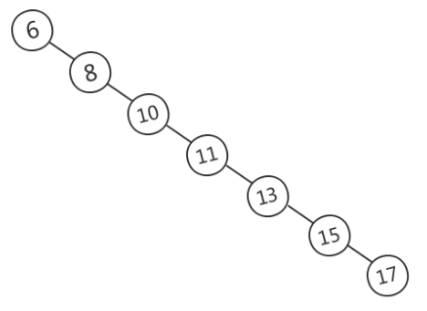
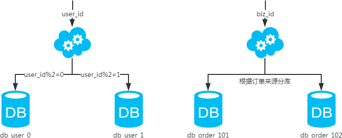
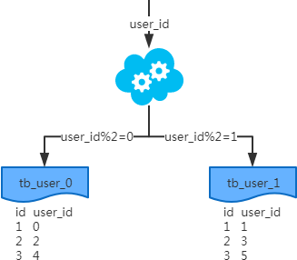
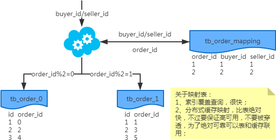
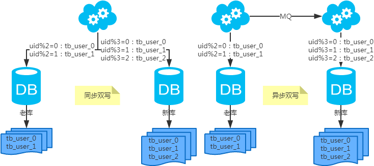

## MySQL

### 1.mysql的行锁、表锁、间隙锁、意向锁分别是做什么的

锁：对 “某种范围” 的数据上 “某种锁”

- 1.“某种范围”：行、表 

- 2.“某种锁”
    * 2.1 共享锁Shared Locks（S锁）
        - 1、兼容性：加了S锁的记录，允许其他事务再加S锁，不允许其他事务再加X锁

        - 2、加锁方式：select…lock in share mode

    * 2.2 排他锁Exclusive Locks（X锁）
        - 1、兼容性：加了X锁的记录，不允许其他事务再加S锁或者X锁

        - 2、加锁方式：select…for update

    * 2.3 表锁：意向锁 Intention Locks，意向锁相互兼容
        - 1、表明“某个事务正在某些行持有了锁、或该事务准备去持有锁”

        - 2、意向锁的存在是为了协调行锁和表锁的关系，支持多粒度（表锁与行锁）的锁并存，。

        - 3、例子：事务A修改user表的记录r，会给记录r上一把行级的排他锁（X），同时会给user表上一把意向排他锁（IX），这时事务B要给user表上一个表级的排他锁就会被阻塞。意向锁通过这种方式实现了行锁和表锁共存且满足事务隔离性的要求。

        - 4、意向共享锁（IS锁）：事务在请求S锁前，要先获得IS锁；2）意向排他锁（IX锁）：事务在请求X锁前，要先获得IX锁

            * 为什么意向锁是表级锁呢？

            当我们需要加一个排他锁时，需要根据意向锁去判断表中有没有数据行被锁定（行锁）；

            （1）如果意向锁是行锁，则需要遍历每一行数据去确认；

            （2）如果意向锁是表锁，则只需要判断一次即可知道有没数据行被锁定，提升性能。

            * 意向锁怎么支持表锁和行锁并存？

            （1）首先明确并存的概念是指数据库同时支持表、行锁，而不是任何情况都支持一个表中同时有一个事务A持有行锁、又有一个事务B持有表锁，因为表一旦被上了一个表级的写锁，肯定不能再上一个行级的锁。
            （2）如果事务A对某一行上锁，其他事务就不可能修改这一行。这与“事务B锁住整个表就能修改表中的任意一行”形成了冲突。所以，没有意向锁的时候，让行锁与表锁共存，就会带来很多问题。于是有了意向锁的出现，如q1的答案中，数据库不需要在检查每一行数据是否有锁，而是直接判断一次意向锁是否存在即可，能提升很多性能。

            意向锁相互兼容，因为IX、IS只是表明申请更低层次级别元素（比如 page、记录）的X、S操作。

            因为上了表级S锁后，不允许其他事务再加X锁，所以表级S锁和X、IX锁不兼容

            上了表级X锁后，会修改数据，所以表级X锁和 IS、IX、S、X（即使是行排他锁，因为表级锁定的行肯定包括行级速订的行，所以表级X和IX、行级X）不兼容。

            注意：上了行级X锁后，行级X锁不会因为有别的事务上了IX而堵塞，一个mysql是允许多个行级X锁同时存在的，只要他们不是针对相同的数据行。

    * 2.4 行锁：记录锁(Record Locks)

    （1）记录锁, 仅仅锁住索引记录的一行，在单条索引记录上加锁。
    
    （2）record lock锁住的永远是索引，而非记录本身，即使该表上没有任何索引，那么innodb会在后台创建一个隐藏的聚集主键索引，那么锁住的就是这个隐藏的聚集主键索引。

    所以说当一条sql没有走任何索引时，那么将会在每一条聚合索引后面加X锁，这个类似于表锁，但原理上和表锁应该是完全不同的。

    * 2.5 行锁：间隙锁(Gap Locks)

    （1）区间锁, 仅仅锁住一个索引区间（开区间，不包括双端端点）。

    （2）在索引记录之间的间隙中加锁，或者是在某一条索引记录之前或者之后加锁，并不包括该索引记录本身。

    比如在 1、2、3中，间隙锁的可能值有 (∞, 1)，(1, 2)，(2, ∞)，

    （3）间隙锁可用于防止幻读，保证索引间的不会被插入数据

    * 2.6 行锁：临键锁(Next-Key Locks)

    （1）record lock + gap lock, 左开右闭区间。<br/>
    （2）默认情况下，innodb使用next-key locks来锁定记录。select … for update <br/>
    （3）但当查询的索引含有唯一属性的时候，Next-Key Lock 会进行优化，将其降级为Record Lock，即仅锁住索引本身，不是范围。 <br/>
    （4）Next-Key Lock在不同的场景中会退化:

     

    * 2.7 行锁：插入意向锁(Insert Intention Locks)

    （1）插入意向锁是一种Gap锁，不是意向锁，在insert操作时产生。<br/>
    （2）在多事务同时写入不同数据至同一索引间隙的时候，并不需要等待其他事务完成，不会发生锁等待。<br/>
    （3）假设有一个记录索引包含键值4和7，不同的事务分别插入5和6，每个事务都会产生一个加在4-7之间的插入意向锁，获取在插入行上的排它锁，但是不会被互相锁住，因为数据行并不冲突。<br/>
    （4）插入意向锁不会阻止任何锁，对于插入的记录会持有一个记录锁。<br/>
    例如test表存在若干数据的数据，先开始一个事务A，插入一条n=5的数据；（图中步骤1）<br/>
    此时如果开始一个事务B，执行查询 select * from test where n > 4 for update，事务B会申请Gap锁（4, ∞)，申请成功后，被事务A的x锁阻塞，直到x锁被释放。（图中步骤2）<br/>
    可以看到图中步骤3的信息，在等待事务释放X锁<br/>

    * 2.9 表锁：自增锁(AUTO-INC Locks)

    AUTO-INC锁是一种特殊的表级锁，发生涉及AUTO_INCREMENT列的事务性插入操作时产生。

- 3.锁的选择

    * 1.如果更新条件没有走索引，例如执行”update test set name=“hello” where name=“world”;” ，此时会进行全表扫描，扫表的时候，要阻止其他任何的更新操作，所以上升为表锁。

    * 2.如果更新条件为索引字段，但是并非唯一索引（包括主键索引），例如执行“update test set name=“hello” where code=9;” 那么此时更新会使用Next-Key Lock。使用Next-Key Lock的原因：

    首先要保证在符合条件的记录上加上排他锁，会锁定当前非唯一索引和对应的主键索引的值；

    还要保证锁定的区间不能插入新的数据。

    * 如果更新条件为唯一索引，则使用Record Lock（记录锁）。

### 2.Mysql联合索引最左匹配原则

在mysql建立联合索引时会遵循最左前缀匹配的原则，即最左优先，在检索数据时从联合索引的最左边开始匹配.

要想理解联合索引的最左匹配原则，先来理解下索引的底层原理。索引的底层是一颗B+树，那么联合索引的底层也就是一颗B+树，只不过联合索引的B+树节点中存储的是键值。由于构建一棵B+树只能根据一个值来确定索引关系，所以数据库依赖联合索引最左的字段来构建。

示例：对列col1、列col2和列col3建一个联合索引

```
KEY test_col1_col2_col3 on test(col1,col2,col3);
```

联合索引 test_col1_col2_col3 实际建立了(col1)、(col1,col2)、(col,col2,col3)三个索引。

```
SELECT * FROM test WHERE col1=“1” AND clo2=“2” AND clo4=“4”
```

上面这个查询语句执行时会依照最左前缀匹配原则，检索时会使用索引(col1,col2)进行数据匹配。

索引的字段可以是任意顺序的，如：

```
SELECT * FROM test WHERE col1=“1” AND clo2=“2”
SELECT * FROM test WHERE col2=“2” AND clo1=“1”
```

这两个查询语句都会用到索引(col1,col2)，mysql创建联合索引的规则是首先会对联合合索引的最左边的，也就是第一个字段col1的数据进行排序，在第一个字段的排序基础上，然后再对后面第二个字段col2进行排序。其实就相当于实现了类似 order by col1 col2这样一种排序规则。

有人会疑惑第二个查询语句不符合最左前缀匹配：首先可以肯定是两个查询语句都包含索引(col1,col2)中的col1、col2两个字段，只是顺序不一样，查询条件一样，最后所查询的结果肯定是一样的。既然结果是一样的，到底以何种顺序的查询方式最好呢？此时我们可以借助mysql查询优化器explain，explain会纠正sql语句该以什么样的顺序执行效率最高，最后才生成真正的执行计划。

#### 为什么要使用联合索引

- 减少开销。建一个联合索引(col1,col2,col3)，实际相当于建了(col1),(col1,col2),(col1,col2,col3)三个索引。每多一个索引，都会增加写操作的开销和磁盘空间的开销。对于大量数据的表，使用联合索引会大大的减少开销！

- 覆盖索引。对联合索引(col1,col2,col3)，如果有如下的sql: select col1,col2,col3 from test where col1=1 and col2=2。那么MySQL可以直接通过遍历索引取得数据，而无需回表，这减少了很多的随机io操作。减少io操作，特别的随机io其实是dba主要的优化策略。所以，在真正的实际应用中，覆盖索引是主要的提升性能的优化手段之一。

- 效率高。索引列越多，通过索引筛选出的数据越少。有1000W条数据的表，有如下sql:select from table where col1=1 and col2=2 and col3=3,假设假设每个条件可以筛选出10%的数据，如果只有单值索引，那么通过该索引能筛选出1000W10%=100w条数据，然后再回表从100w条数据中找到符合col2=2 and col3= 3的数据，然后再排序，再分页；如果是联合索引，通过索引筛选出1000w10% 10% *10%=1w，效率提升可想而知！

#### Explain

由于整个过程是基于explain结果分析的，那接下来在了解下explain中的type字段和key_lef字段。

**type：联接类型。下面给出各种联接类型,按照从最佳类型到最坏类型进行排序:（重点看ref,rang,index）**

- system：表只有一行记录（等于系统表），这是const类型的特例，平时不会出现，可以忽略不计
- const：表示通过索引一次就找到了，const用于比较primary key 或者 unique索引。因为只需匹配一行数据，所有很快。如果将主键置于where列表中，mysql就能将该查询转换为一个const
- eq_ref：唯一性索引扫描，对于每个索引键，表中只有一条记录与之匹配。常见于主键 或 唯一索引扫描。
  注意：ALL全表扫描的表记录最少的表如t1表
- **ref**：非唯一性索引扫描，返回匹配某个单独值的所有行。本质是也是一种索引访问，它返回所有匹配某个单独值的行，然而他可能会找到多个符合条件的行，所以它应该属于查找和扫描的混合体。
- **range**：只检索给定范围的行，使用一个索引来选择行。key列显示使用了那个索引。一般就是在where语句中出现了bettween、<、>、in等的查询。这种索引列上的范围扫描比全索引扫描要好。只需要开始于某个点，结束于另一个点，不用扫描全部索引。
- **index**：Full Index Scan，index与ALL区别为index类型只遍历索引树。这通常为ALL块，应为索引文件通常比数据文件小。（Index与ALL虽然都是读全表，但index是从索引中读取，而ALL是从硬盘读取）
- ALL：Full Table Scan，遍历全表以找到匹配的行

### 3.mysql的慢查询优化方式

#### 慢查询日志概念

MySQL的慢查询日志是MySQL提供的一种日志记录，它用来记录在MySQL中响应时间超过阀值的语句，具体指运行时间超过long_query_time值的SQL，则会被记录到慢查询日志中。long_query_time的默认值为10，意思是运行10S以上的语句。默认情况下，Mysql数据库并不启动慢查询日志，需要我们手动来设置这个参数，当然，如果不是调优需要的话，一般不建议启动该参数，因为开启慢查询日志会或多或少带来一定的性能影响。慢查询日志支持将日志记录写入文件，也支持将日志记录写入数据库表。

#### 慢查询日志相关参数

MySQL 慢查询的相关参数解释：

- slow_query_log    ：是否开启慢查询日志，1表示开启，0表示关闭。
- log-slow-queries  ：旧版（5.6以下版本）MySQL数据库慢查询日志存储路径。可以不设置该参数，系统则会默认给一个缺省的文件host_name-slow.log
- slow-query-log-file：新版（5.6及以上版本）MySQL数据库慢查询日志存储路径。可以不设置该参数，系统则会默认给一个缺省的文件host_name-slow.log
- long_query_time ：慢查询阈值，当查询时间多于设定的阈值时，记录日志。
- log_queries_not_using_indexes：未使用索引的查询也被记录到慢查询日志中（可选项）。
- log_output：日志存储方式。log_output='FILE'表示将日志存入文件，默认值是'FILE'。log_output='TABLE'表示将日志存入数据库，这样日志信息就会被写入到mysql.slow_log表中。MySQL数据库支持同时两种日志存储方式，配置的时候以逗号隔开即可，如：log_output='FILE,TABLE'。日志记录到系统的专用日志表中，要比记录到文件耗费更多的系统资源，因此对于需要启用慢查询日志，又需要能够获得更高的系统性能，那么建议优先记录到文件。

```
mysql> show variables like 'long_query_time';
+-----------------+-----------+
| Variable_name   | Value     |
+-----------------+-----------+
| long_query_time | 10.000000 |
+-----------------+-----------+
1 row in set

mysql> show variables like 'slow_query%';
+---------------------+--------------------------------------+
| Variable_name       | Value                                |
+---------------------+--------------------------------------+
| slow_query_log      | OFF                                  |
| slow_query_log_file | /var/log/mysql/log-slow-queries.log  |
+---------------------+--------------------------------------+
2 rows in set
```

在这里，slow_query_log 指的是慢查询日志是否开启，slow_query_log_file 指明了日志所在的位置。

在 MySQL 的配置文件 my.cnf 的 [mysqld] 项下可以配置慢查询日志开启，一般来讲如下配置即可：

```
[mysqld]
slow_query_log=1
slow_query_log_file=/var/log/mysql/log-slow-queries.log
long_query_time=2
```

需要注意的是，应该赋予 slow_query_log_file 指向的目录 mysql 用户的写入权限：chown mysql.mysql -R /var/log/mysql，一般用默认的目录就好。详细的文档可以看这里：6.4.5 The Slow Query Log。

之后需重载 MySQL 配置生效：/etc/init.d/mysql reload。

#### 分析慢查询日志

在开启了 MySQL 慢查询日志一段时间之后，日志中就会把所有超过 long_query_time 的 SQL 记录下来。另一个有用的相关 MySQL 命令是 mysqldumpslow：由于慢查询日志可能很大或者很难分析，使用它可以获得 MySQL 对慢查询日志的一个总结报告，直接获得我们想要的统计分析后的结果。详细的文档可以看这里：5.6.8 mysqldumpslow — Summarize Slow Query Log Files。

#### 优化 SQL

- 1.最左前缀匹配原则，非常重要的原则，mysql会一直向右匹配直到遇到范围查询(>、<、between、like)就停止匹配，比如a = 1 and b = 2 and c > 3 and d = 4 如果建立(a,b,c,d)顺序的索引，d是用不到索引的，如果建立(a,b,d,c)的索引则都可以用到，a,b,d的顺序可以任意调整；

- 2.=和in可以乱序，比如a = 1 and b = 2 and c = 3 建立(a,b,c)索引可以任意顺序，mysql的查询优化器会帮你优化成索引可以识别的形式；

- 3.尽量选择区分度高的列作为索引,区分度的公式是count(distinct col)/count(*)，表示字段不重复的比例，比例越大我们扫描的记录数越少，唯一键的区分度是1，而一些状态、性别字段可能在大数据面前区分度就是0，那可能有人会问，这个比例有什么经验值吗？使用场景不同，这个值也很难确定，一般需要join的字段我们都要求是0.1以上，即平均1条扫描10条记录；

- 4.索引列不能参与计算，保持列“干净”，比如from_unixtime(create_time) = ’2014-05-29’就不能使用到索引，原因很简单，b+树中存的都是数据表中的字段值，但进行检索时，需要把所有元素都应用函数才能比较，显然成本太大。所以语句应该写成create_time = unix_timestamp(’2014-05-29’);

- 5.尽量的扩展索引，不要新建索引。比如表中已经有a的索引，现在要加(a,b)的索引，那么只需要修改原来的索引即可。

常用的套路是在定位到慢查询语句之后，使用 EXPLAIN + SQL 来了解 MySQL 在执行这条数据时的一些细节，比如是否进行了优化、是否使用了索引等等。基于 Explain 的返回结果我们就可以根据 MySQL 的执行细节进一步分析是否应该优化搜索、怎样优化索引。

### 4.mysql的索引结构为什么使用B加树

在MySQL中，无论是Innodb还是MyIsam，都使用了B+树作索引结构(这里不考虑hash等其他索引)。本文将从最普通的二叉查找树开始，逐步说明各种树解决的问题以及面临的新问题，从而说明MySQL为什么选择B+树作为索引结构。

#### 二叉查找树(BST)：不平衡

二叉查找树(BST，Binary Search Tree)，也叫二叉排序树，在二叉树的基础上需要满足：任意节点的左子树上所有节点值不大于根节点的值，任意节点的右子树上所有节点值不小于根节点的值。如下是一颗BST(图片来源)。


当需要快速查找时，将数据存储在BST是一种常见的选择，因为此时查询时间取决于树高，平均时间复杂度是O(lgn)。然而，BST可能长歪而变得不平衡，如下图所示(图片来源)，此时BST退化为链表，时间复杂度退化为O(n)。

为了解决这个问题，引入了平衡二叉树。



#### 平衡二叉树(AVL)：旋转耗时

AVL树是严格的平衡二叉树，所有节点的左右子树高度差不能超过1；AVL树查找、插入和删除在平均和最坏情况下都是O(lgn)。

AVL实现平衡的关键在于旋转操作：插入和删除可能破坏二叉树的平衡，此时需要通过一次或多次树旋转来重新平衡这个树。当插入数据时，最多只需要1次旋转(单旋转或双旋转)；但是当删除数据时，会导致树失衡，AVL需要维护从被删除节点到根节点这条路径上所有节点的平衡，旋转的量级为O(lgn)。

由于旋转的耗时，AVL树在删除数据时效率很低；在删除操作较多时，维护平衡所需的代价可能高于其带来的好处，因此AVL实际使用并不广泛。

#### 红黑树：树太高

与AVL树相比，红黑树并不追求严格的平衡，而是大致的平衡：只是确保从根到叶子的最长的可能路径不多于最短的可能路径的两倍长。从实现来看，红黑树最大的特点是每个节点都属于两种颜色(红色或黑色)之一，且节点颜色的划分需要满足特定的规则(具体规则略)。红黑树示例如下（图片来源）：


与AVL树相比，红黑树的查询效率会有所下降，这是因为树的平衡性变差，高度更高。但红黑树的删除效率大大提高了，因为红黑树同时引入了颜色，当插入或删除数据时，只需要进行O(1)次数的旋转以及变色就能保证基本的平衡，不需要像AVL树进行O(lgn)次数的旋转。总的来说，红黑树的统计性能高于AVL。

因此，在实际应用中，AVL树的使用相对较少，而红黑树的使用非常广泛。例如，Java中的TreeMap使用红黑树存储排序键值对；Java8中的HashMap使用链表+红黑树解决哈希冲突问题(当冲突节点较少时，使用链表，当冲突节点较多时，使用红黑树)。

对于数据在内存中的情况（如上述的TreeMap和HashMap），红黑树的表现是非常优异的。但是对于数据在磁盘等辅助存储设备中的情况（如MySQL等数据库），红黑树并不擅长，因为红黑树长得还是太高了。当数据在磁盘中时，磁盘IO会成为最大的性能瓶颈，设计的目标应该是尽量减少IO次数；而树的高度越高，增删改查所需要的IO次数也越多，会严重影响性能。

#### B树：为磁盘而生

B树也称B-树(其中-不是减号)，是为磁盘等辅存设备设计的多路平衡查找树，与二叉树相比，B树的每个非叶节点可以有多个子树。因此，当总节点数量相同时，B树的高度远远小于AVL树和红黑树(B树是一颗“矮胖子”)，磁盘IO次数大大减少。

定义B树最重要的概念是阶数(Order)，对于一颗m阶B树，需要满足以下条件：

- 每个节点最多包含 m 个子节点。
- 如果根节点包含子节点，则至少包含 2 个子节点；除根节点外，每个非叶节点至少包含 m/2 个子节点。
- 拥有 k 个子节点的非叶节点将包含 k - 1 条记录。
- 所有叶节点都在同一层中。

可以看出，B树的定义，主要是对非叶结点的子节点数量和记录数量的限制。


B树的优势除了树高小，还有对访问局部性原理的利用。所谓局部性原理，是指当一个数据被使用时，其附近的数据有较大概率在短时间内被使用。B树将键相近的数据存储在同一个节点，当访问其中某个数据时，数据库会将该整个节点读到缓存中；当它临近的数据紧接着被访问时，可以直接在缓存中读取，无需进行磁盘IO；换句话说，B树的缓存命中率更高。

B树在数据库中有一些应用，如mongodb的索引使用了B树结构。但是在很多数据库应用中，使用了是B树的变种B+树。

#### B+树

- B树中每个节点（包括叶节点和非叶节点）都存储真实的数据，B+树中只有叶子节点存储真实的数据，非叶节点只存储键。在MySQL中，这里所说的真实数据，可能是行的全部数据（如Innodb的聚簇索引），也可能只是行的主键（如Innodb的辅助索引），或者是行所在的地址（如MyIsam的非聚簇索引）。
- B树中一条记录只会出现一次，不会重复出现，而B+树的键则可能重复重现——一定会在叶节点出现，也可能在非叶节点重复出现。
- B+树的叶节点之间通过双向链表链接。
- B树中的非叶节点，记录数比子节点个数少1；而B+树中记录数与子节点个数相同。

由此，B+树与B树相比，有以下优势：

- **更少的IO次数**：B+树的非叶节点只包含键，而不包含真实数据，因此每个节点存储的记录个数比B数多很多（即阶m更大），因此B+树的高度更低，访问时所需要的IO次数更少。此外，由于每个节点存储的记录数更多，所以对访问局部性原理的利用更好，缓存命中率更高。

- **更适于范围查询**：在B树中进行范围查询时，首先找到要查找的下限，然后对B树进行中序遍历，直到找到查找的上限；而B+树的范围查询，只需要对链表进行遍历即可。

- **更稳定的查询效率**：B树的查询时间复杂度在1到树高之间(分别对应记录在根节点和叶节点)，而B+树的查询复杂度则稳定为树高，因为所有数据都在叶节点。

B+树也存在劣势：由于键会重复出现，因此会占用更多的空间。但是与带来的性能优势相比，空间劣势往往可以接受，因此B+树的在数据库中的使用比B树更加广泛。

#### 总结

最后，总结一下各种树解决的问题以及面临的新问题：

1)       二叉查找树(BST)：解决了排序的基本问题，但是由于无法保证平衡，可能退化为链表；

2)       平衡二叉树(AVL)：通过旋转解决了平衡的问题，但是旋转操作效率太低；

3)       红黑树：通过舍弃严格的平衡和引入红黑节点，解决了AVL旋转效率过低的问题，但是在磁盘等场景下，树仍然太高，IO次数太多；

4)       B树：通过将二叉树改为多路平衡查找树，解决了树过高的问题；

5)       B+树：在B树的基础上，将非叶节点改造为不存储数据的纯索引节点，进一步降低了树的高度；此外将叶节点使用指针连接成链表，范围查询更加高效。

reference
https://www.cnblogs.com/kismetv/p/11582214.html

### 5.MyISAM 和 InnoDB 的区别有哪些

#### 区别：

- 1.InnoDB 支持事务，MyISAM 不支持事务。这是 MySQL 将默认存储引擎从 MyISAM 变成 InnoDB 的重要原因之一；

- 2.InnoDB 支持外键，而 MyISAM 不支持。对一个包含外键的 InnoDB 表转为 MYISAM 会失败；  

- 3.InnoDB 是聚集索引，MyISAM 是非聚集索引。聚簇索引的文件存放在主键索引的叶子节点上，因此 InnoDB 必须要有主键，通过主键索引效率很高。但是辅助索引需要两次查询，先查询到主键，然后再通过主键查询到数据。因此，主键不应该过大，因为主键太大，其他索引也都会很大。而 MyISAM 是非聚集索引，数据文件是分离的，索引保存的是数据文件的指针。主键索引和辅助索引是独立的。 

- 4.InnoDB 不保存表的具体行数，执行 select count(*) from table 时需要全表扫描。而MyISAM 用一个变量保存了整个表的行数，执行上述语句时只需要读出该变量即可，速度很快；    

- 5.InnoDB 最小的锁粒度是行锁，MyISAM 最小的锁粒度是表锁。一个更新语句会锁住整张表，导致其他查询和更新都会被阻塞，因此并发访问受限。这也是 MySQL 将默认存储引擎从 MyISAM 变成 InnoDB 的重要原因之一；


#### 如何选择：

- 1.是否要支持事务，如果要请选择 InnoDB，如果不需要可以考虑 MyISAM；

- 2.如果表中绝大多数都只是读查询，可以考虑 MyISAM，如果既有读写也挺频繁，请使用InnoDB。

- 3.系统奔溃后，MyISAM恢复起来更困难，能否接受，不能接受就选 InnoDB； 

- 4.MySQL5.5版本开始Innodb已经成为Mysql的默认引擎(之前是MyISAM)，说明其优势是有目共睹的。如果你不知道用什么存储引擎，那就用InnoDB，至少不会差。

#### 其他区别：

- 1、对于AUTO_INCREMENT类型的字段，InnoDB中必须包含只有该字段的索引，但是在MyISAM表中，可以和其他字段一起建立联合索引。

- 2、DELETE FROM table时，InnoDB不会重新建立表，而是一行一行的删除。

- 3、LOAD TABLE FROMMASTER操作对InnoDB是不起作用的，解决方法是首先把InnoDB表改成MyISAM表，导入数据后再改成InnoDB表，但是对于使用的额外的InnoDB特性(例如外键)的表不适用。

- 4、 InnoDB存储引擎被完全与MySQL服务器整合，InnoDB存储引擎为在主内存中缓存数据和索引而维持它自己的缓冲池。

- 5、对于自增长的字段，InnoDB中必须包含只有该字段的索引，但是在MyISAM表中可以和其他字段一起建立联合索引。

- 6、清空整个表时，InnoDB是一行一行的删除，效率非常慢。MyISAM则会重建表。

### 6.MySQL数据库系列之数据库设计原则

MySQL中数据库设计原则：

- 1.一般情况下，应该尽量使用可以正确存储数据的最小数据类型。数据类型不一样，存储的执行效率也不一样。最好使用适度的整型数据类型，例如int之类的数据，这样在做查询或者字段排序的时候速度是最快的。

- 2.尽量避免NULL值的时候，因为这样会增加数据库处理的开销。但是也要考虑实际情况，不要一味的为了避免空值而全部设置为not null，具体的设置情况要根据项目的具体业务来。

- 3.注意char和varchar的使用，char适合存储的大小基本固定在一个范围之内，经常发生变动的数据。而varchar则不一样，varchar适合那种大小不固定，并未经常发生改动的数据。需要注意的是varchar定义的长度最好可以刚好够用，不然会照成资源的浪费，影响整体数据库的性能和存储空间。

- 4.能用整数标示，最好利用整数标示，因为这样开销最小，效率也是最高的。

- 5.一个表字段要限制在一定范围之内，不要太长，不然在查询的时候会付出很大的代价，最好分成常用的和非常用的字段。

- 6.在设计表和设计查询语言的时候就要主要尽量避免大规模的关联查询，因为这样会严重影响数据库的查询效率。

- 7.在设计数据库的时候要根据具体的业务设计出合理的数据库表和字段。不仅要考虑范式，也要考虑反范式。在不影响数据安全和数据冗余的情况下，可以适当的考虑混合范式的设计。

- 8.使用缓存表和汇总表能表进行数据库的查询优化。

Reference

https://yq.aliyun.com/articles/131756

### 7.mysql三大日志-binlog、redo log和undo log

日志是 mysql 数据库的重要组成部分，记录着数据库运行期间各种状态信息。<br/>
mysql日志主要包括**错误日志、查询日志、慢查询日志、事务日志、二进制日志**几大类。作为开发，我们重点需要关注的是**二进制日志( binlog )和事务日志(包括redo log 和 undo log )**，本文接下来会详细介绍这三种日志。

#### binlog

binlog 用于记录数据库执行的写入性操作(不包括查询)信息，以二进制的形式保存在磁盘中。 binlog 是 mysql的逻辑日志，并且由 Server 层进行记录，使用任何存储引擎的 mysql 数据库都会记录 binlog 日志。

- 逻辑日志： 可以简单理解为记录的就是sql语句 。
- 物理日志： mysql 数据最终是保存在数据页中的，物理日志记录的就是数据页变更 。

binlog 是通过追加的方式进行写入的，可以通过 **max_binlog_size** 参数设置每个 binlog文件的大小，当文件大小达到给定值之后，会生成新的文件来保存日志。

##### binlog使用场景

在实际应用中， binlog 的主要使用场景有两个，分别是 **主从复制 和 数据恢复** 。

- **主从复制** ：在 Master 端开启 binlog ，然后将 binlog 发送到各个 Slave 端， Slave 端重放 binlog 从而达到主从数据一致。
- **数据恢复** ：通过使用 mysqlbinlog 工具来恢复数据。

##### binlog刷盘时机

对于 InnoDB 存储引擎而言，只有在事务提交时才会记录 biglog ，此时记录还在内存中，那么 biglog是什么时候刷到磁盘中的呢？ mysql 通过 **sync_binlog** 参数控制 biglog 的刷盘时机，取值范围是 0-N:

- 0：不去强制要求，由系统自行判断何时写入磁盘；
- 1：每次 commit 的时候都要将 binlog 写入磁盘；
- N：每N个事务，才会将 binlog 写入磁盘。

从上面可以看出， **sync_binlog 最安全的是设置是 1** ，这也是 MySQL 5.7.7之后版本的默认值。但是设置一个大一些的值可以提升数据库性能，因此实际情况下也可以将值适当调大，牺牲一定的一致性来获取更好的性能。

##### binlog日志格式

binlog 日志有三种格式，分别为 **STATMENT 、 ROW 和 MIXED** 。

在 MySQL 5.7.7 之前，默认的格式是 STATEMENT ， MySQL 5.7.7 之后，默认值是 ROW 。日志格式通过 binlog-format 指定。

- STATMENT ： 基于 SQL 语句的复制( statement-based replication, SBR )，每一条会修改数据的sql语句会记录到 binlog 中 。

    * 优点： 不需要记录每一行的变化，减少了` binlog ` 日志量，节约了 ` IO ` , 从而提高了性能； 
    * 缺点： 在某些情况下会导致主从数据不一致，比如执行` sysdate() ` 、 ` slepp() ` 等 。 

- ROW ： 基于行的复制( row-based replication, RBR )，不记录每条sql语句的上下文信息，仅需记录哪条数据被修改了 。

    * 优点： 不会出现某些特定情况下的存储过程、或function、或trigger的调用和触发无法被正确复制的问题 ；
    * 缺点： 会产生大量的日志，尤其是 alter table 的时候会让日志暴涨

- MIXED ： 基于 STATMENT 和 ROW 两种模式的混合复制( mixed-based replication, MBR )，一般的复制使用 STATEMENT 模式保存 binlog ，对于 STATEMENT 模式无法复制的操作使用 ROW 模式保存 binlog

#### redo log

##### 为什么需要redo log

我们都知道，事务的四大特性里面有一个是 持久性 ，具体来说就是只要事务提交成功，那么对数据库做的修改就被永久保存下来了，不可能因为任何原因再回到原来的状态 。那么 mysql是如何保证一致性的呢？最简单的做法是在每次事务提交的时候，将该事务涉及修改的数据页全部刷新到磁盘中。但是这么做会有严重的性能问题，主要体现在两个方面：

- 1.因为 Innodb 是以 页 为单位进行磁盘交互的，而一个事务很可能只修改一个数据页里面的几个字节，这个时候将完整的数据页刷到磁盘的话，太浪费资源了！
- 2.一个事务可能涉及修改多个数据页，并且这些数据页在物理上并不连续，使用随机IO写入性能太差！

因此 mysql 设计了 redo log ， 具体来说就是只记录事务对数据页做了哪些修改，这样就能完美地解决性能问题了(相对而言文件更小并且是顺序IO)。

##### redo log基本概念

redo log 包括两部分：一个是内存中的日志缓冲( redo log buffer )，另一个是磁盘上的日志文件( ` redo log file )。 mysql 每执行一条 DML 语句，先将记录写入 redo log buffer `，后续某个时间点再一次性将多个操作记录写到 redo log file 。这种 先写日志，再写磁盘 的技术就是 MySQL里经常说到的 WAL(Write-Ahead Logging) 技术。

在计算机操作系统中，用户空间( user space )下的缓冲区数据一般情况下是无法直接写入磁盘的，中间必须经过操作系统内核空间( `kernel space )缓冲区( OS Buffer )。因此， redo log buffer 写入 redo log file 实际上是先写入 OS Buffer ，然后再通过系统调用 fsync() 将其刷到 redo log file ` 中，过程如下：


mysql 支持三种将 redo log buffer 写入 redo log file 的时机，可以通过 `innodb_flush_log_at_trx_commit ` 参数配置，各参数值含义如下：

|参数值|	含义|
|---|---|
|0（延迟写）|	事务提交时不会将 redo log buffer 中日志写入到 os buffer ，而是每秒写入 os buffer 并调用 fsync() 写入到 redo log file 中。也就是说设置为0时是(大约)每秒刷新写入到磁盘中的，当系统崩溃，会丢失1秒钟的数据。|
|1（实时写，实时刷）|	事务每次提交都会将 redo log buffer 中的日志写入 os buffer 并调用 fsync() 刷到 redo log file 中。这种方式即使系统崩溃也不会丢失任何数据，但是因为每次提交都写入磁盘，IO的性能较差。|
|2（实时写，延迟刷）|	每次提交都仅写入到 os buffer ，然后是每秒调用 fsync() 将 os buffer 中的日志写入到 redo log file 。|


##### redo log记录形式

前面说过， redo log 实际上记录数据页的变更，而这种变更记录是没必要全部保存，因此 redo log 实现上采用了大小固定，循环写入的方式，当写到结尾时，会回到开头循环写日志。如下图：


同时我们很容易得知， 在innodb中，既有 redo log 需要刷盘，还有 数据页 也需要刷盘， redo log 存在的意义主要就是降低对 数据页 刷盘的要求 。在上图中， write pos 表示 redo log 当前记录的 LSN (逻辑序列号)位置， check point 表示 数据页更改记录** 刷盘后对应 redo log 所处的 LSN (逻辑序列号)位置。 write pos 到 check point 之间的部分是 redo log 空着的部分，用于记录新的记录； check point 到 write pos 之间是 redo log 待落盘的数据页更改记录。当 write pos 追上 check point 时，会先推动 check point 向前移动，空出位置再记录新的日志。

启动 innodb 的时候，不管上次是正常关闭还是异常关闭，总是会进行恢复操作。因为 redo log 记录的是数据页的物理变化，因此恢复的时候速度比逻辑日志(如 binlog )要快很多。 重启 innodb 时，首先会检查磁盘中数据页的 LSN ，如果数据页的 LSN 小于日志中的 LSN ，则会从 checkpoint 开始恢复。 还有一种情况，在宕机前正处于
checkpoint 的刷盘过程，且数据页的刷盘进度超过了日志页的刷盘进度，此时会出现数据页中记录的 LSN 大于日志中的 LSN，这时超出日志进度的部分将不会重做，因为这本身就表示已经做过的事情，无需再重做。

#### redo log与binlog区别

| |redo log|	binlog|
|---|---|---|
|文件大小	|redo log 的大小是固定的。|	binlog 可通过配置参数 max_binlog_size 设置每个 binlog 文件的大小。|
|实现方式|	redo log 是 InnoDB 引擎层实现的，并不是所有引擎都有。|	binlog 是 Server 层实现的，所有引擎都可以使用 binlog 日志|
|记录方式|	redo log 采用循环写的方式记录，当写到结尾时，会回到开头循环写日志。|	binlog通过追加的方式记录，当文件大小大于给定值后，后续的日志会记录到新的文件上|
|适用场景|	redo log 适用于崩溃恢复(crash-safe)	|binlog 适用于主从复制和数据恢复|

由 binlog 和 redo log 的区别可知： binlog 日志只用于归档，只依靠 binlog 是没有 `crash-safe 能力的。但只有 redo log 也不行，因为 redo log 是 InnoDB `
特有的，且日志上的记录落盘后会被覆盖掉。因此需要 binlog 和 redo log二者同时记录，才能保证当数据库发生宕机重启时，数据不会丢失。

#### undo log

数据库事务四大特性中有一个是 原子性 ，具体来说就是 原子性是指对数据库的一系列操作，要么全部成功，要么全部失败，不可能出现部分成功的情况。实际上， 原子性 底层就是通过 undo log 实现的。 

由引擎层的InnoDB引擎实现, 是逻辑日志, 记录数据修改被修改前的值, 比如一条 ` INSERT语句，对应一条 DELETE 的 undo log ，对于每个 UPDATE 语句，对应一条相反的 UPDATE 的undo log ，这样在发生错误时，就能回滚到事务之前的数据状态。同时， undo log 也是 MVCC `(多版本并发控制)实现的关键，

当一条数据需要更新前,会先把修改前的记录存储在undolog中,如果这个修改出现异常,则会使用undo日志来实现回滚操作,保证事务的一致性。

当事务提交之后，undo log并不能立马被删除,而是会被放到待清理链表中,待判断没有事物用到该版本的信息时才可以清理相应undolog。

#### 3种日志在事物执行过程中的工作

```
user表
id name
1  ken
2  lj

执行一个事务

BEGIN 
update name = 'wk' from user where id = 1
update name = 'river' from user where id = 2
commit

```

实际事物的执行顺序如下:

A.将id=1的行name的值读取到内存中
B.记录id=1的行name=ken到undo log
C.修改name=wk
D.记录相应数据页的修改到redo log,并更新内存中的数据
E.将id=2的行name的值读取到内存中
F.记录id=2的行name=lj到undo log
G.修改name=river
H.记录相应数据页的修改到redo log,并更新内存中的数据
I.记录事务中所有SQL的逻辑操作到bin log
J.提交事务
K.MySql服务器空闲时,把redo log中的物理数据页刷到磁盘数据文件中

- 1.保证原子性:更新数据前,记录undo log,为保证在更新数据时发生异常导致更新失败,这时可以使用undo log对数据进行回滚(回滚内存中的数据,并会在redo log中记录回滚操作)

- 2.保证持久性:每更新数据后,记录redo log,为防止服务器突然宕机,导致没有把数据刷到磁盘中,每次重启MySql服务器都会从redo log将脏页(未能及时写到磁盘的数据页)刷到磁盘

- 3.两阶段提交,保证数据的一致性:

    先写redo log,再写bin log,完成后才能认为事务是完整的。从库主要通过bin log进行同步,但如果服务器异常宕机,可能会造成主从数据不一致的情况。

    * a.写完redo log宕机,bin log还没写
    因为两阶段提交机制,MySql会判断redo log 和 bin log是否都完整,如果不完整,则认为事务未提交,在从redo log 刷数据时,就不会刷未提交的事务的数据

    * b.在写bin log的中途宕机
    已经写了部分的bin log,但是没有写完整（binlog 是否完整会有一个标识符标识），仍然认为事务未提交。崩溃恢复和主从复制时,都不会使用未提交的数据,从而实现数据的一致性。

    * c.bin log写完了,但未提交事务
    两阶段提交机制认为,只要redo log和bin log都是完整的,则可以认为事务提交了。

### 8.MySql数据库大表添加字段的方法

#### 第一 基础方法

增加字段基本方法，该方法适合十几万的数据量，可以直接进行加字段操作。
```
ALTER TABLE tbl_tpl ADD title(255) DEFAULT '' COMMENT '标题' AFTER id;
```
但是，线上的一张表如果数据量很大，执行加字段操作就会锁表，这个过程可能需要很长时间甚至导致服务崩溃，那么这样操作就有风险。

#### 第二 临时表方法

思路如下：

① 创建一个临时的新表，首先复制旧表的结构（包含索引）

```
create table new_table like old_table;
```

② 给新表加上新增的字段，注意，此时新表是空表，加字段很快；

③ 把旧表的数据复制过来

```
insert into new_table(filed1,filed2) select filed1,filed2 from old_table;
```

④ 删除旧表，重命名新表的名字为旧表的名字

不过这里需要注意，执行第三步的时候，可能这个过程也需要时间，这个时候有新的数据进来，所以原来的表如果有字段记录了数据的写入时间就最好了，可以找到执行这一步操作之后的数据，并重复导入到新表，直到数据差异很小。不过还是会可能损失极少量的数据。

所以，如果表的数据特别大，同时又要保证数据完整，最好停机操作。

#### 第三 使用pt-online-schema-change

pt-online-schema-change是percona公司开发的一个工具，在percona-toolkit包里面可以找到这个功能，它可以在线修改表结构

原理:

- 首先它会新建一张一模一样的表，表名一般是_为前缀_new后缀,例如原表为t_user 临时表就是_t_user_new

- 然后在这个新表执行更改字段操作

- 然后在原表上加三个触发器，DELETE/UPDATE/INSERT，将原表中要执行的语句也在新表中执行

- 最后将原表的数据拷贝到新表中，然后替换掉原表

SQL语句:

```
ALTER TABLE tmp_task_user ADD support tinyint(1) unsigned NOT NULL DEFAULT '1';
```

工具命令：

```
sh pt.sh tmp_task_user "ADD COLUMN support tinyint(1) unsigned NOT NULL DEFAULT '1'"
```

好处:

- 降低主从延时的风险
- 可以限速、限资源，避免操作时MySQL负载过高

建议:

- 在业务低峰期做，将影响降到最低

### 9.如何实现 MySQL 的读写分离

#### 如何实现 MySQL 的读写分离？

其实很简单，就是基于主从复制架构，简单来说，就搞一个主库，挂多个从库，然后我们就单单只是写主库，然后主库会自动把数据给同步到从库上去。

#### MySQL 主从复制原理的是啥？

主库将变更写入 binlog 日志，然后从库连接到主库之后，从库有一个 IO 线程，将主库的 binlog 日志拷贝到自己本地，写入一个 relay 中继日志中。接着从库中有一个 SQL 线程会从中继日志读取 binlog，然后执行 binlog 日志中的内容，也就是在自己本地再次执行一遍 SQL，这样就可以保证自己跟主库的数据是一样的。


这里有一个非常重要的一点，就是从库同步主库数据的过程是串行化的，也就是说主库上并行的操作，在从库上会串行执行。所以这就是一个非常重要的点了，由于从库从主库拷贝日志以及串行执行 SQL 的特点，在高并发场景下，从库的数据一定会比主库慢一些，是有延时的。所以经常出现，刚写入主库的数据可能是读不到的，要过几十毫秒，甚至几百毫秒才能读取到。

而且这里还有另外一个问题，就是如果主库突然宕机，然后恰好数据还没同步到从库，那么有些数据可能在从库上是没有的，有些数据可能就丢失了。

所以 MySQL 实际上在这一块有两个机制，一个是半同步复制，用来解决主库数据丢失问题；一个是并行复制，用来解决主从同步延时问题。

这个所谓半同步复制，也叫 semi-sync 复制，指的就是主库写入 binlog 日志之后，就会将强制此时立即将数据同步到从库，从库将日志写入自己本地的 relay log(中继日志) 之后，接着会返回一个 ack 给主库，主库接收到至少一个从库的 ack 之后才会认为写操作完成了。

所谓并行复制，指的是从库开启多个线程，并行读取 relay log 中不同库的日志，然后并行重放不同库的日志，这是库级别的并行。

读写分离：
- 数据库层面：主数据库复制写，从数据库复制读。
- 软件（代码）层面：通过读写分离中间间，现在比较流行的中间件有**Mycat、Sharding-Sphere、Atlas、Cobar**等实现。

### 10.MySQL数据库之分库分表方案

#### 数据库瓶颈

不管是IO瓶颈，还是CPU瓶颈，最终都会导致数据库的活跃连接数增加，进而逼近甚至达到数据库可承载活跃连接数的阈值。在业务Service来看就是，可用数据库连接少甚至无连接可用。接下来就可以想象了吧（并发量、吞吐量、崩溃）。

##### IO瓶颈

第一种：磁盘读IO瓶颈，热点数据太多，数据库缓存放不下，每次查询时会产生大量的IO，降低查询速度 ->  **分库和垂直分表**。

第二种：网络IO瓶颈，请求的数据太多，网络带宽不够 ->  **分库**。

##### CPU瓶颈

第一种：SQL问题，如SQL中包含join，group by，order by，非索引字段条件查询等，增加CPU运算的操作 -> SQL优化，建立合适的索引，在业务Service层进行业务计算。

第二种：单表数据量太大，查询时扫描的行太多，SQL效率低，CPU率先出现瓶颈 ->  **水平分表**。

#### 分库分表

##### 1、水平分库



- 概念：以 字段为依据 ，按照一定策略（hash、range等），将一个 库中的数据拆分到多个 库中。
- 结果：
    * 每个 库的 结构都一样；
    * 每个 库的 数据都不一样，没有交集；
    * 所有 库的 并集是全量数据；
- 场景：系统绝对并发量上来了，分表难以根本上解决问题，并且还没有明显的业务归属来垂直分库。
- 分析：库多了，io和cpu的压力自然可以成倍缓解。

##### 2、水平分表



- 概念：以 字段为依据 ，按照一定策略（hash、range等），将一个 表中的数据拆分到多个 表中。
- 结果：
    * 每个 表的 结构都一样；
    * 每个 表的 数据都不一样，没有交集；
    * 所有 表的 并集是全量数据；
- 场景：系统绝对并发量并没有上来，只是单表的数据量太多，影响了SQL效率，加重了CPU负担，以至于成为瓶颈。
- 分析：表的数据量少了，单次SQL执行效率高，自然减轻了CPU的负担。

##### 3、垂直分库


- 概念：以 表为依据，按照业务归属不同，将不同的 表拆分到不同的 库中 。
- 结果：
    * 每个 库的 结构都不一样；
    * 每个 库的 数据也不一样，没有交集；
    * 所有 库的 并集是全量数据；
- 场景：系统绝对并发量上来了，并且可以抽象出单独的业务模块。
- 分析：到这一步，基本上就可以服务化了。例如，随着业务的发展一些公用的配置表、字典表等越来越多，这时可以将这些表拆到单独的库中，甚至可以服务化。再有，随着业务的发展孵化出了一套业务模式，这时可以将相关的表拆到单独的库中，甚至可以服务化。

##### 4、垂直分表


- 概念：以 字段为依据，按照字段的活跃性，将 表中字段拆到不同的 表（主表和扩展表）中。
- 结果：
    * 每个 表的 结构都不一样；
    * 每个 表的 数据也不一样，一般来说，每个表的 字段至少有一列交集，一般是主键，用于关联数据；
    * 所有 表的 并集是全量数据；
- 场景：系统绝对并发量并没有上来，表的记录并不多，但是字段多，并且热点数据和非热点数据在一起，单行数据所需的存储空间较大。以至于数据库缓存的数据行减少，查询时会去读磁盘数据产生大量的随机读IO，产生IO瓶颈。
- 分析：可以用列表页和详情页来帮助理解。垂直分表的拆分原则是将热点数据（可能会冗余经常一起查询的数据）放在一起作为主表，非热点数据放在一起作为扩展表。这样更多的热点数据就能被缓存下来，进而减少了随机读IO。拆了之后，要想获得全部数据就需要关联两个表来取数据。但记住，千万别用join，因为join不仅会增加CPU负担并且会讲两个表耦合在一起（必须在一个数据库实例上）。关联数据，应该在业务Service层做文章，分别获取主表和扩展表数据然后用关联字段关联得到全部数据。

#### 分库分表工具

- sharding-sphere：jar，前身是sharding-jdbc；
- TDDL：jar，Taobao Distribute Data Layer；
- Mycat：中间件。

#### 分库分表步骤

根据容量（当前容量和增长量）评估分库或分表个数 -> 选key（均匀）-> 分表规则（hash或range等）-> 执行（一般双写）-> 扩容问题（尽量减少数据的移动）。

#### 分库分表问题

##### 1、非partition key的查询问题（水平分库分表，拆分策略为常用的hash法）

- 1.端上除了partition key只有一个非partition key作为条件查询
    * 映射法

    
    

    注：写入时，基因法生成user_id，如图。关于xbit基因，例如要分8张表，2 3=8，故x取3，即3bit基因。根据user_id查询时可直接取模路由到对应的分库或分表。根据user_name查询时，先通过user_name_code生成函数生成user_name_code再对其取模路由到对应的分库或分表。id生成常用 snowflake算法。

- 2.端上除了partition key不止一个非partition key作为条件查询
    * 映射法

    

    * 冗余法

    

    注：按照order_id或buyer_id查询时路由到db_o_buyer库中，按照seller_id查询时路由到db_o_seller库中。感觉有点本末倒置！有其他好的办法吗？改变技术栈呢？

- 3.后台除了partition key还有各种非partition key组合条件查询
    * NoSQL法

    

    * 冗余法

    

##### 2、非partition key跨库跨表分页查询问题（水平分库分表，拆分策略为常用的hash法）

注：用 NoSQL法解决（ES等）。

##### 3、扩容问题（水平分库分表，拆分策略为常用的hash法）

- 1.水平扩容库（升级从库法）


注：扩容是成倍的。

- 2.水平扩容表（双写迁移法）



第一步：（同步双写）应用配置双写，部署；
第二步：（同步双写）将老库中的老数据复制到新库中；
第三步：（同步双写）以老库为准校对新库中的老数据；
第四步：（同步双写）应用去掉双写，部署；

注： 双写是通用方案。

#### 分库分表总结

- 分库分表，首先得知道瓶颈在哪里，然后才能合理地拆分（分库还是分表？水平还是垂直？分几个？）。且不可为了分库分表而拆分。
- 选key很重要，既要考虑到拆分均匀，也要考虑到非partition key的查询。
- 只要能满足需求，拆分规则越简单越好。


        