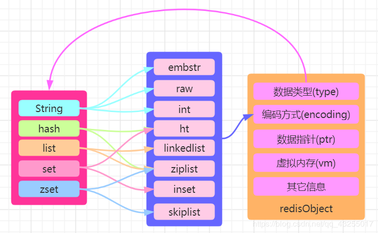
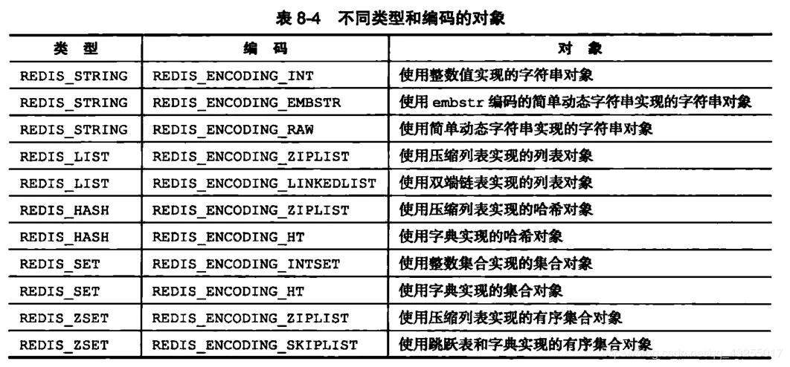
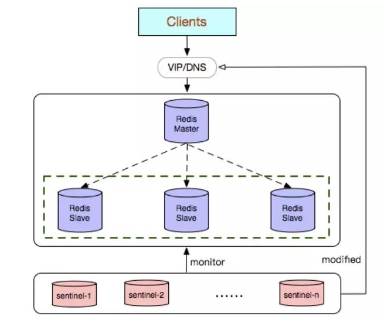

## Redis 

### 1.Redis为什么是单线程及高并发快的3大原因详解

#### Redis的高并发和快速原因

1.redis是基于内存的，内存的读写速度非常快；

2.redis是单线程的，省去了很多上下文切换线程的时间；

3.redis使用多路复用技术，可以处理并发的连接。非阻塞IO 内部实现采用epoll，采用了epoll+自己实现的简单的事件框架。epoll中的读、写、关闭、连接都转化成了事件，然后利用epoll的多路复用特性，绝不在io上浪费一点时间。

#### 为什么Redis是单线程的

因为Redis是基于内存的操作，CPU不是Redis的瓶颈，Redis的瓶颈最有可能是机器内存的大小或者网络带宽。既然单线程容易实现，而且CPU不会成为瓶颈，那就顺理成章地采用单线程的方案了。

1)不需要各种锁的性能消耗 2) 单线程多进程集群方案 3) 采用单线程，避免了不必要的上下文切换和竞争条件，也不存在多进程或者多线程导致的切换而消耗 CPU。

#### IO多路复用技术

redis 采用网络IO多路复用技术来保证在多连接的时候， 系统的高吞吐量。

多路-指的是多个socket连接，复用-指的是复用一个线程。多路复用主要有三种技术：select，poll，epoll。epoll是最新的也是目前最好的多路复用技术。

这里“多路”指的是多个网络连接，“复用”指的是复用同一个线程。采用多路 I/O 复用技术可以让单个线程高效的处理多个连接请求（尽量减少网络IO的时间消耗），且Redis在内存中操作数据的速度非常快（内存内的操作不会成为这里的性能瓶颈），主要以上两点造就了Redis具有很高的吞吐量。

#### 总结：

1. Redis是纯内存数据库，一般都是简单的存取操作，线程占用的时间很多，时间的花费主要集中在IO上，所以读取速度快。

2. 再说一下IO，Redis使用的是非阻塞IO，IO多路复用，使用了单线程来轮询描述符，将数据库的开、关、读、写都转换成了事件，减少了线程切换时上下文的切换和竞争。

3. Redis采用了单线程的模型，保证了每个操作的原子性，也减少了线程的上下文切换和竞争。

4. 另外，数据结构也帮了不少忙，Redis全程使用hash结构，读取速度快，还有一些特殊的数据结构，对数据存储进行了优化，如压缩表，对短数据进行压缩存储，再如，跳表，使用有序的数据结构加快读取的速度。

5. 还有一点，Redis采用自己实现的事件分离器，效率比较高，内部采用非阻塞的执行方式，吞吐能力比较大。


### 2.单线程的redis如何利用多核cpu机器

redis的读取和处理性能非常强大，一般服务器的cpu都不会是性能瓶颈。redis的性能瓶颈主要集中在内存和网络方面。所以，如果使用的redis命令多为O(N)、O(log(N))时间复杂度，那么基本上不会出现cpu瓶颈的情况。

但是如果你确实需要充分使用多核cpu的能力，**那么需要在单台服务器上运行多个redis实例(主从部署/集群化部署)，并将每个redis实例和cpu内核进行绑定**(使用 taskset命令，百度：https://www.baidu.com/s?wd=taskset&tn=84053098_3_dg&ie=utf-8)。

如果需要进行集群化部署，你需要对redis进行分片存储，可以参考https://redis.io/topics/partitioning

### 3.Redis的内存淘汰策略

在使用Redis时，我们一般会为Redis的缓存空间设置一个大小，不会让数据无限制的放入Redis缓存。

对于 Redis 来说，一旦确定了缓存最大容量，比如 4GB，你就可以使用下面这个命令来设定缓存的大小了：

`CONFIG SET maxmemory 4gb`

Redis设置了缓存的容量大小，那么缓存被写满是不可避免的。我们需要面对缓存写满时的替换操作。缓存替换需要解决两个问题：决定淘汰哪些数据，如何处理那些被淘汰的数据。

通过配置文件设置淘汰策略（修改redis.conf文件）：

`config set maxmemory-policy allkeys-lru`

#### 淘汰策略

Redis共提供了8中缓存淘汰策略，其中volatile-lfu和allkeys-lfu是Redis 4.0版本新增的。


* **no-enviction**：禁止驱逐数据，也就是当内存不足以容纳新入数据时，新写入操作就会报错，请求可以继续进行，线上任务也不能持续进行，采用no-enviction策略可以保证数据不被丢失，这也是系统默认的一种淘汰策略。

* **volatile-lru**：从设置过期时间的数据集(server.db[i].expires)中挑选出最近最少使用的数据淘汰。没有设置过期时间的key不会被淘汰，这样就可以在增加内存空间的同时保证需要持久化的数据不会丢失。

* **volatile-random**：从已设置过期时间的数据集(server.db[i].expires)中任意选择数据淘汰。当内存达到限制无法写入非过期时间的数据集时，可以通过该淘汰策略在主键空间中随机移除某个key。

* **volatile-ttl**：除了淘汰机制采用LRU，策略基本上与volatile-lru相似，从设置过期时间的数据集(server.db[i].expires)中挑选将要过期的数据淘汰，ttl值越大越优先被淘汰。根据过期时间的先后进行删除，越早过期的越先被删除。

* **volatile-lfu**: 会使用 LFU 算法 选择设置了过期时间的键值对, 最近最少使用，跟使用的次数有关，淘汰使用次数最少的。(LFU是在Redis4.0后出现的)

* **allkeys-lru**：从数据集(server.db[i].dict)中挑选最近最少使用的数据淘汰，该策略要淘汰的key面向的是全体key集合，而非过期的key集合。

* **allkeys-random**：从数据集(server.db[i].dict)中选择任意数据淘汰。

* **allkeys-lfu**：使用 LFU 算法在所有数据中进行筛选。

#### LRU淘汰

LRU(Least recently used，最近最少使用)算法根据数据的历史访问记录来进行淘汰数据，其核心思想是“如果数据最近被访问过，那么将来被访问的几率也更高”。

在服务器配置中保存了 lru 计数器 server.lrulock(24位时钟)，会定时(redis 定时程序 serverCorn())更新，server.lrulock 的值是根据 server.unixtime 计算出来进行排序的，然后选择最近使用时间最久的数据进行删除。另外，从 struct redisObject 中可以发现，每一个 redis 对象都会设置相应的 lru。每一次访问数据，会更新对应redisObject.lru。

在Redis中，LRU算法是一个近似算法，默认情况下，Redis会随机挑选5个键，并从中选择一个最久未使用的key进行淘汰。在配置文件中，按maxmemory-samples选项进行配置，选项配置越大，消耗时间就越长，但结构也就越精准。

`CONFIG SET maxmemory-samples 100`

##### 为什么要使用近似LRU？

1、性能问题，由于近似LRU算法只是最多随机采样N个key并对其进行排序，如果精准需要对所有key进行排序，这样近似LRU性能更高

2、内存占用问题，redis对内存要求很高，会尽量降低内存使用率，如果是抽样排序可以有效降低内存的占用

3、实际效果基本相等，如果请求符合长尾法则，那么真实LRU与Redis LRU之间表现基本无差异

4、在近似情况下提供可自配置的取样率来提升精准度，例如通过 CONFIG SET maxmemory-samples <count> 指令可以设置取样数，取样数越高越精准，如果你的CPU和内存有足够，可以提高取样数看命中率来探测最佳的采样比例。

#### TTL淘汰

Redis 数据集数据结构中保存了键值对过期时间的表，即 redisDb.expires。与 LRU 数据淘汰机制类似，TTL 数据淘汰机制中会先从过期时间的表中随机挑选几个键值对，取出其中 ttl ***的键值对淘汰。同样，TTL淘汰策略并不是面向所有过期时间的表中最快过期的键值对，而只是随机挑选的几个键值对。

#### 随机淘汰

在随机淘汰的场景下获取待删除的键值对，随机找hash桶再次hash指定位置的dictEntry即可。


#### LFU算法

LFU是在Redis4.0后出现的，LRU的最近最少使用实际上并不精确，考虑下面的情况，如果在|处删除，那么A距离的时间最久，但实际上A的使用频率要比B频繁，所以合理的淘汰策略应该是淘汰B。LFU就是为应对这种情况而生的。

LFU (Least Frequently Used) ：最近最少使用，跟使用的次数有关，淘汰使用次数最少的。

LRU (Least Recently Used): 最近最不经常使用，跟使用的最后一次时间有关，淘汰最近使用时间离现在最久的。

LFU把原来的key对象的内部时钟的24位分成两部分，前16位还代表时钟，后8位代表一个计数器。16位的情况下如果还按照秒为单位就会导致不够用，所以一般这里以时钟为单位。而后8位表示当前key对象的访问频率，8位只能代表255，但是redis并没有采用线性上升的方式，而是通过一个复杂的公式，通过配置如下两个参数来调整数据的递增速度。

lfu-log-factor 可以调整计数器counter的增长速度，lfu-log-factor越大，counter增长的越慢。

lfu-decay-time 是一个以分钟为单位的数值，可以调整counter的减少速度。

##### 新生KEY策略

另外一个问题是，当创建新对象的时候，对象的counter如果为0，很容易就会被淘汰掉，还需要为新生key设置一个初始counter。counter会被初始化为LFU_INIT_VAL，默认5。

### 4.redis如何持久化数据

Redis有两种持久化的方式：**快照（RDB文件）和追加式文件（AOF文件)**：

- RDB持久化方式会在一个特定的间隔保存那个时间点的一个数据快照。
- AOF持久化方式则会记录每一个服务器收到的写操作。在服务启动时，这些记录的操作会逐条执行从而重建出原来的数据。写操作命令记录的格式跟Redis协议一致，以追加的方式进行保存。
- Redis的持久化是可以禁用的，就是说你可以让数据的生命周期只存在于服务器的运行时间里。
- 两种方式的持久化是可以同时存在的，但是当Redis重启时，AOF文件会被优先用于重建数据。

#### RDB 工作原理

- Redis调用fork()，产生一个子进程。
- 子进程把数据写到一个临时的RDB文件。
- 当子进程写完新的RDB文件后，把旧的RDB文件替换掉。

##### 优点

- RDB文件是一个很简洁的单文件，它保存了某个时间点的Redis数据，很适合用于做备份。你可以设定一个时间点对RDB文件进行归档，这样就能在需要的时候很轻易的把数据恢复到不同的版本。
- 基于上面所描述的特性，RDB很适合用于灾备。单文件很方便就能传输到远程的服务器上。
- RDB的性能很好，需要进行持久化时，主进程会fork一个子进程出来，然后把持久化的工作交给子进程，自己不会有相关的I/O操作。
- 比起AOF，在数据量比较大的情况下，RDB的启动速度更快。

##### 缺点

- RDB容易造成数据的丢失。假设每5分钟保存一次快照，如果Redis因为某些原因不能正常工作，那么从上次产生快照到Redis出现问题这段时间的数据就会丢失了。
- RDB使用fork()产生子进程进行数据的持久化，如果数据比较大的话可能就会花费点时间，造成Redis停止服务几毫秒。如果数据量很大且CPU性能不是很好的时候，停止服务的时间甚至会到1秒。

##### 文件路径和名称

默认Redis会把快照文件存储为当前目录下一个名为dump.rdb的文件。要修改文件的存储路径和名称，可以通过修改配置文件redis.conf实现：

```
# RDB文件名，默认为dump.rdb。
dbfilename dump.rdb

# 文件存放的目录，AOF文件同样存放在此目录下。默认为当前工作目录。
dir ./
```

##### 保存点（RDB的启用和禁用）

你可以配置保存点，使Redis如果在每N秒后数据发生了M次改变就保存快照文件。例如下面这个保存点配置表示每60秒，如果数据发生了1000次以上的变动，Redis就会自动保存快照文件：

保存点可以设置多个，Redis的配置文件就默认设置了3个保存点：

```
# 格式为：save <seconds> <changes>
# 可以设置多个。
save 900 1 #900秒后至少1个key有变动
save 300 10 #300秒后至少10个key有变动
save 60 10000 #60秒后至少10000个key有变动
```

如果想禁用快照保存的功能，可以通过注释掉所有"save"配置达到，或者在最后一条"save"配置后添加如下的配置：

`save ""`

##### 错误处理

默认情况下，如果Redis在后台生成快照的时候失败，那么就会停止接收数据，目的是让用户能知道数据没有持久化成功。但是如果你有其他的方式可以监控到Redis及其持久化的状态，那么可以把这个功能禁止掉。

`stop-writes-on-bgsave-error yes`

##### 数据压缩

默认Redis会采用LZF对数据进行压缩。如果你想节省点CPU的性能，你可以把压缩功能禁用掉，但是数据集就会比没压缩的时候要打。

`rdbcompression yes`

##### 数据校验

从版本5的RDB的开始，一个CRC64的校验码会放在文件的末尾。这样更能保证文件的完整性，但是在保存或者加载文件时会损失一定的性能（大概10%）。如果想追求更高的性能，可以把它禁用掉，这样文件在写入校验码时会用0替代，加载的时候看到0就会直接跳过校验。

`rdbchecksum yes`

##### 手动生成快照

Redis提供了两个命令用于手动生成快照。

###### SAVE

SAVE命令会使用同步的方式生成RDB快照文件，这意味着在这个过程中会阻塞所有其他客户端的请求。因此不建议在生产环境使用这个命令，除非因为某种原因需要去阻止Redis使用子进程进行后台生成快照（例如调用fork(2)出错）。

###### BGSAVE

BGSAVE命令使用后台的方式保存RDB文件，调用此命令后，会立刻返回OK返回码。Redis会产生一个子进程进行处理并立刻恢复对客户端的服务。在客户端我们可以使用LASTSAVE命令查看操作是否成功。

```
127.0.0.1:6379> BGSAVE
Background saving started
127.0.0.1:6379> LASTSAVE
(integer) 1433936394
```
配置文件里禁用了快照生成功能不影响SAVE和BGSAVE命令的效果。

#### AOF

快照并不是很可靠。如果你的电脑突然宕机了，或者电源断了，又或者不小心杀掉了进程，那么最新的数据就会丢失。而AOF文件则提供了一种更为可靠的持久化方式。每当Redis接受到会修改数据集的命令时，就会把命令追加到AOF文件里，当你重启Redis时，AOF里的命令会被重新执行一次，重建数据。

##### 优点

- 比RDB可靠。你可以制定不同的fsync策略：不进行fsync、每秒fsync一次和每次查询进行fsync。默认是每秒fsync一次。这意味着你最多丢失一秒钟的数据。

- AOF日志文件是一个纯追加的文件。就算是遇到突然停电的情况，也不会出现日志的定位或者损坏问题。甚至如果因为某些原因（例如磁盘满了）命令只写了一半到日志文件里，我们也可以用redis-check-aof这个工具很简单的进行修复。

- 当AOF文件太大时，Redis会自动在后台进行重写。重写很安全，因为重写是在一个新的文件上进行，同时Redis会继续往旧的文件追加数据。新文件上会写入能重建当前数据集的最小操作命令的集合。当新文件重写完，Redis会把新旧文件进行切换，然后开始把数据写到新文件上。

- AOF把操作命令以简单易懂的格式一条接一条的保存在文件里，很容易导出来用于恢复数据。例如我们不小心用FLUSHALL命令把所有数据刷掉了，只要文件没有被重写，我们可以把服务停掉，把最后那条命令删掉，然后重启服务，这样就能把被刷掉的数据恢复回来。

##### 缺点

- 在相同的数据集下，AOF文件的大小一般会比RDB文件大。

- 在某些fsync策略下，AOF的速度会比RDB慢。通常fsync设置为每秒一次就能获得比较高的性能，而在禁止fsync的情况下速度可以达到RDB的水平。

- 在过去曾经发现一些很罕见的BUG导致使用AOF重建的数据跟原数据不一致的问题。

##### 启用AOF

把配置项appendonly设为yes：

`appendonly yes`

##### 文件路径和名称

```
# 文件存放目录，与RDB共用。默认为当前工作目录。
dir ./

# 默认文件名为appendonly.aof
appendfilename "appendonly.aof"
```

##### 可靠性

你可以配置Redis调用fsync的频率，有三个选项：

- 每当有新命令追加到AOF的时候调用fsync。速度最慢，但是最安全。

- 每秒fsync一次。速度快（2.4版本跟快照方式速度差不多），安全性不错（最多丢失1秒的数据）。

- 从不fsync，交由系统去处理。这个方式速度最快，但是安全性一般。

推荐使用每秒fsync一次的方式（默认的方式），因为它速度快，安全性也不错。相关配置如下：

```
# appendfsync always
appendfsync everysec
# appendfsync no
```

##### 日志重写

随着写操作的不断增加，AOF文件会越来越大。例如你递增一个计数器100次，那么最终结果就是数据集里的计数器的值为最终的递增结果，但是AOF文件里却会把这100次操作完整的记录下来。而事实上要恢复这个记录，只需要1个命令就行了，也就是说AOF文件里那100条命令其实可以精简为1条。所以Redis支持这样一个功能：在不中断服务的情况下在后台重建AOF文件。

工作原理如下：

- Redis调用fork()，产生一个子进程。
- 子进程把新的AOF写到一个临时文件里。
- 主进程持续把新的变动写到内存里的buffer，同时也会把这些新的变动写到旧的AOF里，这样即使重写失败也能保证数据的安全。
- 当子进程完成文件的重写后，主进程会获得一个信号，然后把内存里的buffer追加到子进程生成的那个新AOF里。

我们可以通过配置设置日志重写的条件：

```
# Redis会记住自从上一次重写后AOF文件的大小（如果自Redis启动后还没重写过，则记住启动时使用的AOF文件的大小）。
# 如果当前的文件大小比起记住的那个大小超过指定的百分比，则会触发重写。
# 同时需要设置一个文件大小最小值，只有大于这个值文件才会重写，以防文件很小，但是已经达到百分比的情况。

auto-aof-rewrite-percentage 100
auto-aof-rewrite-min-size 64mb
```

要禁用自动的日志重写功能，我们可以把百分比设置为0：

```
auto-aof-rewrite-percentage 0
Redis 2.4以上才可以自动进行日志重写，之前的版本需要手动运行BGREWRITEAOF这个命令。
```

##### 数据损坏修复

如果因为某些原因（例如服务器崩溃）AOF文件损坏了，导致Redis加载不了，可以通过以下方式进行修复：

- 备份AOF文件。
- 使用redis-check-aof命令修复原始的AOF文件：

`$ redis-check-aof --fix`

- 可以使用diff -u命令看下两个文件的差异。
- 使用修复过的文件重启Redis服务。

##### 从RDB切换到AOF

- 备份一个最新的dump.rdb的文件，并把备份文件放在一个安全的地方。
- 运行以下两条命令：
```
$ redis-cli config set appendonly yes
$ redis-cli config set save ""
```
- 确保数据跟切换前一致。
- 确保数据正确的写到AOF文件里。

第二条命令是用来禁用RDB的持久化方式，但是这不是必须的，因为你可以同时启用两种持久化方式。

记得对配置文件redis.conf进行编辑启用AOF，因为命令行方式修改配置在重启Redis后就会失效。

##### 备份

建议的备份方法：
- 创建一个定时任务，每小时和每天创建一个快照，保存在不同的文件夹里。
- 定时任务运行时，把太旧的文件进行删除。例如只保留48小时的按小时创建的快照和一到两个月的按天创建的快照。
- 每天确保一次把快照文件传输到数据中心外的地方进行保存，至少不能保存在Redis服务所在的服务器。


### 5.redis有哪几种数据结构

主要讲解Redis的五种数据结构详解，包括这五种的数据结构的底层原理实现。

Redis的五种数据结构包括以下五种：

- 1.String：字符串类型
- 2.List：列表类型
- 3.Set：无序集合类型
- 4.ZSet：有序集合类型
- 5.Hash：哈希表类型


#### Redis核心对象

在Redis中有一个「核心的对象」叫做redisObject ，是用来表示所有的key和value的，用redisObject结构体来表示String、Hash、List、Set、ZSet五种数据类型。
redisObject的源代码在redis.h中，使用c语言写的，感兴趣的可以自行查看，关于redisObject我这里画了一张图，表示redisObject的结构如下所示：



在redisObject中 **「type表示属于哪种数据类型，encoding表示该数据的存储方式」**，也就是底层的实现的该数据类型的数据结构。因此这篇文章具体介绍的也是encoding对应的部分。
那么encoding中的存储类型又分别表示什么意思呢？具体数据类型所表示的含义，如下图所示：



如何查看存储类型：

`> object encoding key`

#### String类型

String是Redis最基本的数据类型，上面的简介中也说到Redis是用c语言开发的。但是Redis中的字符串和c语言中的字符串类型却是有明显的区别。
String类型的数据结构存储方式有三种**int、raw、embstr**。那么这三种存储方式有什么区别呢？

##### int

Redis中规定假如存储的是「整数型值」，比如set num 123这样的类型，就会使用 int的存储方式进行存储，在redisObject的「ptr属性」中就会保存该值。


##### SDS

假如存储的 **「字符串是一个字符串值并且长度大于32个字节」** 就会使用**SDS（simple dynamic string）**方式进行存储，并且encoding设置为**raw**；若是 **「字符串长度小于等于32个字节」** 就会将encoding改为**embstr**来保存字符串。

SDS称为「简单动态字符串」，对于SDS中的定义在Redis的源码中有的三个属性**int len、int free、char buf[]**。

len保存了字符串的长度，free表示buf数组中未使用的字节数量，buf数组则是保存字符串的每一个字符元素。

因此当你在Redsi中存储一个字符串Hello时，根据Redis的源代码的描述可以画出SDS的形式的redisObject结构图如下图所示：


###### SDS与c语言字符串对比

Redis使用SDS作为存储字符串的类型肯定是有自己的优势，SDS与c语言的字符串相比，SDS对c语言的字符串做了自己的设计和优化，具体优势有以下几点：

（1）c语言中的字符串并不会记录自己的长度，因此「每次获取字符串的长度都会遍历得到，时间的复杂度是O(n)」，而Redis中获取字符串只要读取len的值就可，时间复杂度变为O(1)。

（2）「c语言」中两个字符串拼接，若是没有分配足够长度的内存空间就「会出现缓冲区溢出的情况」；而「SDS」会先根据len属性判断空间是否满足要求，若是空间不够，就会进行相应的空间扩展，所以「不会出现缓冲区溢出的情况」。

（3）SDS还提供「空间预分配」和「惰性空间释放」两种策略。在为字符串分配空间时，分配的空间比实际要多，这样就能「减少连续的执行字符串增长带来内存重新分配的次数」。

当字符串被缩短的时候，SDS也不会立即回收不适用的空间，而是通过free属性将不使用的空间记录下来，等后面使用的时候再释放。

具体的空间预分配原则是：「当修改字符串后的长度len小于1MB，就会预分配和len一样长度的空间，即len=free；若是len大于1MB，free分配的空间大小就为1MB」。

（4）SDS是二进制安全的，除了可以储存字符串以外还可以储存二进制文件（如图片、音频，视频等文件的二进制数据）；而c语言中的字符串是以空字符串作为结束符，一些图片中含有结束符，因此不是二进制安全的。

##### String类型应用

图片的二进制存储，统计微博数，统计粉丝数 等。

#### Hash类型

Hash对象的实现方式有两种分别是**ziplist、hashtable**，其中hashtable的存储方式key是String类型的，value也是以**key value**的形式进行存储。

字典类型的底层就是hashtable实现的，明白了字典的底层实现原理也就是明白了hashtable的实现原理，hashtable的实现原理可以于HashMap的是底层原理相类比。

##### 字典

两者在新增时都会通过key计算出数组下标，不同的是计算法方式不同，HashMap中是以hash函数的方式，而hashtable中计算出hash值后，还要通过sizemask 属性和哈希值再次得到数组下标。

我们知道hash表最大的问题就是hash冲突，为了解决hash冲突，假如hashtable中不同的key通过计算得到同一个index，就会形成单向链表（「链地址法」），如下图所示：


###### rehash
在字典的底层实现中，value对象以每一个dictEntry的对象进行存储，当hash表中的存放的键值对不断的增加或者减少时，需要对hash表进行一个扩展或者收缩。

这里就会和HashMap一样也会就进行rehash操作，进行重新散列排布。从上图中可以看到有ht[0]和ht[1]两个对象，先来看看对象中的属性是干嘛用的。

在hash表结构定义中有四个属性分别是dictEntry：table、unsigned long size、unsigned long sizemask、unsigned long used，分别表示的含义就是  **「哈希表数组、hash表大小、用于计算索引值，总是等于size-1、hash表中已有的节点数」**。

ht[0]是用来最开始存储数据的，当要进行扩展或者收缩时，ht[0]的大小就决定了ht[1]的大小，ht[0]中的所有的键值对就会重新散列到ht[1]中。

扩展操作：ht[1]扩展的大小是比当前 ht[0].used 值的二倍大的第一个 2 的整数幂；收缩操作：ht[0].used 的第一个大于等于的 2 的整数幂。

当ht[0]上的所有的键值对都rehash到ht[1]中，会重新计算所有的数组下标值，当数据迁移完后ht[0]就会被释放，然后将ht[1]改为ht[0]，并新创建ht[1]，为下一次的扩展和收缩做准备。

###### 渐进式rehash

假如在rehash的过程中数据量非常大，Redis不是一次性把全部数据rehash成功，这样会导致Redis对外服务停止，Redis内部为了处理这种情况采用「渐进式的rehash」。

Redis将所有的rehash的操作分成多步进行，直到都rehash完成，具体的实现与对象中的rehashindex属性相关，「若是rehashindex 表示为-1表示没有rehash操作」。

当rehash操作开始时会将该值改成0，在渐进式rehash的过程 **「更新、删除、查询会在ht[0]和ht[1]中都进行」**，比如更新一个值先更新ht[0]，然后再更新ht[1]。

而新增操作直接就新增到ht[1]表中，ht[0]不会新增任何的数据，这样保证 **「ht[0]只减不增，直到最后的某一个时刻变成空表」**，这样rehash操作完成。

上面就是字典的底层hashtable的实现原理，说完了hashtable的实现原理，我们再来看看Hash数据结构的两一种存储方式「ziplist（压缩列表）」

###### ziplist

压缩列表（ziplist）是一组连续内存块组成的顺序的数据结构，压缩列表能够节省空间，压缩列表中使用多个节点来存储数据。

压缩列表是列表键和哈希键底层实现的原理之一，**「压缩列表并不是以某种压缩算法进行压缩存储数据，而是它表示一组连续的内存空间的使用，节省空间」**，压缩列表的内存结构图如下：


压缩列表中每一个节点表示的含义如下所示：

- zlbytes：4个字节的大小，记录压缩列表占用内存的字节数。
- zltail：4个字节大小，记录表尾节点距离起始地址的偏移量，用于快速定位到尾节点的地址。
- zllen：2个字节的大小，记录压缩列表中的节点数。
- entry：表示列表中的每一个节点。
- zlend：表示压缩列表的特殊结束符号'0xFF'。

再压缩列表中每一个entry节点又有三部分组成，包括previous_entry_ength、encoding、content。

- previous_entry_ength表示前一个节点entry的长度，可用于计算前一个节点的其实地址，因为他们的地址是连续的。
- encoding：这里保存的是content的内容类型和长度。
- content：content保存的是每一个节点的内容。


##### 应用场景

经常会用来做用户数据的管理，存储用户的信息。hash也可以用作高并发场景下使用Redis生成唯一的id。下面我们就以这两种场景用作案例编码实现。

###### 存储用户数据

第一个场景比如我们要储存用户信息，一般使用用户的ID作为key值，保持唯一性，用户的其他信息（地址、年龄、生日、电话号码等）作为value值存储。
若是传统的实现就是将用户的信息封装成为一个对象，通过序列化存储数据，当需要获取用户信息的时候，就会通过反序列化得到用户信息。若是使用Redis的hash来存储用户数据，就会将原来的value值又看成了一个k v形式的存储容器，这样就不会带来序列化的性能开销的问题。

若是使用Redis的hash来存储用户数据，就会将原来的value值又看成了一个k v形式的存储容器，这样就不会带来序列化的性能开销的问题。


###### 分布式生成唯一ID

第二个场景就是生成分布式的唯一ID，这个场景下就是把redis封装成了一个工具类进行实现.

#### List类型

Redis中的列表在3.2之前的版本是使用ziplist和linkedlist进行实现的。在3.2之后的版本就是引入了quicklist。

ziplist压缩列表上面已经讲过了，我们来看看linkedlist和quicklist的结构是怎么样的。

linkedlist是一个双向链表，他和普通的链表一样都是由指向前后节点的指针。插入、修改、更新的时间复杂度尾O(1)，但是查询的时间复杂度确实O(n)。

linkedlist和quicklist的底层实现是采用链表进行实现，在c语言中并没有内置的链表这种数据结构，Redis实现了自己的链表结构。


Redis中链表的特性：

- 每一个节点都有指向前一个节点和后一个节点的指针。
- 头节点和尾节点的prev和next指针指向为null，所以链表是无环的。
- 链表有自己长度的信息，获取长度的时间复杂度为O(1)。

Redis中List的实现比较简单，下面我们就来看看它的应用场景。

##### 应用场景

消息队列：

Redis中的列表可以实现「阻塞队列」，结合lpush和brpop命令就可以实现。生产者使用lupsh从列表的左侧插入元素，消费者使用brpop命令从队列的右侧获取元素进行消费。

#### Set集合

Redis中列表和集合都可以用来存储字符串，但是 **「Set是不可重复的集合，而List列表可以存储相同的字符串」**，Set集合是无序的这个和后面讲的ZSet有序集合相对。

Set的底层实现是 **「ht和intset」**，ht（哈希表）前面已经详细了解过，下面我们来看看inset类型的存储结构。

inset也叫做整数集合，用于保存整数值的数据结构类型，它可以保存 **int16_t、int32_t 或者int64_t** 的整数值。

在整数集合中，有三个属性值**encoding、length、contents[]**，分别表示编码方式、整数集合的长度、以及元素内容，length就是记录contents里面的大小。

在整数集合新增元素的时候，若是超出了原集合的长度大小，就会对集合进行升级，具体的升级过程如下：

- 首先扩展底层数组的大小，并且数组的类型为新元素的类型。
- 然后将原来的数组中的元素转为新元素的类型，并放到扩展后数组对应的位置。
- 整数集合升级后就不会再降级，编码会一直保持升级后的状态。

##### 应用场景

Set集合的应用场景可以用来 **「去重、抽奖、共同好友、二度好友」**等业务类型

#### ZSet集合

ZSet是有序集合，从上面的图中可以看到ZSet的底层实现是**ziplist和skiplist**实现的，ziplist上面已经详细讲过，这里来讲解skiplist的结构实现。

skiplist也叫做「跳跃表」，跳跃表是一种有序的数据结构，它通过每一个节点维持多个指向其它节点的指针，从而达到快速访问的目的。

skiplist由如下几个特点：

- 有很多层组成，由上到下节点数逐渐密集，最上层的节点最稀疏，跨度也最大。
- 每一层都是一个有序链表，只扫包含两个节点，头节点和尾节点。
- 每一层的每一个节点都含有指向同一层下一个节点和下一层同一个位置节点的指针。
- 如果一个节点在某一层出现，那么该以下的所有链表同一个位置都会出现该节点。


在跳跃表的结构中有head和tail表示指向头节点和尾节点的指针，能后快速的实现定位。level表示层数，len表示跳跃表的长度，BW表示后退指针，在从尾向前遍历的时候使用。

BW下面还有两个值分别表示分值（score）和成员对象（各个节点保存的成员对象）。

跳跃表的实现中，除了最底层的一层保存的是原始链表的完整数据，上层的节点数会越来越少，并且跨度会越来越大。

跳跃表的上面层就相当于索引层，都是为了找到最后的数据而服务的，数据量越大，条表所体现的查询的效率就越高，和平衡树的查询效率相差无几。

##### 应用场景

因为ZSet是有序的集合，因此ZSet在实现排序类型的业务是比较常见的，比如在首页推荐10个最热门的帖子，也就是阅读量由高到低，排行榜的实现等业务。


Reference:

https://juejin.cn/post/6844904192042074126


### 6.redis集群有哪几种形式

Redis支持三种集群方案

- 主从复制模式
- Sentinel（哨兵）模式
- Cluster模式
- Jedis sharding集群

#### 主从复制模式

主从复制模式中包含一个主数据库实例（master）与一个或多个从数据库实例（slave）:

客户端可对主数据库进行读写操作，对从数据库进行读操作，主数据库写入的数据会实时自动同步给从数据库。


##### 主从复制原理：

- 从服务器连接主服务器，发送SYNC命令； 
- 主服务器接收到SYNC命名后，开始执行BGSAVE命令生成RDB文件并使用缓冲区记录此后执行的所有写命令； 
- 主服务器BGSAVE执行完后，向所有从服务器发送快照文件，并在发送期间继续记录被执行的写命令； 
- 从服务器收到快照文件后丢弃所有旧数据，载入收到的快照； 
- 主服务器快照发送完毕后开始向从服务器发送缓冲区中的写命令； 
- 从服务器完成对快照的载入，开始接收命令请求，并执行来自主服务器缓冲区的写命令；（从服务器初始化完成）
- 此后主服务器每执行一个写命令就会向从服务器发送相同的写命令，从服务器接收并执行收到的写命令（从服务器初始化完成后的操作）

部署主从复制模式只需稍微调整slave的配置，在redis.conf中添加

```
replicaof 127.0.0.1 6379 # master的ip，port
masterauth 123456 # master的密码
replica-serve-stale-data no # 如果slave无法与master同步，设置成slave不可读，方便监控脚本发现问题
```

##### 主从复制优缺点：

###### 优点：

- master能自动将数据同步到slave，可以进行读写分离，分担master的读压力
- master、slave之间的同步是以非阻塞的方式进行的，同步期间，客户端仍然可以提交查询或更新请求

###### 缺点：

- Redis不具备自动容错和恢复功能，主机从机的宕机都会导致前端部分读写请求失败，需要等待机器重启或者手动切换前端的IP才能恢复。
- 主机宕机，宕机前有部分数据未能及时同步到从机，切换IP后还会引入数据不一致的问题，降低了系统的可用性。
- Redis较难支持在线扩容，在集群容量达到上限时在线扩容会变得很复杂。

#### 哨兵模式

当主服务器中断服务后，可以将一个从服务器升级为主服务器，以便继续提供服务，但是这个过程需要人工手动来操作。 为此，Redis 2.8中提供了哨兵工具来实现自动化的系统监控和故障恢复功能。

哨兵的作用就是监控Redis系统的运行状况。它的功能包括以下两个。

    （1）监控主服务器和从服务器是否正常运行。 
    （2）主服务器出现故障时自动将从服务器转换为主服务器。
     (3) 多个哨兵可以监控同一个Redis，哨兵之间也会自动监控



##### 哨兵的工作方式：

- 每个Sentinel（哨兵）进程以每秒钟一次的频率向整个集群中的Master主服务器，Slave从服务器以及其他Sentinel（哨兵）进程发送一个 PING 命令。
- 如果一个实例（instance）距离最后一次有效回复 PING 命令的时间超过 down-after-milliseconds 选项所指定的值， 则这个实例会被 Sentinel（哨兵）进程标记为主观下线（SDOWN）
- 如果一个Master主服务器被标记为主观下线（SDOWN），则正在监视这个Master主服务器的所有 Sentinel（哨兵）进程要以每秒一次的频率确认Master主服务器的确进入了主观下线状态
- 当有足够数量的 Sentinel（哨兵）进程（大于等于配置文件指定的值）在指定的时间范围内确认Master主服务器进入了主观下线状态（SDOWN）， 则Master主服务器会被标记为客观下线（ODOWN）
- 在一般情况下， 每个 Sentinel（哨兵）进程会以每 10 秒一次的频率向集群中的所有Master主服务器、Slave从服务器发送 INFO 命令。
- 当Master主服务器被 Sentinel（哨兵）进程标记为客观下线（ODOWN）时，Sentinel（哨兵）进程向下线的 Master主服务器的所有 Slave从服务器发送 INFO 命令的频率会从 10 秒一次改为每秒一次。
- 若没有足够数量的 Sentinel（哨兵）进程同意 Master主服务器下线， Master主服务器的客观下线状态就会被移除。若 Master主服务器重新向 Sentinel（哨兵）进程发送 PING 命令返回有效回复，Master主服务器的主观下线状态就会被移除。

选出领头哨兵后，领头者开始对系统进行故障恢复，从出现故障的master的从数据库中挑选一个来当选新的master,选择规则如下：

- 所有在线的slave中选择优先级最高的，优先级可以通过slave-priority配置
- 如果有多个最高优先级的slave，则选取复制偏移量最大（即复制越完整）的当选
- 如果以上条件都一样，选取id最小的slave

选出领头哨兵后，领头者开始对系统进行故障恢复，从出现故障的master的从数据库中挑选一个来当选新的master,选择规则如下：

- 所有在线的slave中选择优先级最高的，优先级可以通过slave-priority配置
- 如果有多个最高优先级的slave，则选取复制偏移量最大（即复制越完整）的当选
- 如果以上条件都一样，选取id最小的slave

挑选出需要继任的slave后，领头哨兵向该数据库发送命令使其升格为master，然后再向其他slave发送命令接受新的master，最后更新数据。将已经停止的旧的master更新为新的master的从数据库，使其恢复服务后以slave的身份继续运行。 


哨兵模式基于前文的主从复制模式。哨兵的配置文件为sentinel.conf，在文件中添加

```
sentinel monitor mymaster 127.0.0.1 6379 1 # mymaster定义一个master数据库的名称，后面是master的ip， port，1表示至少需要一个Sentinel进程同意才能将master判断为失效，如果不满足这个条件，则自动故障转移（failover）不会执行
sentinel auth-pass mymaster 123456 # master的密码

sentinel down-after-milliseconds mymaster 5000 # 5s未回复PING，则认为master主观下线，默认为30s
sentinel parallel-syncs mymaster 2  # 指定在执行故障转移时，最多可以有多少个slave实例在同步新的master实例，在slave实例较多的情况下这个数字越小，同步的时间越长，完成故障转移所需的时间就越长
sentinel failover-timeout mymaster 300000 # 如果在该时间（ms）内未能完成故障转移操作，则认为故障转移失败，生产环境需要根据数据量设置该值
```

分别以26379,36379,46379端口启动三个sentinel:

```
[root@dev-server-1 sentinel]# redis-server sentinel1.conf --sentinel
[root@dev-server-1 sentinel]# redis-server sentinel2.conf --sentinel
[root@dev-server-1 sentinel]# redis-server sentinel3.conf --sentinel
```

##### 哨兵模式的优缺点
###### 优点：

- 哨兵模式基于主从复制模式，所以主从复制模式有的优点，哨兵模式也有
- 哨兵模式下，master挂掉可以自动进行切换，系统可用性更高

###### 缺点：

- 同样也继承了主从模式难以在线扩容的缺点，Redis的容量受限于单机配置
- 需要额外的资源来启动sentinel进程，实现相对复杂一点，同时slave节点作为备份节点不提供服务

#### Redis-Cluster集群

redis的哨兵模式基本已经可以实现高可用，读写分离 ，但是在这种模式下每台redis服务器都存储相同的数据，很浪费内存，所以在redis3.0上加入了cluster模式，实现的redis的分布式存储，也就是说每台redis节点上存储不同的内容。

Redis-Cluster采用无中心结构,它的特点如下：

- 所有的redis节点彼此互联(PING-PONG机制),内部使用二进制协议优化传输速度和带宽。

- 节点的fail是通过集群中超过半数的节点检测失效时才生效。

- 客户端与redis节点直连,不需要中间代理层.客户端不需要连接集群所有节点,连接集群中任何一个可用节点即可。


##### Cluster模式的具体工作机制：

- 在Redis的每个节点上，都有一个插槽（slot），取值范围为0-16383
- 当我们存取key的时候，Redis会根据CRC16的算法得出一个结果，然后把结果对16384求余数，这样每个key都会对应一个编号在0-16383之间的哈希槽，通过这个值，去找到对应的插槽所对应的节点，然后直接自动跳转到这个对应的节点上进行存取操作
- 为了保证高可用，Cluster模式也引入主从复制模式，一个主节点对应一个或者多个从节点，当主节点宕机的时候，就会启用从节点
- 当其它主节点ping一个主节点A时，如果半数以上的主节点与A通信超时，那么认为主节点A宕机了。如果主节点A和它的从节点都宕机了，那么该集群就无法再提供服务了

Cluster模式集群节点最小配置6个节点(3主3从，因为需要半数以上)，其中主节点提供读写操作，从节点作为备用节点，不提供请求，只作为故障转移使用。


Cluster模式的部署比较简单，首先在redis.conf中

```
port 7100 # 本示例6个节点端口分别为7100,7200,7300,7400,7500,7600 
daemonize yes # r后台运行 
pidfile /var/run/redis_7100.pid # pidfile文件对应7100,7200,7300,7400,7500,7600 
cluster-enabled yes # 开启集群模式 
masterauth passw0rd # 如果设置了密码，需要指定master密码
cluster-config-file nodes_7100.conf # 集群的配置文件，同样对应7100,7200等六个节点
cluster-node-timeout 15000 # 请求超时 默认15秒，可自行设置 
```

分别以端口7100,7200,7300,7400,7500,7600 启动六个实例(如果是每个服务器一个实例则配置可一样)

```
[root@dev-server-1 cluster]# redis-server redis_7100.conf
[root@dev-server-1 cluster]# redis-server redis_7200.conf
...
```

然后通过命令将这个6个实例组成一个3主节点3从节点的集群，

```
redis-cli --cluster create --cluster-replicas 1 127.0.0.1:7100 127.0.0.1:7200 127.0.0.1:7300 127.0.0.1:7400 127.0.0.1:7500 127.0.0.1:7600 -a passw0rd
```
##### Cluster模式的优缺点
###### 优点：

- 无中心架构，数据按照slot分布在多个节点。
- 集群中的每个节点都是平等的关系，每个节点都保存各自的数据和整个集群的状态。每个节点都和其他所有节点连接，而且这些连接保持活跃，这样就保证了我们只需要连接集群中的任意一个节点，就可以获取到其他节点的数据。
- 可线性扩展到1000多个节点，节点可动态添加或删除
- 能够实现自动故障转移，节点之间通过gossip协议交换状态信息，用投票机制完成slave到master的角色转换

###### 缺点：

- 客户端实现复杂，驱动要求实现Smart Client，缓存slots mapping信息并及时更新，提高了开发难度。目前仅JedisCluster相对成熟，异常处理还不完善，比如常见的“max redirect exception”
- 节点会因为某些原因发生阻塞（阻塞时间大于 cluster-node-timeout）被判断下线，这种failover是没有必要的
- 数据通过异步复制，不保证数据的强一致性
- slave充当“冷备”，不能缓解读压力
- 批量操作限制，目前只支持具有相同slot值的key执行批量操作，对mset、mget、sunion等操作支持不友好
- key事务操作支持有线，只支持多key在同一节点的事务操作，多key分布不同节点时无法使用事务功能
- 不支持多数据库空间，单机redis可以支持16个db，集群模式下只能使用一个，即db 0

Redis Cluster模式不建议使用pipeline和multi-keys操作，减少max redirect产生的场景。

#### Jedis sharding集群

Redis Sharding可以说是在Redis cluster出来之前业界普遍的采用方式，其主要思想是采用hash算法将存储数据的key进行hash散列，这样特定的key会被定为到特定的节点上。

庆幸的是，Java Redis客户端驱动Jedis已支持Redis Sharding功能，即ShardedJedis以及结合缓存池的ShardedJedisPool

Jedis的Redis Sharding实现具有如下特点：

- 采用一致性哈希算法，将key和节点name同时hashing，然后进行映射匹配，采用的算法是MURMUR_HASH。采用一致性哈希而不是采用简单类似哈希求模映射的主要原因是当增加或减少节点时，不会产生由于重新匹配造成的rehashing。一致性哈希只影响相邻节点key分配，影响量小。
- 为了避免一致性哈希只影响相邻节点造成节点分配压力，ShardedJedis会对每个Redis节点根据名字(没有，Jedis会赋予缺省名字)会虚拟化出160个虚拟节点进行散列。根据权重weight，也可虚拟化出160倍数的虚拟节点。用虚拟节点做映射匹配，可以在增加或减少Redis节点时，key在各Redis节点移动再分配更均匀，而不是只有相邻节点受影响。
- ShardedJedis支持keyTagPattern模式，即抽取key的一部分keyTag做sharding，这样通过合理命名key，可以将一组相关联的key放入同一个Redis节点，这在避免跨节点访问相关数据时很重要。

当然，Redis Sharding这种轻量灵活方式必然在集群其它能力方面做出妥协。比如扩容，当想要增加Redis节点时，尽管采用一致性哈希，毕竟还是会有key匹配不到而丢失，这时需要键值迁移。

作为轻量级客户端sharding，处理Redis键值迁移是不现实的，这就要求应用层面允许Redis中数据丢失或从后端数据库重新加载数据。但有些时候，击穿缓存层，直接访问数据库层，会对系统访问造成很大压力。

### 7.有海量key和value都比较小的数据，在redis中如何存储才更省内存

原理：通过大幅减少key的数量来降低内存的消耗。

实现：hash hset,在客户端通过分组将海量的key根据一定的策略映射到一组hash对象中，由于value较小，故hash类型的对象会使用占用内存较小的ziplist编码。

eg：如存在100万个键，可以映射到1000个hash中，每个hash保存1000个元素。

### 8.如何保证redis和DB中的数据一致性

读取缓存步骤一般没有什么问题，但是一旦涉及到数据更新：数据库和缓存更新，就容易出现缓存(Redis)和数据库（MySQL）间的数据一致性问题。

不管是先写MySQL数据库，再删除Redis缓存；还是先删除缓存，再写库，都有可能出现数据不一致的情况。举一个例子：

1.如果删除了缓存Redis，还没有来得及写库MySQL，另一个线程就来读取，发现缓存为空，则去数据库中读取数据写入缓存，此时缓存中为脏数据。

2.如果先写了库，在删除缓存前，写库的线程宕机了，没有删除掉缓存，则也会出现数据不一致情况。

因为写和读是并发的，没法保证顺序,就会出现缓存和数据库的数据不一致的问题。

如来解决？这里给出两个解决方案，先易后难，结合业务和技术代价选择使用。

#### 第一种方案：采用延时双删策略

伪代码如下

```
public void write( String key, Object data )
{
	redis.delKey( key );
	db.updateData( data );
	Thread.sleep( 500 );
	redis.delKey( key );
}
```

##### 具体的步骤就是：
- 先删除缓存
- 再写数据库
- 休眠500毫秒
- 再次删除缓存

那么，这个500毫秒怎么确定的，具体该休眠多久呢？

需要评估自己的项目的读数据业务逻辑的耗时。这么做的目的，就是确保读请求结束，写请求可以删除读请求造成的缓存脏数据。

当然这种策略还要考虑redis和数据库主从同步的耗时。最后的的写数据的休眠时间：则在读数据业务逻辑的耗时基础上，加几百ms即可。比如：休眠1秒。

##### 设置缓存过期时间

从理论上来说，给缓存设置过期时间，是保证最终一致性的解决方案。所有的写操作以数据库为准，只要到达缓存过期时间，则后面的读请求自然会从数据库中读取新值然后回填缓存。

##### 该方案的弊端

结合双删策略+缓存超时设置，这样最差的情况就是在超时时间内数据存在不一致，而且又增加了写请求的耗时。

#### 第二种方案：异步更新缓存(基于订阅binlog的同步机制)

##### 技术整体思路：

MySQL binlog增量订阅消费+消息队列+增量数据更新到redis

- 读Redis：热数据基本都在Redis
- 写MySQL:增删改都是操作MySQL
- 更新Redis数据：MySQ的数据操作binlog，来更新到Redis

##### Redis更新

(1）数据操作主要分为两大块：

    * 一个是全量(将全部数据一次写入到redis)
    * 一个是增量（实时更新）, 这里说的是增量,指的是mysql的update、insert、delate变更数据。

(2）读取binlog后分析 ，利用消息队列,推送更新各台的redis缓存数据。

这样一旦MySQL中产生了新的写入、更新、删除等操作，就可以把binlog相关的消息推送至Redis，Redis再根据binlog中的记录，对Redis进行更新。

其实这种机制，很类似MySQL的主从备份机制，因为MySQL的主备也是通过binlog来实现的数据一致性。

这里可以结合使用canal(阿里的一款开源框架)，通过该框架可以对MySQL的binlog进行订阅，而canal正是模仿了mysql的slave数据库的备份请求，使得Redis的数据更新达到了相同的效果。

当然，这里的消息推送工具你也可以采用别的第三方：kafka、rabbitMQ等来实现推送更新Redis!

Reference:
https://www.cnblogs.com/myseries/p/12068845.html


