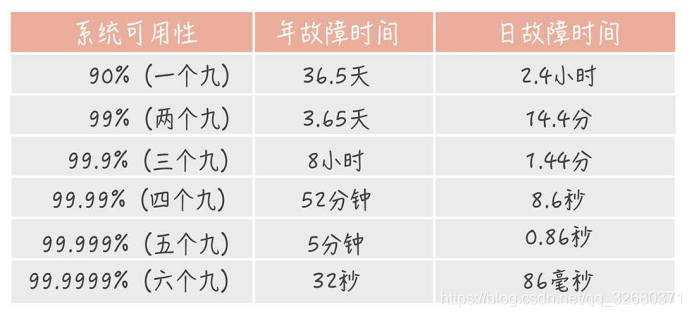

## 系统、架构设计

### 1.系统高可用，要考虑哪些方面，系统高可用性的方法

主要包括下面这些内容：

- 高可用的定义
- 哪些情况可能会导致系统不可用？
- 有些提高系统可用性的方法？只是简单的提一嘴，更具体内容在后续的文章中介绍，就拿限流来说，你需要搞懂：何为限流？如何限流？为什么要限流？如何做呢？说一下原理？。

#### 什么是高可用？可用性的判断标准

高可用描述的是一个系统在大部分时间都是可用的，可以为我们提供服务的。高可用代表系统即使在发生硬件故障或者系统升级的时候，服务仍然是可用的。

一般情况下，我们使用多少个 9 来评判一个系统的可用性，比如 99.9999% 就是代表该系统在所有的运行时间中只有 0.0001% 的时间都是可用的，这样的系统就是非常非常高可用的了！当然，也会有系统如果可用性不太好的话，可能连 9 都上不了。

#### 哪些情况会导致系统不可用？

- 黑客攻击；
- 硬件故障，比如服务器坏掉。
- 并发量/用户请求量激增导致整个服务宕掉或者部分服务不可用。
- 代码中的坏味道导致内存泄漏或者其他问题导致程序挂掉。
- 网站架构某个重要的角色比如 Nginx 或者数据库突然不可用。
- 自然灾害或者人为破坏。

#### 有哪些提高系统可用性的方法

##### 1. 注重代码质量，测试严格把关

我觉得这个是最最最重要的，代码质量有问题比如比较常见的内存泄漏、循环依赖都是对系统可用性极大的损害。大家都喜欢谈限流、降级、熔断，但是我觉得从代码质量这个源头把关是首先要做好的一件很重要的事情。如何提高代码质量？比较实际可用的就是 CodeReview，不要在乎每天多花的那 1 个小时左右的时间，作用可大着呢！

另外，安利这个对提高代码质量有实际效果的宝贝：

- sonarqube ：保证你写出更安全更干净的代码！（ps: 目前所在的项目基本都会用到这个插件）。
- Alibaba 开源的 Java 诊断工具 Arthas 也是很不错的选择。
- IDEA 自带的代码分析等工具进行代码扫描也是非常非常棒的。

##### 2.故障转移(failover),使用集群，减少单点故障

故障转移我们一般通过冗余节点来实现，当一个节点出现故障时，我们可以把流量从故障节点导流到其他节点。

对于对等服务，处理起来比较简单，由于每个节点都是无状态的，只需要简单把请求导流到其他的正常节点即可。

对于不对等服务，就比较麻烦，由于每个节点不是对等的，一般备份节点需要复制主节点的状态，不管是热备（备份节点同时也提供读服务）还是冷备（只是备份数据），当主节点故障了，failover机制需要进行主备切换。一般我们通过心跳机制来发现不可用节点。那么主备切换需要注意什么呢？主备切换一般需要考虑数据的完整性，选择数据最完整的备份节点，同时一般还需要保证只有一个主节点能够对外提供服务，为此需要使用raft，paxos等分布式一致性算法保证只有一个主节点。可以看出主备切换一般都比较复杂。

##### 3.限流

限流则是限制服务的并发访问以保证系统。流量控制（flow control），其原理是监控应用流量的 QPS 或并发线程数等指标，当达到指定的阈值时对流量进行控制，以避免被瞬时的流量高峰冲垮，从而保障应用的高可用性。——来自 alibaba-Sentinel 的 wiki。

##### 4.超时和重试机制设置

一旦用户请求超过某个时间的得不到响应，就抛出异常。这个是非常重要的，很多线上系统故障都是因为没有进行超时设置或者超时设置的方式不对导致的。我们在读取第三方服务的时候，尤其适合设置超时和重试机制。

- 那超时时间设置的多长呢？对于一个后台服务超时时间一般不超过200ms，但是在性能篇中说过，整个系统的响应时间最好不超过200ms，如果系统的调用链比较长，200ms显然是太长了。

- 一般我们使用一些 RPC 框架的时候，这些框架都自带的超时重试的配置。如果不进行超时设置可能会导致请求响应速度慢，甚至导致请求堆积进而让系统无法在处理请求。重试的次数一般设为 3 次，再多次的重试没有好处，反而会加重服务器压力（部分场景使用失败重试机制会不太适合）。

    * 对于调用方一般需要设置被调用方的重试次数，以提供更高的可用性，即使是4个9的高可用的系统，如果一个请求的调用链长度是8，在所有节点都不出故障的概率是99.92%，可用性直接少了一个9。为此我们一般需要设置重试次数，那么设置为多少次呢？对于一个4个9的系统来说，如果设置重试次数为3次，每次都出问题的概率实在太小了(概率为0.0001的4次方)。为此一般设置为3次即可。

##### 5.熔断机制

超时和重试机制设置之外，熔断机制也是很重要的。 熔断机制说的是系统自动收集所依赖服务的资源使用情况和性能指标，当所依赖的服务恶化或者调用失败次数达到某个阈值的时候就迅速失败，让当前系统立即切换依赖其他备用服务。 比较常用的是流量控制和熔断降级框架是 Netflix 的 Hystrix 和 alibaba 的 Sentinel。

##### 6.异步调用

异步调用的话我们不需要关心最后的结果，这样我们就可以用户请求完成之后就立即返回结果，具体处理我们可以后续再做，秒杀场景用这个还是蛮多的。但是，使用异步之后我们可能需要 适当修改业务流程进行配合，比如用户在提交订单之后，不能立即返回用户订单提交成功，需要在消息队列的订单消费者进程真正处理完该订单之后，甚至出库后，再通过电子邮件或短信通知用户订单成功。除了可以在程序中实现异步之外，我们常常还使用消息队列，消息队列可以通过异步处理提高系统性能（削峰、减少响应所需时间）并且可以降低系统耦合性。

##### 7.使用缓存

如果我们的系统属于并发量比较高的话，如果我们单纯使用数据库的话，当大量请求直接落到数据库可能数据库就会直接挂掉。使用缓存缓存热点数据，因为缓存存储在内存中，所以速度相当地快！

##### 8.监控体系

监控系统就是帮我们全方位的观察系统状态。

（1）资源监控

例如 CPU、内存、磁盘、网络 ……

（2）系统监控

例如某些URL访问是否失败、接口调用是否正常、接口平均响应时间、JVM回收情况 ……

（3）业务监控

例如订单系统有个关键的业务指标：订单支付成功率。

这个指标是否异常？可以与历史数据进行比较，知道了历史分布曲线，如果今天发生了剧烈波动，就可能出问题了。

##### 9.日志报警

日志可以帮我们快速定位问题，但这是被动的，更应该通过日志进行主动报警、主动解决。

##### 10.灰度发布与回滚

 (1）新功能上线的灰度

上线新功能时，可以先让一小部分人看到，如果没有问题，再逐步开放。

比如根据user_id划分流量，或者根据用户标签划分。

（2）旧系统重构的灰度

对旧系统重构后，通常不是马上全部切换为新系统，新旧系统会并存一段时间。

比如开始时10%的用户使用新系统，90%使用旧系统，新系统有问题就及时修改，影响范围不大。

新系统越来越成熟稳定，在此过程中逐渐增加新系统用户的占比，最终完成切换。

（3）回滚

如果发现新功能新系统有比较严重的问题，可以回滚为旧系统。

一种是整体回滚，直接把整个系统回滚到上个版本。

另一种是功能回滚，在开发新功能时做了开关，可以通过开切换新旧功能。

##### 11.其他

- 核心应用和服务优先使用更好的硬件
- 注意备份，必要时候回滚。
- 定期检查/更换硬件： 如果不是购买的云服务的话，定期还是需要对硬件进行一波检查的，对于一些需要更换或者升级的硬件，要及时更换或者升级。
- ...

### 2.如何做系统设计

