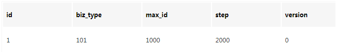
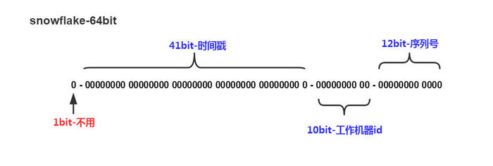
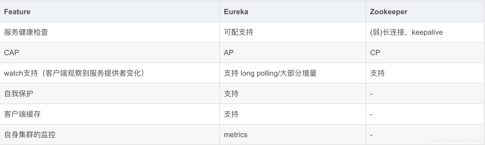

## 系统、架构设计

### 1.系统高可用，要考虑哪些方面，系统高可用性的方法

主要包括下面这些内容：

- 高可用的定义
- 哪些情况可能会导致系统不可用？
- 有些提高系统可用性的方法？只是简单的提一嘴，更具体内容在后续的文章中介绍，就拿限流来说，你需要搞懂：何为限流？如何限流？为什么要限流？如何做呢？说一下原理？。

#### 什么是高可用？可用性的判断标准

高可用描述的是一个系统在大部分时间都是可用的，可以为我们提供服务的。高可用代表系统即使在发生硬件故障或者系统升级的时候，服务仍然是可用的。

一般情况下，我们使用多少个 9 来评判一个系统的可用性，比如 99.9999% 就是代表该系统在所有的运行时间中只有 0.0001% 的时间都是可用的，这样的系统就是非常非常高可用的了！当然，也会有系统如果可用性不太好的话，可能连 9 都上不了。


#### 哪些情况会导致系统不可用？

- 黑客攻击；
- 硬件故障，比如服务器坏掉。
- 并发量/用户请求量激增导致整个服务宕掉或者部分服务不可用。
- 代码中的坏味道导致内存泄漏或者其他问题导致程序挂掉。
- 网站架构某个重要的角色比如 Nginx 或者数据库突然不可用。
- 自然灾害或者人为破坏。

#### 有哪些提高系统可用性的方法

##### 1. 注重代码质量，测试严格把关

我觉得这个是最最最重要的，代码质量有问题比如比较常见的内存泄漏、循环依赖都是对系统可用性极大的损害。大家都喜欢谈限流、降级、熔断，但是我觉得从代码质量这个源头把关是首先要做好的一件很重要的事情。如何提高代码质量？比较实际可用的就是 CodeReview，不要在乎每天多花的那 1 个小时左右的时间，作用可大着呢！

另外，安利这个对提高代码质量有实际效果的宝贝：

- sonarqube ：保证你写出更安全更干净的代码！（ps: 目前所在的项目基本都会用到这个插件）。
- Alibaba 开源的 Java 诊断工具 Arthas 也是很不错的选择。
- IDEA 自带的代码分析等工具进行代码扫描也是非常非常棒的。

##### 2.故障转移(failover),使用集群，减少单点故障

故障转移我们一般通过冗余节点来实现，当一个节点出现故障时，我们可以把流量从故障节点导流到其他节点。

对于对等服务，处理起来比较简单，由于每个节点都是无状态的，只需要简单把请求导流到其他的正常节点即可。

对于不对等服务，就比较麻烦，由于每个节点不是对等的，一般备份节点需要复制主节点的状态，不管是热备（备份节点同时也提供读服务）还是冷备（只是备份数据），当主节点故障了，failover机制需要进行主备切换。一般我们通过心跳机制来发现不可用节点。那么主备切换需要注意什么呢？主备切换一般需要考虑数据的完整性，选择数据最完整的备份节点，同时一般还需要保证只有一个主节点能够对外提供服务，为此需要使用raft，paxos等分布式一致性算法保证只有一个主节点。可以看出主备切换一般都比较复杂。

##### 3.限流

限流则是限制服务的并发访问以保证系统。流量控制（flow control），其原理是监控应用流量的 QPS 或并发线程数等指标，当达到指定的阈值时对流量进行控制，以避免被瞬时的流量高峰冲垮，从而保障应用的高可用性。——来自 alibaba-Sentinel 的 wiki。

##### 4.超时和重试机制设置

一旦用户请求超过某个时间的得不到响应，就抛出异常。这个是非常重要的，很多线上系统故障都是因为没有进行超时设置或者超时设置的方式不对导致的。我们在读取第三方服务的时候，尤其适合设置超时和重试机制。

- 那超时时间设置的多长呢？对于一个后台服务超时时间一般不超过200ms，但是在性能篇中说过，整个系统的响应时间最好不超过200ms，如果系统的调用链比较长，200ms显然是太长了。

- 一般我们使用一些 RPC 框架的时候，这些框架都自带的超时重试的配置。如果不进行超时设置可能会导致请求响应速度慢，甚至导致请求堆积进而让系统无法在处理请求。重试的次数一般设为 3 次，再多次的重试没有好处，反而会加重服务器压力（部分场景使用失败重试机制会不太适合）。

    * 对于调用方一般需要设置被调用方的重试次数，以提供更高的可用性，即使是4个9的高可用的系统，如果一个请求的调用链长度是8，在所有节点都不出故障的概率是99.92%，可用性直接少了一个9。为此我们一般需要设置重试次数，那么设置为多少次呢？对于一个4个9的系统来说，如果设置重试次数为3次，每次都出问题的概率实在太小了(概率为0.0001的4次方)。为此一般设置为3次即可。

##### 5.熔断机制

超时和重试机制设置之外，熔断机制也是很重要的。 熔断机制说的是系统自动收集所依赖服务的资源使用情况和性能指标，当所依赖的服务恶化或者调用失败次数达到某个阈值的时候就迅速失败，让当前系统立即切换依赖其他备用服务。 比较常用的是流量控制和熔断降级框架是 Netflix 的 Hystrix 和 alibaba 的 Sentinel。

##### 6.异步调用

异步调用的话我们不需要关心最后的结果，这样我们就可以用户请求完成之后就立即返回结果，具体处理我们可以后续再做，秒杀场景用这个还是蛮多的。但是，使用异步之后我们可能需要 适当修改业务流程进行配合，比如用户在提交订单之后，不能立即返回用户订单提交成功，需要在消息队列的订单消费者进程真正处理完该订单之后，甚至出库后，再通过电子邮件或短信通知用户订单成功。除了可以在程序中实现异步之外，我们常常还使用消息队列，消息队列可以通过异步处理提高系统性能（削峰、减少响应所需时间）并且可以降低系统耦合性。

##### 7.使用缓存

如果我们的系统属于并发量比较高的话，如果我们单纯使用数据库的话，当大量请求直接落到数据库可能数据库就会直接挂掉。使用缓存缓存热点数据，因为缓存存储在内存中，所以速度相当地快！

##### 8.监控体系

监控系统就是帮我们全方位的观察系统状态。

（1）资源监控

例如 CPU、内存、磁盘、网络 ……

（2）系统监控

例如某些URL访问是否失败、接口调用是否正常、接口平均响应时间、JVM回收情况 ……

（3）业务监控

例如订单系统有个关键的业务指标：订单支付成功率。

这个指标是否异常？可以与历史数据进行比较，知道了历史分布曲线，如果今天发生了剧烈波动，就可能出问题了。

##### 9.日志报警

日志可以帮我们快速定位问题，但这是被动的，更应该通过日志进行主动报警、主动解决。

##### 10.灰度发布与回滚

 (1）新功能上线的灰度

上线新功能时，可以先让一小部分人看到，如果没有问题，再逐步开放。

比如根据user_id划分流量，或者根据用户标签划分。

（2）旧系统重构的灰度

对旧系统重构后，通常不是马上全部切换为新系统，新旧系统会并存一段时间。

比如开始时10%的用户使用新系统，90%使用旧系统，新系统有问题就及时修改，影响范围不大。

新系统越来越成熟稳定，在此过程中逐渐增加新系统用户的占比，最终完成切换。

（3）回滚

如果发现新功能新系统有比较严重的问题，可以回滚为旧系统。

一种是整体回滚，直接把整个系统回滚到上个版本。

另一种是功能回滚，在开发新功能时做了开关，可以通过开切换新旧功能。

##### 11.其他

- 核心应用和服务优先使用更好的硬件
- 注意备份，必要时候回滚。
- 定期检查/更换硬件： 如果不是购买的云服务的话，定期还是需要对硬件进行一波检查的，对于一些需要更换或者升级的硬件，要及时更换或者升级。
- ...

### 2.如何做系统设计

//TODO

### 3.分布式唯一ID

主要分析一下以下9种，分布式ID生成器方式以及优缺点：

- UUID
- 数据库自增ID
- 数据库多主模式
- 号段模式
- Redis
- 雪花算法（SnowFlake）
- 滴滴出品（TinyID）
- 百度 （Uidgenerator）
- 美团（Leaf）

#### 1、基于UUID

在Java的世界里，想要得到一个具有唯一性的ID，首先被想到可能就是UUID，毕竟它有着全球唯一的特性。那么UUID可以做分布式ID吗？答案是可以的，但是并不推荐！

##### 优点：

生成足够简单，本地生成无网络消耗，具有唯一性

##### 缺点：

- 无序的字符串，不具备趋势自增特性
- 没有具体的业务含义
- 长度过长16 字节128位，36位长度的字符串，存储以及查询对MySQL的性能消耗较大，MySQL官方明确建议主键要尽量越短越好，作为数据库主键 UUID 的无序性会导致数据位置频繁变动，严重影响性能。

#### 2、基于数据库自增ID

基于数据库的auto_increment自增ID完全可以充当分布式ID，具体实现：需要一个单独的MySQL实例用来生成ID。

访问量激增时MySQL本身就是系统的瓶颈，用它来实现分布式服务风险比较大，不推荐！

##### 优点：

实现简单，ID单调自增，数值类型查询速度快

##### 缺点：

DB单点存在宕机风险，无法扛住高并发场景

#### 3、基于数据库集群模式

前边说了单点数据库方式不可取，那对上边的方式做一些高可用优化，换成主从模式集群。害怕一个主节点挂掉没法用，那就做双主模式集群，也就是两个Mysql实例都能单独的生产自增ID。

那这样还会有个问题，两个MySQL实例的自增ID都从1开始，会生成重复的ID怎么办？

解决方案：设置起始值和自增步长

##### 优点：

解决DB单点问题

##### 缺点：

不利于后续扩容，而且实际上单个数据库自身压力还是大，依旧无法满足高并发场景。

#### 4、基于数据库的号段模式

号段模式是当下分布式ID生成器的主流实现方式之一，号段模式可以理解为从数据库批量的获取自增ID，每次从数据库取出一个号段范围，例如 (1,1000] 代表1000个ID，具体的业务服务将本号段，生成1~1000的自增ID并加载到内存。  表结构如下：

```
CREATE TABLE id_generator (
  id int(10) NOT NULL,
  max_id bigint(20) NOT NULL COMMENT '当前最大id',
  step int(20) NOT NULL COMMENT '号段的布长',
  biz_type	int(20) NOT NULL COMMENT '业务类型',
  version int(20) NOT NULL COMMENT '版本号',
  PRIMARY KEY (`id`)
) 
```

biz_type ：代表不同业务类型

max_id ：当前最大的可用id

step ：代表号段的长度

version ：是一个乐观锁，每次都更新version，保证并发时数据的正确性



等这批号段ID用完，再次向数据库申请新号段，对max_id字段做一次update操作，update max_id= max_id + step，update成功则说明新号段获取成功，新的号段范围是(max_id ,max_id +step]。

```
update id_generator set max_id = #{max_id+step}, version = version + 1 where version = # {version} and biz_type = XXX
```

由于多业务端可能同时操作，所以采用版本号version乐观锁方式更新，这种分布式ID生成方式不强依赖于数据库，不会频繁的访问数据库，对数据库的压力小很多。

#### 5、基于Redis模式

Redis也同样可以实现，原理就是利用redis的 incr命令实现ID的原子性自增。

```
127.0.0.1:6379> set seq_id 1     // 初始化自增ID为1
OK
127.0.0.1:6379> incr seq_id      // 增加1，并返回递增后的数值
(integer) 2
```

用redis实现需要注意一点，要考虑到redis持久化的问题。redis有两种持久化方式RDB和AOF

- RDB会定时打一个快照进行持久化，假如连续自增但redis没及时持久化，而这会Redis挂掉了，重启Redis后会出现ID重复的情况。
- AOF会对每条写命令进行持久化，即使Redis挂掉了也不会出现ID重复的情况，但由于incr命令的特殊性，会导致Redis重启恢复的数据时间过长。

#### 6、基于雪花算法（Snowflake）模式

雪花算法（Snowflake）是twitter公司内部分布式项目采用的ID生成算法，开源后广受国内大厂的好评，在该算法影响下各大公司相继开发出各具特色的分布式生成器。



Snowflake生成的是Long类型的ID，一个Long类型占8个字节，每个字节占8比特，也就是说一个Long类型占64个比特。

Snowflake ID组成结构：正数位（占1比特）+ 时间戳（占41比特）+ 机器ID（占5比特）+ 数据中心（占5比特）+ 自增值（占12比特），总共64比特组成的一个Long类型。

- 第一个bit位（1bit）：Java中long的最高位是符号位代表正负，正数是0，负数是1，一般生成ID都为正数，所以默认为0。
- 时间戳部分（41bit）：毫秒级的时间，不建议存当前时间戳，而是用（当前时间戳 - 固定开始时间戳）的差值，可以使产生的ID从更小的值开始；41位的时间戳可以使用69年，(1L << 41) / (1000L * 60 * 60 * 24 * 365) = 69年
- 工作机器id（10bit）：也被叫做workId，这个可以灵活配置，机房或者机器号组合都可以。
- 序列号部分（12bit），自增值支持同一毫秒内同一个节点可以生成4096个ID

#### 7、百度（uid-generator）

uid-generator是由百度技术部开发

uid-generator是基于Snowflake算法实现的，与原始的snowflake算法不同在于，uid-generator支持自定义时间戳、工作机器ID和 序列号 等各部分的位数，而且uid-generator中采用用户自定义workId的生成策略。

uid-generator需要与数据库配合使用，需要新增一个WORKER_NODE表。当应用启动时会向数据库表中去插入一条数据，插入成功后返回的自增ID就是该机器的workId数据由host，port组成。

##### 对于uid-generator ID组成结构：

workId，占用了22个bit位，时间占用了28个bit位，序列化占用了13个bit位，需要注意的是，和原始的snowflake不太一样，时间的单位是秒，而不是毫秒，workId也不一样，而且同一应用每次重启就会消费一个workId。

#### 8、美团（Leaf）

Leaf由美团开发

Leaf同时支持号段模式和snowflake算法模式，可以切换使用。

号段模式

先导入源码 github.com/Meituan-Dia… ，在建一张表leaf_alloc

```
DROP TABLE IF EXISTS `leaf_alloc`;

CREATE TABLE `leaf_alloc` (
  `biz_tag` varchar(128)  NOT NULL DEFAULT '' COMMENT '业务key',
  `max_id` bigint(20) NOT NULL DEFAULT '1' COMMENT '当前已经分配了的最大id',
  `step` int(11) NOT NULL COMMENT '初始步长，也是动态调整的最小步长',
  `description` varchar(256)  DEFAULT NULL COMMENT '业务key的描述',
  `update_time` timestamp NOT NULL DEFAULT CURRENT_TIMESTAMP ON UPDATE CURRENT_TIMESTAMP COMMENT '数据库维护的更新时间',
  PRIMARY KEY (`biz_tag`)
) ENGINE=InnoDB;
```

然后在项目中开启号段模式，配置对应的数据库信息，并关闭snowflake模式

```
leaf.name=com.sankuai.leaf.opensource.test
leaf.segment.enable=true
leaf.jdbc.url=jdbc:mysql://localhost:3306/leaf_test?useUnicode=true&characterEncoding=utf8&characterSetResults=utf8
leaf.jdbc.username=root
leaf.jdbc.password=root

leaf.snowflake.enable=false
#leaf.snowflake.zk.address=
#leaf.snowflake.port=
```

启动leaf-server 模块的 LeafServerApplication项目就跑起来了

号段模式获取分布式自增ID的测试url ：http：//localhost：8080/api/segment/get/leaf-segment-test

监控号段模式：http://localhost:8080/cache

snowflake模式

Leaf的snowflake模式依赖于ZooKeeper，不同于原始snowflake算法也主要是在workId的生成上，Leaf中workId是基于ZooKeeper的顺序Id来生成的，每个应用在使用Leaf-snowflake时，启动时都会都在Zookeeper中生成一个顺序Id，相当于一台机器对应一个顺序节点，也就是一个workId。

```
leaf.snowflake.enable=true
leaf.snowflake.zk.address=127.0.0.1
leaf.snowflake.port=2181
```

#### 9、滴滴（Tinyid）

Tinyid由滴滴开发

Tinyid是基于号段模式原理实现的与Leaf如出一辙，每个服务获取一个号段（1000,2000]、（2000,3000]、（3000,4000]

Tinyid提供http和tinyid-client两种方式接入

Refer to:

https://zhuanlan.zhihu.com/p/107939861

### 4.CAP

著名的CAP理论指出，一个分布式系统不可能同时满足C（一致性）、A（可用性）、和P（分区容错性）。由于分区容错性P在分布式系统中必须要保证的，因此我们只能在A和C之间进行权衡。

因此： 
Zookeeper保证的是CP， 
Eureka则是AP。

但是对CAP/AP/CP很不理解，于是查阅资料，做一个简单的了解。

#### Zoopkeeper保证CP

当向注册中心查询服务列表时，我们可以容忍注册中心返回的是几分钟以前的注册信息，但是不能接受服务直接down掉不可用。也就是说，服务注册功能对可用性的要求要高于一致性。但是zk会出现这样的一种情况，当master节点因网路故障与其他节点失去联系时，剩余的节点会重新进行leader选举。问题在于，选举leader的时间太长，30~120s，且选举期间整个zk集群是都是不可用的，这就导致在选举期间注册服务瘫痪，在云部署的环境下，因网络问题使得zk集群失去master节点是较大概率会发生的事，虽然服务能够最终恢复，但是漫长的选举时间导致的注册长期不可用是不能容忍的。

#### Eureka保证AP

Eureka看明白了这一点，因此在设计时就优先保证可用性。Eureka各个节点都是平等的，几个节点挂掉不影响正常节点的工作，剩余的节点依然可以提供注册和查询服务。而Eureka的客户端在向某个Eureka注册时如果发现连接失败，则会自动切换至其他的节点，只要有一台Eureka还在，就能保证注册服务可用（保证可用性），只不过查到的信息可能不是最新的（不保证一致性）。除此之外，Eureka还有一种自我保护机制，如果在15分钟内超过85%的节点都没有正常的心跳，那么Eureka就认为客户端与注册中心出现了网络故障，此时会出现以下几种情况： 

- 1.Eureka不再从注册列表中移除因为长时间没有收到心跳而应该过期的服务 
- 2.Eureka仍然能够接受新服务的注册和查询请求，但是不会被同步到其它节点上（即保证当前节点依然可用） 
- 3.当前网络稳定时，当前实例新的注册信息会被同步到其它节点中 

因此，Eureka可以很好的应对因网络故障导致节点失去联系的情况，而不会像zookeeper那样使整个注册服务瘫痪。

#### Eureka服务治理机制与Dubbo服务治理机制的比较:



Eureka支持健康检查，自我保护等。

Zookeeper为CP设计，Eureka为AP设计。

作为服务发现产品，可用性优先级较高，一致性的特点并不重要，宁可返回错误的数据，也比不反回结果要好得多。

服务列表变更Zookeeper服务端会有通知，Eureka则通过长轮询来实现，Eureka未来会实现watch机制。

#### 取与舍

按场景进行选择：

- 钱财安全 - CP
- 用户体验 - AP（保留分区容错性和可用性，舍弃一致性）


